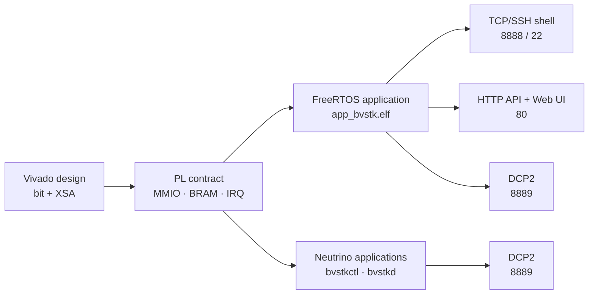
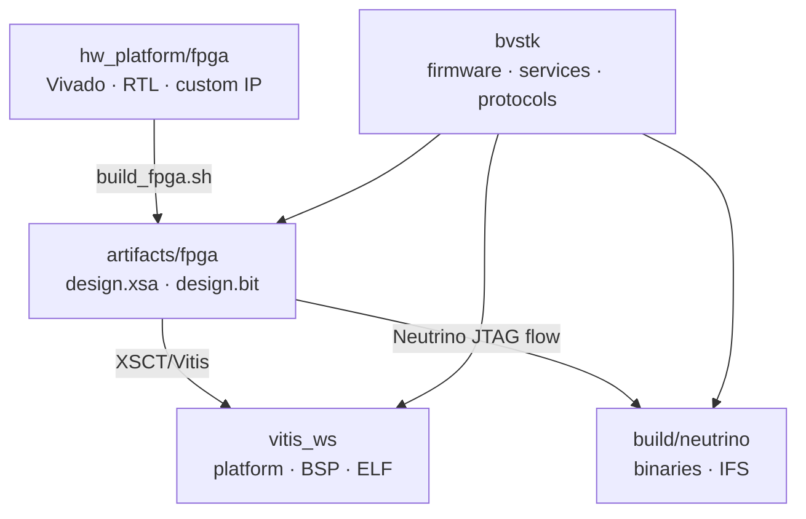

# bvstk

`bvstk` — прошивка и набор прикладных программ для платформы Burevestnik на
базе Zynq-7000. Проект собирает два варианта исполнения:

| Вариант | Основной артефакт | Роль в проекте |
|---|---|---|
| FreeRTOS + Xilinx BSP | `vitis_ws/app_bvstk/Debug/app_bvstk.elf` | полный runtime устройства: сеть, файлы, консоль, HTTP, DCP2 и PL |
| Neutrino + Zynq7000 BSP | `build/neutrino/bvstkctl`, `bvstkd`, IFS | POSIX-приложения и сервисный слой для работы с тем же PL-контрактом |

Программная часть работает поверх аппаратного дизайна Zynq: PS предоставляет
процессор и стандартную периферию, PL содержит ядра I²C, SMI/MDIO и SPI. Адреса
MMIO, BRAM и IRQ описаны в `src/hardware/` и должны соответствовать
`artifacts/fpga/design.xsa` и `design.bit`.

## Быстрая навигация

| Задача | Документ |
|---|---|
| начать эксплуатацию устройства | [Руководство пользователя](docs/user/guide.md) |
| собрать и загрузить FreeRTOS | [Сборка](docs/dev/build.md), [Запуск и отладка](docs/dev/run-and-debug.md) |
| собрать Neutrino | [Сборка Neutrino](docs/dev/build.md#5-сборка-neutrino) |
| понять архитектуру | [Архитектура](docs/dev/architecture.md) |
| разобраться в общей части и портах ОС | [FreeRTOS и Neutrino](docs/dev/multi-os.md), [Структура исходников](docs/dev/source-layout.md) |
| работать с I²C, SMI или SPI | [Обзор PL](docs/dev/pl-cores.md) |
| найти точный HTTP-контракт | [HTTP API reference](docs/reference/http-api.md) |
| реализовать DCP2-клиент | [Практика DCP2](docs/user/dcp2-usage.md), [Спецификация DCP2](docs/dcp2.md) |
| посмотреть команды и порты | [Справочные таблицы](docs/reference/appendices.md) |

Полный указатель находится в [docs/README.md](docs/README.md).

## Система и интерфейсы



В FreeRTOS после запуска доступны следующие точки взаимодействия:

| Интерфейс | Порт | Назначение |
|---|---:|---|
| TCP-консоль | `8888` | интерактивные команды и диагностика |
| SSH-консоль | `22` | тот же command dispatcher через wolfSSH; включается при сборке |
| HTTP | `80` | JSON API, файловые операции и Web UI |
| DCP2 | `8889` | бинарный request/response и события `NOTIFY` |

TCP-консоль и HTTP работают в доверенном инженерном контуре. Авторизация для
этих двух интерфейсов отсутствует. SSH использует пароль, заданный во время
сборки; Neutrino применяет ключевую SSH-проверку из своего build flow.

## Минимальный FreeRTOS flow

```sh
source <Vitis-install>/settings64.sh
cd <repo-root>
./build.sh check
./build.sh freertos
./run.sh freertos jtag
```

После старта:

```sh
telnet <device-ip> 8888
curl http://<device-ip>/api/version
./scripts/dcp2/monitor_notify.py <device-ip> --port 8889
```

`./build.sh freertos` использует `artifacts/fpga/design.xsa`. Аппаратный экспорт
и bitstream создаются скриптом `scripts/fpga/build_fpga.sh` из внешнего
репозитория hardware platform.

## Сборка вариантов ОС

```sh
./build.sh check             # архитектурные проверки и host-тесты
./build.sh freertos          # FreeRTOS ELF
./build.sh neutrino          # bvstkctl и bvstkd
./build.sh neutrino-image    # Neutrino IFS
./build.sh all               # FreeRTOS ELF и Neutrino IFS
```

JTAG-загрузка выполняется отдельно:

```sh
./run.sh freertos jtag
./run.sh neutrino jtag
```

## Репозитории



`hw_platform/fpga` содержит RTL и Vivado-проект. `bvstk` содержит программную
часть, build-скрипты, конфигурацию, web-ресурсы и тесты. Смена MMIO, BRAM, IRQ
или состава IP требует согласованного обновления обоих репозиториев.

## Каталоги верхнего уровня

| Каталог | Содержимое |
|---|---|
| `src/shared/` | общие модели, контракты, статусы и события |
| `src/hardware/` | карта платы и регистровые контракты PL |
| `src/drivers/pl/` | переносимые raw-драйверы PL |
| `src/services/` | переносимые device, cache, policy и control services |
| `src/protocols/` | переносимые wire/protocol adapters |
| `src/ports/` | OS/BSP adapters |
| `src/apps/` | FreeRTOS и Neutrino composition roots |
| `configs/` | исходные JSON-конфигурации |
| `scripts/` | сборка, запуск, проверки и диагностические утилиты |
| `web/` | Web UI и загрузчики статики |
| `tests/host/` | host-тесты общего кода |
| `docs/` | документация по ролям и уровням точности |

## Требования к изменению документации

Код и build-скрипты задают источник истины для команд, путей, API и статусов
возможностей. При изменении публичного контракта обновляются соответствующий
reference-документ, практическое руководство и пример smoke-теста.
