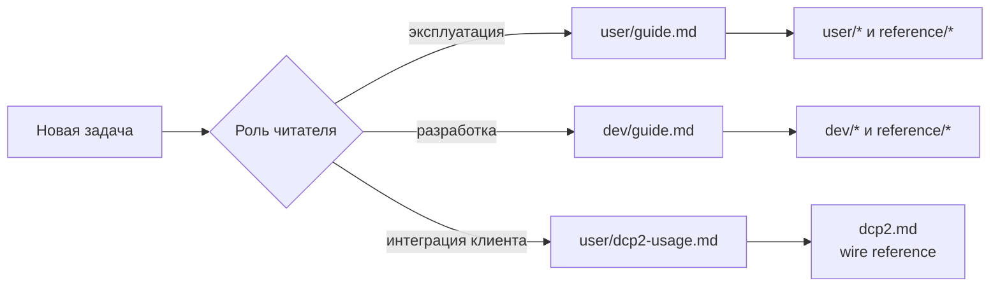

# Документация bvstk

Документация организована по роли читателя и уровню детализации. Стартовая
страница проекта — [корневой README](../README.md).

## Маршруты чтения

## Пользовательская документация

| Документ | Содержание |
|---|---|
| [Руководство пользователя](user/guide.md) | первый запуск, подключение, основные операции |
| [Сеть](user/network.md) | IP, MAC, gateway, сохранение и восстановление доступа |
| [Файловые системы](user/filesystems.md) | `sd:/`, `flash:/`, конфигурация и файлы |
| [TCP-консоль](user/tcp-console.md) | команды, сессии и диагностика |
| [HTTP](user/http.md) | практические HTTP-сценарии |
| [DCP2](user/dcp2-usage.md) | подключение клиента и `NOTIFY` |
| [Web UI](user/web-ui.md) | загрузка и проверка статических ресурсов |
| [Диагностика](user/troubleshooting.md) | последовательность проверки типовых отказов |

## Документация разработчика

| Документ | Содержание |
|---|---|
| [Руководство разработчика](dev/guide.md) | рабочий цикл и выбор маршрута по задаче |
| [Архитектура](dev/architecture.md) | слои системы и жизненный цикл FreeRTOS/Neutrino |
| [Структура исходников](dev/source-layout.md) | каталоги и правила зависимостей |
| [Сборка](dev/build.md) | FPGA, FreeRTOS, Neutrino и артефакты |
| [Окружение](dev/development-environment.md) | инструменты, конфиги и машина разработчика |
| [Запуск и отладка](dev/run-and-debug.md) | JTAG, VS Code и GDB |
| [Общая архитектура ОС](dev/multi-os.md) | разделение common code и ports |
| [Hardware platform](dev/hardware-platform.md) | граница RTL, XSA и firmware |
| [Конфигурация](dev/config-store.md) | загрузка, миграция и persistence |
| [PL overview](dev/pl-cores.md) | общая модель I²C, SMI и SPI |
| [SD через PL](dev/sd-card.md) | SD SPI controller, FreeRTOS port и FatFs |
| [I²C](dev/pl/i2c.md) | raw cores, services, cache, policy и адаптеры |
| [SMI](dev/pl/smi.md) | MDIO core, policy и polling |
| [SPI](dev/pl/spi.md) | transfer core и runtime |
| [FreeRTOS SSH](dev/freertos-ssh.md) | сборка и подключение SSH-консоли |
| [Тестирование](dev/testing.md) | host-тесты, архитектурные проверки и smoke-тесты |
| [Build scripts](../scripts/README.md) | карта скриптов FPGA, Vitis, Neutrino и VSCode |

## Reference

| Документ | Содержание |
|---|---|
| [Справочные таблицы](reference/appendices.md) | порты, артефакты, быстрые команды |
| [Команды консоли](reference/console-commands.md) | полный синтаксис shell-команд |
| [HTTP API reference](reference/http-api.md) | маршруты, методы, JSON и статусы |
| [Конфигурация reference](reference/configuration.md) | JSON-поля и ограничения |
| [Карта hardware](reference/hardware-map.md) | MMIO, BRAM, IRQ и PL contract |
| [Статусы](reference/status-codes.md) | статусы common API и DCP2 |
| [Спецификация DCP2](dcp2.md) | индекс wire-спецификации |
| [Сторонние зависимости](../third_party/README.md) | offline-архивы и BSP snapshot |

Формальные документы описывают текущий контракт. Практические руководства
показывают рабочие сценарии и ожидаемые результаты команд.
