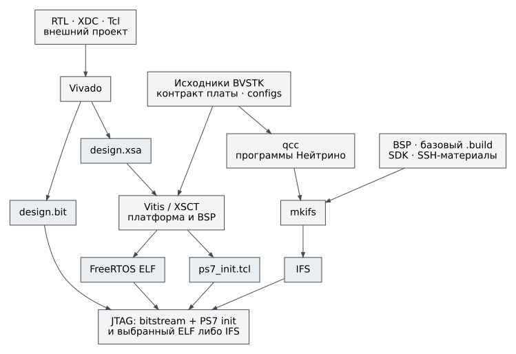

# Сборка и запуск

Выберите результат, который требуется получить. Сборка приложения,
формирование образа ОС и программирование PL — отдельные операции.
Корневая команда `build.sh all` не собирает аппаратный проект и не
загружает плату.

| Задача | Команда из корня BVSTK | Результат |
|---|---|---|
| Проверить архитектурные ограничения и общий код | `./build.sh check` | Отчёт проверок и результаты тестов на компьютере |
| Собрать FreeRTOS | `./build.sh freertos` | `vitis_ws/app_bvstk/Debug/app_bvstk.elf` |
| Собрать программы Нейтрино | `./build.sh neutrino` | Шесть исполняемых файлов в `build/neutrino/` |
| Сформировать IFS Нейтрино | `./build.sh neutrino-image` | `build/neutrino/ifs-zynq7000-ax7020-bvstk.raw` |
| Собрать обе программные цели | `./build.sh all` | FreeRTOS ELF, затем IFS Нейтрино |
| Получить аппаратный экспорт | `./scripts/fpga/build_fpga.sh` | `artifacts/fpga/design.bit` и `design.xsa` |

Рисунок 1. XSA — вход генерации платформы Vitis, а не исполняемый образ.
Сборка программ Нейтрино использует программный контракт платы; XSA не
передаётся компилятору `qcc`. Совместимость аппаратуры требуется при запуске.

## Порядок работы

Начните с [подготовки компьютера](environment.md). Если аппаратный экспорт
уже получен из проверенной ревизии, повторный запуск Vivado не обязателен.
Далее выберите [FreeRTOS](freertos.md) или [Нейтрино](neutrino.md), затем
перейдите к [JTAG-загрузке](jtag.md). Для пошагового исполнения FreeRTOS
используйте [отладку](debug.md).

Сценарии изменяют производные каталоги. Сохраните локальную работу внутри
Vitis/Vivado до запуска очистки. Не храните единственную копию ручных правок
в сгенерированном BSP или в `vitis_ws`: штатная сборка может пересоздать их.

## Согласованный комплект

Для воспроизводимого запуска фиксируют ревизии BVSTK и аппаратного
репозитория, локальные изменения, версии инструментов, выбранные параметры
и контрольные суммы `design.bit`, `design.xsa`, `ps7_init.tcl` и ELF/IFS.
Одинаковое имя файла не подтверждает одинаковое содержимое. Встроенная дата
компиляции не заменяет идентификатор ревизии.

Команда JTAG загружает PL и оперативную память. Она не является записью
автономного загрузочного образа в QSPI или SD. В этом руководстве нет
проверенной процедуры формирования и установки `BOOT.BIN`; её нельзя
подменять JTAG-командами.

Все параметры сценариев собраны в [справочнике сборки](../reference/build-options.md).
