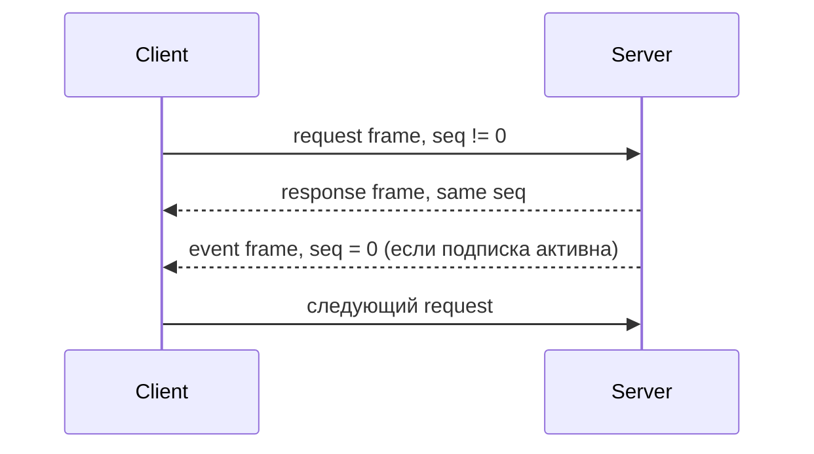

# DCP2: спецификация протокола

## 1. Назначение и профили реализации

DCP2 — бинарный протокол управления BVSTK поверх TCP. Он предоставляет request/response-обмен и, для FreeRTOS-сервера, асинхронные notify-события в рамках одного соединения.

| Профиль | Реализация | Порт | Возможности |
|---|---|---:|---|
| FreeRTOS | `src/apps/freertos/services/dcp2/dcp2_server.c` | `8889` | PING, MEM, I2C, SMI, NOTIFY, stream control |
| Neutrino | `src/apps/neutrino/bvstkd/main.c` + `src/protocols/dcp2/` | `8889` | PING, MEM, I2C, SMI, SPI |
| host codec | `src/protocols/dcp2/bvstk_dcp2_codec.c` | — | encode/decode и status mapping |

Версия wire-протокола — `2`. Клиент выбирает профиль по фактическому набору поддержанных service/opcode. Сервер возвращает `ERR_UNSUPPORTED` для операции, отсутствующей в его profile.

## 2. Обмен по TCP

TCP передаёт непрерывный байтовый поток. Каждый кадр начинается с заголовка длиной 8 байт, после которого следует payload длиной `dcp_len`.



FreeRTOS-сервер обслуживает одно принятое соединение в текущем server task; после его закрытия принимает следующее. Notify-фильтр и stream flags принадлежат соединению.

## 3. Формат кадра

### 3.1. Header

Все целые поля имеют порядок байт big-endian.

| Offset | Size | Поле | Значение |
|---:|---:|---|---|
| `0` | 4 | `magic` | ASCII `DCP2` (`44 43 50 32`) |
| `4` | 2 | `ver` | `0x0002` |
| `6` | 2 | `dcp_len` | размер payload, `4..4096` |

Общий размер кадра: `8 + dcp_len` байт.

### 3.2. Payload prefix

| Offset внутри payload | Size | Поле |
|---:|---:|---|
| `0` | 1 | `srv` |
| `1` | 1 | `op` |
| `2` | 2 | `seq` |
| `4` | variable | `body` |

```text
DCP2_FRAME
├── magic[4]
├── ver:u16
├── dcp_len:u16
└── payload[dcp_len]
    ├── srv:u8
    ├── op:u8
    ├── seq:u16
    └── body[]
```

### 3.3. Operation flags

| Bit | Mask | Значение |
|---:|---:|---|
| `6` | `0x40` | event |
| `7` | `0x80` | response |
| `0..5` | `0x3F` | opcode |

Request использует оба флага со значением `0`. Response устанавливает bit `7`. Event устанавливает bit `6`.

Правила `seq`:

| Тип | `seq` |
|---|---:|
| request | `1..65535` |
| response | копия request sequence |
| event | `0` |

## 4. Service IDs и opcode

| `srv` | Имя | Request opcodes |
|---:|---|---|
| `0x00` | PING | `0x00` PING |
| `0x01` | MEM | `0x00` READ, `0x01` WRITE |
| `0x02` | I2C | `0x00` READ_REG, `0x01` WRITE_REG, `0x02` POLICY_SET |
| `0x03` | SMI | `0x00` READ, `0x01` WRITE |
| `0x04` | SPI | профиль-зависимый transfer |
| `0x05` | UART | stream control |
| `0x06` | NOTIFY | `0x10` SUBSCRIBE, `0x11` UNSUBSCRIBE |
| `0x7F` | VENDOR | зарезервирован |

Для `I2C`, `SMI`, `SPI` и `UART` opcode `0x10`/`0x11` используется как stream subscribe/unsubscribe control в FreeRTOS server profile.

## 5. Response body

Response body начинается с двухбайтового status:

```text
response body = status:u16 + response_data[]
```

Статусы:

| Код | Имя |
|---:|---|
| `0x0000` | `OK` |
| `0x0001` | `ERR_MALFORMED` |
| `0x0002` | `ERR_UNSUPPORTED` |
| `0x0003` | `ERR_DENIED` |
| `0x0004` | `ERR_BUSY` |
| `0x0005` | `ERR_TIMEOUT` |
| `0x0006` | `ERR_RANGE` |
| `0x0007` | `ERR_INTERNAL` |

Клиент сначала проверяет header, затем `srv/op/seq`, затем status и только после успешного status разбирает response data.

## 6. PING

### Request

| Поле | Значение |
|---|---|
| `srv` | `0x00` |
| opcode | `0x00` |
| body | отсутствует |

### Response

Тело содержит только status. Успешный PING подтверждает TCP-соединение, версию `0x0002` и способность сервера разбирать кадры.

## 7. MEM

### 7.1. Request body

| Offset | Size | Поле |
|---:|---:|---|
| `0` | 1 | `flags` |
| `1` | 1 | `width_bits` |
| `2` | 4 | `addr` |
| `6` | 2 | `count` |
| `8` | variable | write data для WRITE |

Поддерживаемые widths: `8`, `16`, `32`, `64`. Bit `0` в `flags` — `AUTOINC`; остальные bits должны быть `0`.

При `AUTOINC=1` адрес следующего элемента увеличивается на `width_bits/8`. При `AUTOINC=0` все элементы обращаются по одному адресу.

### 7.2. READ и WRITE

| Операция | Body |
|---|---|
| READ | первые 8 байт |
| WRITE | первые 8 байт + `count * width_bits/8` data bytes |

READ возвращает `count` элементов в big-endian. WRITE возвращает только status. FreeRTOS server проверяет адрес по разрешённому MMIO-набору PL-регионов; произвольное адресное пространство устройства не предоставляется.

Общий codec/control profile Neutrino ограничивает MEM-операции 32-битными словами и картой `bvstk_pl_region`.

## 8. I2C

### 8.1. READ_REG

| Offset | Size | Поле |
|---:|---:|---|
| `0` | 1 | `addr_7b` |
| `1` | 1 | `reg` |

Response data при `OK` — один байт значения.

### 8.2. WRITE_REG

| Offset | Size | Поле |
|---:|---:|---|
| `0` | 1 | `addr_7b` |
| `1` | 1 | `reg` |
| `2` | 1 | `value` |

Запись проходит через I2C master service и policy. Успешная FreeRTOS-операция синхронизируется с persistent config; Neutrino `bvstkd` использует общий control API.

### 8.3. POLICY_SET

| Offset | Size | Поле |
|---:|---:|---|
| `0` | 1 | `addr_7b` |
| `1` | 1 | `policy` |

| `policy` | Режим |
|---:|---|
| `0` | whitelist |
| `1` | blacklist |

Операция меняет активный mode устройства. Редактирование массивов rules выполняется shell или HTTP API.

## 9. SMI

### 9.1. READ

| Offset | Size | Поле |
|---:|---:|---|
| `0` | 1 | `phy_addr` |
| `1` | 1 | `reg` |

Response data при `OK` — `value:u16` big-endian.

### 9.2. WRITE

| Offset | Size | Поле |
|---:|---:|---|
| `0` | 1 | `phy_addr` |
| `1` | 1 | `reg` |
| `2` | 2 | `value:u16` |

SMI policy проверяет регистр. FreeRTOS server сначала использует общий SMI service при его готовности, затем сохраняет legacy fallback path для совместимых runtime-веток. Neutrino `bvstkd` вызывает общий service напрямую.

## 10. SPI

### Neutrino control profile

Общий `bvstk_dcp2_control` поддерживает opcode `0x00`:

| Offset | Size | Поле |
|---:|---:|---|
| `0` | 2 | `count` |
| `2` | `count * 4` | `tx[count]` |

`count` находится в диапазоне `1..256`. Response data содержит `rx[count]`, каждое слово — big-endian `u32`.

### FreeRTOS server profile

FreeRTOS `dcp2_server.c` принимает SPI stream control, а обычный SPI request/response в текущем dispatcher возвращает `ERR_UNSUPPORTED`. Клиент должен учитывать этот профиль при выборе target.

## 11. NOTIFY

### 11.1. SUBSCRIBE request

Body имеет 13 байт:

| Offset | Size | Поле |
|---:|---:|---|
| `0` | 4 | `class_mask` |
| `4` | 4 | `source_mask` |
| `8` | 4 | `bus_mask` |
| `12` | 1 | `flags` |

Каждая маска должна быть ненулевой. Допустимые flags:

| Bit | Mask | Значение |
|---:|---:|---|
| `0` | `0x01` | включить `time_us` в event |
| `1` | `0x02` | snapshot-on-subscribe, зарезервированная семантика |

Классы событий:

| Bit | Mask | Событие |
|---:|---:|---|
| `0` | `0x00000001` | register attempt |
| `1` | `0x00000002` | register commit |
| `2` | `0x00000004` | register denied |
| `3` | `0x00000008` | state changed |
| `4` | `0x00000010` | fault |

Источники: `TELNET=0`, `HOST=1`, `DCP=2`, `INTERNAL=3`. Шины: `I2C=0`, `SMI=1`, `SPI=2`, `UART=3`, `SYS=4`.

### 11.2. UNSUBSCRIBE request

Body отсутствует. После успешного ответа notify filter соединения очищается.

### 11.3. NOTIFY_EVENT

Event использует `srv=0x06`, opcode `0x10 | 0x40`, `seq=0`.

Без timestamp body имеет 20 байт:

| Offset | Size | Поле |
|---:|---:|---|
| `0` | 2 | `ev_type` |
| `2` | 2 | `status` |
| `4` | 1 | `source` |
| `5` | 1 | `bus` |
| `6` | 1 | `op_kind` |
| `7` | 1 | reserved |
| `8` | 4 | `arg0` |
| `12` | 4 | `arg1` |
| `16` | 4 | `arg2` |

При `WITH_TIMESTAMP` перед этими полями добавляется `time_us:u64`, и body имеет 28 байт.

Типы событий:

| `ev_type` | Имя |
|---:|---|
| `0x0001` | `REG_ATTEMPT` |
| `0x0002` | `REG_COMMIT` |
| `0x0003` | `REG_DENIED` |
| `0x0004` | `STATE_CHANGED` |
| `0x0005` | `FAULT` |

Для I2C `arg0=addr_7b`, `arg1=reg`, `arg2=value`. Для SMI `arg0=phy`, `arg1=reg`, `arg2=value`.

## 12. Stream control

Для `srv=I2C`, `SMI`, `SPI`, `UART` доступны control-операции:

| Opcode | Request body | Назначение |
|---:|---|---|
| `0x10` | один байт `flags` | включить stream |
| `0x11` | пустой | выключить stream |

Flags:

| Bit | Mask | Значение |
|---:|---:|---|
| `0` | `0x01` | raw words |
| `1` | `0x02` | timestamp |
| `2` | `0x04` | reset lost counters |

FreeRTOS server сохраняет параметры подписки в connection state. Генератор PL stream events в текущем server runtime отсутствует; клиентам следует использовать NOTIFY для фактических событий управления.

## 13. Примеры кадров

### PING request

```text
44 43 50 32  00 02  00 04  00 00  00 01
```

Разбор:

| Часть | Значение |
|---|---|
| magic | `DCP2` |
| version | `2` |
| payload length | `4` |
| service | `PING` |
| opcode | `PING` |
| sequence | `1` |
| body | empty |

### I2C read request

Для address `0x36`, register `0x13`, sequence `2`:

```text
44 43 50 32  00 02  00 06  02 00  00 02  36 13
```

Успешный response содержит payload prefix `02 80 00 02`, status `00 00` и один байт результата.

## 14. Правила клиента

1. Передавать все multi-byte поля в big-endian.
2. Использовать ненулевой sequence для каждого request.
3. Сопоставлять response по `srv`, opcode без flag bits и sequence.
4. Проверять длину payload до разбора body.
5. Повторять запросы только для `ERR_BUSY` и `ERR_TIMEOUT` с лимитом попыток.
6. Относить `ERR_MALFORMED`, `ERR_RANGE`, `ERR_DENIED` и `ERR_UNSUPPORTED` к исправляемым параметрам или capability profile.
7. Для notify читать event frames между response frames.

## 15. Совместимость с исходниками

| Документ или код | Роль |
|---|---|
| `src/apps/freertos/services/dcp2/dcp2_server.c` | полный FreeRTOS dispatch и TCP server |
| `src/protocols/dcp2/bvstk_dcp2_codec.*` | общий frame codec |
| `src/protocols/dcp2/bvstk_dcp2_control.*` | общий control profile для Neutrino |
| `src/shared/protocols/dcp2/bvstk_dcp2_model.h` | notify enums и masks |
| `scripts/dcp2/monitor_notify.py` | reference notify client |
| [Практика DCP2](user/dcp2-usage.md) | запуск и smoke-тесты |

Изменение wire-формата требует одновременной правки server, common codec/control, host tools, тестов и этого документа.
