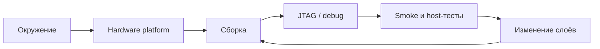

# Документация разработчика

Рабочий маршрут разработчика начинается с [Руководства разработчика](guide.md).

| Если требуется | Документ |
|---|---|
| понять систему | [introduction.md](introduction.md), [architecture.md](architecture.md) |
| найти код | [source-layout.md](source-layout.md) |
| собрать артефакты | [build.md](build.md) |
| настроить инструменты | [development-environment.md](development-environment.md) |
| загрузить и отладить | [run-and-debug.md](run-and-debug.md) |
| сравнить ОС | [multi-os.md](multi-os.md) |
| проверить XSA и RTL | [hardware-platform.md](hardware-platform.md) |
| работать с конфигурацией | [config-store.md](config-store.md) |
| изменить PL | [pl-cores.md](pl-cores.md) и [pl/](pl/i2c.md) |
| включить SSH FreeRTOS | [freertos-ssh.md](freertos-ssh.md) |
| запустить проверки | [testing.md](testing.md) |
| настроить build scripts | [../../scripts/README.md](../../scripts/README.md) |
| собрать Neutrino IFS | [../../scripts/neutrino/README.md](../../scripts/neutrino/README.md) |
