# Архитектура системы

## Оглавление

[1. Назначение документа](#1-назначение-документа)
[2. Границы системы](#2-границы-системы)
	[2.1. Что входит в систему](#21-что-входит-в-систему)
	[2.2. Что находится вне репозитория `bvstk`](#22-что-находится-вне-репозитория-bvstk)
	[2.3. Внешние зависимости](#23-внешние-зависимости)
[3. Архитектурная роль прошивки](#3-архитектурная-роль-прошивки)
	[3.1. Прошивка как управляющий слой системы](#31-прошивка-как-управляющий-слой-системы)
	[3.2. Порядок включения системы и связь макро-блоков](#32-порядок-включения-системы-и-связь-макро-блоков)
[4. Основные архитектурные блоки](#4-основные-архитектурные-блоки)
	[4.1. Базовый программный уровень исполнения](#41-базовый-программный-уровень-исполнения)
		[4.1.1. Точка входа](#411-точка-входа)
		[4.1.2. ОСРВ FreeRTOS](#412-осрв-freertos)
		[4.1.3. Платформа Xilinx и BSP](#413-платформа-xilinx-и-bsp)
	[4.1.4. Базовые механизмы PS](#414-базовые-механизмы-ps)
	[4.2. Подсистемы хранения и файлового доступа](#42-подсистемы-хранения-и-файлового-доступа)
		[4.2.1. Локальные носители данных](#421-локальные-носители-данных)
		[4.2.2. Подсистема SD](#422-подсистема-sd)
			[4.2.2.1. Жизненный цикл](#4221-жизненный-цикл)
			[4.2.2.2. Архитектурные зависимости и взаимодействия](#4222-архитектурные-зависимости-и-взаимодействия)
			[4.2.2.3. Назначение и модель данных](#4223-назначение-и-модель-данных)
			[4.2.2.4. Готовность и режим деградации](#4224-готовность-и-режим-деградации)
		[4.2.3. Подсистема QSPI](#423-подсистема-qspi)
			[4.2.3.1. Жизненный цикл](#4231-жизненный-цикл)
			[4.2.3.2. Архитектурные зависимости и взаимодействия](#4232-архитектурные-зависимости-и-взаимодействия)
			[4.2.3.3. Назначение и модель данных](#4233-назначение-и-модель-данных)
			[4.2.3.4. Готовность и режим деградации](#4234-готовность-и-режим-деградации)
		[4.2.4. Общий слой файлового доступа](#424-общий-слой-файлового-доступа)
		[4.2.5. Логические файловые устройства](#425-логические-файловые-устройства)
		[4.2.6. Готовность и режимы деградации](#426-готовность-и-режимы-деградации)
	[4.3. Подсистема конфигурации](#43-подсистема-конфигурации)
		[4.3.1. Архитектурная роль и границы ответственности](#431-архитектурная-роль-и-границы-ответственности)
		[4.3.2. Жизненный цикл и публикация готовности](#432-жизненный-цикл-и-публикация-готовности)
		[4.3.3. Источники конфигурации и приоритеты](#433-источники-конфигурации-и-приоритеты)
		[4.3.4. Модель данных и состав конфигурации](#434-модель-данных-и-состав-конфигурации)
		[4.3.5. Взаимодействие с другими подсистемами](#435-взаимодействие-с-другими-подсистемами)
		[4.3.6. Готовность и режим деградации](#436-готовность-и-режим-деградации)
	[4.4. Сетевой уровень](#44-сетевой-уровень)
	[4.5. Сервисы управления](#45-сервисы-управления)
	[4.6. Подсистемы работы с PL](#46-подсистемы-работы-с-pl)

## 1. Назначение документа

Настоящий документ описывает архитектуру исполнения прошивки `bvstk` в её
текущем состоянии. В документе фиксируются границы системы, состав основных
подсистем, порядок старта, модель готовности и ключевые зависимости между
конфигурацией, сетью, сервисами управления и PL-подсистемами.

Документ предназначен для использования как верхнеуровневый архитектурный
reference при анализе и изменений прошивке.

## 2. Границы системы

### 2.1. Что входит в систему

В состав системы входят прошивка `bvstk`, исполняемая на PS-части Zynq,
аппаратная платформа на базе соответствующего hardware design в PL, локальные
подсистемы хранения на SD и QSPI, подсистема конфигурации `config_store`,
сетевой runtime на базе lwIP, внешние сервисы управления `TCP`, `HTTP` и
`DCP2`, а также программные подсистемы работы с PL-ядрами.

В архитектурном смысле `bvstk` следует рассматривать как программную управляющую часть единой системы, в
которой поведение firmware определяется как собственным runtime-кодом, так и
составом, адресным пространством и моделью работы аппаратных блоков,
экспортированных из hardware platform.

### 2.2. Что находится вне репозитория `bvstk`

За пределами репозитория `bvstk` находятся аппаратный Vivado-проект, из
которого
формируется целевой hardware design, экспортируемые артефакты `bit` и `xsa`, а
также исходные описания и упаковка кастомных PL-ядер, используемых прошивкой.
Для текущей системы эта часть представлена отдельным hardware-репозиторием, в
котором задаются состав аппаратных блоков, их адресное пространство, линии
прерываний, топология соединений и другие свойства платформы, от которых
напрямую зависит корректность работы firmware.

### 2.3. Внешние зависимости

Архитектура `bvstk` зависит от ряда внешних компонентов, которые определяют
возможность сборки, запуска и корректной работы системы. Эти зависимости
приведены в таблице ниже.

| Внешний компонент            | Архитектурная роль                                                                                                                                                                                           |
| ---------------------------- | ------------------------------------------------------------------------------------------------------------------------------------------------------------------------------------------------------------ |
| Hardware platform            | Определяет аппаратную конфигурацию системы, включая состав PL-блоков, адресное пространство, линии прерываний и топологию соединений, на которые опирается firmware.                                         |
| Накопители памяти            | Обеспечивают файловую подсистему устройства и хранение постоянного состояния. В текущей архитектуре к ним относятся `QSPI` и `SD`, от доступности которых зависят `flash:/`, `sd:/` и работа `config_store`. |
| Ethernet                     | Обеспечивает сетевую связность, необходимую для работы сервисов `TCP`, `HTTP` и `DCP2`.                                                                                                                      |
| Внешнее аппаратное окружение | Включает устройства, доступ к которым осуществляется через ядра в программируемой логике (PL)                                                                                                                |

## 3. Архитектурная роль прошивки

### 3.1. Прошивка как управляющий слой системы

В системе `bvstk` прошивка выполняет функцию программного управляющего слоя.
Она координирует запуск подсистем, загрузку конфигурации, инициализацию сети,
работу внешних сервисов управления и доступ к аппаратным возможностям
платформы.

На архитектурном уровне эта роль реализуется через несколько макро-блоков,
которые образуют основную структуру системы. Базовый программный уровень
исполнения предоставляет среду работы для остальных частей прошивки.
Подсистемы хранения и файлового доступа обеспечивают доступ к локальным
носителям. Подсистема конфигурации связывает встроенные значения, постоянное
состояние и прикладные настройки устройства. Сетевой уровень поднимает
связность и создаёт основу для внешних сервисов управления. Сами сервисы
управления формируют внешнюю control-plane поверхность системы. Наконец,
подсистемы работы с PL обеспечивают доступ к аппаратным возможностям платформы
со стороны PS.

Через эти макро-блоки прошивка связывает внешние интерфейсы управления,
локальное состояние устройства, сетевое окружение, подсистемы хранения и
аппаратные блоки, расположенные в PL. По этой причине архитектурная роль
`bvstk` сводится к организации целостного управления системой на стороне PS.

Роль основных макро-блоков в архитектуре системы приведена в таблице ниже.

| Макро-блок | Архитектурная роль |
|---|---|
| Базовый программный уровень исполнения | Предоставляет среду выполнения для остальных частей прошивки и опирается на базовые программные компоненты платформы на стороне PS. |
| Подсистемы хранения и файлового доступа | Обеспечивают доступ к локальным носителям, монтирование файловых систем и работу с файловым пространством устройства. |
| Подсистема конфигурации | Связывает встроенные значения, постоянное состояние и прикладные настройки, публикуя конфигурацию для остальных частей системы. |
| Сетевой уровень | Поднимает сетевую связность устройства и создаёт основу для работы внешних интерфейсов управления. |
| Сервисы управления | Формируют внешнюю управляющую поверхность системы и связывают оператора или клиентское ПО с внутренними возможностями устройства. |
| Подсистемы работы с PL | Обеспечивают программный доступ со стороны PS к аппаратным блокам, расположенным в программируемой логике. |

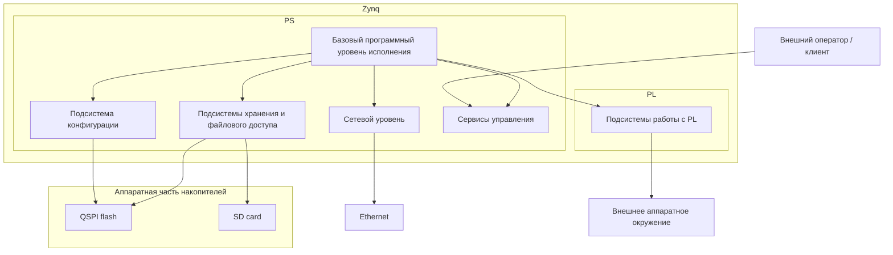

### 3.2. Порядок включения системы и связь макро-блоков

При запуске системы первым начинает работать базовый программный уровень
исполнения, который создаёт среду для запуска остальных частей прошивки. Поверх
него включаются подсистемы хранения и файлового доступа, обеспечивающие доступ
к локальным носителям и файловому пространству устройства. После этого
подсистема конфигурации получает возможность загрузить и опубликовать параметры,
от которых зависит дальнейшая работа сетевого уровня и части прикладных
подсистем.

Когда конфигурация становится доступной либо определяется, что система должна
временно работать на встроенных значениях, включается сетевой уровень,
обеспечивающий связность устройства. Поверх сетевого уровня становятся доступны
сервисы управления, через которые внешний оператор или клиентское ПО получает
доступ к функциям системы. Параллельно с этим базовый программный уровень
исполнения подготавливает подсистемы работы с PL, через которые прошивка
связывается с аппаратными блоками платформы и с внешним аппаратным окружением.


## 4. Основные архитектурные блоки

### 4.1. Базовый программный уровень исполнения

Базовый программный уровень исполнения образует фундамент, на котором работают
все остальные архитектурные блоки. Он задаёт точку входа прошивки,
обеспечивает среду выполнения, предоставляет базовые системные механизмы и
связывает прикладной код с платформенным программным слоем Xilinx.

К этому уровню относятся верхнеуровневая стартовая последовательность в
`main()`, операционная система реального времени (ОСРВ) `FreeRTOS`, платформенный BSP и низкоуровневые
драйверы стороны PS, а также общие механизмы работы с памятью, прерываниями,
таймерами, диагностическим выводом и доступом к регистрам платформы. Так же
формируется программная основа, поверх которой далее строятся подсистемы
хранения и файлового доступа, подсистема конфигурации, сетевой уровень,
сервисы управления и подсистемы работы с PL.

#### 4.1.1. Точка входа

Точкой входа является функция `main()`, расположенная в
`src/main.c`. Именно в ней задаётся верхнеуровневая стартовая
последовательность
системы до передачи управления планировщику `FreeRTOS`.

На этом этапе выполняется начальный старт системы, после чего
вызовом `vTaskStartScheduler()` управление передаётся среде выполнения
`FreeRTOS`, и дальнейшая работа системы продолжается уже в модели задач и
потоков.

#### 4.1.2. ОСРВ FreeRTOS

Когда система стартовала, управление передается в среду `FreeRTOS`. После вызова `vTaskStartScheduler()` крупные подсистемы
прошивки начинают работать как набор параллельно существующих задач и потоков,
которые либо создаются напрямую через `xTaskCreate()`, либо запускаются через
`sys_thread_new()` в связке с сетевым стеком `lwIP`.

Структура задач и потоков в текущей архитектуре может быть представлена в
следующем виде:

```text
Задачи и механизмы исполнения системы
├── Задачи начального запуска и публикации состояния
│   ├── Точка входа
│   │   └── main()
│   └── Переход к многозадачному исполнению
│       └── vTaskStartScheduler()
│
├── Задачи подсистем хранения и файлового доступа
│   ├── Задачи подготовки SD
│   │   └── sd_card
│   └── Задачи подготовки QSPI
│       └── qspi_fs
│
├── Задачи конфигурационной подсистемы
│   └── Загрузка и публикация конфигурации
│       └── cfg
│
├── Задачи сетевого уровня
│   ├── Инициализация сетевого runtime
│   │   └── lan_thrd
│   └── Обслуживание сетевого стека
│       └── xemacif_irq_thread
│
├── Задачи сервисов управления
│   ├── TCP-консоль
│   │   └── tcp_server_thrd
│   ├── HTTP
│   │   └── http
│   └── DCP2
│       └── dcp2
│
├── Задачи PL-подсистем
│   ├── Задачи I2C
│   │   ├── Событийные задачи I2C
│   │   │   ├── Master path
│   │   │   │   └── i2c_master_evt
│   │   │   └── Slave path
│   │   │       └── i2c_slave_evt
│   │   └── Задачи рабочей логики I2C
│   │       └── i2c_task
│   ├── Задачи SMI
│   │   ├── Событийные задачи SMI
│   │   │   ├── Master path
│   │   │   │   └── master_evt_task
│   │   │   └── Slave path
│   │   │       └── slave_evt_task
│   │   └── Задачи рабочей логики SMI
│   │       └── smi_task
│   └── Задачи SPI
│       └── Отдельные runtime-задачи отсутствуют
│
├── Временные служебные задачи
│   └── Задачи перезагрузки
│       └── reboot
│
└── Механизмы ОСРВ и runtime-среды, не оформленные как отдельные задачи
    ├── Планировщик FreeRTOS
    ├── Heap и allocator
    ├── Очереди
    ├── Mutex и semaphore
    ├── Interrupt handlers
    ├── Hooks среды выполнения
    │   ├── vApplicationMallocFailedHook()
    │   └── vApplicationStackOverflowHook()
    └── Обвязка lwIP thread model
        └── sys_thread_new()
```

Порядок запуска задач и потоков из `main()` в текущем boot path может быть
представлен в следующем виде:

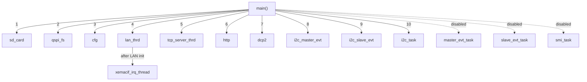

Взаимосвязь основных задач и публикуемых ими состояний в текущей архитектуре
может быть представлена в следующем виде:

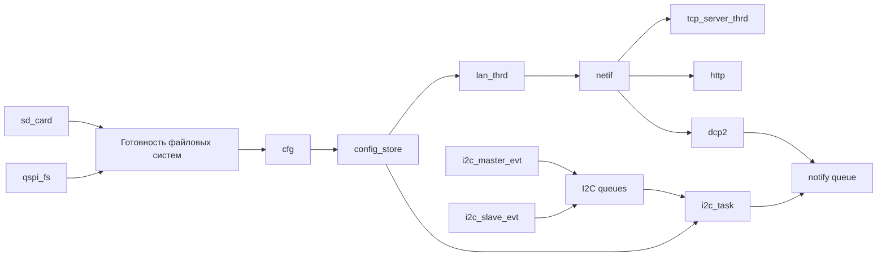

С точки зрения архитектурных зависимостей эта структура не является простым
перечнем независимых задач. Подсистемы хранения `sd_card` и `qspi_fs`
подготавливают локальные носители, от которых зависит последующая работа
подсистемы конфигурации `cfg`. Задача `cfg` публикует итоговое состояние
`config_store`, которое затем используется сетевым уровнем и прикладными
подсистемами как источник рабочих параметров.

Сетевой поток `lan_thrd` зависит от готовности `config_store`, поскольку
использует его для получения сетевых параметров, однако эта зависимость имеет
мягкий характер: при недоступности конфигурации система может перейти на
встроенные fallback-значения. После успешного подъёма сетевого интерфейса
`lan_thrd` публикует рабочее состояние `netif`, от которого зависит
практическая доступность серверных потоков `tcp_server_thrd`, `http` и `dcp2`.
Поток `xemacif_irq_thread`, создаваемый после инициализации сети, обслуживает
приём Ethernet-пакетов и тем самым завершает формирование базового сетевого
runtime.

Потоки `tcp_server_thrd`, `http` и `dcp2` представляют серверную часть системы.
Они создаются независимо от того, готов ли уже сетевой интерфейс, однако их
практическая доступность определяется состоянием сетевого уровня. В этом смысле
их связь с `lan_thrd` и `netif` является не прямой блокирующей зависимостью, а
зависимостью эксплуатационной готовности.

Подсистема `I2C` строится как отдельная группа задач. Задачи `i2c_master_evt` и
`i2c_slave_evt` обслуживают событийный путь низкоуровневого обмена и передают
события через очереди `I2C`, тогда как `i2c_task` выполняет высокоуровневую
рабочую логику подсистемы. Она
ожидает готовности `config_store`, загружает конфигурацию устройств, выполняет
начальную инициализацию и далее управляет рабочим циклом подсистемы. В отличие
от сетевого уровня эта часть архитектуры зависит от конфигурации жёстче: при
отсутствии готового `config_store` или описанных устройств основная задача
`i2c_task` завершает работу.

Отдельной общей точкой взаимодействия между прикладной логикой `I2C` и
подсистемой `DCP2` выступает `notify queue`. Через неё `i2c_task` публикует
события, которые затем становятся доступны на стороне бинарного протокола
управления.

#### 4.1.3. Платформа Xilinx и BSP

В архитектуре `bvstk` платформенный программный слой Xilinx и связанный с ним
`BSP` образуют промежуточный уровень между прикладным кодом прошивки и
аппаратной платформой Zynq. Через этот уровень прошивка получает доступ к
описанию аппаратной конфигурации, базовым платформенным типам и константам,
низкоуровневым драйверам стороны `PS`, а также к библиотекам, на которых
строятся остальные архитектурные блоки системы.

Именно этот слой задаёт программный контракт между прошивкой и hardware
platform. Через него в проекте используются параметры платформы из
`xparameters.h`, базовые типы и коды возврата Xilinx, механизмы
диагностического вывода, низкоуровневый доступ к регистрам, обработка
прерываний, а также драйверные и библиотечные компоненты, необходимые для
работы накопителей, сети и других подсистем на стороне `PS`.

Практически это означает, что `bvstk` не следует рассматривать как полностью
самодостаточное приложение на языке `C`. Значительная часть его базовой среды
исполнения определяется тем, какая платформа и какой `BSP` были сгенерированы в
Vitis на основе актуального `xsa`. По этой причине изменения аппаратной
конфигурации, состава библиотек или параметров платформы могут влиять на
поведение прошивки не меньше, чем изменения в собственных исходниках проекта.

Взаимосвязь прикладного кода прошивки, платформенного программного слоя и
аппаратной платформы может быть представлена в следующем виде:

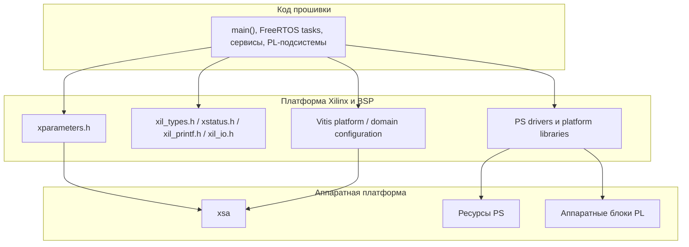

В текущем проекте этот слой проявляется через использование заголовков и
компонентов Xilinx, таких как `xparameters.h`, `xil_types.h`, `xstatus.h`,
`xil_printf.h`, `xil_io.h`, а также через платформенные библиотеки и доменные
настройки, формируемые в процессе сборки Vitis.

#### 4.1.4. Базовые механизмы PS

Для понимания базового программного уровня исполнения важно различать код,
который выполняется до запуска ОСРВ, саму среду `FreeRTOS`, её рабочие
механизмы и прикладные задачи, которые затем существуют внутри этой среды. При
этом и код вне ОСРВ, и механизмы `FreeRTOS`, и прикладные задачи опираются на
общие базовые механизмы стороны `PS`, через которые прошивка взаимодействует с
аппаратными ресурсами платформы.

Эта граница может быть представлена в следующем виде:

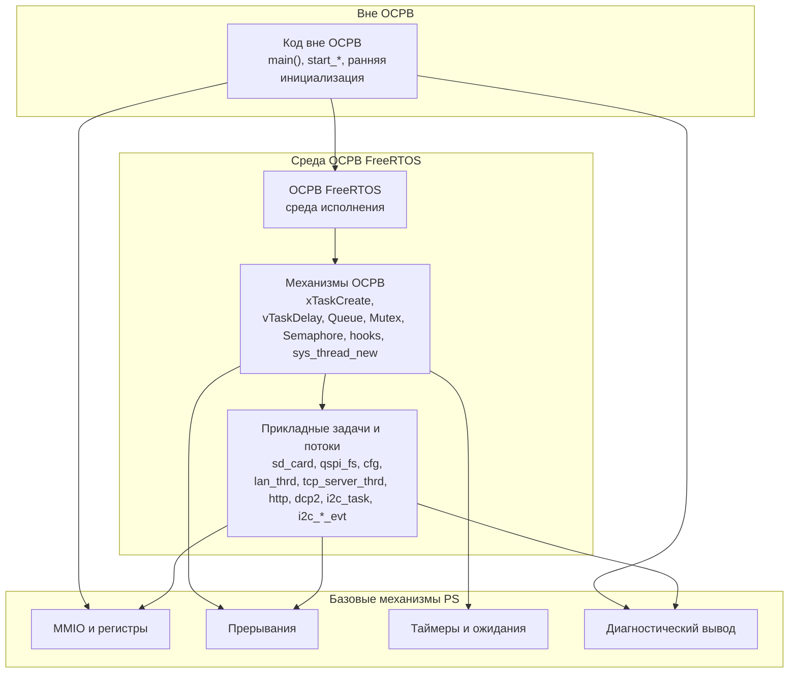

В архитектуре `bvstk` к базовым механизмам стороны `PS` относятся
низкоуровневый доступ к регистрам и адресному пространству платформы,
обработка прерываний, базовые средства тайминга и ожидания, а также
диагностический вывод. Эти механизмы не образуют отдельные прикладные
подсистемы, но именно через них код до запуска ОСРВ, механизмы `FreeRTOS` и
прикладные задачи получают доступ к реальным ресурсам платформы.

Практически это означает, что данный уровень описывает не отдельные задачи
прошивки, а тот низкоуровневый исполнительный контур стороны `PS`, который
связывает точку входа, среду `FreeRTOS`, её механизмы и прикладные задачи в
единую рабочую систему.

### 4.2. Подсистемы хранения и файлового доступа

#### 4.2.1. Локальные носители данных

В текущей архитектуре подсистема хранения опирается на два локальных
носителя данных: `SD card` и `QSPI flash`. Они образуют физическую основу
файлового пространства устройства и используются прошивкой как источники
постоянных и эксплуатационных данных.

Оба носителя входят в единый контур локального
хранения, однако отличаются по своей роли, режиму доступности и характеру
использования.

Доступ к обоим носителям строится по общей многоуровневой схеме.
На нижнем уровне находятся сами физические устройства хранения. Поверх них
работает платформенный слой низкоуровневого доступа со стороны `PS`: для
`SD` эту роль выполняет контроллер и драйвер `XSdPs`, а для `QSPI` —
подсистема `qspi_flash` / `qspi_fs`, обеспечивающая доступ к области флеш-
памяти, отведённой под файловую систему.

Следующий уровень образует слой `diskio`, через который файловая библиотека
`FatFs` получает унифицированный блочный доступ к конкретному носителю. За
счёт этого файловая модель отделяется от особенностей аппаратного интерфейса,
а `SD` и `QSPI` могут рассматриваться как логические диски с единым способом
работы.

На верхнем уровне `FatFs` публикует каждый носитель как логический файловый
том, доступный остальным частям прошивки через файловые пути. Цепочка доступа к локальным носителям имеет следующий вид:

`SD card` → `XSdPs` (низкоуровневый блочный доступ) → `diskio` → `FatFs` → `sd:/`

`QSPI flash` → `qspi_flash` / `qspi_fs` (низкоуровневый блочный доступ) → `diskio` → `FatFs` → `flash:/`

Для наглядности эту модель можно представить в следующем виде:

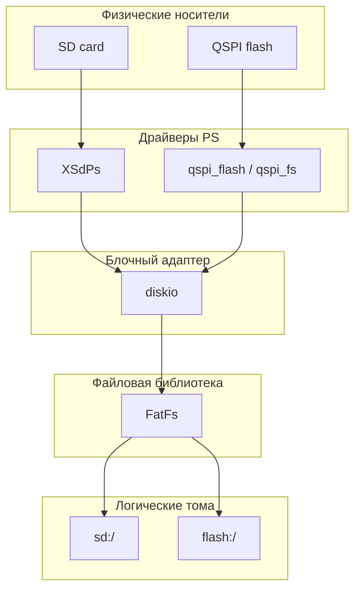

#### 4.2.2. Подсистема SD

Подсистема SD отвечает за работу со съёмной картой памяти на стороне PS и после
  успешной инициализации делает её доступной для системы как логический файловый том
  sd:/. Архитектурно это отдельная runtime-подсистема локального хранения, встроенная
  в общий файловый слой устройства.

##### 4.2.2.1. Жизненный цикл

Жизненный цикл подсистемы `SD` может быть представлен
следующим образом:

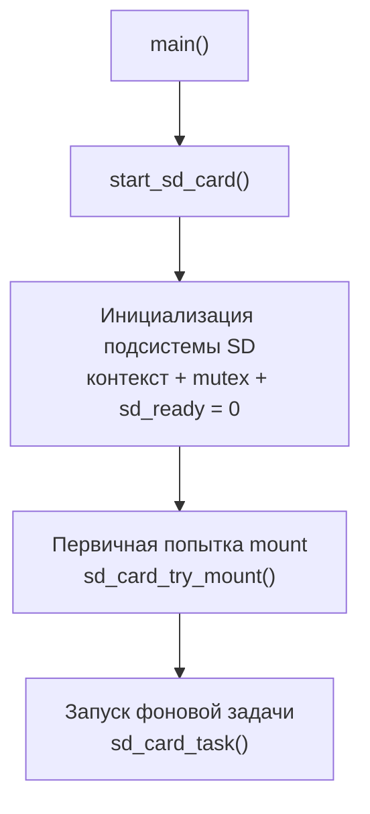

Во время общего старта прошивки
`main()` вызывает `start_sd_card()`, после чего подсистема подготавливает
внутренний контекст работы с носителем, создаёт средства синхронизации и
сбрасывает собственный флаг готовности в состояние `sd_ready = 0`. Сразу после
этого выполняется первичная попытка монтирования через `sd_card_try_mount()`.
Её задача состоит в том, чтобы как можно раньше поднять том `sd:/`, если карта
уже установлена и аппаратный путь доступен к моменту старта системы.

Независимо от исхода этой первичной попытки далее создаётся отдельная задача
`sd_card_task()`, в которой и продолжает жить runtime-поведение подсистемы.
##### 4.2.2.2. Архитектурные зависимости и взаимодействия

Архитектурные зависимости и взаимодействия подсистемы `SD` в текущей
реализации могут быть представлены следующим образом:

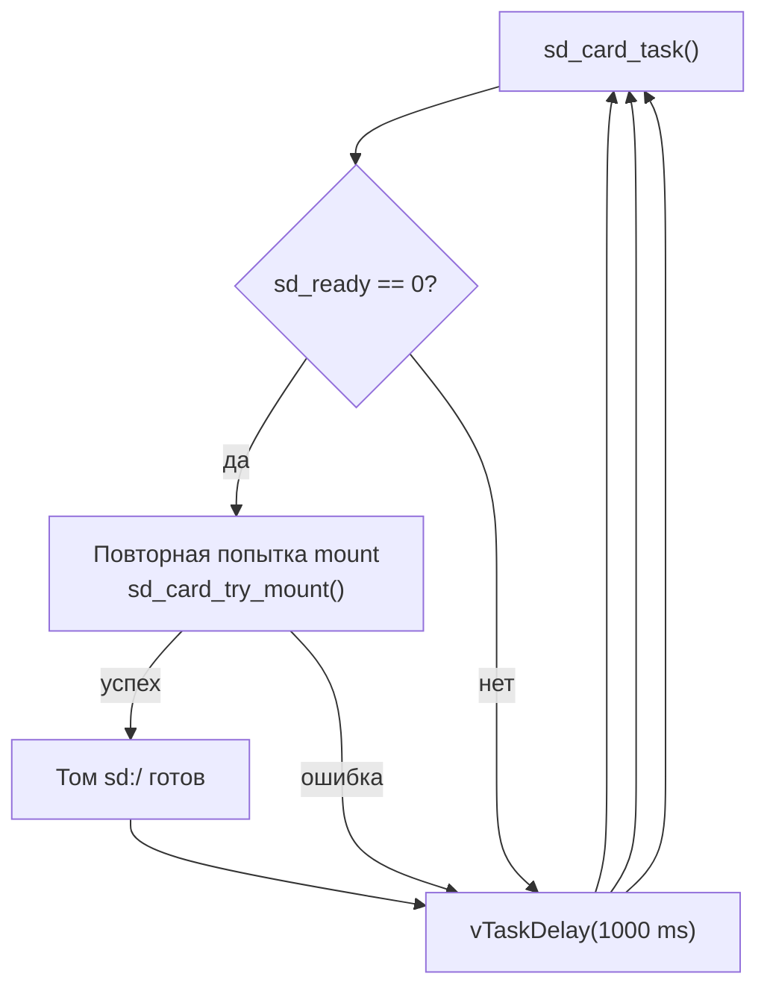

Роль `sd_card_task()` ограничена периодической проверкой `sd_ready` и
повторными вызовами `sd_card_try_mount()`, если том ещё не готов. При успешной
попытке подсистема публикует готовность `sd:/`; при неуспехе задача уходит в
паузу и затем повторяет цикл. Детали внутреннего пути монтирования остаются
внутри `sd_card_try_mount()` и не являются частью внешнего контракта фоновой
задачи.

Внешний слой взаимодействия с уже опубликованным томом `sd:/` может
быть представлен так:

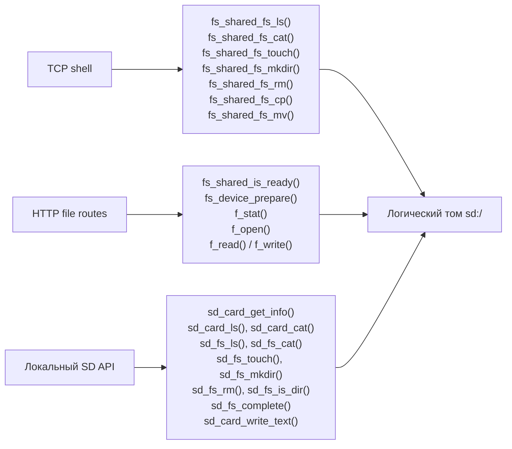

После успешного монтирования подсистема `SD` публикуется в общем файловом слое
как логическое устройство `sd:/`. На этом уровне остальные части прошивки
работают уже не с контроллером `XSdPs`, а с файловым устройством и его
контекстом.

Практически это даёт три основных пути взаимодействия. TCP-консоль работает
через общий слой `fs_shared`, вызывая `fs_shared_fs_ls()`,
`fs_shared_fs_cat()`, `fs_shared_fs_touch()`, `fs_shared_fs_mkdir()`,
`fs_shared_fs_rm()`, `fs_shared_fs_cp()` и `fs_shared_fs_mv()`. На стороне
HTTP с томом `sd:/` работают файловые обработчики из `http_fs_routes.c`, то
есть код web/API слоя, который обслуживает HTTP-запросы на чтение, выдачу и
запись файлов. Эти обработчики сначала проверяют готовность и подготавливают
устройство через `fs_shared_is_ready()` и `fs_device_prepare()`, а затем
выполняют сами файловые операции через `FatFs`, используя `f_stat()`,
`f_open()`, `f_read()` и `f_write()`.
Отдельно модуль `sd_card.c` предоставляет внутренний API модуля `SD`, то есть
набор обычных `C`-функций, через которые другой код прошивки может работать с
томом `sd:/` без участия shell-команд или HTTP-обработчиков. Этот API нужен
для тех случаев, когда доступ к `SD` требуется прямо из кода подсистемы, а не
через внешний пользовательский интерфейс.

По смыслу этот API делится на несколько групп. Функции `sd_card_get_info()`,
`sd_card_ls()` и `sd_card_cat()` дают доступ к базовой информации о носителе и
простым операциям чтения. Функции `sd_fs_ls()`, `sd_fs_cat()`,
`sd_fs_touch()`, `sd_fs_mkdir()`, `sd_fs_rm()` и `sd_fs_is_dir()` образуют
набор типовых файловых операций над путями внутри тома `sd:/`. Функция
`sd_fs_complete()` обслуживает сценарии автодополнения и выбора путей, а
`sd_card_write_text()` предоставляет упрощённую запись текстового содержимого в
файл.

Архитектурно этот SD-API не образует отдельного внешнего слоя доступа. Это
внутренние обёртки над контекстом `sd_ctx`, общим файловым слоем и, в нужных
местах, над вызовами `FatFs`. Поэтому его правильнее понимать не как
самостоятельную подсистему поверх `SD`, а как локальный программный интерфейс
модуля `sd_card`, предназначенный для прямого использования из других частей
прошивки.

##### 4.2.2.3. Назначение и модель данных

`SD` следует рассматривать как дополнительный
съёмный носитель эксплуатационного назначения. Он не является основным
хранилищем встроенного постоянного состояния устройства, а используется как
удобное внешнее файловое пространство для сервисных и пользовательских
сценариев.

#### 4.2.3. Подсистема QSPI

Подсистема `QSPI` отвечает за работу со встроенной QSPI NOR flash на стороне
`PS` и после успешного монтирования публикует выделенное файловое окно этой
памяти как логический том `flash:/`. В отличие от `SD`, здесь речь идёт не о
съёмном эксплуатационном носителе, а о встроенном постоянном хранилище,
которое используется самой системой для конфигурации, web-ресурсов и других
постоянных данных.

##### 4.2.3.1. Жизненный цикл

Стартовый путь подсистемы `QSPI` в текущей реализации может быть представлен
следующим образом:

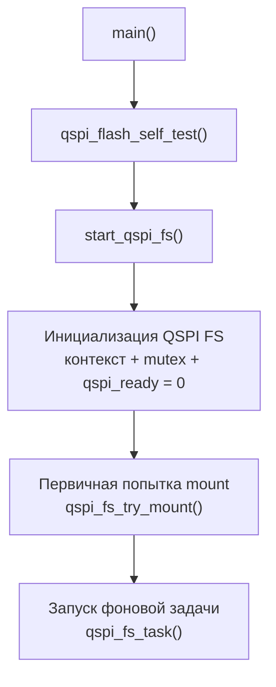

В текущем boot path `main()` сначала вызывает `qspi_flash_self_test()`, а уже
затем запускает файловую подсистему `QSPI` через `start_qspi_fs()`. Это важно
для архитектурного понимания: в отличие от `SD`, здесь перед публикацией тома
`flash:/` выполняется отдельный диагностический шаг на уровне низкоуровневого
flash-драйвера.

Далее `start_qspi_fs()` подготавливает файловый контекст `qspi_ctx`, создаёт
mutex, сбрасывает флаг готовности `qspi_ready = 0` и выполняет первую попытку
монтирования через `qspi_fs_try_mount()`. После этого создаётся отдельная
задача `qspi_fs_task()`, в которой живёт дальнейшее runtime-поведение
подсистемы. Подробная фоновая логика повторных попыток монтирования раскрыта в
следующем подпункте.

##### 4.2.3.2. Архитектурные зависимости и взаимодействия

Фоновая работа `qspi_fs_task()` в текущей реализации может быть представлена
следующим образом:

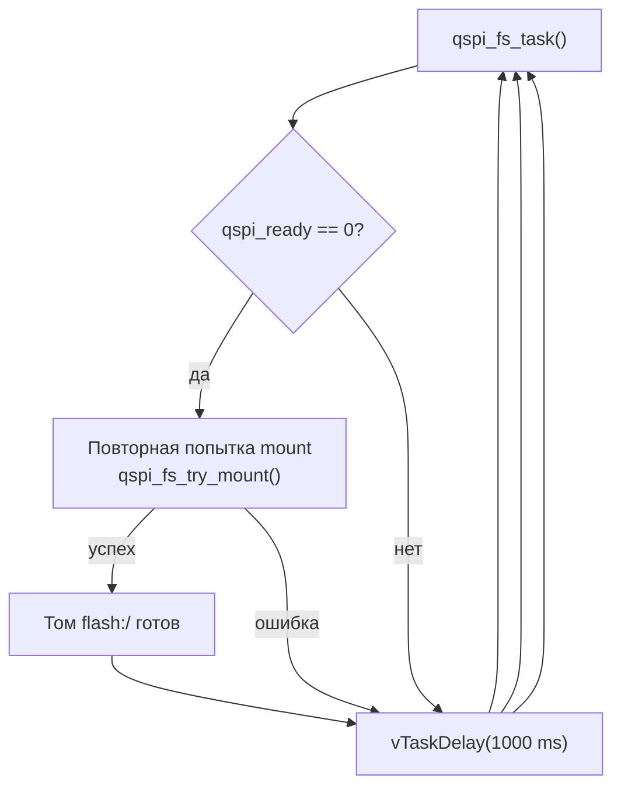

Роль `qspi_fs_task()` ограничена периодической проверкой `qspi_ready` и
повторными вызовами `qspi_fs_try_mount()`, если том ещё не готов. Обычные
файловые операции других подсистем через эту задачу не проходят. После
успешного монтирования `QSPI` публикуется как логический том `flash:/`, и
дальнейшее взаимодействие с ним идёт уже через файловый слой.

Внешний слой взаимодействия с томом `flash:/` может быть представлен так:

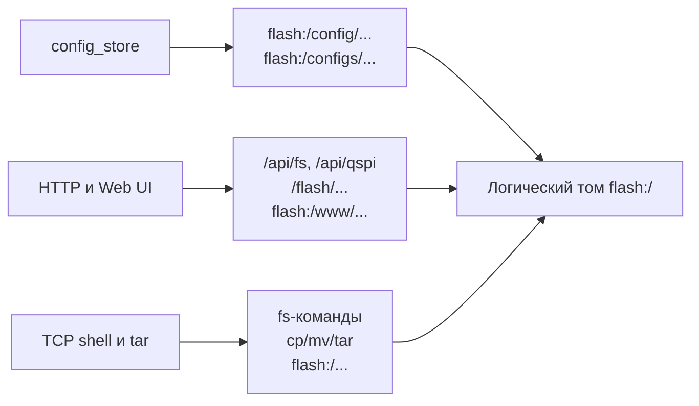

Для `QSPI` архитектурные связи заметно жёстче, чем для `SD`. Том `flash:/`
используется как основной носитель постоянного состояния системы. Через него
работает `config_store`, который хранит и загружает конфигурацию из
`flash:/config/...` с поддержкой legacy-layout `flash:/configs/...`. Через него
же HTTP-слой обслуживает файловый доступ к `/flash/...`, endpoint
`/api/qspi` и раздачу Web UI из `flash:/www/...`. TCP-консоль и tar-сценарии
также работают с этим томом как с обычным файловым устройством.

С точки зрения низкоуровневой архитектуры путь здесь тоже отличается от `SD`.
Подсистема `qspi_fs` опирается на драйвер `qspi_flash`, который выполняет
инициализацию контроллера `XQspiPs`, чтение, программирование страниц и стирание
секторов flash. Поверх этого слоя `diskio.c` экспортирует выделенное окно QSPI
как блочное устройство FatFs. И только после этого подсистема становится
доступной остальным частям прошивки в форме логического тома `flash:/`.

##### 4.2.3.3. Назначение и модель данных

С архитектурной точки зрения `QSPI` следует рассматривать как встроенное
постоянное хранилище устройства. В отличие от `SD`, оно не предназначено
прежде всего для обменных или съёмных пользовательских сценариев. Его основная
роль состоит в том, чтобы хранить конфигурацию устройства, web-ресурсы и
другие данные, которые должны переживать перезагрузку и быть доступны сразу
после старта системы.

При этом в файловую систему отдаётся не всё адресное пространство флеша. В
`qspi_fs_layout.h` файловое окно FatFs задаётся как диапазон, начинающийся с
`QSPI_FS_BASE_BYTES` и занимающий `QSPI_FS_SIZE_BYTES`. По умолчанию первые
`8 MiB` флеша резервируются под `BOOT.bin` и другие boot-образы, а том
`flash:/` строится только поверх оставшейся части памяти. Это принципиальная
архитектурная граница: файловая подсистема QSPI не должна пересекаться с
областью загрузочных образов.

В упрощённом виде эта раскладка может быть представлена так:

| Область QSPI flash | Диапазон | Архитектурная роль |
|---|---|---|
| Зарезервированная начальная область | `0 .. QSPI_FS_BASE_BYTES - 1` | Загрузочные образы, включая `BOOT.bin`, и другие данные раннего старта |
| Файловое окно FatFs | `QSPI_FS_BASE_BYTES .. QSPI_FS_BASE_BYTES + QSPI_FS_SIZE_BYTES - 1` | Логический том `flash:/`, доступный прошивке как встроенное файловое хранилище |

При значениях по умолчанию эта схема означает, что из общего объёма флеша
`32 MiB` первые `8 MiB` не участвуют в файловой подсистеме, а оставшиеся
`24 MiB` используются как окно для тома `flash:/`.

Для остальной прошивки `QSPI` выглядит как обычный файловый том `flash:/`, с
которым можно работать через FatFs так же, как и с другими файловыми
устройствами. Но на физическом уровне это не такой же носитель, как `SD`, а
NOR flash со своей моделью записи.

Практически это означает, что запись в `flash:/` под капотом устроена сложнее,
чем кажется на уровне файловой системы. Файловый слой работает блоками по
`512` байт, а сама QSPI flash стирается более крупными участками по `4 KiB`.
Поэтому для изменения данных драйверу приходится не просто переписать один
логический блок, а сначала прочитать более крупный участок флеша, затем
обновить нужные данные в памяти, после чего стереть физический сектор и
запрограммировать его заново.

Эта деталь важна не сама по себе, а как архитектурное объяснение того, почему
`flash:/` нельзя полностью приравнивать к обычному блочному диску. На уровне
API он выглядит как нормальный том FatFs, но на уровне физической памяти
опирается на более грубую и дорогую по операциям модель записи, характерную
для NOR flash.

#### 4.2.4. Общий слой файлового доступа

Поверх конкретных носителей `SD` и `QSPI` в прошивке существует общий файловый
слой, который даёт остальным подсистемам единый способ работы с файловыми
томами. Его задача состоит не в управлении аппаратурой хранения, а в том,
чтобы представить разные носители в общей файловой модели и скрыть различия
между ними на уровне прикладных вызовов.

Архитектурно этот слой может быть представлен следующим образом:

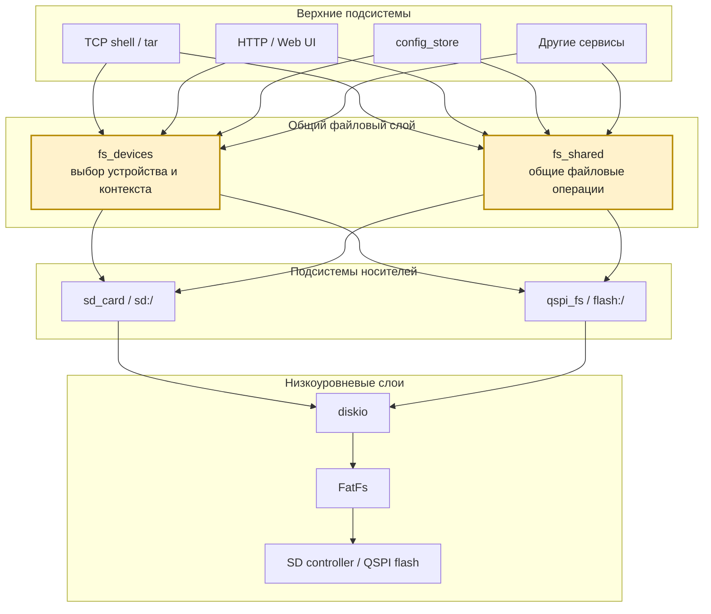

Практически эта роль реализуется через два связанных компонента. `fs_shared`
задаёт общий контракт файловых операций над контекстом конкретного тома:
монтирование, проверку готовности, чтение, запись, создание каталогов,
удаление, копирование и другие базовые действия. `fs_devices`, в свою очередь,
связывает символьные имена устройств вроде `sd` и `flash` с соответствующими
файловыми контекстами и позволяет выбрать нужный том по имени или по пути.

Архитектурный смысл этого слоя состоит в том, что верхние сервисы прошивки
работают не с драйверами `SD` или `QSPI` напрямую, а с уже опубликованными
логическими томами. Благодаря этому shell, HTTP и другие части системы могут
использовать одинаковую модель файловых операций для `sd:/` и `flash:/`,
несмотря на различия между физическими носителями и их низкоуровневыми
драйверами.

### 4.3. Подсистема конфигурации

Подсистема конфигурации отвечает за загрузку, хранение и публикацию рабочего
конфигурационного состояния устройства. В текущей реализации её центральным
компонентом является `config_store`.

#### 4.3.1. Архитектурная роль и границы ответственности

`config_store` выполняет роль центральной точки
публикации конфигурационного состояния устройства. Через него прошивка
получает уже собранную прикладную
конфигурацию, пригодную для использования сетевым уровнем и PL-подсистемами.
Его следует рассматривать как самостоятельную архитектурную подсистему между хранением и рабочей логикой устройства.

Концептуально роль `config_store` в системе может быть представлена так:

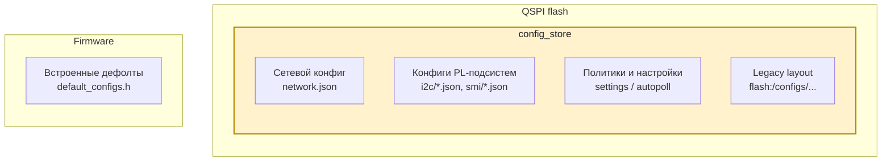

В практическом смысле зона ответственности `config_store` включает четыре
задачи. Во-первых, он загружает конфигурацию из постоянного хранилища и умеет
переходить на встроенные значения по умолчанию, если сохранённые данные
недоступны. Во-вторых, он приводит эту конфигурацию к внутренней рабочей форме
и хранит её в памяти в виде структур `network_config_t`,
`i2c_device_config_t`, `smi_phy_config_t` и связанных с ними конфигурационных
данных. В-третьих, он публикует состояние
готовности, после которого другие подсистемы могут считать конфигурацию
доступной. В-четвёртых, он предоставляет API для чтения, обновления и
сохранения уже загруженного конфигурационного состояния обратно в `flash:/`.

При этом границы ответственности `config_store` достаточно чёткие. Он хранит и
публикует конфигурацию, но сам не поднимает сеть, не управляет жизненным
циклом `PL` подсистем, не выполняет прикладные операции с устройствами и не
заменяет собой файловую подсистему. После публикации конфигурации он передаёт
эстафету другим архитектурным блокам, которые уже используют загруженные
данные в своей собственной рабочей логике.

#### 4.3.2. Жизненный цикл и публикация готовности

#### 4.3.3. Источники конфигурации и приоритеты

#### 4.3.4. Модель данных и состав конфигурации

#### 4.3.5. Взаимодействие с другими подсистемами

#### 4.3.6. Готовность и режим деградации

### 4.4. Сетевой уровень

### 4.5. Сервисы управления

### 4.6. Подсистемы работы с PL
