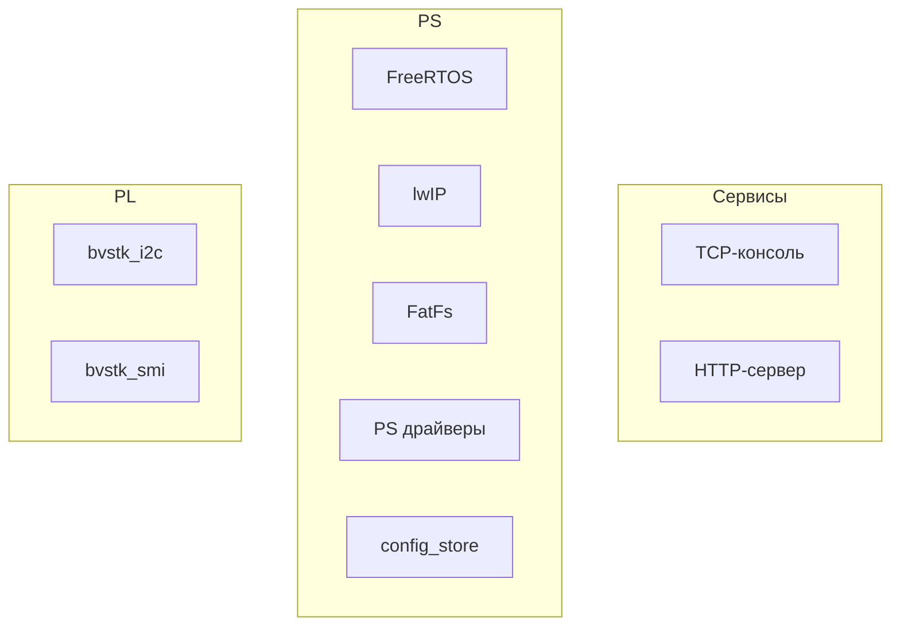
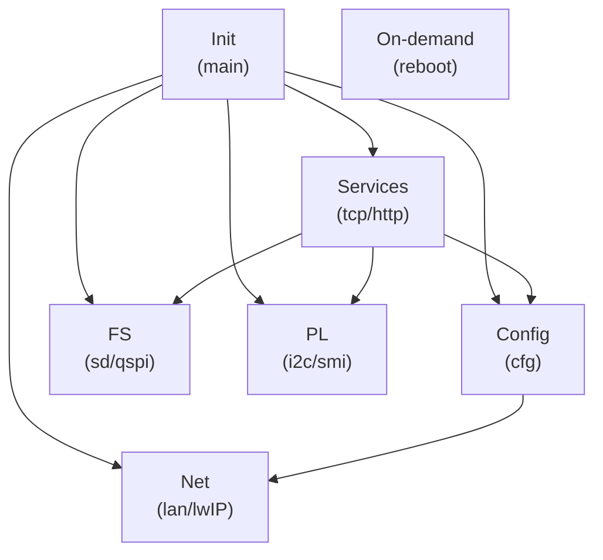
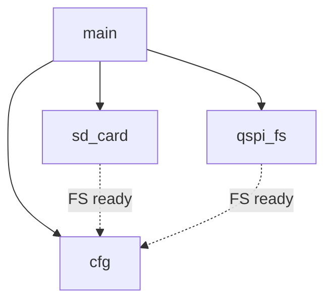
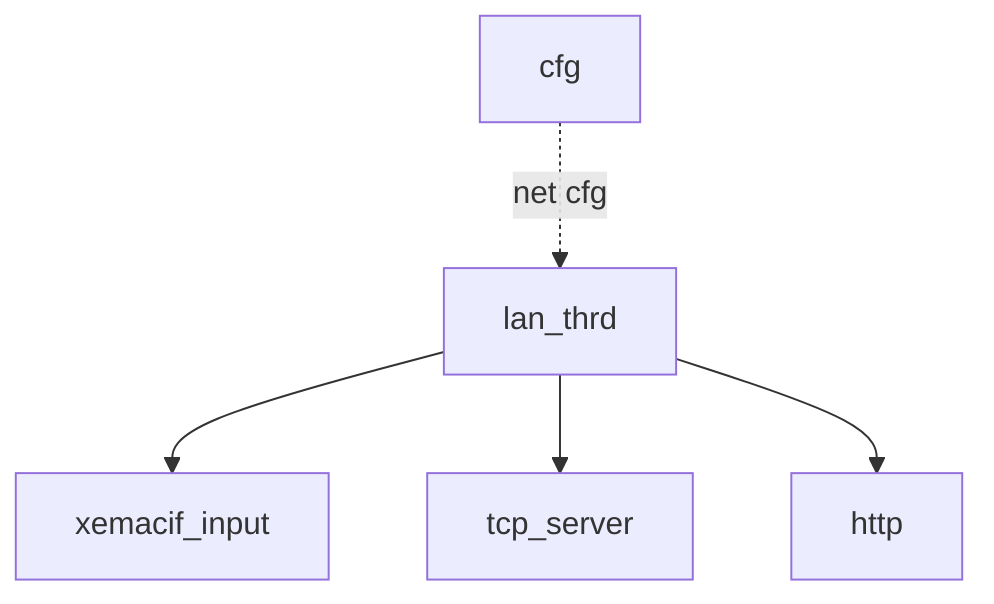
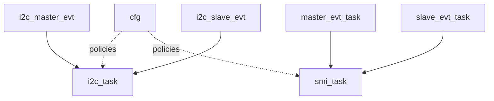

# Архитектура системы

Подробный разбор архитектуры прошивки, задач FreeRTOS и порядка инициализации.

### Общая схема модулей

Логически прошивка состоит из трёх “слоёв”:
- **Системный слой PS**: FreeRTOS, lwIP, FatFs и драйверы PS‑периферии (GEM/SDIO/QSPI).
- **Сервисы управления**: TCP‑консоль и HTTP‑сервер, которые используют сеть, файловые системы и конфигурацию.
- **Подсистемы PL‑ядер**: `bvstk_i2c` и `bvstk_smi`, управляемые со стороны PS и конфигурируемые через JSON.

Связи между слоями:

Соответствие блоков схемы модулям в `bvstk/src/`:

- **TCP‑консоль** (`tcp`)
  - `src/bvstk_tcp_server/bvstk_tcp_server.c`, `src/bvstk_tcp_server/bvstk_tcp_server.h`
  - `src/bvstk_tcp_server/utils/console_common.c`, `src/bvstk_tcp_server/utils/console_common.h`
  - `src/bvstk_tcp_server/utils/console_dispatch.c`
  - Команды: `src/bvstk_tcp_server/utils/fs_shell.c`, `src/bvstk_tcp_server/utils/ip_shell.c`, `src/bvstk_tcp_server/utils/i2c_shell.c`, `src/bvstk_tcp_server/utils/smi_shell.c`, `src/bvstk_tcp_server/utils/mem_shell.c`, `src/bvstk_tcp_server/utils/tar_shell.c`, `src/bvstk_tcp_server/utils/reg_frames.c`

- **HTTP‑сервер** (`http`)
  - `src/http/http_server.c`, `src/http/http_server.h`
  - `src/http_fs/http_fs_routes.c`
  - `src/tar/tar.c`, `src/tar/tar.h`

- **FreeRTOS** (`rtos`)
  - Запуск и init: `src/main.c`, `src/main.h`
  - Задачи/потоки: `src/bvstk_lan/bvstk_lan.c`, `src/bvstk_tcp_server/bvstk_tcp_server.c`, `src/http/http_server.c`, `src/config/config_store.c`, `src/sd_card/sd_card.c`, `src/qspi_fs/qspi_fs.c`, `src/bvstk_i2c/bvstk_i2c.c`, `src/bvstk_smi/bvstk_smi.c`
  - Glue для FatFs: `src/fs/ffsystem_freertos.c`

- **lwIP** (`lwip`)
  - `src/bvstk_lan/bvstk_lan.c`, `src/bvstk_lan/bvstk_lan.h`
  - Сокеты: `src/bvstk_tcp_server/*`, `src/http/http_server.c`, `src/http_fs/http_fs_routes.c`, `src/fs/fs_shared.c`
  - Доп. сервисы: `src/mqtt_proc/*`, `src/sntp_proc/*`

- **FatFs** (`fatfs`)
  - `src/fs/fs_shared.c`, `src/fs/fs_shared.h`
  - `src/fs/fs_devices.c`, `src/fs/fs_devices.h`
  - `src/fs/diskio.c`
  - SD том: `src/sd_card/sd_card.c`, `src/sd_card/sd_card.h`
  - QSPI том: `src/qspi_fs/qspi_fs.c`, `src/qspi_fs/qspi_fs.h`, `src/qspi_fs/qspi_fs_layout.h`

- **PS драйверы** (`psdrv`)
  - Ethernet (GEM): `src/bvstk_lan/bvstk_lan.c`
  - SDIO: `src/sd_card/sd_card.c`
  - QSPI: `src/qspi_flash/qspi_flash.c`, `src/qspi_flash/qspi_flash.h`
  - MMIO/IRQ для PL‑взаимодействия: `src/bvstk_i2c/bvstk_i2c.c`, `src/bvstk_smi/bvstk_smi.c`

- **config_store** (`cfg`)
  - `src/config/config_store.c`, `src/config/config_store.h`
  - Дефолты (генерируются при сборке): `src/config/default_configs.h`

- **bvstk_i2c** (`i2c_sw`)
  - `src/bvstk_i2c/bvstk_i2c.c`, `src/bvstk_i2c/bvstk_i2c.h`
  - Интеграции: `src/bvstk_tcp_server/utils/i2c_shell.c`, `src/http_fs/http_fs_routes.c`

- **bvstk_smi** (`smi_sw`)
  - `src/bvstk_smi/bvstk_smi.c`, `src/bvstk_smi/bvstk_smi.h`
  - Интеграции: `src/bvstk_tcp_server/utils/smi_shell.c`, `src/http_fs/http_fs_routes.c`

### Потоки/задачи FreeRTOS

В прошивке используется ОСРВ FreeRTOS. “Потоки” lwIP (`sys_thread_new`) в итоге тоже создаются как задачи FreeRTOS (через порт lwIP под FreeRTOS).

**Группы задач**

Расшифровка групп:

- **Init (main)** — *не задача*: синхронный код в `src/main.c` до `vTaskStartScheduler()`, который вызывает `start_*()` и тем самым создаёт задачи ниже.
  - Создаёт/запускает: `sd_card`, `qspi_fs`, `cfg`, `lan_thrd`, `tcp_server_thrd`, `http`, а также подсистемы I2C/SMI/SPI.
- **Config (cfg)** — задача `cfg` (`src/config/config_store.c`): загрузка/миграция JSON и выставление `config_store_is_ready()`.
  - Задачи: `cfg`
- **FS (sd/qspi)** — фоновые задачи, которые монтируют тома и держат флаги готовности.
  - Задачи: `sd_card`, `qspi_fs`
- **Net (lan/lwIP)** — инициализация сети и приём пакетов.
  - Задачи/потоки: `lan_thrd`, `xemacif_input_thread`
- **Services (tcp/http)** — пользовательские сервисы поверх lwIP.
  - Задачи/потоки: `tcp_server_thrd`, `http`
- **PL (i2c/smi)** — подсистемы кастомных PL‑ядер (event‑таски + worker/autopoll).
  - I2C: `i2c_master_evt`, `i2c_slave_evt`, `i2c_task`
  - SMI: `master_evt_task`, `slave_evt_task`, `smi_task`
- **On-demand (reboot)** — задачи, которые создаются на время выполнения команды.
  - Задачи: `reboot`

**Конфиг и файловые системы**

Расшифровка:

- **`main`** — `src/main.c`: синхронно вызывает `start_sd_card()`, `start_qspi_fs()`, `start_config_store()` и т.п., затем запускает планировщик.
- **`sd_card`** — `src/sd_card/sd_card.c`: задача, которая инициализирует SDIO и периодически пытается примонтировать SD‑том (`sd:/`, `0:/`).
- **`qspi_fs`** — `src/qspi_fs/qspi_fs.c`: задача, которая инициализирует QSPI и периодически пытается примонтировать QSPI‑том (`flash:/`, `1:/`).
- **`cfg`** — `src/config/config_store.c`: задача, которая ждёт готовность QSPI‑тома, создаёт каталоги `flash:/config`, мигрирует legacy‑конфиги, читает/парсит JSON и выставляет `config_store_is_ready()`.
- **`FS ready` (пунктир)** — логическая зависимость: `cfg` использует QSPI‑ФС для чтения/записи конфигов; `sd_card`/`qspi_fs` поднимают соответствующие тома и выставляют флаг готовности.

**Сеть и сервисы**

Расшифровка:

- **`cfg`** — `src/config/config_store.c`: источник сетевых параметров (IP/маска/шлюз/MAC) из `flash:/config/network.json` (или дефолт), которые используются при инициализации сети.
- **`lan_thrd`** — `src/bvstk_lan/bvstk_lan.c`: поток/задача, который читает конфиг (если готов), вызывает `lwip_init()`, поднимает `netif` и делает интерфейс “up”.
- **`xemacif_input`** — поток `xemacif_input_thread` (создаётся из `lan_thrd`): приём/обработка входящих пакетов из драйвера Ethernet и доставка их в стек lwIP.
- **`tcp_server`** — `src/bvstk_tcp_server/bvstk_tcp_server.c`: TCP‑консоль (порт 8888), работает поверх socket API lwIP.
- **`http`** — `src/http/http_server.c` + `src/http_fs/http_fs_routes.c`: HTTP‑сервер (порт 80) и маршрутизация `/api/*`, `/sd|/flash|/tar`, статика из `flash:/www/`.
- **`net cfg` (пунктир)** — логическая зависимость: `lan_thrd` пытается использовать параметры из `cfg` (если `config_store_is_ready()`), иначе поднимается с дефолтными значениями.

**PL подсистемы**

Расшифровка:

- **`cfg`** — `src/config/config_store.c`: источник конфигов/политик для PL‑подсистем (I2C/SMI), доступных через `config_store_*`.
- **I2C задачи** — `src/bvstk_i2c/bvstk_i2c.c`:
  - **`i2c_master_evt`** — event‑задача: получает события от IRQ/очереди “master” и инициирует обработку.
  - **`i2c_slave_evt`** — event‑задача: получает события “slave” (кадры/команды) и инициирует обработку.
  - **`i2c_task`** — рабочая задача: autopoll, применение persisted settings, операции чтения/записи с учётом политик.
- **SMI задачи** — `src/bvstk_smi/bvstk_smi.c`:
  - **`master_evt_task`** — event‑задача “master”: обработка событий от IRQ/очереди.
  - **`slave_evt_task`** — event‑задача “slave”: обработка команд/событий хоста.
  - **`smi_task`** — рабочая задача: autopoll PHY, применение persisted settings, операции чтения/записи с учётом политик.
- **`policies` (пунктир)** — логическая зависимость: рабочие задачи используют данные из `cfg` (конфиги устройств/PHY и политики), когда `config_store_is_ready()` установлен.
- **Стрелки `*_evt → *_task`** — упрощённо: ISR кладёт событие в очередь → event‑задача извлекает → основная логика выполняется в worker‑задаче.

**Постоянные задачи (создаются при старте)**
- **`cfg`** — загрузка/миграция JSON‑конфигов и установка флага готовности (`start_config_store()` → `config_task`). `CONFIG_TASK_STACK=2048`, `CONFIG_TASK_PRIO=tskIDLE_PRIORITY+3`. Код: `src/config/config_store.c`.
- **`sd_card`** — фоновое монтирование SD (`0:/`, `sd:/`) с периодическими попытками. `SD_TASK_STACK=1024`, `SD_TASK_PRIO=tskIDLE_PRIORITY+2`. Код: `src/sd_card/sd_card.c`.
- **`qspi_fs`** — фоновое монтирование QSPI‑тома (`1:/`, `flash:/`). `QSPI_TASK_STACK=1024`, `QSPI_TASK_PRIO=tskIDLE_PRIORITY+1`. Код: `src/qspi_fs/qspi_fs.c`.
- **`lan_thrd`** — инициализация сети (lwIP + netif) и запуск input‑треда `xemacif_input_thread`. Код: `src/bvstk_lan/bvstk_lan.c`.
- **`tcp_server_thrd`** — TCP‑консоль на порту 8888. Стек: `TCP_THREAD_STACKSIZE=12288`. Код: `src/bvstk_tcp_server/bvstk_tcp_server.c`, `src/bvstk_tcp_server/bvstk_tcp_server.h`.
- **`http`** — HTTP‑сервер на порту 80. Стек: `HTTP_THREAD_STACK=2048`. Код: `src/http/http_server.c`.
- **I2C подсистема** — `i2c_master_evt`, `i2c_slave_evt`, `i2c_task` (очереди + обработка событий + autopoll). `I2C_TASK_STACK_SIZE=512`, `I2C_TASK_PRIORITY=tskIDLE_PRIORITY+1`. Код: `src/bvstk_i2c/bvstk_i2c.c`, `src/bvstk_i2c/bvstk_i2c.h`.
- **SMI подсистема** — `master_evt_task`, `slave_evt_task`, `smi_task` (очереди + обработка событий + autopoll). `SMI_TASK_STACK_SIZE=1024`, `SMI_TASK_PRIORITY=tskIDLE_PRIORITY+1` (evt‑таски: `SMI_TASK_PRIORITY+1`). Код: `src/bvstk_smi/bvstk_smi.c`, `src/bvstk_smi/bvstk_smi.h`.

**Задачи “по требованию”**
- **`reboot`** — отложенная перезагрузка (создаётся по команде из консоли или HTTP). Код: `src/bvstk_tcp_server/utils/console_dispatch.c`, `src/http_fs/http_fs_routes.c`.

**Синхронизация и обмен**
- Очереди FreeRTOS используются в I2C/SMI для доставки событий из ISR в задачи (например, `q_master/q_slave`).
- Mutex’ы используются для шины/доступа к общим ресурсам (например, `i2c_bus_mutex`, `smi_bus_mutex`, а также mutex’ы контекстов ФС SD/QSPI).

### Порядок инициализации

Порядок старта задаётся `src/main.c`. Важно: до `vTaskStartScheduler()` выполняется “синхронный” код `main()`, который **создаёт задачи**; сами задачи начинают выполняться после запуска планировщика.

**Шаги `main()` (по порядку вызова)**
1. `qspi_flash_self_test()` — быстрый тест записи/чтения QSPI (и попытка восстановить исходные данные тестового сектора).
2. `start_sd_card()` — создаёт задачу `sd_card` и делает первую попытку монтирования SD‑тома.
3. `start_qspi_fs()` — создаёт задачу `qspi_fs` и делает первую попытку монтирования QSPI‑тома.
4. `fs_devices_init()` — связывает “устройства” `sd`/`flash` с их контекстами (маршрутизация `sd:/` и `flash:/`).
5. `start_config_store()` — создаёт задачу `cfg`:
   - ждёт готовность QSPI‑тома (порядка десятков секунд),
   - создаёт `flash:/config/`,
   - мигрирует legacy `flash:/configs/` при необходимости,
   - загружает JSON‑конфиги в RAM и выставляет `config_store_is_ready()`.
6. `start_lan()` — создаёт поток `lan_thrd`, который:
   - пытается дождаться `config_store` (короткий таймаут),
   - вызывает `lwip_init()`, поднимает `netif`,
   - создаёт поток `xemacif_input_thread`.
7. `start_tcp_server()` — создаёт поток `tcp_server_thrd` (TCP‑консоль `:8888`).
8. `start_http_server()` — создаёт поток `http` (HTTP `:80`).
9. `start_smi()` — создаёт задачи SMI: `master_evt_task`, `slave_evt_task`, `smi_task`.
10. `start_i2c()` — создаёт задачи I2C: `i2c_master_evt`, `i2c_slave_evt`, `i2c_task`.
11. `vTaskStartScheduler()` — запуск планировщика; после этого управление переходит задачам.

**Ключевые зависимости**
- `cfg` использует QSPI‑том для чтения/записи конфигов; пока QSPI не смонтирован, используется fallback на “вшитые” дефолты.
- `lan_thrd` пытается применить сетевой конфиг из `cfg`; если `config_store` ещё не готов, сеть поднимется с дефолтными параметрами.
- `tcp_server_thrd` и `http` предполагают, что сеть/стек lwIP уже подняты (поэтому `start_lan()` вызывается раньше).
