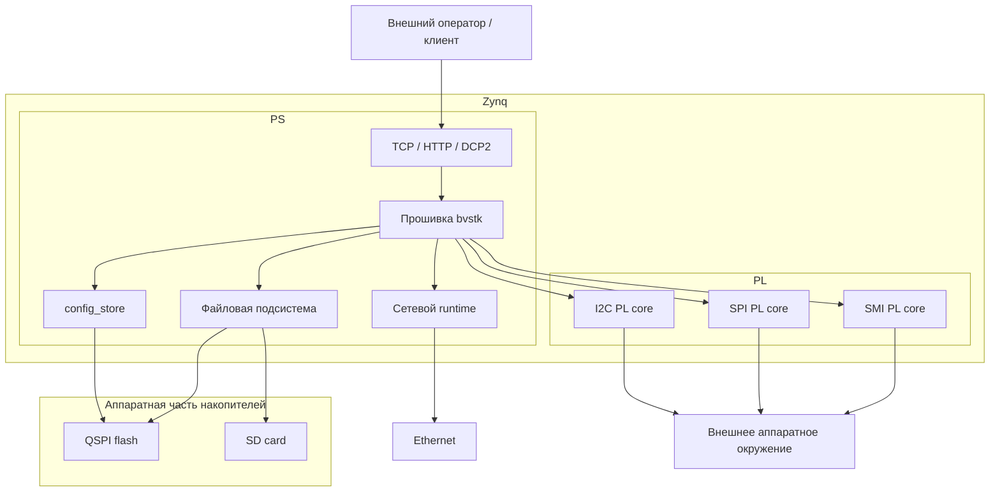
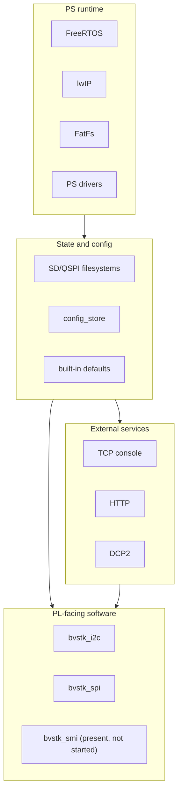
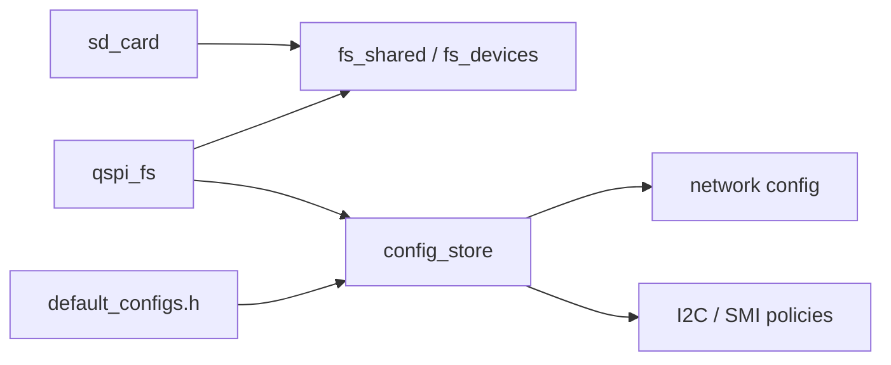

# Архитектура системы

## Оглавление

1. [Назначение документа](#1-назначение-документа)
2. [Границы системы](#2-границы-системы)
3. [Архитектурная роль прошивки](#3-архитектурная-роль-прошивки)
4. [Основные архитектурные блоки](#4-основные-архитектурные-блоки)
5. [Последовательность старта](#5-последовательность-старта)
6. [Модель готовности подсистем](#6-модель-готовности-подсистем)
7. [Архитектура исполнения](#7-архитектура-исполнения)
8. [Модель конфигурации и состояния](#8-модель-конфигурации-и-состояния)
9. [Внешние интерфейсы управления](#9-внешние-интерфейсы-управления)
10. [Граница PS ↔ PL](#10-граница-ps--pl)
11. [PL-подсистемы](#11-pl-подсистемы)
12. [Деградированные режимы и частичная работоспособность](#12-деградированные-режимы-и-частичная-работоспособность)
13. [Ключевые архитектурные ограничения](#13-ключевые-архитектурные-ограничения)
14. [Source of Truth](#14-source-of-truth)
15. [Связанные документы](#15-связанные-документы)

## 1. Назначение документа

Настоящий документ описывает архитектуру исполнения прошивки `bvstk` в её
текущем состоянии. В документе фиксируются границы системы, состав основных
подсистем, порядок старта, модель готовности и ключевые зависимости между
конфигурацией, сетью, сервисами управления и PL-подсистемами.

Документ предназначен для использования как верхнеуровневый архитектурный
reference при анализе и изменении firmware.

## 2. Границы системы

### 2.1. Что входит в систему

В состав системы входят прошивка `bvstk`, исполняемая на PS-части Zynq,
аппаратная платформа на базе соответствующего hardware design в PL, локальные
подсистемы хранения на SD и QSPI, подсистема конфигурации `config_store`,
сетевой runtime на базе lwIP, внешние сервисы управления `TCP`, `HTTP` и
`DCP2`, а также программные подсистемы работы с PL-ядрами `I2C`, `SPI` и
`SMI`.

В архитектурном смысле `bvstk` следует рассматривать не как изолированное
приложение, а как программную управляющую часть единой системы, в
которой поведение firmware определяется как собственным runtime-кодом, так и
составом, адресным пространством и моделью работы аппаратных блоков,
экспортированных из hardware platform.

### 2.2. Что находится вне репозитория `bvstk`

За пределами репозитория `bvstk` находятся аппаратный Vivado-проект, из
которого
формируется целевой hardware design, экспортируемые артефакты `bit` и `xsa`, а
также исходные описания и упаковка кастомных PL-ядер, используемых прошивкой.
Для текущей системы эта часть представлена отдельным hardware-репозиторием, в
котором задаются состав аппаратных блоков, их адресное пространство, линии
прерываний, топология соединений и другие свойства платформы, от которых
напрямую зависит корректность работы firmware.

### 2.3. Внешние зависимости

Архитектура `bvstk` зависит от ряда внешних компонентов, которые определяют
возможность сборки, запуска и корректной работы системы. Эти зависимости
приведены в таблице ниже.

| Внешний компонент            | Архитектурная роль                                                                                                                                                                                           |
| ---------------------------- | ------------------------------------------------------------------------------------------------------------------------------------------------------------------------------------------------------------ |
| Hardware platform            | Определяет аппаратную конфигурацию системы, включая состав PL-блоков, адресное пространство, линии прерываний и топологию соединений, на которые опирается firmware.                                         |
| Накопители памяти            | Обеспечивают файловую подсистему устройства и хранение постоянного состояния. В текущей архитектуре к ним относятся `QSPI` и `SD`, от доступности которых зависят `flash:/`, `sd:/` и работа `config_store`. |
| Ethernet                     | Обеспечивает сетевую связность, необходимую для работы сервисов `TCP`, `HTTP` и `DCP2`.                                                                                                                      |
| Внешнее аппаратное окружение | Включает устройства, доступ к которым осуществляется через ядра в программируемой логике (PL)                                                                                                                |

## 3. Архитектурная роль прошивки

### 3.1. Прошивка как управляющий слой системы

В системе `bvstk` прошивка выполняет функцию программного управляющего слоя.
Она координирует запуск подсистем, загрузку конфигурации, инициализацию сети,
работу внешних сервисов управления и доступ к аппаратным возможностям
платформы.

Через прошивку связываются внешние интерфейсы управления, локальное состояние
устройства и аппаратные блоки, расположенные в PL. По этой причине
архитектурная роль `bvstk` сводится к организации целостного управления
системой на стороне PS.

### 3.2. Что прошивка делает при нормальной работе

### 3.3. Что прошивка не определяет самостоятельно

## 4. Основные архитектурные блоки

### 4.1. Базовый runtime layer

### 4.2. Storage and filesystem layer

### 4.3. Configuration layer

### 4.4. Network layer

### 4.5. Control-plane services

### 4.6. PL-facing subsystems

## 5. Последовательность старта

### 5.1. Точка входа `main()`

### 5.2. Порядок вызовов `start_*`

### 5.3. Что происходит до `vTaskStartScheduler()`

### 5.4. Что становится асинхронным после запуска планировщика

### 5.5. Текущий boot profile

## 6. Модель готовности подсистем

### 6.1. Готовность файловых систем

### 6.2. Готовность `config_store`

### 6.3. Готовность сети

### 6.4. Готовность сервисов TCP / HTTP / DCP2

### 6.5. Готовность I2C / SPI / SMI

## 7. Архитектура исполнения

### 7.1. Постоянные задачи и потоки

### 7.2. Временные задачи

### 7.3. Shared state и общие ресурсы

### 7.4. Очереди, mutex и event paths

## 8. Модель конфигурации и состояния

### 8.1. Built-in defaults

### 8.2. Persistent config на QSPI

### 8.3. Applied runtime state

### 8.4. Центральная роль `config_store`

## 9. Внешние интерфейсы управления

### 9.1. TCP-консоль

### 9.2. HTTP

### 9.3. DCP2

### 9.4. Разделение ролей между интерфейсами

## 10. Граница PS ↔ PL

### 10.1. Общая модель взаимодействия

### 10.2. MMIO, IRQ и аппаратные зависимости

### 10.3. Что задаётся hardware design

### 10.4. Что реализуется firmware

## 11. PL-подсистемы

### 11.1. I2C

### 11.2. SPI

### 11.3. SMI

### 11.4. Текущий статус подсистем в boot path

## 12. Деградированные режимы и частичная работоспособность

### 12.1. Отсутствие `flash:/`

### 12.2. Timeout `config_store`

### 12.3. Fallback network configuration

### 12.4. Частично поднятые сервисы

### 12.5. Подсистема присутствует в коде, но не активна при старте

## 13. Ключевые архитектурные ограничения

### 13.1. Зависимость от актуального `xsa`

### 13.2. Зависимость поведения от PL-ядра

### 13.3. Разделение persisted state и runtime state

### 13.4. Несинхронная готовность подсистем

## 14. Source of Truth

### 14.1. Boot path

### 14.2. Configuration

### 14.3. Network

### 14.4. TCP / HTTP / DCP2

### 14.5. I2C / SPI / SMI

### 14.6. Hardware platform

## 15. Связанные документы

### 15.1. `build.md`

### 15.2. `run-and-debug.md`

### 15.3. `config-store.md`

### 15.4. `pl-cores.md`

### 15.5. `dcp2.md`

---

## Legacy: Старая версия текста

Этот документ описывает архитектуру прошивки в её текущем состоянии. Его цель не в том, чтобы перечислить все файлы подряд, а в том, чтобы зафиксировать рабочую модель системы: что именно стартует при загрузке, как связаны между собой файловые системы, конфигурация, сеть и сервисы, и где проходит граница между программной частью на PS и аппаратными блоками в PL.

Для `bvstk` особенно важно помнить, что архитектура не сводится к набору FreeRTOS-задач. Прошивка существует как программная половина системы на базе Zynq и зависит от аппаратного экспорта, из которого приходят адреса, IRQ и доступные PL-ядра. Поэтому правильнее воспринимать её как control plane поверх конкретного hardware design, а не как абстрактное сетевое приложение.

## Архитектура в одном абзаце

После старта `main()` выполняет короткую синхронную инициализацию и создаёт фоновые задачи. Сначала поднимаются локальные носители и слой файловых устройств, затем стартует `config_store`, который переводит систему от встроенных дефолтов к сохранённой конфигурации на QSPI. После этого поднимается сеть, а уже поверх неё запускаются пользовательские сервисы: TCP-консоль, HTTP и DCP2. Параллельно стартуют подсистемы работы с PL-ядрами. В текущей версии это `I2C` и `SPI`; код `SMI` в проекте есть, но из `main()` сейчас не запускается.

## Логическая схема

Если убрать детали реализации, прошивка состоит из четырёх крупных слоёв. Первый слой образуют базовые системные компоненты PS: FreeRTOS, lwIP, FatFs и драйверы PS-периферии. Второй слой отвечает за локальное состояние устройства: файловые системы, `config_store` и встроенные дефолты. Третий слой образуют внешние сервисы управления, через которые систему видит оператор или клиент. Четвёртый слой связан с PL-ядрами и даёт программную сторону доступа к I2C, SPI и, потенциально, SMI.

Эта схема важнее, чем дерево каталогов. Она показывает, что `config_store` не является второстепенной утилитой, а занимает центральное место между файловой системой, сетью и конфигурируемыми подсистемами. Точно так же `I2C`, `SPI` и `SMI` нельзя считать просто библиотеками для работы с регистрами: они опираются на конкретную аппаратную платформу и живут на границе PS и PL.

## Соответствие архитектуры коду

Ниже приведена компактная карта основных модулей, которая лучше отражает реальную архитектуру, чем полный перечень исходников.

| Область | Основные модули |
|---|---|
| Старт и базовая инициализация | `src/main.c`, `src/main.h` |
| Сеть и lwIP | `src/bvstk_lan/` |
| TCP-консоль | `src/bvstk_tcp_server/` и `src/bvstk_tcp_server/utils/` |
| HTTP и файловые маршруты | `src/http/`, `src/http_fs/`, `src/tar/` |
| DCP2 | `src/dcp2/` |
| Конфигурация | `src/config/` |
| SD и QSPI | `src/sd_card/`, `src/qspi_flash/`, `src/qspi_fs/`, `src/fs/` |
| PL-подсистемы | `src/bvstk_i2c/`, `src/bvstk_spi/`, `src/bvstk_smi/` |

Практически это означает следующее. Если задача связана с тем, как система стартует и в каком порядке появляются сервисы, смотреть нужно в `main.c` и в функции `start_*()`. Если вопрос упирается в сетевое поведение, нужны `bvstk_lan`, серверные модули и, нередко, `config_store`, потому что сеть берёт параметры именно оттуда. Если же поведение связано с I2C, SPI или SMI, то почти всегда приходится держать в голове сразу два слоя: C-код прошивки и соответствующую часть hardware platform.

## Что реально происходит при старте

Стартовая последовательность в текущем коде задаётся прямо в `src/main.c`. До запуска планировщика исполняется только синхронный код `main()`, который не делает “полноценную работу” сам, а в основном запускает подсистемы и создаёт задачи. Уже после `vTaskStartScheduler()` система превращается в набор параллельно работающих задач и потоков lwIP.

Текущий порядок вызовов выглядит так:

| Порядок | Вызов из `main()` | Что это даёт системе |
|---:|---|---|
| 1 | `qspi_flash_self_test()` | быстрая проверка QSPI flash до старта ФС |
| 2 | `start_sd_card()` | запуск SD-задачи и первая попытка монтирования `sd:/` |
| 3 | `start_qspi_fs()` | запуск QSPI-задачи и первая попытка монтирования `flash:/` |
| 4 | `fs_devices_init()` | связывание логических устройств `sd` и `flash` с общим FS-слоем |
| 5 | `start_config_store()` | запуск `cfg`, загрузка JSON-конфигов и переход от дефолтов к persistent state |
| 6 | `start_lan()` | запуск сетевого потока и инициализация lwIP/netif |
| 7 | `start_tcp_server()` | TCP-консоль на `8888` |
| 8 | `start_http_server()` | HTTP-сервер на `80` |
| 9 | `start_dcp2_server()` | бинарный сервер DCP2 на `8889` |
| 10 | `start_i2c()` | запуск I2C-подсистемы поверх PL |
| 11 | `start_spi()` | инициализация SPI runtime-слоя поверх PL |
| 12 | `//start_smi()` | SMI-код в проекте есть, но сейчас из старта выключен |
| 13 | `vTaskStartScheduler()` | передача управления FreeRTOS |

Это важное отличие от старой версии документации: `DCP2` и `SPI` больше нельзя считать побочными компонентами, а `SMI`, наоборот, нельзя описывать как активную часть текущего boot path. Подсистема `SMI` присутствует в коде и в документации по PL-ядрам, но в рабочем старте прошивки сейчас не участвует.

## Как связаны файловые системы и конфигурация

На уровне архитектуры `sd_card`, `qspi_fs` и `config_store` образуют один связанный блок. `sd_card` и `qspi_fs` пытаются примонтировать носители в фоне. `config_store` интересуется прежде всего QSPI-томом, потому что именно там лежит постоянная конфигурация устройства. Пока `flash:/` недоступен, система может жить на встроенных дефолтах, но не может считаться полностью перешедшей в своё нормальное конфигурируемое состояние.

`config_store` не просто читает файлы. Он создаёт каталоги на QSPI, поддерживает основной путь `flash:/config/...`, умеет работать с legacy-структурой `flash:/configs/...`, загружает сетевой конфиг и наборы конфигураций для I2C и SMI, а затем публикует их как рантайм-состояние через `config_store_is_ready()` и семейство `config_store_get_*()`.

Из-за этого многие архитектурные зависимости в проекте имеют мягкий характер. Например, сеть может стартовать до того, как `config_store` полностью готов, но тогда она поднимется на fallback-параметрах. I2C-задачи могут существовать до полной готовности конфигурации, но их содержательное поведение появится только тогда, когда loaded policies и persisted settings станут доступны.

## Как устроен сетевой слой

Сетевой слой начинается в `bvstk_lan`. Поток `lan_thrd` сначала пытается дождаться `config_store`, затем вызывает `lwip_init()`, конфигурирует `netif`, поднимает интерфейс и создаёт поток `xemacif_irq_thread`, который принимает пакеты из Ethernet-драйвера и передаёт их в стек lwIP. Если сетевой конфиг к этому моменту недоступен, подставляются жёстко заданные fallback-значения.

Поверх этого слоя работают три разных сервиса, и с архитектурной точки зрения их лучше не смешивать.

| Сервис | Порт | Архитектурная роль |
|---|---:|---|
| TCP-консоль | `8888` | человеко-ориентированный интерактивный shell и диагностика |
| HTTP | `80` | web UI, JSON API, файловые операции и reboot/file routes |
| DCP2 | `8889` | структурированный бинарный протокол с request/response и async event |

TCP-консоль реализована в `bvstk_tcp_server` и живёт как обычный socket-сервер поверх lwIP. Она выступает не только как средство ручного управления, но и как важная отладочная поверхность: через неё видны файловые системы, сеть, конфиги, I2C/SMI-команды и низкоуровневые диагностические действия вроде `mem`.

HTTP-сервер в `http_server.c` намеренно прост: он принимает по одному соединению, разбирает запрос, а маршрутизацию и прикладную логику передаёт в `http_handle_request()`, которая фактически живёт в `http_fs`-слое. С архитектурной точки зрения это не “отдельный большой web framework”, а тонкая обвязка вокруг файловых и API-маршрутов проекта.

DCP2 устроен иначе. Это не человеко-ориентированный интерфейс, а собственный бинарный протокол, который даёт формальный transport layer для операций с памятью, I2C, SMI, SPI и notify-событиями. Поэтому архитектурно DCP2 ближе не к HTTP, а к отдельной control plane surface для внешнего клиента. В текущем проекте он уже является одним из основных сервисов, а не вспомогательной утилитой.

## FreeRTOS-задачи и потоки

В проекте используются и “обычные” задачи FreeRTOS через `xTaskCreate`, и потоки lwIP через `sys_thread_new`. С архитектурной точки зрения различие между ними вторично: оба механизма в итоге создают исполняемые сущности внутри той же ОСРВ. Намного важнее понимать, какие из них являются постоянными, а какие создаются по требованию.

Ниже приведена карта постоянных задач и потоков, которые реально относятся к текущему boot path.

| Имя | Откуда создаётся | Роль |
|---|---|---|
| `sd_card` | `start_sd_card()` | фоновое монтирование SD |
| `qspi_fs` | `start_qspi_fs()` | фоновое монтирование QSPI |
| `cfg` | `start_config_store()` | загрузка и публикация конфигурации |
| `lan_thrd` | `start_lan()` | инициализация lwIP и сетевого интерфейса |
| `xemacif_irq_thread` | `lan_thread()` | приём входящих Ethernet-пакетов |
| `tcp_server_thrd` | `start_tcp_server()` | TCP-консоль |
| `http` | `start_http_server()` | HTTP-сервер |
| `dcp2` | `start_dcp2_server()` | DCP2-сервер |
| `i2c_master_evt` | `start_i2c()` | обработка master IRQ/event path для I2C |
| `i2c_slave_evt` | `start_i2c()` | обработка slave IRQ/event path для I2C |
| `i2c_task` | `start_i2c()` | рабочая I2C-логика, cache/autopoll/settings |

Помимо этого, существуют временные задачи, например `reboot`, которые создаются из TCP-консоли или HTTP-обработчиков только на время выполнения конкретного действия.

Если нужны ориентиры по стеку и приоритетам, полезно держать в голове такую сводку:

| Имя | Стек | Приоритет |
|---|---:|---:|
| `cfg` | `2048` | `tskIDLE_PRIORITY + 3` |
| `sd_card` | `1024` | `tskIDLE_PRIORITY + 2` |
| `qspi_fs` | `1024` | `tskIDLE_PRIORITY + 1` |
| `lan_thrd` | `THREAD_STACKSIZE = 2046` | `tskIDLE_PRIORITY + 2` |
| `xemacif_irq_thread` | `THREAD_STACKSIZE = 2046` | `tskIDLE_PRIORITY + 2` |
| `tcp_server_thrd` | `12288` | `tskIDLE_PRIORITY + 1` |
| `http` | `2048` | `tskIDLE_PRIORITY + 1` |
| `dcp2` | `3072` | `tskIDLE_PRIORITY + 1` |
| `i2c_master_evt` | `512` | `tskIDLE_PRIORITY + 1` |
| `i2c_slave_evt` | `512` | `tskIDLE_PRIORITY + 1` |
| `i2c_task` | `512` | `tskIDLE_PRIORITY + 1` |

SMI здесь намеренно не включён, потому что в текущем состоянии он не стартует из `main()`. Если его снова включат, к этой таблице надо будет вернуть `master_evt_task`, `slave_evt_task` и `smi_task`.

## Как устроены PL-подсистемы в текущей версии

Архитектурно `I2C`, `SPI` и `SMI` занимают разное место, хотя все они относятся к работе с PL.

`bvstk_i2c` сейчас является полноценно активной подсистемой. Она стартует вместе с системой, держит очереди событий, mutex для сериализации доступа к шине, кэш регистров и конфигурацию устройств, полученную из `config_store`. На её стороне уже живут политики записи, persisted settings, notify-интеграция и пользовательские точки входа через shell, HTTP и DCP2. Это не просто “драйвер”, а программный слой управления поверх I2C PL-core.

`bvstk_spi` в текущем коде устроен заметно проще. Он инициализирует runtime-конфигурацию SPI-ядра, при наличии IRQ ставит обработчик, а дальше предоставляет синхронную передачу слов через `spi_transfer_words()`. Здесь нет отдельной фоновой рабочей задачи уровня `i2c_task`; архитектурно это скорее thin runtime adapter между сервисами прошивки и SPI PL-core.

`bvstk_smi` по исходникам остаётся крупной и продуманной подсистемой с очередями событий, autopoll, persisted settings и фильтрами записи. Но в текущем boot path она выключена строкой `//start_smi();` в `main.c`. Это важное состояние: код и конфигурационная модель SMI в репозитории есть, DCP2 и shell по-прежнему содержат SMI-ветки, но без явного старта из `main()` их нельзя описывать как живую часть текущей архитектуры исполнения.

## Ключевые зависимости и архитектурные последствия

В `bvstk` нет одной жёсткой точки, после которой “всё уже готово”. Архитектура собрана как набор подсистем с мягкими зависимостями, поэтому у каждой части есть своё понятие readiness.

| Что зависит от чего | Практический эффект |
|---|---|
| `config_store` зависит от `flash:/` | пока QSPI не смонтирован, persistent config недоступен |
| сеть зависит от `config_store` только частично | при таймауте сеть поднимется на fallback-адресе |
| TCP/HTTP/DCP2 зависят от живого lwIP/netif | серверы могут быть созданы, но бесполезны без сети |
| I2C и SMI логически зависят от `config_store` | политики и persisted settings появляются только после загрузки конфигов |
| вся PL-логика зависит от актуального `xsa` | неверный hardware export ломает архитектуру глубже, чем отдельный баг в C-коде |

Из этого вытекает важный практический вывод. Если в системе наблюдается “частично живое” поведение, не нужно сразу считать это аномалией. Для этой архитектуры естественно, что файловые системы, конфигурация, сеть и PL-подсистемы входят в рабочее состояние не одновременно. Намного важнее понимать, на каком именно слое застряла инициализация.

## На что смотреть при архитектурных изменениях

Если меняется общий порядок старта, первая точка проверки всегда `src/main.c`. Если меняется модель конфигурации, нужно смотреть одновременно `config_store`, встроенные дефолты и те подсистемы, которые читают `config_store_is_ready()`. Если меняется внешняя поверхность управления, почти всегда затрагиваются сразу несколько слоёв: TCP-консоль, HTTP, DCP2 и прикладная логика соответствующей шины. А если изменение касается I2C, SPI или SMI на уровне поведения транзакций, одной только прошивки уже недостаточно: архитектурно это задача на границе firmware и hardware platform.

## Что читать дальше

Этот документ даёт общую модель системы, но специально не уходит в детальный разбор каждой подсистемы. Дальше полезно открывать профильные документы по конкретной задаче.

| Документ | Когда к нему переходить |
|---|---|
| `build.md` | если нужен разбор сборки, `vitis_ws` и артефактов |
| `run-and-debug.md` | если важен JTAG-старт, attach и первичная проверка |
| `config-store.md` | если вопрос касается JSON, дефолтов, migration и persistence |
| `pl-cores.md` | если работа идёт на границе PS ↔ PL |
| `hardware-platform.md` | если нужно связать архитектуру прошивки с `Burevestnik_21` и `ip_repo` |
