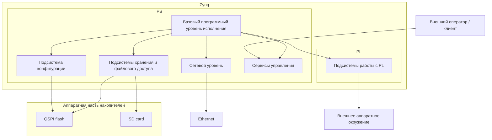
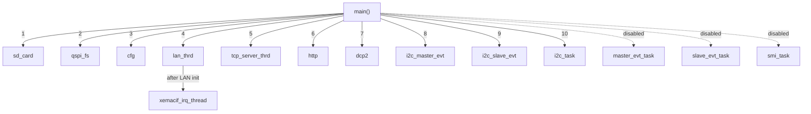
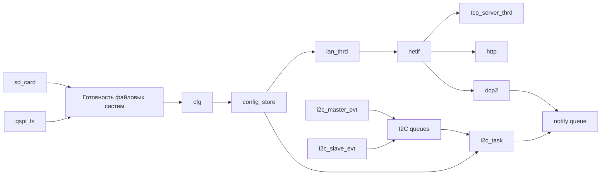

# Архитектура системы

## Оглавление

[1. Назначение документа](#1-назначение-документа)
[2. Границы системы](#2-границы-системы)
	[2.1. Что входит в систему](#21-что-входит-в-систему)
	[2.2. Что находится вне репозитория `bvstk`](#22-что-находится-вне-репозитория-bvstk)
	[2.3. Внешние зависимости](#23-внешние-зависимости)
[3. Архитектурная роль прошивки](#3-архитектурная-роль-прошивки)
	[3.1. Прошивка как управляющий слой системы](#31-прошивка-как-управляющий-слой-системы)
	[3.2. Порядок включения системы и связь макро-блоков](#32-порядок-включения-системы-и-связь-макро-блоков)
[4. Основные архитектурные блоки](#4-основные-архитектурные-блоки)
	[4.1. Базовый программный уровень исполнения](#41-базовый-программный-уровень-исполнения)
		[4.1.1. Точка входа](#411-точка-входа)
		[4.1.2. ОСРВ FreeRTOS](#412-осрв-freertos)
		[4.1.3. Платформа Xilinx и BSP](#413-платформа-xilinx-и-bsp)
		[4.1.4. Базовые механизмы PS](#414-базовые-механизмы-ps)
[4.2. Подсистемы хранения и файлового доступа](#42-подсистемы-хранения-и-файлового-доступа)
[4.3. Подсистема конфигурации](#43-подсистема-конфигурации)
[4.4. Сетевой уровень](#44-сетевой-уровень)
[4.5. Сервисы управления](#45-сервисы-управления)
[4.6. Подсистемы работы с PL](#46-подсистемы-работы-с-pl)

## 1. Назначение документа

Настоящий документ описывает архитектуру исполнения прошивки `bvstk` в её
текущем состоянии. В документе фиксируются границы системы, состав основных
подсистем, порядок старта, модель готовности и ключевые зависимости между
конфигурацией, сетью, сервисами управления и PL-подсистемами.

Документ предназначен для использования как верхнеуровневый архитектурный
reference при анализе и изменений прошивке.

## 2. Границы системы

### 2.1. Что входит в систему

В состав системы входят прошивка `bvstk`, исполняемая на PS-части Zynq,
аппаратная платформа на базе соответствующего hardware design в PL, локальные
подсистемы хранения на SD и QSPI, подсистема конфигурации `config_store`,
сетевой runtime на базе lwIP, внешние сервисы управления `TCP`, `HTTP` и
`DCP2`, а также программные подсистемы работы с PL-ядрами.

В архитектурном смысле `bvstk` следует рассматривать как программную управляющую часть единой системы, в
которой поведение firmware определяется как собственным runtime-кодом, так и
составом, адресным пространством и моделью работы аппаратных блоков,
экспортированных из hardware platform.

### 2.2. Что находится вне репозитория `bvstk`

За пределами репозитория `bvstk` находятся аппаратный Vivado-проект, из
которого
формируется целевой hardware design, экспортируемые артефакты `bit` и `xsa`, а
также исходные описания и упаковка кастомных PL-ядер, используемых прошивкой.
Для текущей системы эта часть представлена отдельным hardware-репозиторием, в
котором задаются состав аппаратных блоков, их адресное пространство, линии
прерываний, топология соединений и другие свойства платформы, от которых
напрямую зависит корректность работы firmware.

### 2.3. Внешние зависимости

Архитектура `bvstk` зависит от ряда внешних компонентов, которые определяют
возможность сборки, запуска и корректной работы системы. Эти зависимости
приведены в таблице ниже.

| Внешний компонент            | Архитектурная роль                                                                                                                                                                                           |
| ---------------------------- | ------------------------------------------------------------------------------------------------------------------------------------------------------------------------------------------------------------ |
| Hardware platform            | Определяет аппаратную конфигурацию системы, включая состав PL-блоков, адресное пространство, линии прерываний и топологию соединений, на которые опирается firmware.                                         |
| Накопители памяти            | Обеспечивают файловую подсистему устройства и хранение постоянного состояния. В текущей архитектуре к ним относятся `QSPI` и `SD`, от доступности которых зависят `flash:/`, `sd:/` и работа `config_store`. |
| Ethernet                     | Обеспечивает сетевую связность, необходимую для работы сервисов `TCP`, `HTTP` и `DCP2`.                                                                                                                      |
| Внешнее аппаратное окружение | Включает устройства, доступ к которым осуществляется через ядра в программируемой логике (PL)                                                                                                                |

## 3. Архитектурная роль прошивки

### 3.1. Прошивка как управляющий слой системы

В системе `bvstk` прошивка выполняет функцию программного управляющего слоя.
Она координирует запуск подсистем, загрузку конфигурации, инициализацию сети,
работу внешних сервисов управления и доступ к аппаратным возможностям
платформы.

На архитектурном уровне эта роль реализуется через несколько макро-блоков,
которые образуют основную структуру системы. Базовый программный уровень
исполнения предоставляет среду работы для остальных частей прошивки.
Подсистемы хранения и файлового доступа обеспечивают доступ к локальным
носителям. Подсистема конфигурации связывает встроенные значения, постоянное
состояние и прикладные настройки устройства. Сетевой уровень поднимает
связность и создаёт основу для внешних сервисов управления. Сами сервисы
управления формируют внешнюю control-plane поверхность системы. Наконец,
подсистемы работы с PL обеспечивают доступ к аппаратным возможностям платформы
со стороны PS.

Через эти макро-блоки прошивка связывает внешние интерфейсы управления,
локальное состояние устройства, сетевое окружение, подсистемы хранения и
аппаратные блоки, расположенные в PL. По этой причине архитектурная роль
`bvstk` сводится к организации целостного управления системой на стороне PS.

Роль основных макро-блоков в архитектуре системы приведена в таблице ниже.

| Макро-блок | Архитектурная роль |
|---|---|
| Базовый программный уровень исполнения | Предоставляет среду выполнения для остальных частей прошивки и опирается на базовые программные компоненты платформы на стороне PS. |
| Подсистемы хранения и файлового доступа | Обеспечивают доступ к локальным носителям, монтирование файловых систем и работу с файловым пространством устройства. |
| Подсистема конфигурации | Связывает встроенные значения, постоянное состояние и прикладные настройки, публикуя конфигурацию для остальных частей системы. |
| Сетевой уровень | Поднимает сетевую связность устройства и создаёт основу для работы внешних интерфейсов управления. |
| Сервисы управления | Формируют внешнюю управляющую поверхность системы и связывают оператора или клиентское ПО с внутренними возможностями устройства. |
| Подсистемы работы с PL | Обеспечивают программный доступ со стороны PS к аппаратным блокам, расположенным в программируемой логике. |



### 3.2. Порядок включения системы и связь макро-блоков

При запуске системы первым начинает работать базовый программный уровень
исполнения, который создаёт среду для запуска остальных частей прошивки. Поверх
него включаются подсистемы хранения и файлового доступа, обеспечивающие доступ
к локальным носителям и файловому пространству устройства. После этого
подсистема конфигурации получает возможность загрузить и опубликовать параметры,
от которых зависит дальнейшая работа сетевого уровня и части прикладных
подсистем.

Когда конфигурация становится доступной либо определяется, что система должна
временно работать на встроенных значениях, включается сетевой уровень,
обеспечивающий связность устройства. Поверх сетевого уровня становятся доступны
сервисы управления, через которые внешний оператор или клиентское ПО получает
доступ к функциям системы. Параллельно с этим базовый программный уровень
исполнения подготавливает подсистемы работы с PL, через которые прошивка
связывается с аппаратными блоками платформы и с внешним аппаратным окружением.


## 4. Основные архитектурные блоки

### 4.1. Базовый программный уровень исполнения

Базовый программный уровень исполнения образует фундамент, на котором работают
все остальные архитектурные блоки. Он задаёт точку входа прошивки,
обеспечивает среду выполнения, предоставляет базовые системные механизмы и
связывает прикладной код с платформенным программным слоем Xilinx.

К этому уровню относятся верхнеуровневая стартовая последовательность в
`main()`, операционная система реального времени (ОСРВ) `FreeRTOS`, платформенный BSP и низкоуровневые
драйверы стороны PS, а также общие механизмы работы с памятью, прерываниями,
таймерами, диагностическим выводом и доступом к регистрам платформы. Так же
формируется программная основа, поверх которой далее строятся подсистемы
хранения и файлового доступа, подсистема конфигурации, сетевой уровень,
сервисы управления и подсистемы работы с PL.

#### 4.1.1. Точка входа

Точкой входа является функция `main()`, расположенная в
`src/main.c`. Именно в ней задаётся верхнеуровневая стартовая
последовательность
системы до передачи управления планировщику `FreeRTOS`.

На этом этапе выполняется начальный старт системы, после чего
вызовом `vTaskStartScheduler()` управление передаётся среде выполнения
`FreeRTOS`, и дальнейшая работа системы продолжается уже в модели задач и
потоков.

#### 4.1.2. ОСРВ FreeRTOS

Когда система стартовала, управление передается в среду `FreeRTOS`. После вызова `vTaskStartScheduler()` крупные подсистемы
прошивки начинают работать как набор параллельно существующих задач и потоков,
которые либо создаются напрямую через `xTaskCreate()`, либо запускаются через
`sys_thread_new()` в связке с сетевым стеком `lwIP`.

Структура задач и потоков в текущей архитектуре может быть представлена в
следующем виде:

```text
Задачи и механизмы исполнения системы
├── Задачи начального запуска и публикации состояния
│   ├── Точка входа
│   │   └── main()
│   └── Переход к многозадачному исполнению
│       └── vTaskStartScheduler()
│
├── Задачи подсистем хранения и файлового доступа
│   ├── Задачи подготовки SD
│   │   └── sd_card
│   └── Задачи подготовки QSPI
│       └── qspi_fs
│
├── Задачи конфигурационной подсистемы
│   └── Загрузка и публикация конфигурации
│       └── cfg
│
├── Задачи сетевого уровня
│   ├── Инициализация сетевого runtime
│   │   └── lan_thrd
│   └── Обслуживание сетевого стека
│       └── xemacif_irq_thread
│
├── Задачи сервисов управления
│   ├── TCP-консоль
│   │   └── tcp_server_thrd
│   ├── HTTP
│   │   └── http
│   └── DCP2
│       └── dcp2
│
├── Задачи PL-подсистем
│   ├── Задачи I2C
│   │   ├── Событийные задачи I2C
│   │   │   ├── Master path
│   │   │   │   └── i2c_master_evt
│   │   │   └── Slave path
│   │   │       └── i2c_slave_evt
│   │   └── Задачи рабочей логики I2C
│   │       └── i2c_task
│   ├── Задачи SMI
│   │   ├── Событийные задачи SMI
│   │   │   ├── Master path
│   │   │   │   └── master_evt_task
│   │   │   └── Slave path
│   │   │       └── slave_evt_task
│   │   └── Задачи рабочей логики SMI
│   │       └── smi_task
│   └── Задачи SPI
│       └── Отдельные runtime-задачи отсутствуют
│
├── Временные служебные задачи
│   └── Задачи перезагрузки
│       └── reboot
│
└── Механизмы ОСРВ и runtime-среды, не оформленные как отдельные задачи
    ├── Планировщик FreeRTOS
    ├── Heap и allocator
    ├── Очереди
    ├── Mutex и semaphore
    ├── Interrupt handlers
    ├── Hooks среды выполнения
    │   ├── vApplicationMallocFailedHook()
    │   └── vApplicationStackOverflowHook()
    └── Обвязка lwIP thread model
        └── sys_thread_new()
```

Порядок запуска задач и потоков из `main()` в текущем boot path может быть
представлен в следующем виде:



Взаимосвязь основных задач и публикуемых ими состояний в текущей архитектуре
может быть представлена в следующем виде:



С точки зрения архитектурных зависимостей эта структура не является простым
перечнем независимых задач. Подсистемы хранения `sd_card` и `qspi_fs`
подготавливают локальные носители, от которых зависит последующая работа
подсистемы конфигурации `cfg`. Задача `cfg` публикует итоговое состояние
`config_store`, которое затем используется сетевым уровнем и прикладными
подсистемами как источник рабочих параметров.

Сетевой поток `lan_thrd` зависит от готовности `config_store`, поскольку
использует его для получения сетевых параметров, однако эта зависимость имеет
мягкий характер: при недоступности конфигурации система может перейти на
встроенные fallback-значения. После успешного подъёма сетевого интерфейса
`lan_thrd` публикует рабочее состояние `netif`, от которого зависит
практическая доступность серверных потоков `tcp_server_thrd`, `http` и `dcp2`.
Поток `xemacif_irq_thread`, создаваемый после инициализации сети, обслуживает
приём Ethernet-пакетов и тем самым завершает формирование базового сетевого
runtime.

Потоки `tcp_server_thrd`, `http` и `dcp2` представляют серверную часть системы.
Они создаются независимо от того, готов ли уже сетевой интерфейс, однако их
практическая доступность определяется состоянием сетевого уровня. В этом смысле
их связь с `lan_thrd` и `netif` является не прямой блокирующей зависимостью, а
зависимостью эксплуатационной готовности.

Подсистема `I2C` строится как отдельная группа задач. Задачи `i2c_master_evt` и
`i2c_slave_evt` обслуживают событийный путь низкоуровневого обмена и передают
события через очереди `I2C`, тогда как `i2c_task` выполняет высокоуровневую
рабочую логику подсистемы. Она
ожидает готовности `config_store`, загружает конфигурацию устройств, выполняет
начальную инициализацию и далее управляет рабочим циклом подсистемы. В отличие
от сетевого уровня эта часть архитектуры зависит от конфигурации жёстче: при
отсутствии готового `config_store` или описанных устройств основная задача
`i2c_task` завершает работу.

Отдельной общей точкой взаимодействия между прикладной логикой `I2C` и
подсистемой `DCP2` выступает `notify queue`. Через неё `i2c_task` публикует
события, которые затем становятся доступны на стороне бинарного протокола
управления.

#### 4.1.3. Платформа Xilinx и BSP

#### 4.1.4. Базовые механизмы PS

### 4.2. Подсистемы хранения и файлового доступа

### 4.3. Подсистема конфигурации

### 4.4. Сетевой уровень

### 4.5. Сервисы управления

### 4.6. Подсистемы работы с PL
