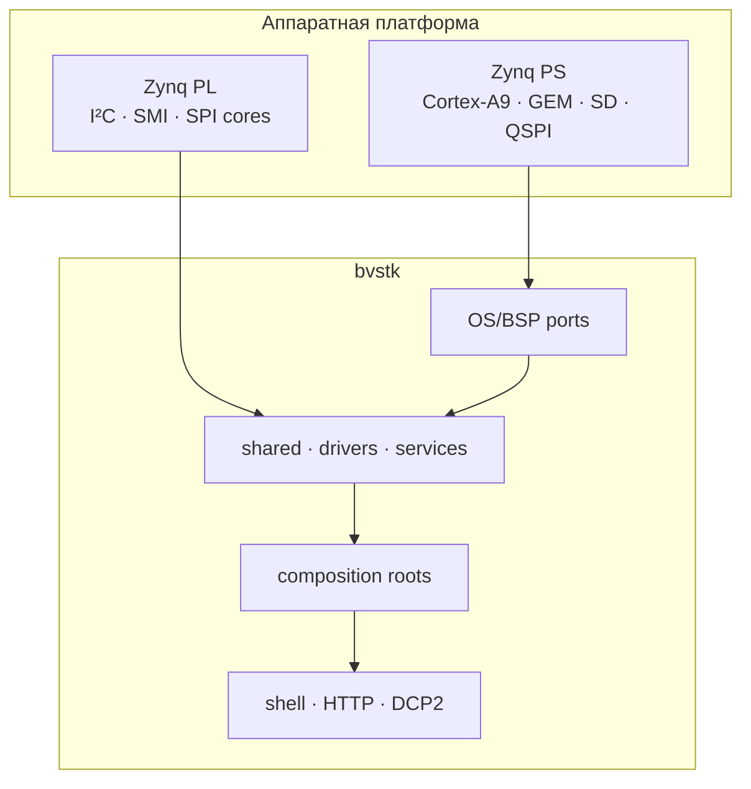
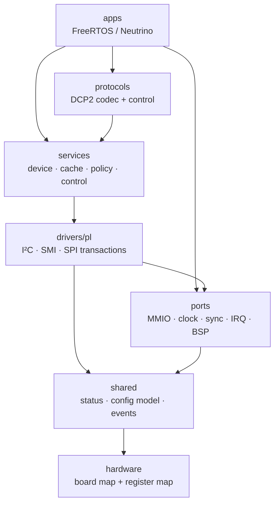
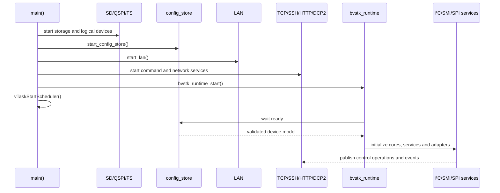
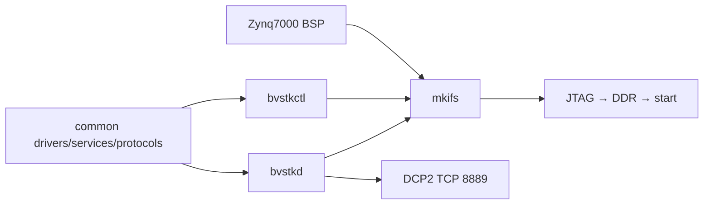
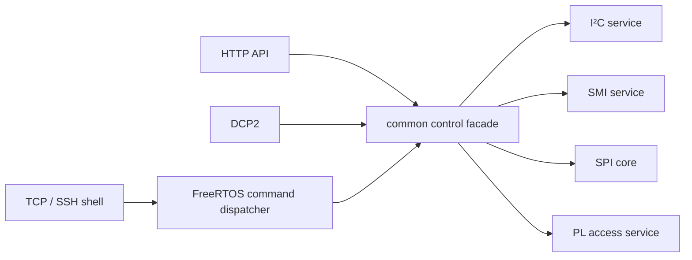
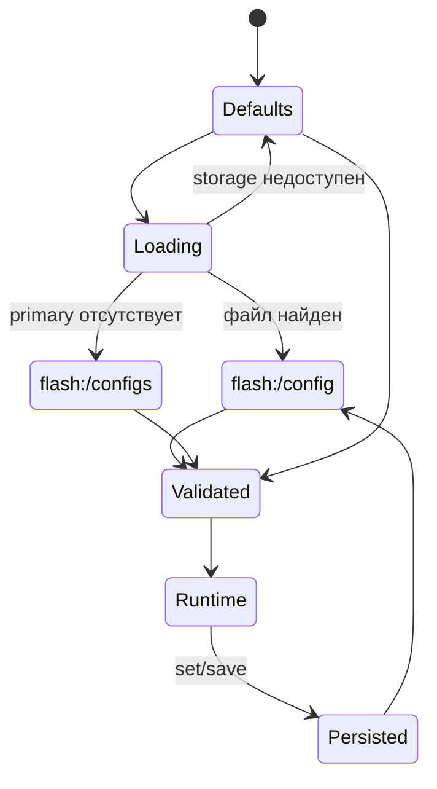

# Архитектура системы

## 1. Назначение и границы

`bvstk` предоставляет control plane для платы на базе Zynq-7000. PS запускает
ОС и сетевые сервисы, PL выполняет аппаратные транзакции с внешними шинами,
configuration store связывает persistent-файлы с runtime-моделью, а протоколы
управления предоставляют доступ человеку и внешнему клиенту.

```mermaid
flowchart TB
    subgraph HW["Аппаратная платформа"]
        PS["Zynq PS\nCortex-A9 · GEM · SD · QSPI"]
        PL["Zynq PL\nI²C · SMI · SPI cores"]
    end
    subgraph SW["bvstk"]
        PORT["OS/BSP ports"]
        COMMON["shared · drivers · services"]
        APPS["composition roots"]
        EXT["shell · HTTP · DCP2"]
    end
    PS --> PORT
    PL --> COMMON
    PORT --> COMMON
    COMMON --> APPS
    APPS --> EXT
```

В границу репозитория входят firmware, порты ОС, build-скрипты, исходные
конфигурации, host-тесты и web-ресурсы. RTL-проект `hw_platform/fpga` находится
в отдельном репозитории и поставляет `design.xsa`, `design.bit` и локальный
`ip_repo`.

## 2. Слои программной части

```mermaid
flowchart TB
    APP["apps\nFreeRTOS / Neutrino"]
    PROTO["protocols\nDCP2 codec + control"]
    SERVICE["services\ndevice · cache · policy · control"]
    DRIVER["drivers/pl\nI²C · SMI · SPI transactions"]
    PORT["ports\nMMIO · clock · sync · IRQ · BSP"]
    SHARED["shared\nstatus · config model · events"]
    HARDWARE["hardware\nboard map + register map"]
    APP --> PROTO
    APP --> SERVICE
    APP --> PORT
    PROTO --> SERVICE
    SERVICE --> DRIVER
    DRIVER --> PORT
    DRIVER --> SHARED
    PORT --> SHARED
    SHARED --> HARDWARE
```

| Слой | Ответственность | ОС-зависимость |
|---|---|---|
| `apps/` | composition root, startup, внешние runtime-сервисы | высокая |
| `protocols/` | wire-format и mapping запросов в control API | отсутствует |
| `services/` | прикладная модель устройств, cache, policy и операции | отсутствует |
| `drivers/pl/` | raw MMIO/BRAM-транзакции PL | отсутствует |
| `ports/` | реализации платформенных контрактов | высокая |
| `shared/` | статусы, структуры, события и узкие interfaces | отсутствует |
| `hardware/` | адреса, размеры, регистры и board contract | отсутствует |

Правило зависимостей задаётся направлением сверху вниз. Common layers не
подключают FreeRTOS, lwIP, FatFs, Xilinx BSP или Neutrino API.

## 3. Startup FreeRTOS

Точка входа `src/apps/freertos/main.c` запускает инфраструктуру и сетевые
сервисы. `bvstk_runtime` ждёт готовности `config_store` и после этого собирает
общие PL services.

```mermaid
sequenceDiagram
    participant Main as main()
    participant FS as SD/QSPI/FS
    participant CFG as config_store
    participant LAN as LAN
    participant API as TCP/SSH/HTTP/DCP2
    participant RT as bvstk_runtime
    participant PL as I²C/SMI/SPI services

    Main->>FS: start storage and logical devices
    Main->>CFG: start_config_store()
    Main->>LAN: start_lan()
    Main->>API: start command and network services
    Main->>RT: bvstk_runtime_start()
    Main->>Main: vTaskStartScheduler()
    RT->>CFG: wait ready
    CFG-->>RT: validated device model
    RT->>PL: initialize cores, services and adapters
    PL-->>API: publish control operations and events
```

Стандартный startup запускает I²C, SMI core/service и SPI runtime через
`bvstk_runtime`. Legacy `start_smi()` из старого FreeRTOS runtime остаётся в
исходном дереве для совместимости старого API, но стандартная инициализация
использует common SMI service.

## 4. Startup Neutrino

Neutrino собирает `bvstkctl` и `bvstkd` из явного списка исходников. Оба
используют common PL cores/services и Neutrino ports.

```mermaid
flowchart LR
    BSP["Zynq7000 BSP"] --> IFS["mkifs"]
    COMMON["common drivers/services/protocols"] --> CTL["bvstkctl"]
    COMMON --> DAEMON["bvstkd"]
    CTL --> IFS
    DAEMON --> IFS
    IFS --> JTAG["JTAG → DDR → start"]
    DAEMON --> DCP2["DCP2 TCP 8889"]
```

`bvstkctl` предназначен для командной проверки PL и control API. `bvstkd`
поднимает DCP2-сервис на порту `8889`. Сетевые и файловые runtime-сервисы
FreeRTOS в Neutrino image не включаются.

## 5. Control surfaces

```mermaid
flowchart LR
    SHELL["TCP / SSH shell"] --> DISPATCH["FreeRTOS command dispatcher"]
    HTTP["HTTP API"] --> CONTROL["common control facade"]
    DCP["DCP2"] --> CONTROL
    DISPATCH --> CONTROL
    CONTROL --> I2C["I²C service"]
    CONTROL --> SMI["SMI service"]
    CONTROL --> SPI["SPI core"]
    CONTROL --> MEM["PL access service"]
```

Shell-команды используют FreeRTOS-specific composition root. HTTP и DCP2
маршрутизируют операции через `bvstk_control_api_t`, благодаря чему policy и
проверки остаются в common services.

## 6. Configuration flow

```mermaid
stateDiagram-v2
    [*] --> Defaults
    Defaults --> Loading
    Primary: flash:/config
    Legacy: flash:/configs
    Loading --> Primary: файл найден
    Loading --> Legacy: primary отсутствует
    Loading --> Defaults: storage недоступен
    Primary --> Validated
    Legacy --> Validated
    Defaults --> Validated
    Validated --> Runtime
    Runtime --> Persisted: set/save
    Persisted --> Primary
```

`config_store` публикует нормализованные `network_config_t`,
`i2c_device_config_t[]` и `smi_phy_config_t[]`. Primary layout имеет приоритет,
legacy layout используется как fallback и источник миграции. Runtime-код работает
с моделью в памяти; сохранение выполняется отдельным вызовом.

## 7. Состояние PL-подсистем

| Подсистема | Common code | FreeRTOS runtime | Neutrino |
|---|---|---|---|
| I²C | raw master/slave, device/cache/policy/services | master service + slave IRQ/task adapter | master service и control API |
| SMI | raw core и service, policy, cache, polling API | runtime service через `bvstk_runtime` | core/service в `bvstkd` |
| SPI | transfer core | runtime shell и mutex | core в `bvstkd` |

Детальная граница PS ↔ PL приведена в [pl-cores.md](pl-cores.md), а board-level
контракт — в [hardware-platform.md](hardware-platform.md).

## 8. Failure domains

| Симптом | Проверяемый слой |
|---|---|
| `xsct` или `qcc` не найден | окружение разработки |
| build использует другой XSA | build configuration и artifacts |
| сервисы не слушают порты | startup, сеть и runtime readiness |
| `config_store not ready` | SD/QSPI mount и configuration flow |
| I²C policy отклоняет запись | device model и policy service |
| PL отвечает timeout | MMIO/BRAM/IRQ, bitstream и RTL |
| DCP2 возвращает `ERR_UNSUPPORTED` | protocol capability и control mapping |

## 9. Связанные документы

| Тема | Документ |
|---|---|
| common/ports | [multi-os.md](multi-os.md) |
| каталоги и manifests | [source-layout.md](source-layout.md) |
| конфигурация | [config-store.md](config-store.md) |
| PL | [pl-cores.md](pl-cores.md) |
| DCP2 | [../dcp2.md](../dcp2.md) |
