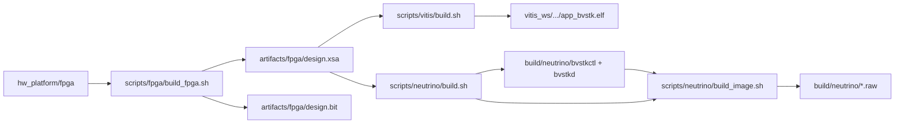
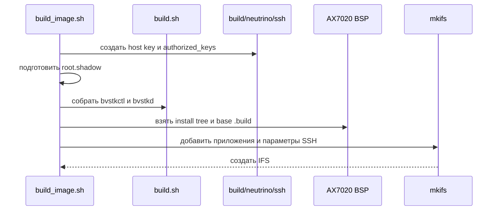

# Сборка

## 1. Точки входа

Корневой `build.sh` выбирает вариант сборки, а `run.sh` запускает готовый образ через JTAG.

| Команда | Результат |
|---|---|
| `./build.sh check` | host-тесты, проверка архитектурных ограничений и документации |
| `./build.sh freertos` | FreeRTOS ELF `vitis_ws/app_bvstk/Debug/app_bvstk.elf` |
| `./build.sh neutrino` | приложения `build/neutrino/bvstkctl` и `build/neutrino/bvstkd` |
| `./build.sh neutrino-image` | Neutrino IFS `build/neutrino/ifs-zynq7000-ax7020-bvstk.raw` |
| `./build.sh all` | FreeRTOS ELF и Neutrino IFS последовательно |

Сборка Vivado вызывается отдельно:

```sh
./scripts/fpga/build_fpga.sh
```

Команды `build.sh all` и `build.sh freertos` используют уже существующий аппаратный экспорт. Vivado запускается только явной командой `scripts/fpga/build_fpga.sh`.



## 2. Требования к окружению

### 2.1. FreeRTOS и Vivado

Требуются `xsct`, Python 3 и актуальный `design.xsa`. Сборка аппаратной платформы дополнительно требует Vivado. Для JTAG-запуска нужны `hw_server`, кабель и `design.bit`.

```sh
source <Vitis-install>/settings64.sh
xsct -version
python3 --version
vivado -version
```

Если путь к скрипту окружения хранится в конфигурации, его можно передать через `XILINX_SETTINGS`:

```sh
XILINX_SETTINGS=/opt/Xilinx/Vitis/2021.2/settings64.sh \
  ./build.sh freertos
```

### 2.2. Neutrino

Для приложений и IFS требуются `qcc`, `mkifs`, установленный BSP AX7020 и базовое `.build`-описание. Скрипты автоматически пытаются подключить `/etc/profile.d/kpda_env_2024.sh`, если команды SDK ещё отсутствуют в `PATH`.

```sh
source /etc/profile.d/kpda_env_2024.sh
qcc -V
mkifs -V
```

Пути к BSP и базовому образу задаются через `NEUTRINO_BSP_DIR` и `NEUTRINO_BASE_BUILD`.

## 3. Сборка аппаратной платформы

Исходный Vivado-проект ожидается во внешнем каталоге `hw_platform/fpga`. Скрипт экспортирует два артефакта в `artifacts/fpga/`:

| Файл | Использование |
|---|---|
| `design.xsa` | создание Vitis platform и Neutrino-совместимой карты адресов |
| `design.bit` | программирование PL перед JTAG-запуском |

Параметры можно задать в `scripts/fpga/build_fpga.conf` или флагами:

```sh
./scripts/fpga/build_fpga.sh --jobs 12
./scripts/fpga/build_fpga.sh --clean
./scripts/fpga/build_fpga.sh --log-dir /tmp/bvstk-vivado-logs
```

| Параметр | Назначение | Значение по умолчанию |
|---|---|---|
| `FPGA_DIR` | каталог с Vivado Tcl-проектом | соседний `hw_platform/fpga` |
| `VIVADO_BIN` | исполняемый файл Vivado | `vivado` |
| `OUTPUT_DIR` | каталог экспортированных файлов | `artifacts/fpga/` |
| `VIVADO_LOG_DIR` | журналы и journal-файлы | `artifacts/vivado/logs/` |
| `JOBS` | число потоков implementation | `8` |
| `CLEAN` | очистка Vivado workspace | `0` |

## 4. Сборка FreeRTOS

Минимальный сценарий:

```sh
source <Vitis-install>/settings64.sh
./build.sh freertos
```

Путь к XSA и режим очистки задаются переменными окружения:

```sh
XSA=/abs/path/to/design.xsa CLEAN=1 ./build.sh freertos
```

| Переменная | Назначение | Значение по умолчанию |
|---|---|---|
| `XSA` | входной аппаратный export | `artifacts/fpga/design.xsa` |
| `CLEAN` | удалить `vitis_ws/` перед сборкой | `1` |
| `LWIP_LIB` | принудительный выбор lwIP-библиотеки BSP | автоопределение `lwip220`, затем `lwip211` |
| `BUILD_VITIS_CONFIG` | путь к конфигурации Vitis | `scripts/vitis/build_vitis.conf` |
| `XILINX_SETTINGS` | скрипт окружения Xilinx | пусто |
| `BVSTK_SSH_ENABLE` | включить FreeRTOS SSH | `0` |
| `BVSTK_SSH_USER` | имя SSH-пользователя | `root` |
| `BVSTK_SSH_PASSWORD` | пароль при включённом SSH | обязательный параметр |

Конфигурационный файл загружается как shell-скрипт. Шаблон находится в `scripts/vitis/build_vitis.conf.example`; локальный файл `scripts/vitis/build_vitis.conf` предназначен для machine-specific путей и игнорируется Git.

Сборка `scripts/vitis/build.tcl` выполняет следующие этапы:

1. создаёт или пересоздаёт `vitis_ws/`;
2. генерирует `src/apps/freertos/config/default_configs.h` из каталога `configs/`;
3. создаёт platform `plat_bvstk` под `ps7_cortexa9_0` и `freertos10_xilinx`;
4. настраивает lwIP, xilffs, heap и проектный `diskio.c`;
5. подключает FreeRTOS source view, общие модули, аппаратные описания и порт ОС;
6. собирает `app_bvstk.elf`.

Основные результаты:

| Путь | Содержимое |
|---|---|
| `vitis_ws/app_bvstk/Debug/app_bvstk.elf` | ELF приложения |
| `vitis_ws/app_bvstk/src` | target-specific source view |
| `vitis_ws/plat_bvstk/hw/ps7_init.tcl` | инициализация PS7 для JTAG |
| `vitis_ws/plat_bvstk/hw/design.bit` | копия bitstream в platform |
| `vitis_ws/plat_bvstk/export/plat_bvstk/plat_bvstk.xpfm` | экспорт Vitis platform |
| `src/apps/freertos/config/default_configs.h` | сгенерированные встроенные конфиги |

`CLEAN=0` подходит для изменения исходников при неизменном hardware export. После изменения XSA, BSP-настроек, состава source roots или генераторов рекомендуется выполнить полную пересборку с `CLEAN=1`.

## 5. Сборка Neutrino

Сборка приложений:

```sh
source /etc/profile.d/kpda_env_2024.sh
./build.sh neutrino
```

Сборка IFS:

```sh
./build.sh neutrino-image
```

`scripts/neutrino/build.sh` компилирует `bvstkctl` и `bvstkd` из общего набора PL cores, сервисов, control API и DCP2. `scripts/neutrino/build_image.sh` выполняет дополнительные операции:



| Переменная | Назначение | Значение по умолчанию |
|---|---|---|
| `NEUTRINO_BUILD_DIR` | каталог производных файлов | `build/neutrino` |
| `NEUTRINO_BSP_DIR` | каталог BSP | `third_party/neutrino/bsp/ax7020` |
| `NEUTRINO_BASE_BUILD` | базовый `.build` | `$NEUTRINO_BSP_DIR/images/zynq7000-ax7020-ssh.build` |
| `NEUTRINO_IFS_FILE` | путь итогового IFS | `build/neutrino/ifs-zynq7000-ax7020-bvstk.raw` |
| `NEUTRINO_KEY_DIR` | host key и authorized keys | `build/neutrino/ssh` |
| `NEUTRINO_ROOT_SHADOW_FILE` | внешний файл `/etc/shadow` | `build/neutrino/root.shadow` |
| `QCC_VARIANT` | вариант компилятора | `8.3.0,gcc_ntoarmv7le` |

По умолчанию создаётся заблокированная учётная запись `root`. Парольная авторизация требует заранее подготовленного `root.shadow`; процедура приведена в [Neutrino build workflow](../../scripts/neutrino/README.md).

## 6. Проверки

Перед передачей артефактов в JTAG рекомендуется выполнить:

```sh
./build.sh check
./tests/host/run.sh
```

`build.sh check` запускает архитектурные проверки, host-тесты переносимого PL access API и проверку документации. `tests/host/run.sh` можно выполнять отдельно при изменении общих C-модулей.

Проверка результатов сборки:

```sh
test -x vitis_ws/app_bvstk/Debug/app_bvstk.elf
test -x build/neutrino/bvstkctl
test -x build/neutrino/bvstkd
test -f build/neutrino/ifs-zynq7000-ax7020-bvstk.raw
```

## 7. Связанные документы

| Документ | Содержание |
|---|---|
| [Среда разработки](development-environment.md) | инструменты, артефакты и VSCode |
| [Запуск и отладка](run-and-debug.md) | JTAG, UART, GDB и первичная проверка |
| [Аппаратная платформа](hardware-platform.md) | соответствие XSA, bitstream и PL-карты |
| [Два варианта ОС](multi-os.md) | границы общего и target-specific кода |
| [FreeRTOS SSH](freertos-ssh.md) | опциональная SSH-сборка и конфигурация |
