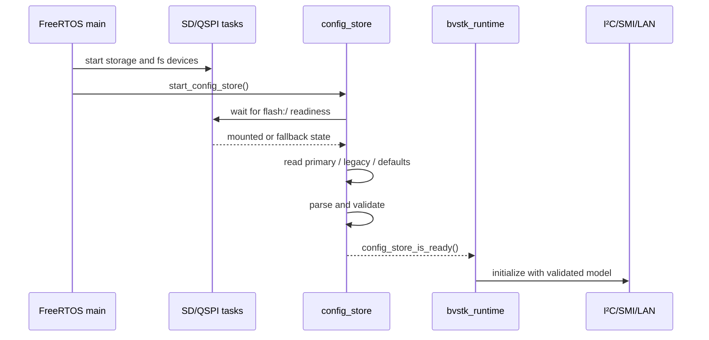
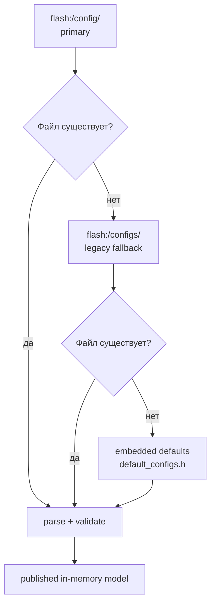
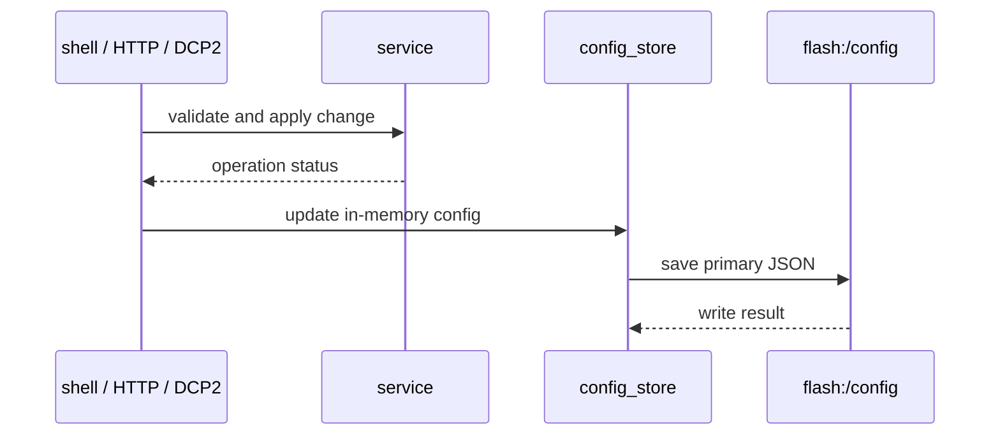

# Конфигурация и `config_store`

`config_store` загружает JSON из файловой системы, проверяет значения, формирует
модель в памяти и предоставляет её runtime-сервисам. Для FreeRTOS это задача,
запущенная после старта SD/QSPI; для common layers модель представлена структурами
из `src/shared/config/bvstk_config_model.h`.

## 1. Жизненный цикл



До публикации готовности runtime-сервисы должны считать конфигурацию неполной.
Функция `config_store_wait_ready(timeout_ms)` используется composition roots,
которые зависят от перечня устройств.

## 2. Приоритет источников



| Уровень | Путь | Назначение |
|---|---|---|
| primary | `flash:/config/` | актуальное persistent-хранилище |
| legacy | `flash:/configs/` | чтение старой структуры и миграция |
| defaults | `src/apps/freertos/config/default_configs.h` | встроенный fallback |
| source JSON | `configs/` | входные файлы для code generator |

После загрузки runtime читает структуры из RAM. Прямое чтение JSON для каждой
операции не используется.

## 3. Модель данных

| Область | Тип | Поля |
|---|---|---|
| сеть | `network_config_t` | IP, netmask, gateway, MAC и `has_*` flags |
| I²C | `i2c_device_config_t[]` | имя, файл, 7-bit address, регистры, policy, rules, settings |
| SMI | `smi_phy_config_t[]` | имя, PHY address, регистры, policy, polling, rules, settings |

### 3.1. I²C

Файл `configs/i2c/axp15060.json` содержит:

```json
{
  "name": "axp15060",
  "addr_7b": 54,
  "reg_count": 74,
  "max_value_code": 64,
  "policy": "whitelist",
  "whitelist": [
    { "reg": 19, "val": 16 },
    { "reg": 19, "val": 17 }
  ],
  "blacklist": []
}
```

I²C-модель содержит device descriptor, пары `{reg, val}` для whitelist и
blacklist, а также `settings[]` для значений, применяемых при старте или
сохранении. Поля `autopoll_*` к I²C не относятся.

### 3.2. SMI

Файл `configs/smi/lan8720.json` дополнительно содержит профиль polling:

```json
{
  "name": "lan8720",
  "phy_addr": 1,
  "reg_count": 32,
  "policy": "whitelist",
  "autopoll_enabled": true,
  "autopoll_reg_delay_ms": 0,
  "autopoll_cycle_delay_ms": 1000,
  "autopoll_regs": [0, 1, 4, 5, 17, 31],
  "write_allow_regs": [0, 4, 18, 30, 31],
  "write_deny_regs": [],
  "settings": []
}
```

SMI policy разрешает или запрещает запись по номеру регистра. I²C policy
работает с парой регистра и значения.

## 4. Валидация

| Данные | Проверки |
|---|---|
| I²C address | `0..0x7F` |
| I²C `reg_count` | `1..I2C_CFG_MAX_REG_COUNT` |
| I²C register | меньше `reg_count` |
| I²C value | не больше `max_value_code` |
| SMI PHY/register | `0..31` и меньше `reg_count` |
| policy | `whitelist` или `blacklist` |
| arrays | размер не превышает соответствующий `*_MAX` |

Невалидный файл отбрасывается на этапе загрузки. Runtime получает только
проверенную структуру.

## 5. Изменение и сохранение



Для I²C shell успешные изменения policy и rule lists синхронизируются с
`config_store` и сохраняются в `flash:/config/i2c/<device>.json`. HTTP
`PUT /api/i2c` обновляет policy и массивы rules. Адрес устройства и имя файла
через этот endpoint не меняются.

Состояние после изменения проверяется по трём уровням:

```text
i2c axp15060 info
i2c axp15060 policy show rules
cat flash:/config/i2c/axp15060.json
```

## 6. Ошибки и диагностика

| Симптом | Проверка |
|---|---|
| `config_store not ready` | готовность `flash:/`, mount logs и время после boot |
| применились defaults | наличие primary/legacy JSON и результат парсинга |
| запись пропала после reboot | `config_store_save_*()` и состояние QSPI |
| новый JSON не используется | пересобран ли `default_configs.h` и какой файл выбран |
| I²C policy выглядит старой | сравнить service, RAM-модель и файл на `flash:/` |

## 7. Связанные документы

| Тема | Документ |
|---|---|
| архитектура | [architecture.md](architecture.md) |
| I²C service | [pl/i2c.md](pl/i2c.md) |
| JSON reference | [../reference/configuration.md](../reference/configuration.md) |
| файловая система | [../user/filesystems.md](../user/filesystems.md) |
