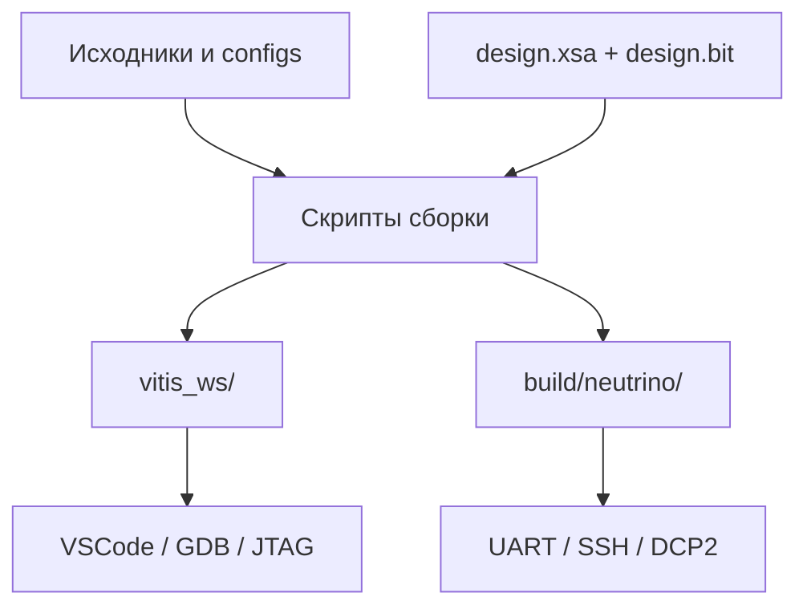

# Среда разработки

## 1. Состав окружения

BVSTK собирается поверх конкретного аппаратного экспорта. Рабочая среда считается готовой, когда инструменты выбранной ОС доступны в `PATH`, а `design.xsa` и `design.bit` получены из совместимой версии Vivado-проекта.

| Задача | Инструменты и входные данные |
|---|---|
| Сборка PL | Vivado, внешний `hw_platform/fpga` |
| Сборка FreeRTOS | XSCT/Vitis, Python 3, `design.xsa` |
| FreeRTOS JTAG | XSCT, `hw_server`, `design.bit`, кабель |
| Сборка Neutrino | `qcc`, `mkifs`, AX7020 BSP |
| Neutrino JTAG | XSCT, UART, IFS, bitstream, `ps7_init.tcl` |
| Навигация в VSCode | `compile_commands.json`, сгенерированный workspace Vitis |

Проверка базовых команд:

```sh
source <Vitis-install>/settings64.sh
xsct -version
python3 --version
vivado -version
hw_server -h
```

```sh
source /etc/profile.d/kpda_env_2024.sh
qcc -V
mkifs -V
```

## 2. Карта локальных артефактов



| Путь | Назначение | Жизненный цикл |
|---|---|---|
| `artifacts/fpga/design.xsa` | аппаратный export | производный локальный артефакт |
| `artifacts/fpga/design.bit` | bitstream | производный локальный артефакт |
| `artifacts/vivado/logs/` | Vivado logs | генерируется и игнорируется Git |
| `vitis_ws/` | platform, BSP, source view, ELF | генерируется `scripts/vitis/build.sh` |
| `build/neutrino/` | приложения, IFS, keys, UART log | генерируется Neutrino-скриптами |
| `configs/` | входные JSON-шаблоны | версионируемый источник |
| `web/` | статические web-ресурсы | версионируемый источник |

`vitis_ws/` и `build/neutrino/` содержат производные файлы. Исходные изменения следует вносить в `src/`, `configs/`, `web/` и скрипты, которые создают эти каталоги.

## 3. Конфигурация скриптов

Для Vitis предусмотрены два shell-конфига:

| Файл | Назначение |
|---|---|
| `scripts/vitis/build_vitis.conf` | `XSA`, `XILINX_SETTINGS`, `CLEAN_DEFAULT` |
| `scripts/vitis/run_jtag.conf` | `BITSTREAM_FILE`, `ELF_FILE`, `PS7_INIT_TCL`, `XILINX_SETTINGS` |

Шаблоны имеют суффикс `.example`. Альтернативный конфиг сборки выбирается через `BUILD_VITIS_CONFIG`, конфиг JTAG — через `RUN_JTAG_CONFIG`.

Для Neutrino используется набор переменных окружения, перечисленный в [руководстве по сборке](build.md). Наиболее важные параметры — `NEUTRINO_BSP_DIR`, `NEUTRINO_BASE_BUILD`, `NEUTRINO_BUILD_DIR` и `NEUTRINO_IFS_FILE`.

## 4. Аппаратные артефакты

Сборка FreeRTOS использует `artifacts/fpga/design.xsa`, если переменная `XSA` отсутствует. JTAG-скрипт использует `artifacts/fpga/design.bit`, если `BITSTREAM_FILE` не задан. `ps7_init.tcl` для FreeRTOS берётся из `vitis_ws/plat_bvstk/hw/ps7_init.tcl`.

Перед запуском следует сверить комплект:

```sh
ls -l artifacts/fpga/design.xsa artifacts/fpga/design.bit
ls -l vitis_ws/plat_bvstk/hw/ps7_init.tcl
```

Изменение PL-регионов или IRQ требует обновления XSA, bitstream и карты `src/hardware/boards/ax7020/bvstk_pl_regions.c`. Сборка C-кода с устаревшим XSA создаёт артефакт, который может успешно линковаться и при этом обращаться к другой аппаратной карте.

## 5. VSCode и compile commands

После сборки FreeRTOS можно сгенерировать базу для IntelliSense:

```sh
./scripts/vscode/gen_compile_commands.sh
```

VSCode использует `compile_commands.json` и заголовки из `vitis_ws/`. Поэтому корректный порядок выглядит так:

1. собрать FreeRTOS platform и BSP;
2. сгенерировать `compile_commands.json`;
3. открыть или перезапустить VSCode;
4. выбрать задачу запуска или debug-конфигурацию.

Скрипты в `.vscode/` поддерживают запуск `hw_server`, подготовку JTAG и attach GDB к core0. Подробная последовательность приведена в [запуске и отладке](run-and-debug.md).

## 6. Согласование версий

| Изменение | Требуемое действие |
|---|---|
| новый `design.xsa` | пересобрать FreeRTOS с `CLEAN=1` |
| новый `design.bit` | проверить карту PL и JTAG-пути |
| изменение `configs/` | повторить генерацию `default_configs.h` и собрать ELF |
| изменение BSP или FatFs patch | пересоздать `vitis_ws/` |
| изменение состава source roots | пересоздать source view через сборку Vitis |
| изменение Neutrino `.build` | повторно собрать IFS |

Эта таблица задаёт минимальный объём пересборки для типовых изменений и снижает риск использования устаревших производных файлов.

## 7. Полезные проверки

```sh
./build.sh check
./tests/host/run.sh
git diff --check
```

При ошибке инструмента сначала проверяйте окружение командой `command -v <tool>`, затем путь конфигурации и входной аппаратный артефакт. Для диагностической последовательности используйте [troubleshooting](../user/troubleshooting.md).
