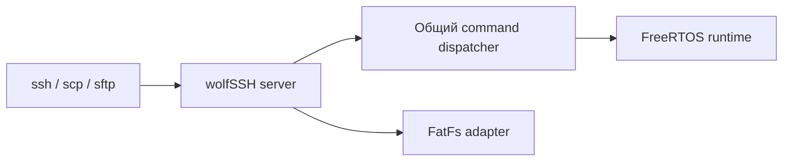

# SSH в FreeRTOS

## 1. Назначение

Опциональный SSH-сервер FreeRTOS предоставляет инженерную консоль на TCP-порту `22`. Командный диспетчер общий с TCP-консолью на `8888`; SSH добавляет парольную аутентификацию и файловые операции SCP/SFTP через адаптер FatFs.



Обычная FreeRTOS-сборка SSH-компоненты не подключает. Включение выполняется явной переменной `BVSTK_SSH_ENABLE=1`.

## 2. Сборка

Минимальная команда:

```sh
BVSTK_SSH_ENABLE=1 \
BVSTK_SSH_PASSWORD='your-password' \
  ./build.sh freertos
```

Полная настройка с именем пользователя, портом и постоянным host key:

```sh
BVSTK_SSH_ENABLE=1 \
BVSTK_SSH_USER=root \
BVSTK_SSH_PORT=22 \
BVSTK_SSH_PASSWORD='your-password' \
BVSTK_SSH_HOST_KEY=/secure/path/ssh_host_rsa_key.pem \
  ./build.sh freertos
```

| Переменная | Назначение | Значение по умолчанию |
|---|---|---|
| `BVSTK_SSH_ENABLE` | включает SSH-сервис и зависимости | `0` |
| `BVSTK_SSH_USER` | имя пользователя | `root` |
| `BVSTK_SSH_PORT` | TCP-порт | `22` |
| `BVSTK_SSH_PASSWORD` | пароль, из которого создаётся SHA-256 digest | обязательный параметр |
| `BVSTK_SSH_HOST_KEY` | PEM host key для встраивания в firmware | временно сгенерированный ключ |
| `BVSTK_WOLFSSL_ROOT` | готовая wolfSSL-сборка | `build/ssh-deps/wolfssl` |
| `BVSTK_WOLFSSH_ROOT` | готовая wolfSSH-сборка | `build/ssh-deps/wolfssh` |

Переменные задаются в командной строке, shell-конфиге или CI-среде. Пароль хранится только как digest в сгенерированном заголовке `src/apps/freertos/services/ssh/bvstk_ssh_generated.h`; файл относится к build-артефактам и не добавляется в Git.

## 3. Зависимости

Исходные архивы wolfSSL и wolfSSH находятся в `third_party/dist/`. `scripts/vitis/build_ssh_deps.sh` распаковывает их, применяет проектные патчи и создаёт ARM/FreeRTOS-библиотеки в `build/ssh-deps/`.

| Компонента | Требуемые возможности |
|---|---|
| wolfSSL | wolfCrypt, SHA-256, RSA, `WOLFSSL_LWIP`, callback seed |
| wolfSSH | server, shell, SCP callbacks, SFTP, FatFs adapter |
| compiler flags | `WOLFSSH_SCP_USER_CALLBACKS`, `WOLFSSH_FATFS`, `WOLFSSH_BVSTK_FATFS`, `WOLFSSH_TERM`, `NO_TERMIOS` |

При включённой опции build проверяет наличие библиотек и символов SCP/SFTP. Каталог `third_party/dist/` содержит исходные архивы и лицензии; производные библиотеки размещаются в `build/ssh-deps/`.

## 4. Host key и повторные сборки

Если `BVSTK_SSH_HOST_KEY` не задан, генератор создаёт временный RSA-ключ и встраивает его в заголовок. После каждой такой сборки fingerprint может измениться. Для локальной платы запись можно удалить:

```sh
ssh-keygen -f "$HOME/.ssh/known_hosts" -R 192.168.0.10
```

Постоянный ключ следует хранить вне репозитория с ограниченными правами:

```sh
chmod 0600 /secure/path/ssh_host_rsa_key.pem
```

## 5. Подключение

```sh
ssh root@192.168.0.10
ssh -p 22 root@192.168.0.10 'i2c list'
```

TCP-консоль на `8888` продолжает обслуживаться параллельно. SSH поддерживает интерактивное редактирование, историю команд и автодополнение. Диспетчер выполняет команды устройства; полноценная Unix shell-среда в образе отсутствует.

## 6. Передача файлов

SFTP и современный OpenSSH SCP используют виртуальные FatFs-пути:

```sh
sftp root@192.168.0.10
scp ./file.bin root@192.168.0.10:/sd:/file.bin
scp ./file.bin root@192.168.0.10:/sd-pl:/test1/file.bin
scp root@192.168.0.10:/flash:/config/network.json ./network.json
scp -r ./config root@192.168.0.10:/flash:/
```

Для классического SCP применяется `-O`:

```sh
scp -O ./file.bin root@192.168.0.10:/sd:/file.bin
scp -O ./file.bin root@192.168.0.10:/sd-pl:/test1/file.bin
scp -O -r ./config root@192.168.0.10:/flash:/
```

| Виртуальный путь | FatFs-том |
|---|---|
| `/sd`, `/sd:/` | SD, логический том `0:/` |
| `/flash`, `/flash:/` | QSPI, логический том `1:/` |
| `/sd-pl`, `/sd-pl:/` | внешняя MicroSD через PL, логический том `2:/` |
| `/config/...` | путь относительно текущего default root, обычно SD |

Операции ограничены возможностями FatFs: Unix-владельцы, символические ссылки и полный набор POSIX-метаданных отсутствуют. Для каталогов используется `-r`.

## 7. Безопасность

SSH предназначен для доверенного инженерного контура. Пароль и host key передаются в build environment и должны храниться в защищённом секретном хранилище CI или локальной системе. TCP-консоль и HTTP API остаются отдельными интерфейсами с собственной моделью доступа; включение SSH не меняет их сетевую доступность.

## 8. Связанные документы

| Документ | Содержание |
|---|---|
| [Сборка](build.md) | переменные и результаты FreeRTOS build |
| [Консольные команды](../reference/console-commands.md) | общий command dispatcher |
| [Файловые системы](../user/filesystems.md) | тома, пути и ограничения FatFs |
| [Сетевые интерфейсы](../user/network.md) | адреса и сервисные порты |
