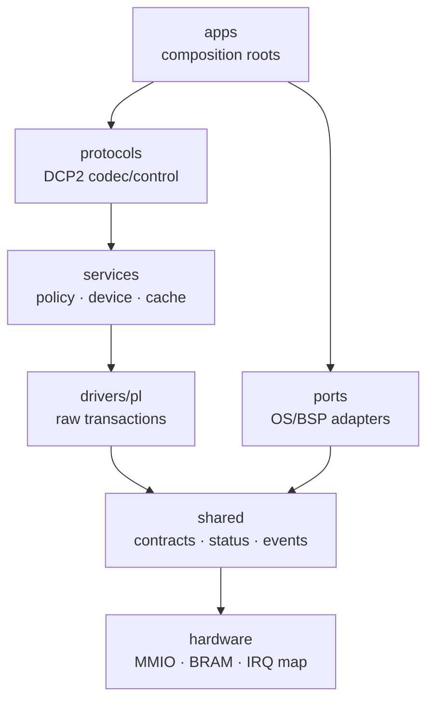
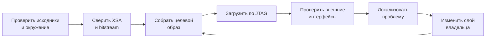
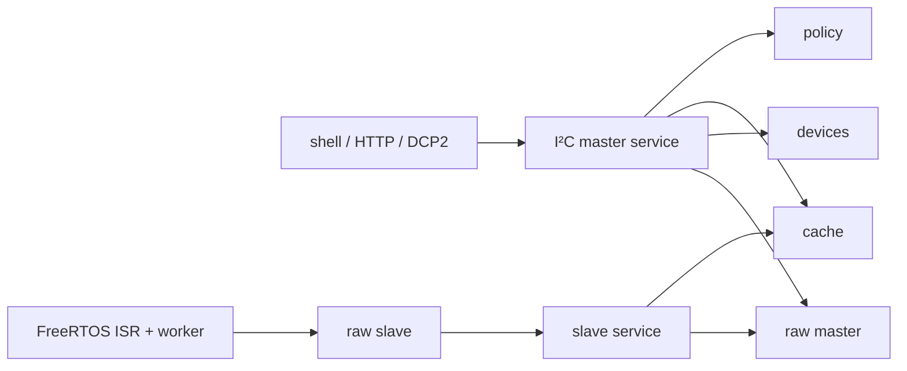
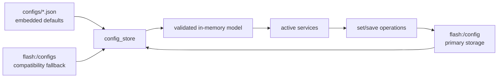

# Руководство разработчика

Документ задаёт рабочий маршрут для изменений в `bvstk`: от проверки окружения
и hardware export до сборки, загрузки, тестирования и публикации результата.

## 1. Модель проекта

`bvstk` состоит из общего кода, портов ОС и двух composition roots. Общий код
описывает аппаратные и прикладные контракты. Порт предоставляет MMIO, синхронизацию,
часы, IRQ и интеграцию с BSP. Composition root собирает конкретный образ и
определяет порядок запуска.



FreeRTOS composition root находится в `src/apps/freertos/`. Neutrino root
содержит `i2c`, `bvstkctl`, `bvstkd` и `bvstk-shell` в `src/apps/neutrino/`. Подробнее слои описаны в
[architecture.md](architecture.md), а правила включения исходников — в
[source-layout.md](source-layout.md).

## 2. Рабочий цикл



Базовая последовательность:

```sh
./build.sh check
./build.sh freertos
./run.sh freertos jtag
```

Для Neutrino:

```sh
./build.sh neutrino-image
./run.sh neutrino jtag
```

Изменение RTL или аппаратного export начинается с `scripts/fpga/build_fpga.sh`.
При изменении только C-кода достаточно сборки соответствующего образа.

## 3. Выбор слоя для изменения

| Наблюдаемая задача | Владелец |
|---|---|
| startup и порядок инициализации | `src/apps/freertos/main.c`, `src/apps/freertos/runtime/` |
| общая транзакция PL | `src/drivers/pl/` |
| регистровая модель устройства, cache или policy | `src/services/` |
| MMIO, BRAM, IRQ и board contract | `src/hardware/` |
| FreeRTOS task/ISR или Xilinx BSP | `src/ports/freertos-xilinx/` |
| Neutrino MMIO/POSIX integration | `src/ports/neutrino-zynq7000/` |
| shell-команда | `src/apps/freertos/console/` |
| HTTP route | `src/apps/freertos/services/http/http_fs_routes.c` |
| DCP2 wire или control mapping | `src/protocols/dcp2/`, `src/services/control/` |
| persistence JSON | `src/apps/freertos/config/`, `configs/` |
| Web UI | `web/assets/`, `web/upload_flash_www.py` |

Для I²C полезно держать границу особенно чётко:



Подробности находятся в [pl/i2c.md](pl/i2c.md).

## 4. Конфигурация и runtime

Конфигурация проходит три состояния:



При диагностике конфигурации сверяйте одновременно:

1. исходный JSON в `configs/`;
2. сохранённый файл в `flash:/config/`;
3. runtime-состояние через shell или HTTP.

Полный жизненный цикл описан в [config-store.md](config-store.md).

## 5. Внешние интерфейсы

| Интерфейс | Применение | Проверка |
|---|---|---|
| TCP shell | ручная диагностика и команды | `telnet <ip> 8888` |
| SSH | shell и SCP в FreeRTOS | `ssh root@<ip>` |
| HTTP | JSON API и файлы | `curl http://<ip>/api/version` |
| DCP2 | бинарный control plane и события | `scripts/dcp2/monitor_notify.py` |

Интерфейс, через который проверяется функция, должен соответствовать владельцу
изменения. Например, изменение DCP2-события проверяется DCP2-клиентом, а не
только shell-командой.

## 6. Отладка

Последовательность локализации:

| Шаг | Проверка | Вывод |
|---:|---|---|
| 1 | JTAG загрузил правильные bitstream и ELF | hardware/software pair согласована |
| 2 | UART или shell показывает запуск | FreeRTOS/Neutrino достигли runtime |
| 3 | `/api/version`, `/api/net`, `/api/fs` отвечают | сеть, HTTP и storage доступны |
| 4 | `i2c list`, DCP2 `PING` или нужная команда | сервис и конфигурация готовы |
| 5 | `mem`, PL-диагностика, Logic 2 | проверка границы PS ↔ PL |

При ошибке на шаге 1 анализируйте XSA, bitstream и `vitis_ws`. Ошибка на шаге 3
обычно относится к сети, файловой системе или `config_store`. Ошибка на шаге 5
требует сверки MMIO/BRAM/IRQ и поведения RTL.

## 7. Соседние документы

| Тема | Документ |
|---|---|
| архитектура | [architecture.md](architecture.md) |
| исходники | [source-layout.md](source-layout.md) |
| сборка | [build.md](build.md) |
| запуск | [run-and-debug.md](run-and-debug.md) |
| FreeRTOS/Neutrino | [multi-os.md](multi-os.md) |
| hardware | [hardware-platform.md](hardware-platform.md) |
| PL | [pl-cores.md](pl-cores.md) |
| I²C | [pl/i2c.md](pl/i2c.md) |
| тесты | [testing.md](testing.md) |
