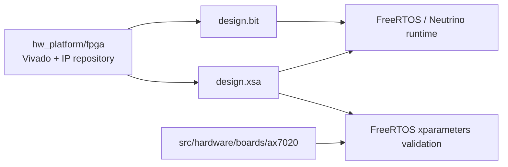
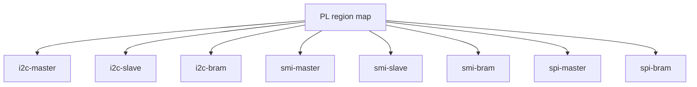
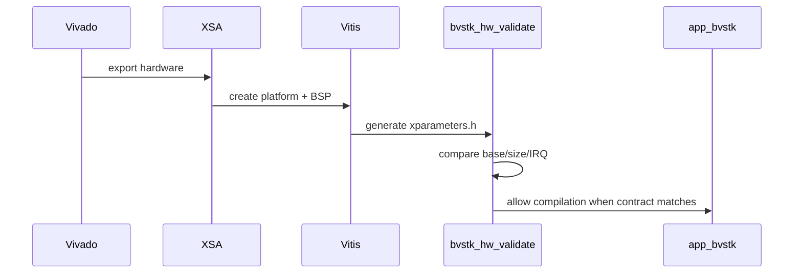

# Аппаратная платформа

## 1. Контур платформы

BVSTK рассчитан на AX7020 с Zynq-7000 и кастомными PL-ядрами. Исходный Vivado-проект подключается из внешнего каталога `hw_platform/fpga`; в программный репозиторий передаются экспорт `design.xsa` и bitstream `design.bit`.



Пара `XSA + bitstream` и программный контракт платы должны описывать одну версию hardware design. Контракт хранится в `src/hardware/boards/ax7020/bvstk_hw_config.h` и `bvstk_pl_regions.c`.

## 2. Программный контракт AX7020

`bvstk_hw_config.h` задаёт физические адреса, размеры MMIO-окон, IRQ и номер контракта. FreeRTOS-модуль `src/ports/freertos-xilinx/board/ax7020/bvstk_hw_validate.c` сравнивает эти значения с `xparameters.h`, сгенерированным Vitis.

| Семейство | MMIO-регионы | BRAM |
|---|---|---|
| I2C | master, slave | общий mailbox BRAM |
| SMI | master, slave | общий mailbox BRAM |
| SPI | master | BRAM окна ответа |
| SD через PL | AXI controller + internal buffer | 512-byte buffer внутри IP |

Текущая карта адресов:

| Регион | База | Размер |
|---|---:|---:|
| `i2c-bram` | `0x40000000` | `0x2000` |
| `smi-bram` | `0x42000000` | `0x2000` |
| `spi-bram` | `0x44000000` | `0x2000` |
| `i2c-master` | `0x43C00000` | `0x10000` |
| `smi-master` | `0x43C10000` | `0x10000` |
| `smi-slave` | `0x43C20000` | `0x10000` |
| `spi-master` (legacy design) | `0x43C30000` | `0x10000` |
| `i2c-slave` | `0x43C40000` | `0x10000` |
| `sd-controller` (playground, replaces SPI) | `0x43C30000` | `0x10000` |

В legacy XSA адрес `0x43C30000` принадлежит SPI master. В playground он
переиспользуется SD controller; одновременно загружать оба ядра по этому
адресу нельзя.

IRQ-контракт:

| Источник | GIC ID |
|---|---:|
| SMI master | `61` |
| SMI slave | `62` |
| I2C master | `63` |
| I2C slave | `64` |
| SPI master | `65` |

## 3. Карта PL-регионов

`bvstk_pl_regions.c` предоставляет единый список, который используют `bvstkctl`, общий PL service и диагностические API.



Имена регионов используются в Neutrino CLI:

```text
bvstkctl pl list
bvstkctl pl probe
bvstkctl pl read i2c-master 0x00
bvstkctl pl write spi-master 0x00 0x00000001
```

Режим `pl write` предназначен для диагностики. Значение и смещение должны соответствовать регистровой карте конкретного IP.

## 4. Логические окна BRAM

### 4.1. I2C

| Окно | Смещение внутри I2C BRAM | Назначение |
|---|---:|---|
| slave write | `0x0000` | mailbox от внешнего I2C slave path |
| master | `0x0500` | transaction buffer master path |
| slave read | `0x1000` | ответ slave path |

### 4.2. SMI

| Окно | Смещение внутри SMI BRAM | Назначение |
|---|---:|---|
| master write | `0x0000` | команда MDIO master |
| slave write | `0x1000` | входящий slave mailbox |
| slave read | `0x2000` | ответ slave mailbox |

### 4.3. SPI

SPI использует control-регистры master и BRAM-область чтения. Точные offsets находятся в `src/hardware/pl/spi/bvstk_spi_regs.h`; при изменении RTL этот файл обновляется вместе с IP-контрактом.

### 4.4. SD через PL

SD controller использует единственное AXI4-Lite окно: native-регистры и
512-байтный buffer находятся внутри одного IP. PS последовательно записывает
или читает 128 слов через `DATA`; отдельный `BVSTK_SD_BRAM_BASE` не нужен.

## 5. Связь с Vivado и Vitis

Сборка Vivado экспортирует XSA и bitstream. Vitis создаёт BSP и генерирует `xparameters.h`. FreeRTOS validation сопоставляет аппаратные значения с проектными константами.



При расхождении аппаратного контракта сборка должна завершаться на validation-этапе. Для Neutrino те же базовые константы компилируются напрямую из `src/hardware/boards/ax7020/`; runtime требует совместимого XSA и bitstream.

## 6. Изменение hardware contract

| Изменение в PL | Обновляемые элементы |
|---|---|
| база или размер региона | `bvstk_hw_config.h`, PL map, validation, драйверный код |
| IRQ | `bvstk_hw_config.h`, BSP validation, OS adapter |
| BRAM layout | `hardware/pl/*_regs.h`, core/service, тесты |
| формат transaction frame | соответствующий core, service, DCP2 surface и host-тесты |
| состав IP | XSA, source view, `scripts/neutrino/build.sh`, документация |

После изменения выполняется полный цикл:

```sh
./scripts/fpga/build_fpga.sh
./build.sh check
./build.sh freertos
./build.sh neutrino
```

JTAG-запуск выполняется только после проверки, что `design.xsa`, `design.bit`, `ps7_init.tcl` и ELF относятся к одному export.

## 7. Граница ответственности

| Слой | Ответственность |
|---|---|
| Vivado/IP | регистры, BRAM, внешние сигналы, IRQ и timing |
| `hardware/` | адресная карта платы и программное описание PL-регионов |
| `drivers/pl/` | OS-independent transaction primitives |
| `services/` | устройства, cache, policy, конфигурация и события |
| `ports/` | MMIO, mutex, clock, IRQ и системные типы ОС |
| `apps/` | composition root, shell, HTTP, DCP2 и порядок запуска |

При отказе операции следует сопоставлять слой отказа с этой таблицей. Ошибка адресации указывает на контракт платформы, timeout — на core/PL/clock/IRQ, отказ policy — на сервис и конфигурацию, ошибка транспорта — на соответствующий adapter.
