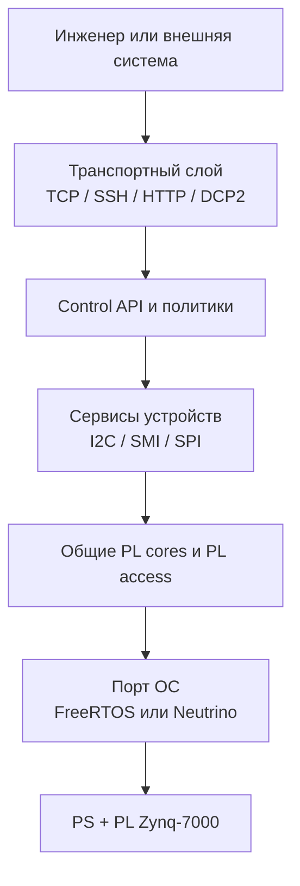
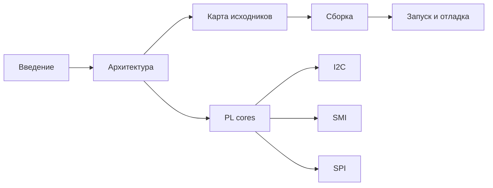

# Введение в BVSTK

## 1. Назначение проекта

BVSTK — программная платформа для Zynq-7000. В состав SoC входят процессорная система PS с ARM Cortex-A9 и программируемая логика PL. Проект объединяет низкоуровневый доступ к PL, сервисы управления устройствами, сетевые интерфейсы и варианты запуска под FreeRTOS и ЗОСРВ «Нейтрино».

Основные задачи программного комплекса:

| Область | Возможности |
|---|---|
| Управление PL | Доступ к I2C, SMI/MDIO, SPI и картам регионов PL |
| Конфигурация | JSON-конфиги сети, устройств и политик; сохранение в QSPI |
| Диагностика | TCP-консоль, HTTP API, DCP2, PL read/write |
| Файлы | FatFs-тома `sd:/`, `sd-pl:/` и `flash:/`, web-ресурсы |
| Целевые ОС | FreeRTOS для полного прикладного runtime; Neutrino для I²C runtime, `bvstkctl`, `bvstkd`, `bvstk-shell` и IFS |

## 2. Модель выполнения

Общий код описывает аппаратный контракт и операции над устройствами. Порт ОС предоставляет отображение регистров, синхронизацию, время и обработку системных событий. Composition root каждой ОС собирает необходимые сервисы и транспортные интерфейсы.

Порядок зависимостей закреплён в `src/`: приложения выбирают сервисы и порты, сервисы используют общие cores, cores обращаются к платформенному PL access API. Детальная карта расположения приведена в [карте исходников](source-layout.md).

## 3. Варианты поставки

### 3.1. FreeRTOS

FreeRTOS-вариант запускается из `src/apps/freertos/main.c`. Он включает сетевой стек lwIP, файловые тома, конфигурационное хранилище, TCP-консоль, HTTP API и DCP2. SSH-сервер подключается при сборке с `BVSTK_SSH_ENABLE=1`.

Типовые порты:

| Интерфейс | Порт или путь | Назначение |
|---|---:|---|
| TCP-консоль | `8888` | интерактивные команды |
| DCP2 | `8889` | бинарное управление и диагностика |
| HTTP | `80` | API и web UI |
| SSH | `22` | защищённая консоль FreeRTOS при включённой опции |

### 3.2. Neutrino

Neutrino-сборка формирует приложения `i2c`, `bvstkctl`, `bvstkd` и
интерактивный `bvstk-shell`:

| Приложение | Назначение |
|---|---|
| `i2c` | FreeRTOS-совместимые shell-команды I²C через `/dev/bvstk-i2c` |
| `bvstkctl` | локальная диагностика PL и проксирование I²C-команд |
| `bvstkd` | единственный владелец I²C runtime и DCP2-сервер на TCP-порту `8889` |

Скрипт `scripts/neutrino/build_image.sh` добавляет приложения в IFS вместе с компонентами BSP и SSH-конфигурацией. Полный цикл описан в [руководстве по сборке](build.md) и [документе о двух ОС](multi-os.md).

## 4. Аппаратная платформа

Проект ожидает согласованный набор `design.xsa` и `design.bit`. По умолчанию они находятся в `artifacts/fpga/`. Исходный Vivado-проект расположен во внешнем каталоге `hw_platform/fpga`, который подключается к репозиторию отдельно.

Минимальная аппаратная конфигурация включает:

| Компонент | Роль в BVSTK |
|---|---|
| PS GEM | Ethernet для lwIP и сетевых сервисов |
| PS SDIO | том `sd:/` |
| PL SD SPI | том `sd-pl:/` |
| PS QSPI NOR | том `flash:/`, конфигурация и web-файлы |
| PL I2C | master-операции и slave-путь в FreeRTOS/Neutrino |
| PL SMI | операции MDIO и политика PHY |
| PL SPI | доступ к SPI-регистрам и пакетным операциям |

Адреса и размеры PL-регионов задаёт карта платы `src/hardware/boards/ax7020/bvstk_pl_regions.c`. Изменение аппаратного дизайна требует обновления XSA, bitstream и соответствующих описаний регионов.

## 5. Термины

| Термин | Значение в проекте |
|---|---|
| PS | процессорная система Zynq: ARM, GEM, SDIO, QSPI и системные контроллеры |
| PL | программируемая логика FPGA с пользовательскими ядрами |
| core | общий низкоуровневый модуль, работающий с конкретным PL-регионом |
| service | функциональный слой над core: устройства, cache, policy и операции |
| port | адаптер ОС или BSP для MMIO, IRQ, mutex и времени |
| DCP2 | бинарный протокол управления поверх TCP |
| policy | правила доступа к адресам и регистрам устройства |
| config store | загрузка, валидация, применение и сохранение JSON-конфигурации |
| IFS | загрузочный образ Neutrino, создаваемый `mkifs` |

В текущем проекте периодический autopoll предусмотрен в модели SMI. I2C использует операции по запросу и сохранение register writes; соответствующие JSON-поля и API описаны в [руководстве по конфигурации](config-store.md).

## 6. Рекомендуемый маршрут чтения

Для пользовательской интеграции переходите к [руководству пользователя](../user/guide.md), [сетевому интерфейсу](../user/network.md), [файловым системам](../user/filesystems.md) и [справочнику HTTP API](../reference/http-api.md).
