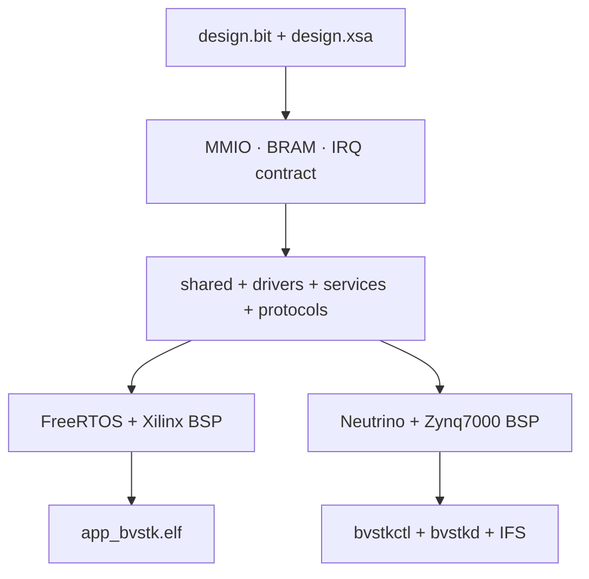
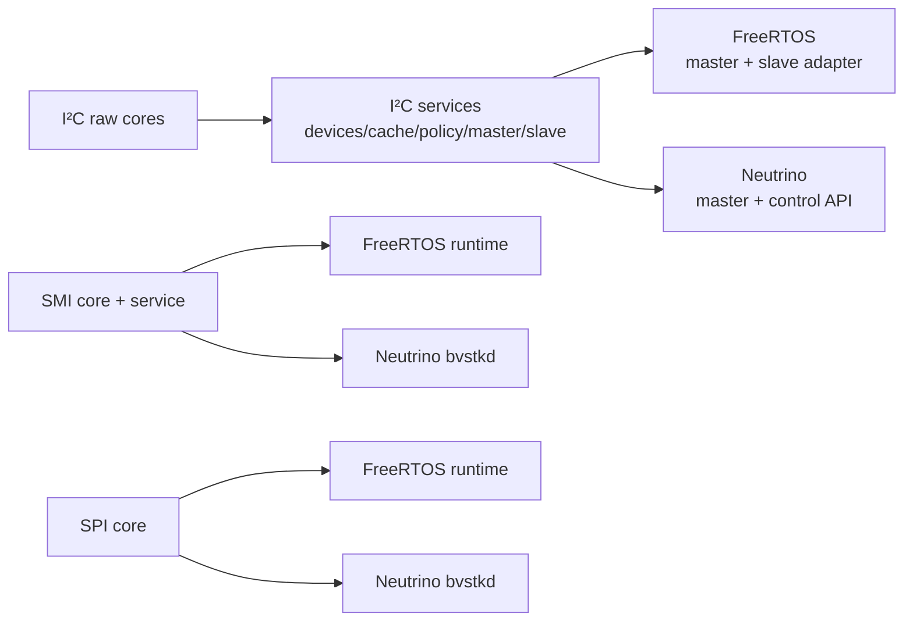
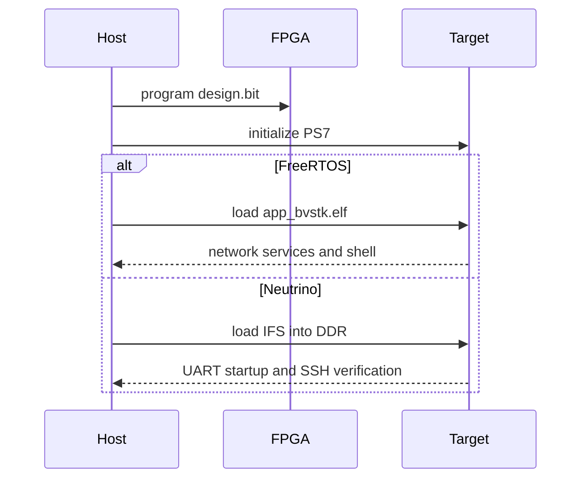

# Общая архитектура FreeRTOS и Neutrino

Обе ОС работают с одной аппаратной платформой и общими переносимыми слоями.
Различия сосредоточены в ports, composition roots, build flow и наборе внешних
сервисов.

## 1. Общая модель



## 2. Общие слои

| Слой | Содержимое |
|---|---|
| `src/hardware/` | регистры PL и AX7020 board map |
| `src/shared/` | статусы, configuration model, events, platform contracts |
| `src/drivers/pl/` | raw I²C, SMI и SPI transactions |
| `src/services/` | I²C/SMI services и control facade |
| `src/protocols/dcp2/` | codec и portable request handler |
| hardware artifacts | одинаковые `design.bit`, `design.xsa`, BRAM layout и IRQ IDs |

Общий код не обращается к FreeRTOS, lwIP, FatFs, Xilinx BSP или Neutrino API.
Выбор реализации системных контрактов выполняется build manifest.

## 3. Различия targets

| Область | FreeRTOS | Neutrino |
|---|---|---|
| composition root | `src/apps/freertos/` | `src/apps/neutrino/` |
| port | `src/ports/freertos-xilinx/` | `src/ports/neutrino-zynq7000/` |
| MMIO | Xilinx MMIO и platform adapter | `ThreadCtl` + `mmap_device_memory` |
| sync | FreeRTOS mutex/semaphore | POSIX/Neutrino synchronization |
| build | XSCT/Vitis | `qcc` + `mkifs` |
| primary output | `vitis_ws/app_bvstk/Debug/app_bvstk.elf` | `build/neutrino/bvstkctl`, `bvstkd` |
| boot artifact | JTAG ELF flow | `ifs-zynq7000-ax7020-bvstk.raw` |
| standard services | storage, LAN, shell, SSH, HTTP, DCP2, PL runtime | `bvstkctl`, `bvstkd`, DCP2 |

## 4. PL reuse



OS-specific code owns scheduling, IRQ attachment, memory mapping and lifetime.
Policy, range validation, cache semantics and service-level statuses remain in
common services.

## 5. Build commands

```sh
./build.sh check
./build.sh freertos
./build.sh neutrino
./build.sh neutrino-image
./build.sh all
```

FreeRTOS and Neutrino use the same `artifacts/fpga/design.xsa` and
`artifacts/fpga/design.bit`. A hardware change requires rebuilding both targets.

## 6. JTAG flow



Подробности находятся в [build.md](build.md), [run-and-debug.md](run-and-debug.md)
и [hardware-platform.md](hardware-platform.md).
