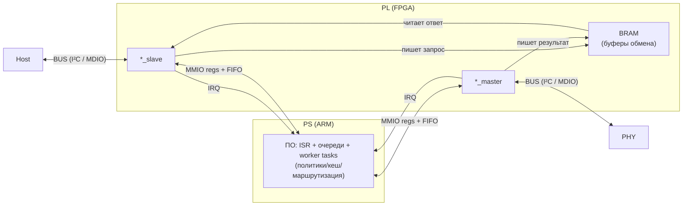
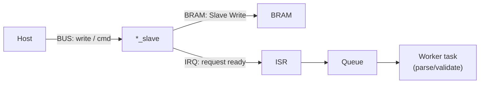
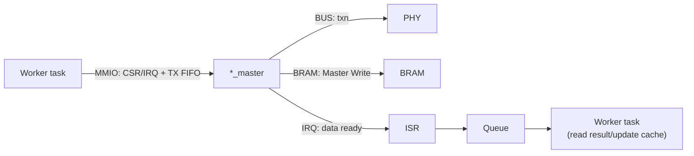

# PL‑ядра

Подробное описание PL-подсистем, обмена PS ↔ PL, политик доступа и работы с I2C/SMI.


### Назначение и место в системе

PL‑ядра в этом проекте — это аппаратно‑программные “прокси/мониторы” для низкоуровневых шин, которые отделяют **интерфейс Host** от **интерфейса к реальному PHY**. Непосредственный обмен (тайминги/фреймы/буферизация) выполняется в PL (FPGA), а анализ, перенос данных между буферами и политика доступа — в ПО на PS (ARM) под FreeRTOS.

Для обеих подсистем (`bvstk_i2c` и `bvstk_smi`) используется один и тот же архитектурный паттерн:

**1) Два PL‑ядра: `*_slave` и `*_master`**
- `*_slave` “подменяет” собой ведомое устройство со стороны Host: принимает транзакции Host→устройство, сохраняет параметры/данные в BRAM и поднимает IRQ, чтобы процессор мог обработать запрос. При операциях чтения Host ядро читает подготовленный процессором ответ из BRAM и выдаёт его на шину.
- `*_master` “подменяет” собой мастера со стороны PHY: получает от процессора команды/данные через MMIO (регистры управления + FIFO), выполняет реальные транзакции к PHY и складывает результаты в BRAM, после чего поднимает IRQ о готовности данных.

**2) Общая BRAM как буфер и точка синхронизации**
- BRAM используется как общий “быстрый буфер” между PL и PS и логически делится минимум на три области:  
  - *Master Write/Read* (данные от PHY через `*_master` → CPU)  
  - *Slave Write* (запросы/данные от Host через `*_slave` → CPU)  
  - *Slave Read* (ответ CPU → Host через `*_slave`)
- В прошивке адреса задаются как **смещения** относительно базового адреса BRAM из `xparameters.h` (реальный физический адрес зависит от HW‑design).
  - Для SMI: `BRAM_BASEADDR` + `MASTER_WR_OFFSET`/`SLAVE_WR_OFFSET`/`SLAVE_RD_OFFSET` (см. `src/bvstk_smi/bvstk_smi.h`).
  - Для I2C: `BRAM_BASE_ADDR` + `I2C_BRAM_MASTER`/`I2C_BRAM_SLAVE_WR`/`I2C_BRAM_SLAVE_RD` (см. `src/bvstk_i2c/bvstk_i2c.h`).

**3) Роль PS (ARM)**
- PS обрабатывает события по IRQ (ISR → очередь → worker‑задача), извлекает данные из *Slave Write*, при необходимости модифицирует/фильтрует транзакции, инициирует операции через `*_master` и формирует ответ, заполняя *Slave Read*.
- На уровне ПО реализуются защитные механизмы: политики доступа к регистрам (whitelist/blacklist), persisted settings, а также (где применимо) autopoll/кеширование для снижения латентности и нагрузки на шину/CPU.

### Общая схема PS ↔ PL core

PS (ARM) управляет PL‑ядрами через MMIO‑регистры и FIFO, а события от PL получает по IRQ. PL‑ядра буферизуют запросы/ответы в общей BRAM, а PS читает/записывает эти буферы и решает, что делать с транзакцией (разобрать, применить политики, сходить в PHY, обновить кеш). Таким образом PS выполняет “контрольную логику”, а PL — “транспорт/тайминги” внешней шины.

**0) Абстрактная схема (блоки)**


**1) Host → `*_slave` → PS (приём запроса)**

- `*_slave` буферизует запрос в *Slave Write* и сигнализирует IRQ (для Host‑чтения IRQ может не формироваться — зависит от ядра/события).
- Worker‑задача решает “что делать”: ответить из кеша, сходить в PHY через `*_master`, применить политику (allow/deny), обновить persisted settings.

**2) PS → `*_master` → PHY → PS (реальная транзакция к PHY)**

- `*_master` выполняет обмен с PHY и складывает результат в *Master Write*, после чего поднимает IRQ.
- PS читает данные/адрес последней записи (через MMIO/BRAM), обновляет кеш и решает, что вернуть Host.

**3) PS → `*_slave` → Host (выдача ответа)**

- PS формирует ответ в *Slave Read*. `*_slave` отдаёт его на шину при чтении со стороны Host (обычно без отдельного “старта” со стороны PS).

### Общий протокол обмена и ограничения

Протокол обмена между PS и PL строится вокруг трёх “плоскостей”:
- **Управление (MMIO)** — PS конфигурирует `*_slave`/`*_master` и запускает операции через их регистры управления и FIFO.
- **Данные (BRAM)** — запросы/ответы буферизуются в общей BRAM в выделенных областях (*Slave Write*, *Master Write/Read*, *Slave Read*).
- **События (IRQ)** — PL поднимает IRQ по факту “данные готовы/событие случилось”; PS подтверждает обработку сбросом флага IRQ.

**Базовая дисциплина обмена**
- PL пишет в BRAM как **producer**, PS читает как **consumer** (и наоборот для *Slave Read*). Содержимое области считается валидным только после соответствующего IRQ/флага готовности.
- PS должен **сбрасывать IRQ** (через `IRQ`/`IRQ_REG`) после того, как прочитал необходимые регистры/адрес и обработал данные, иначе следующий сигнал/событие может не прийти.
- Доступ к “реальной” шине со стороны `*_master` должен быть **сериализован** (в прошивке используется mutex), чтобы не смешивать команды (autopoll/консоль/HTTP) и ответы.

**Адресация BRAM**
- Во всех случаях адреса в прошивке задаются как **смещения** от базового адреса BRAM из `xparameters.h`.
- Для **SMI/MDIO** MDIO‑адрес `(phy[4:0], reg[4:0])` соответствует индексу `idx = (phy << 5) | reg`, а ячейка данных — `4 * idx` байт. Три копии адресного пространства лежат в BRAM с разными offset’ами: `MASTER_WR_OFFSET`, `SLAVE_WR_OFFSET`, `SLAVE_RD_OFFSET` (см. `src/bvstk_smi/bvstk_smi.h`).
- Для **I²C** используются фиксированные окна BRAM для обмена “фреймами”: *Slave Write* (`I2C_BRAM_SLAVE_WR`), *Master Read* (`I2C_BRAM_MASTER`), *Slave Read* (`I2C_BRAM_SLAVE_RD`) относительно `BRAM_BASE_ADDR` (см. `src/bvstk_i2c/bvstk_i2c.h`). Данные идут 32‑битными словами: сначала заголовок, затем payload.

**Форматы команд (на стороне PS → `*_master`)**
- **I²C master** получает поток 32‑битных слов в TX‑регистре/FIFO: заголовок `I2C_MAKE_HEADER(addr7, op, num_bytes)`, затем данные. Запуск — через биты `CSR_START_BIT`/`CSR_RP_START_BIT` (см. `src/bvstk_i2c/bvstk_i2c.h`).
- **SMI master** получает по TX FIFO одно слово на транзакцию: `{rw, phy_addr, reg_addr, data}` (см. формирование слова в `mdio_read()/mdio_write()` в `src/bvstk_smi/bvstk_smi.c`). Запуск/режимы — через `CSR_m`/`TIMEOUT_m`, подтверждение — через `IRQ_m`.
- **SPI master** получает поток 32‑битных слов в `TX_FIFO_ADDR` (`0x10`); режимы/тайминги задаются через `PACKET_ADDR` (`0x08`), `TIMEOUT_ADDR` (`0x0C`) и `SPI_SIG_ADDR` (`0x18`), запуск — через `CSR_ADDR` (`0x00`). См. `src/bvstk_spi/bvstk_spi.h`.

**Ограничения/важные замечания**
- Прошивка предполагает, что HW‑design согласован с `xparameters.h` (baseaddr/IRQ/BRAM layout). Несовпадение адресов или размеров BRAM приводит к некорректной работе/падениям.
- Протокол событий **не гарантирует “потоковую” доставку** без потерь при переполнении внутренних FIFO/буферов PL‑ядра: при переполнениях может потребоваться сброс/реинициализация ядра и повтор операции.
- Для ответов Host (через `*_slave`) PS должен успевать заполнить *Slave Read* до того, как Host начнёт чтение; иначе Host может получить старые/нулевые данные (поведение зависит от конкретной реализации PL‑ядра).

### Очереди/ISR/worker tasks

Обработка событий от PL‑ядер в прошивке построена по шаблону **“короткий ISR → очередь → worker‑задача”**. Идея простая: ISR делает минимум (прочитал флаги/адрес, погасил IRQ, положил “маркер события”), а вся тяжёлая работа (чтение BRAM, парсинг, политика, запуск транзакций master, логирование) выполняется в обычных FreeRTOS‑задачах.

**ISR (прерывания от PL)**
- Для каждого ядра есть отдельный IRQ (обычно `*_master` и `*_slave`). Обработчики устанавливаются через `xPortInstallInterruptHandler(...)` и используют `xQueueSendFromISR(...)`.
- Типичные действия ISR:
  1) прочитать MMIO‑регистры ядра (статус/IRQ/адрес/параметры транзакции);  
  2) записать в IRQ‑регистр значение сброса, чтобы погасить прерывание;  
  3) отправить компактное событие в очередь (`q_master`/`q_slave`);  
  4) при необходимости выполнить `portYIELD_FROM_ISR(...)`.
- Важно: ISR не должен читать большие блоки BRAM и не должен “долго думать” — иначе растёт латентность и риск потери событий.

**Очереди событий**
- На практике используется две очереди на подсистему: **master‑очередь** (события “данные от PHY готовы”) и **slave‑очередь** (события “Host запрос/фаза транзакции”).
- Размер элементов очереди — небольшой struct (тип события + адрес/размер/слово параметров). Это позволяет переносить контекст из ISR в задачу без тяжёлых копирований.
- Ограничение: при переполнении очереди событие может быть потеряно (в ряде мест возврат из `xQueueSendFromISR` не обрабатывается). Для “жёстких” сценариев стоит контролировать заполнение FIFO/очередей и предусмотреть recovery (reset/повтор).

**Worker‑задачи**
- `master_evt_task`: обрабатывает события от `*_master` (IRQ “результат готов”), читает данные из *Master Write/Read* в BRAM, обновляет кеш и/или будит ожидающего потребителя.
- `slave_evt_task`: обрабатывает события от `*_slave` (Host write/read, STOP/RP_START), читает входной фрейм из *Slave Write*, применяет правила (whitelist/blacklist), запускает транзакции через `*_master` при необходимости и готовит ответ в *Slave Read*.
- Фоновые задачи подсистемы:
  - I²C: отдельная задача выполняет загрузку конфигурации, восстановление persisted settings и (при включении) autopoll/refresh кеша.
  - SMI: отдельная задача выполняет apply persisted settings и периодический опрос PHY (autopoll); для синхронных чтений может использоваться отдельная очередь/фильтр “жду конкретный PHY/REG”.

**Синхронизация**
- Доступ к `*_master` (реальная шина) сериализуется mutex’ом, чтобы autopoll, HTTP/консоль и обработка запросов Host не мешали друг другу.
- При изменении общих структур конфигурации/кеша применяются критические секции (чтобы не получить гонку между задачами/ISR).

### Конфигурация и политики доступа

Конфигурация PL‑подсистем хранится в `config_store` и задаётся JSON‑файлами на QSPI (`flash:/config/...`). При старте `config_store` читает/парсит эти файлы и публикует готовые структуры, которые дальше используются worker‑задачами **в рантайме**: для фильтрации записей Host→PHY, для autopoll и для применения “сохранённых настроек” (persisted settings).

**Где лежат конфиги**
- I²C: `flash:/config/i2c/*.json` (legacy: `flash:/configs/i2c/*.json`)
- SMI/MDIO: `flash:/config/smi/*.json` (legacy: `flash:/configs/smi/*.json`)

**Приоритет и формат хранения**
- Обычно один JSON‑файл соответствует одному устройству/PHY.
- При наличии одинаковых конфигов в primary и legacy приоритет у `flash:/config/...` (primary).
- Конфиги можно менять как файлы (через `fs`/HTTP файловый API) или через команды/эндпоинты, которые правят структуру в памяти и затем сохраняют её на флеш через `config_store_save_*()`.

**Политики доступа (общая идея)**
- Политики применяются в точке, где прошивка собирается “пробросить” **запись** в PHY через `*_master`.
- Чтения, как правило, разрешены, а записи проходят через deny/allow фильтры (конкретная семантика зависит от подсистемы).
- Детали: см. ниже `PL‑ядро I2C → Политики...` и `PL‑ядро SMI → Политики...`.

**Persisted settings (общая идея)**
- Это список “какие регистры выставить при старте”, который применяется после загрузки конфигурации.
- Список может обновляться в рантайме (например, при успешных ручных записях), но на флеш попадёт только после явного сохранения (команда `... save` или соответствующий API).

**Ограничения**
- Все массивы (правила, настройки, списки регистров autopoll) имеют compile‑time лимиты. Если конфиг превышает лимиты, лишние элементы будут отброшены при загрузке/сохранении.

### Диагностика и отладка

Диагностика PL‑подсистем сводится к трём вещам: **проверить “готовность” (config/FS), выполнить безопасное чтение состояния/кеша, и только затем делать точечные read/write** (с учётом политик доступа).

**Быстрые проверки**
- Готовность конфигов/FS:
  - HTTP: `GET /api/qspi` (готовность QSPI‑тома), `GET /api/i2c` (готовность `config_store` + список устройств).
  - TCP‑консоль: `fs ls flash:/config/`, `i2c list`, `smi list`.
- Autopoll/политики/параметры устройства:
  - TCP‑консоль: `i2c <dev> info`, `i2c <dev> rules`, `i2c <dev> autopoll`; `smi <dev> info`, `smi <dev> rules`, `smi <dev> autopoll`.

**Точечные операции**
- Для ручной работы используйте команды из соответствующих подразделов `PL‑ядро I2C → Управление` и `PL‑ядро SMI → Управление`.
- Если нужно “посмотреть/потрогать” память или MMIO — используйте `mem r/w` и `POST /api/diag/mem/read|write` (опасно, только в доверенной среде).

**HTTP‑диагностика (полезно для автоматизации)**
- Диагностические операции (использовать только в доверенной сети):
  - `POST /api/diag/i2c/read` / `POST /api/diag/i2c/write`
  - `POST /api/diag/smi/read` / `POST /api/diag/smi/write`
  - `POST /api/diag/mem/read` / `POST /api/diag/mem/write`

Примеры:
```sh
curl -X POST http://<ip>/api/diag/i2c/read  -H 'Content-Type: application/json' --data '{"name":"axp15060","reg":19}'
curl -X POST http://<ip>/api/diag/smi/read  -H 'Content-Type: application/json' --data '{"phy":1,"reg":0}'
curl -X POST http://<ip>/api/diag/mem/read  -H 'Content-Type: application/json' --data '{"addr":1073741824}'
curl -X POST http://<ip>/api/diag/mem/write -H 'Content-Type: application/json' --data '{"confirm":true,"addr":1073741824,"val":0}'
```

**Чтение BRAM “вручную” (через `mem r ...`)**
- SMI: адрес ячейки для `(phy, reg)` вычисляется как `BRAM_BASEADDR + <OFFSET> + 4 * ((phy<<5) | reg)`, где `<OFFSET>` — `MASTER_WR_OFFSET`/`SLAVE_WR_OFFSET`/`SLAVE_RD_OFFSET` (`src/bvstk_smi/bvstk_smi.h`).
- I²C: используются окна `BRAM_BASE_ADDR + I2C_BRAM_*` (`src/bvstk_i2c/bvstk_i2c.h`); первый word — заголовок, далее payload 32‑битными словами.

**Типовые причины “не работает”**
- `DENIED`/`Forbidden` на write: сработала политика allow/deny (проверьте `policy`, списки правил, `reg_count`).
- Нет реакции/пустые данные: `config_store`/QSPI ещё не готов, либо autopoll выключен и кеш не обновляется.
- Нестабильность при активной диагностике: слишком частые операции (особенно `mem`/diag write) могут ломать состояние PL‑ядра; в таком случае начните с перезагрузки и возвращайтесь к поштучным проверкам.

### PL‑ядро I2C (bvstk_i2c)

#### Модель устройств и JSON‑формат

`bvstk_i2c` описывает I²C‑устройства как набор **“регистровых” девайсов** с линейной адресацией `reg = 0..reg_count-1` и 8‑битными значениями. Обычно одному устройству соответствует один JSON‑файл в `flash:/config/i2c/`, который загружается `config_store` при старте.

**Как прошивка использует модель**
- Консоль/HTTP выбирают устройство по `name` или по адресу `addr_7b` и работают с его регистрами (`r/w`, правила, autopoll).
- Поток Host→PL‑slave (в MITM‑режиме) трактуется как “регистровый доступ”:
  - **write**: первый байт — стартовый `reg`, дальше идут байты значений, которые пишутся последовательно (`reg`, `reg+1`, …) с проверкой политики.
  - **read**: первый байт — `reg`, ответ формируется из кеша (который обновляется чтениями/записями в PHY и/или autopoll).
- Persisted settings (`settings[]`) применяются при старте как последовательность регистровых записей в PHY.

**Поля JSON (I²C device)**

Обязательные поля:
- `name` — уникальное имя устройства (используется как ключ выбора).
- `addr_7b` — 7‑битный I²C‑адрес (0..127).
- `reg_count` — число регистров (1..256).
- `max_value_code` — верхняя граница допустимого значения `val` в правилах/записях (0..64).
- `policy` — `"whitelist"` или `"blacklist"`.

Опциональные поля:
- `autopoll_enabled` — включить периодический опрос.
- `autopoll_regs` — список регистров для опроса (каждый `< reg_count`).
- `autopoll_reg_delay_ms` — задержка между чтениями регистров внутри цикла.
- `autopoll_cycle_delay_ms` — пауза между циклами опроса.
- `whitelist` / `blacklist` — массивы правил `{ "reg": <0..reg_count-1>, "val": <0..max_value_code> }`.
- `settings` — persisted settings `{ "reg": <0..reg_count-1>, "val": <0..255> }` (применяются на старте).

**Минимальный пример**
```json
{
  "name": "axp15060",
  "addr_7b": 54,
  "reg_count": 256,
  "max_value_code": 64,
  "policy": "whitelist"
}
```

**Пример с правилами, autopoll и persisted settings**
```json
{
  "name": "axp15060",
  "addr_7b": 54,
  "reg_count": 256,
  "max_value_code": 64,
  "policy": "whitelist",

  "autopoll_enabled": true,
  "autopoll_reg_delay_ms": 2,
  "autopoll_cycle_delay_ms": 1000,
  "autopoll_regs": [0, 1, 2, 16, 17],

  "whitelist": [
    { "reg": 19, "val": 17 },
    { "reg": 19, "val": 18 }
  ],
  "blacklist": [],

  "settings": [
    { "reg": 19, "val": 17 }
  ]
}
```

#### Политики и persisted settings

В `bvstk_i2c` политика доступа применяется **к операциям записи** (Host→PHY и ручные write из консоли/HTTP). Чтение регистров разрешено, а запись проходит через фильтр “можно/нельзя” для пары **(reg, val)**.

**Политика (whitelist / blacklist)**
- Политика задаётся полем `policy` в JSON и может переключаться в рантайме.
- Правила хранятся в двух списках:
  - `whitelist[]`: разрешённые пары `{reg,val}`
  - `blacklist[]`: запрещённые пары `{reg,val}`
- Семантика:
  - **Whitelist**: запись разрешена **только** если `{reg,val}` есть в `whitelist`.
  - **Blacklist**: запись разрешена **если** `{reg,val}` *не* находится в `blacklist`.
- Дополнительные проверки “валидности”:
  - `reg < reg_count`
  - `val <= max_value_code` (ограничение на “код значения”, используется именно в политике)

Практическое следствие: политика по умолчанию — **whitelist**. Если `whitelist` пустой, то любые записи будут отклоняться (`DENIED`), пока вы явно не добавите разрешающие правила.

**Где применяется**
- В MITM‑режиме (Host→`I²C_slave`) функция обработки фрейма проверяет каждую запись `{reg+i, frame[1+i]}` через политику и только потом инициирует реальную запись в PHY через `I²C_master`.
- В ручных командах (TCP‑консоль/HTTP‑diag) запись тоже проходит через ту же политику и может вернуть `DENIED/Forbidden`.

**Persisted settings (`settings[]`)**
Persisted settings — это отдельный список регистровых записей `{reg,val}`, который:
- **применяется при старте** (последовательно записывается в PHY после загрузки конфигурации);
- **может пополняться в рантайме**: когда запись реально прошла в PHY, прошивка обновляет/добавляет соответствующую пару в `settings[]` (последняя запись считается “истинным” значением).

Важно:
- `settings[]` — это *не* список разрешений. Он описывает “какие значения выставить при старте”.
- Размер списка ограничен (`I2C_CFG_SETTINGS_MAX`): при заполнении новые записи перестанут добавляться.
- Сохранение на флеш делается явно командой `i2c <name> save` (или эквивалентом через API): это сохраняет `policy`/`whitelist`/`blacklist` и текущие `settings[]` в `flash:/config/i2c/<device>.json`.

#### Autopoll и кэш

`bvstk_i2c` поддерживает локальный кеш регистров устройства и периодическое обновление (autopoll). Это нужно, чтобы:
- быстро отвечать Host на чтение (без ожидания реального I²C‑обмена к PHY);
- уменьшить нагрузку на шину при частых чтениях одних и тех же регистров;
- иметь “снимок” состояния регистров для диагностики.

**Кеш регистров**
- Кеш хранится в ОЗУ прошивки как таблица `device × reg` (в коде — `s_reg_cache[dev][reg]`).
- Источники обновления кеша:
  1) **Стартовый full‑scan**: после загрузки конфигов выполняется чтение регистров `0..reg_count-1` для каждого устройства и заполнение кеша.
  2) **Autopoll**: периодически перечитывает выбранные регистры и обновляет кеш.
  3) **Запись в PHY**: при успешной записи прошивка сразу обновляет кеш соответствующего регистра (последняя запись считается истинным значением).
  4) **Явные чтения из консоли/HTTP**: `i2c ... r ...` инициирует чтение через `I²C_master` и обновляет кеш.

**Как формируется ответ на чтение Host**
- В MITM‑режиме `I²C_slave` получает `reg` (и, при необходимости, длину ответа), а прошивка формирует payload из кеша и записывает его в BRAM (*Slave Read*).
- В типовом режиме чтение Host **не заставляет** немедленно читать PHY: ответ берётся из кеша. Свежесть данных обеспечивается full‑scan/autopoll/явными чтениями.

**Autopoll (периодический опрос)**
- Включается полями `autopoll_enabled` + список `autopoll_regs[]` (опрашиваются только эти регистры).
- Тайминги:
  - `autopoll_reg_delay_ms` — задержка между чтениями регистров внутри одного цикла.
  - `autopoll_cycle_delay_ms` — пауза между циклами для устройства (минимум 1 мс).
- Если autopoll выключен на всех устройствах — задача просто “спит” и кеш обновляется только от стартового full‑scan и ручных операций.

**Ограничения**
- Кеш не “магически” синхронизирован с реальным PHY: если кто‑то меняет регистры вне этого комплекса, кеш будет обновляться только при следующем чтении (autopoll/ручное).
- При слишком частом autopoll можно увеличить нагрузку на I²C и латентность обслуживания команд/Host — подбирайте задержки и набор регистров осознанно.

#### Управление (консоль/HTTP)

Управление `bvstk_i2c` доступно через TCP‑консоль (порт 8888) и через HTTP‑API. Консоль удобна для ручной работы, HTTP — для автоматизации и UI.

**TCP‑консоль: команда `i2c`**
- Список/инфо:
  - `i2c list`
  - `i2c <name> [info]`
- Чтение/запись регистров (проходит через политику):
  - `i2c <name> r <reg>`
  - `i2c <name> w <reg> <val>`
  - Альтернатива выбора по адресу: `i2c @0x36 r 0x10`
- Настройка устройства (с сохранением в `flash:/config/i2c/<...>.json`):
  - `i2c <name> addr <addr_7b>`
  - `i2c <name> policy <whitelist|blacklist>`
  - `i2c <name> allow|deny|clear <reg> <val>`
  - `i2c <name> rules`
  - `i2c <name> save` (persist policy/rules + settings)
- Autopoll:
  - `i2c <name> autopoll` (показать текущие настройки; изменение — через HTTP `/api/i2c` или правкой JSON).

**HTTP: конфигурация**
- Подробности по `GET/PUT /api/i2c` (форматы JSON, примеры) — в разделе [HTTP‑сервер → /api/*](#api).
- Для принудительного чтения/записи прямо в PHY используйте `PUT /api/diag/i2c/read|write` (см. [PL‑ядра → Диагностика и отладка](#Диагностика%20и%20отладка)).

### PL‑ядро SMI/MDIO (bvstk_smi)

#### Модель PHY и JSON‑формат

`bvstk_smi` — подсистема для обмена по **SMI/MDIO** с Ethernet PHY. На уровне модели MDIO рассматривается как “регистровое пространство” из 1024 ячеек: 5 бит `phy` (0..31) + 5 бит `reg` (0..31). Операции `read/write` адресуются парой `(phy, reg)`.

**BRAM‑зеркала (MDIO → BRAM)**
- Каждой паре `(phy, reg)` соответствует индекс `idx = (phy << 5) | reg` и смещение `4 * idx` байт (ячейка 32‑бит).
- В BRAM ведутся три независимых “слоя” этого адресного пространства (см. `src/bvstk_smi/bvstk_smi.h`):
  - `MASTER_WR_OFFSET` — данные, пришедшие от PHY через `SMI_master`
  - `SLAVE_WR_OFFSET` — данные/запросы, пришедшие от Host через `SMI_slave`
  - `SLAVE_RD_OFFSET` — данные, которые `SMI_slave` отдаёт Host при чтении

Адрес конкретной ячейки в BRAM:
`BRAM_BASEADDR + <OFFSET> + 4 * ((phy<<5) | reg)`.

**Роли `SMI_slave` и `SMI_master`**
- `SMI_slave` завершает MDIO‑транзакции со стороны Host и работает с BRAM:
  - Host‑write → запись слова в область *Slave Write* и IRQ (PS узнаёт адрес через `MEM_ADDR_s`)
  - Host‑read ← чтение слова из области *Slave Read* (PS может подписаться на событие через `S2H`)
- `SMI_master` выполняет реальные транзакции к PHY:
  - PS формирует команду (MMIO/FIFO) → `SMI_master` делает MDIO read/write
  - при чтении PHY данные пишутся в область *Master Write* и поднимается IRQ (PS получает адрес через `MEM_AADR_m`)

**Модель “данные для Host”**
Для удобства `bvstk_smi` держит “зеркало” данных для Host: при событии `SMI_master` “данные записаны в BRAM” прошивка копирует слово из *Master Write* в соответствующую ячейку *Slave Read* (т.е. Host‑чтения могут обслуживаться из актуального снимка).

**Поля JSON (SMI PHY)**
Конфигурация одного PHY описывается структурой `smi_phy_config_t` (`src/config/config_store.h`) и сохраняется в JSON (см. раздел “Конфигурация и политики доступа”).

Обязательные поля:
- `name` — имя PHY (ключ выбора).
- `phy_addr` — адрес PHY (0..31).
- `reg_count` — количество регистров, которые разрешено адресовать (обычно 32).
- `policy` — `"whitelist"` или `"blacklist"` (политика записей).

Опциональные поля:
- `autopoll_enabled`, `autopoll_regs`, `autopoll_reg_delay_ms`, `autopoll_cycle_delay_ms`
- `write_allow_regs` / `write_deny_regs` — списки номеров регистров (0..31) для контроля *write*
- `settings` — persisted settings `{ "reg": <0..31>, "val": <0..65535> }` (применяются при старте)

**Минимальный пример**
```json
{
  "name": "lan8720",
  "phy_addr": 1,
  "reg_count": 32,
  "policy": "whitelist"
}
```

**Пример с правилами, autopoll и persisted settings**
```json
{
  "name": "lan8720",
  "phy_addr": 1,
  "reg_count": 32,
  "policy": "whitelist",

  "autopoll_enabled": true,
  "autopoll_reg_delay_ms": 2,
  "autopoll_cycle_delay_ms": 1000,
  "autopoll_regs": [0, 1, 31],

  "write_allow_regs": [0, 4],
  "write_deny_regs": [],

  "settings": [
    { "reg": 0, "val": 33024 }
  ]
}
```

#### Политики и persisted settings

В `bvstk_smi` политика доступа применяется **к операциям записи** (Host→PHY и ручные `smi ... w ...`). Чтение регистров разрешено, а запись проходит через фильтр “можно/нельзя” для пары **(phy, reg)**.

**Политика (whitelist / blacklist)**
- Политика задаётся полем `policy` в JSON и может переключаться в рантайме.
- Для контроля записи используются списки регистров:
  - `write_allow_regs[]` — разрешённые регистры для write
  - `write_deny_regs[]` — запрещённые регистры для write
- Семантика:
  - **Whitelist**: запись разрешена только если `reg` присутствует в `write_allow_regs`.
  - **Blacklist**: запись запрещена если `reg` присутствует в `write_deny_regs`.
- Дополнительные проверки:
  - `reg < reg_count` (иначе write запрещён)
  - Если конфиг для PHY не найден — запись разрешается (legacy‑поведение для совместимости).

**Persisted settings (`settings[]`)**
Persisted settings — это список регистровых записей `{reg,val}`, который:
- **применяется при старте** (в `smi_task`: после готовности `config_store` прошивка проходит по `settings[]` и делает записи в PHY);
- **может пополняться в рантайме**: при успешной записи `smi_write_checked()` обновляет/добавляет запись в `settings[]` для выбранного PHY.

Сохранение на флеш выполняется явно (например, `smi <sel> save`), иначе изменения останутся только в ОЗУ до перезагрузки.

#### Autopoll и обработка событий

`bvstk_smi` поддерживает периодический опрос PHY (autopoll) и обработку событий от `SMI_master/SMI_slave` по IRQ.

**Autopoll (периодический опрос PHY)**
- Реализован в задаче `smi_task`:
  - если `autopoll_enabled=true` и `autopoll_regs_len>0` — опрашиваются только регистры из `autopoll_regs[]`;
  - иначе (autopoll включён, но список пустой) — опрашиваются `reg=0..reg_count-1`.
- Тайминги:
  - `autopoll_reg_delay_ms` — задержка между чтениями регистров внутри цикла;
  - `autopoll_cycle_delay_ms` — пауза между циклами для данного PHY (минимум 1 мс).
- Если конфигурации PHY нет, используется legacy‑сканирование `phy=1`, `reg=0..31` раз в ~1 секунду.

**События и “зеркало” для Host**
- IRQ от `SMI_master` (событие “данные записаны в BRAM”) превращается в `MASTER_EVT_DATA`; worker читает слово из *Master Write* и копирует его в *Slave Read* по тому же `idx` (чтобы Host видел актуальное значение).
- IRQ от `SMI_slave` (события Host write/read) превращается в `SLAVE_EVT_HOST_WRITE` / `SLAVE_EVT_HOST_READ`:
  - Host write: PS извлекает `(phy, reg)` из адреса ячейки BRAM и выполняет запись в PHY через `SMI_master` (с учётом политики).
  - Host read: событие можно использовать как “подтверждение”/синхронизацию (например, для `mdio_read_blocking` в диагностике).

**Переполнения/сброс**
- При переполнении буферов/FIFO `SMI_master` формирует событие `MASTER_EVT_OVERFLOW`; в этом случае требуется сброс/восстановление состояния (прошивка делает reset регистрами ядра).

#### Управление (консоль/HTTP)

Управление `bvstk_smi` доступно через TCP‑консоль; для автоматизации чтения/записи используются HTTP‑диагностические эндпоинты (см. “Диагностика и отладка”).

**TCP‑консоль: команда `smi`**
- Список/инфо:
  - `smi list`
  - `smi <name|phy|@phy> [info]`
- Чтение/запись регистров:
  - `smi <sel> r <reg>`
  - `smi <sel> w <reg> <data>` (подчиняется политике; при запрете вернёт `DENIED`)
- Настройка PHY (с сохранением):
  - `smi <sel> phy <phy_addr>` (сменить PHY address)
  - `smi <sel> policy <whitelist|blacklist>`
  - `smi <sel> allow|deny|clear <reg>` (редактирование списков `write_allow_regs`/`write_deny_regs`)
  - `smi <sel> settings [clear]`
  - `smi <sel> save` (persist policy/allow|deny + settings)
- Autopoll:
  - `smi <sel> autopoll [on|off|reg_delay <ms>|cycle_delay <ms>|regs <r0> <r1> ...]`

**HTTP**
- Конфиг PHY обычно редактируется как файл (`flash:/config/smi/*.json`) или через консоль с `save`.
- Для “принудительных” операций чтения/записи используйте `/api/diag/smi/read|write` (см. раздел “Диагностика и отладка”).
