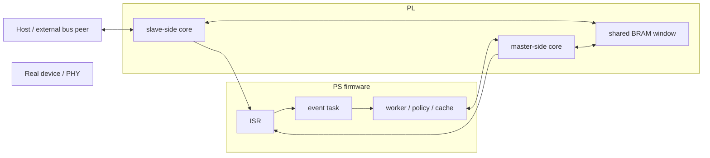

# PL-ядра

Этот документ описывает программную сторону работы с PL-ядрами в `bvstk`. Его задача не в том, чтобы дублировать RTL-документацию или перечислить все регистры, а в том, чтобы зафиксировать, как прошивка сейчас взаимодействует с I2C, SPI и SMI-блоками, какие из этих подсистем реально активны в текущем boot path и как проходит граница между кодом на PS и логикой в PL.

Для этого проекта особенно важно не смешивать два разных утверждения: “подсистема реализована в коде” и “подсистема реально активна после старта прошивки”. В текущем состоянии `I2C` и `SPI` действительно запускаются из `main()`. Код `SMI` в проекте тоже есть, с полноценными очередями, политиками и runtime-логикой, но строка `start_smi()` сейчас закомментирована, поэтому `SMI` нельзя описывать как часть текущего рабочего boot path наравне с `I2C`.

## Что такое PL-подсистемы в `bvstk`

На архитектурном уровне PL-ядра в этом проекте это не просто периферийные блоки, к которым ARM пишет пару регистров. Прошивка использует их как аппаратные прокси для внешних шин. Тайминги, транзакционные FSM, FIFO, BRAM-буферы и IRQ происходят в FPGA, а программная часть на PS занимается политиками доступа, синхронизацией, кешированием, публикацией наружу через TCP/HTTP/DCP2 и применением сохранённых настроек.

Для `I2C` и `SMI` эта модель особенно выражена. Там программная логика работает поверх пары PL-ядер `master/slave`, общей BRAM-области и отдельных IRQ. `SPI` устроен проще: с точки зрения firmware это сейчас скорее синхронный runtime-adapter к одному PL-блоку, а не полноценная event-driven MITM-подсистема.

## Текущее состояние подсистем

| Подсистема | Статус в коде | Статус в текущем старте прошивки | Основные внешние поверхности |
|---|---|---|---|
| `bvstk_i2c` | полноценно реализована | активна | TCP, HTTP, DCP2, notify |
| `bvstk_spi` | реализована как runtime-слой | активна | TCP shell, runtime API, DCP2 stream-control |
| `bvstk_smi` | полноценно реализована | код есть, но `start_smi()` сейчас не вызывается | shell/DCP2/HTTP code paths присутствуют, но runtime зависит от явного старта |

Это различие критично. Если документация описывает `SMI` так, будто оно уже работает после каждой загрузки, она вводит в заблуждение. Но и игнорировать `SMI` нельзя, потому что конфигурационная модель, shell-команды, DCP2-ветки и сам код подсистемы остаются частью проекта.

## Общая модель обмена PS ↔ PL

Для `I2C` и `SMI` прошивка использует один и тот же базовый паттерн. ARM управляет PL-ядрами через MMIO-регистры и FIFO. Данные между PS и PL проходят через заранее выделенные окна BRAM. О готовности событий PL сообщает через отдельные IRQ. ISR на PS делает минимальную работу, складывает компактное событие в очередь, а вся тяжёлая логика выполняется уже в обычной FreeRTOS-задаче.

В такой архитектуре важно не переоценивать роль C-кода. Если ломается адресация BRAM, семантика IRQ, формат кадра или timing внешней шины, это уже не локальная проблема firmware-модуля. Это задача на стыке `bvstk` и hardware platform.

## Как это выглядит в текущем коде

Ниже приведена практическая карта программных модулей, связанных с PL.

| Область | Основные файлы |
|---|---|
| I2C runtime | `src/bvstk_i2c/bvstk_i2c.c`, `src/bvstk_i2c/bvstk_i2c.h` |
| SPI runtime | `src/bvstk_spi/bvstk_spi.c`, `src/bvstk_spi/bvstk_spi.h` |
| SMI runtime | `src/bvstk_smi/bvstk_smi.c`, `src/bvstk_smi/bvstk_smi.h` |
| Shell surfaces | `src/bvstk_tcp_server/utils/i2c_shell.c`, `src/bvstk_tcp_server/utils/spi_shell.c`, `src/bvstk_tcp_server/utils/smi_shell.c` |
| HTTP surfaces | `src/http_fs/http_fs_routes.c` |
| DCP2 surfaces | `src/dcp2/dcp2_server.c`, `src/dcp2/dcp2_notify.c` |
| Конфигурация | `src/config/config_store.c`, `src/config/config_store.h` |

Из этого видно, что PL-подсистемы в `bvstk` не являются изолированными драйверами. У каждой из них есть как минимум один внешний control surface, а у `I2C` и `SMI` ещё и тесная зависимость от `config_store`.

## I2C как основная активная PL-подсистема

`bvstk_i2c` в текущей системе является самым зрелым и активно используемым примером PS ↔ PL взаимодействия. Подсистема стартует из `main()`, создаёт очереди `q_master` и `q_slave`, ставит два IRQ-обработчика, поднимает mutex для сериализации доступа к шине и запускает три задачи: `i2c_master_evt`, `i2c_slave_evt` и `i2c_task`.

Смысл этого деления такой. `i2c_master_evt` и `i2c_slave_evt` выполняют event-driven часть и обслуживают сигналы от соответствующих IRQ. `i2c_task` держит более “медленную” логику: ждёт готовность `config_store`, принимает список устройств, делает стартовый full scan, применяет persisted settings и, если включён compile-time флаг `I2C_AUTOPOLL_ENABLE`, выполняет циклический опрос регистров.

### Как устроена I2C-модель

Прошивка рассматривает каждое I2C-устройство как регистровый девайс с линейной адресацией `reg = 0..reg_count-1`, 7-битным адресом `addr_7b` и 8-битными значениями. Эта модель приходит из `config_store` через массив `i2c_device_config_t`. Для каждого устройства в RAM существует регистровый кеш `s_reg_cache[dev][reg]`, а активный device context выбирается через индекс в `s_cfgs`.

| Что хранится для устройства | Где задаётся |
|---|---|
| имя, адрес, число регистров | JSON `flash:/config/i2c/*.json` и `i2c_device_config_t` |
| политика `whitelist/blacklist` | `config_store` + runtime API `i2cdev_set_policy_*()` |
| списки разрешений/запретов `{reg,val}` | `whitelist[]`, `blacklist[]` |
| persisted settings | `settings[]` |
| `autopoll`-профиль | `autopoll_enabled`, `autopoll_regs[]`, delays |
| кеш регистров | `s_reg_cache[][]` в `bvstk_i2c.c` |

Это делает `I2C` не просто драйвером шины, а policy-aware регистровой подсистемой. Она знает о допустимых значениях, о persistence и о том, что ответы хосту могут отдаваться не напрямую из PHY, а из кеша.

### MMIO, BRAM и IRQ у I2C

Со стороны firmware I2C использует два базовых адреса управления: `I2C_MASTER_BASE` и `I2C_SLAVE_BASE`. Отдельно существует BRAM-окно `BRAM_BASE_ADDR`, внутри которого выделены три логические области:

| Окно BRAM | Смещение |
|---|---:|
| `I2C_BRAM_SLAVE_WR` | `0x0000` |
| `I2C_BRAM_MASTER` | `0x0500` |
| `I2C_BRAM_SLAVE_RD` | `0x1000` |

Со стороны IRQ используются две fabric-линии: `IRQ_I2C_MASTER` и `IRQ_I2C_SLAVE`. В текущей реализации ISR делает минимум: гасит IRQ и складывает компактное событие в очередь. Вся содержательная логика происходит уже в задачах.

### Как I2C работает в рантайме

На чтении и записи поведение заметно различается. Запись рассматривается как потенциально опасная операция и проходит через политику доступа. Чтение старается быть дешёвым и быстрым, поэтому в MITM-потоке ответы хосту в первую очередь формируются из кеша, а не через синхронный запрос к PHY на каждый read.

Стартовый `full scan` читает все регистры каждого устройства и заполняет кеш. Persisted settings затем поверх этого выполняют целевые записи в PHY и одновременно обновляют кеш. Если compile-time включён `I2C_AUTOPOLL_ENABLE`, рабочая задача начинает периодически перечитывать указанные в конфиге регистры и держать кеш свежим.

В текущем коде `I2C_AUTOPOLL_ENABLE` по умолчанию равен `0`, поэтому полезно помнить, что наличие полей `autopoll_*` в конфиге ещё не означает, что autopoll реально исполняется в этой сборке. Модель данных и API для него есть, но фактическая активность зависит от compile-time флага.

### Политики и persisted settings у I2C

Политика записи у `I2C` применяется к паре `(reg, val)`, а не только к номеру регистра. Это важно и для shell, и для HTTP, и для DCP2. В режиме `whitelist` запись разрешена только если такая пара присутствует в `whitelist[]`. В режиме `blacklist` запись запрещается только если пара присутствует в `blacklist[]`. Дополнительно проверяются пределы `reg_count` и `max_value_code`.

Persisted settings хранятся отдельно от policy rules. Это не список разрешений, а список реальных значений, которые надо применить на устройстве при старте. После успешной записи в PHY текущая реализация также пытается актуализировать `settings[]` в in-memory конфиге, чтобы последующее сохранение через `config_store_save_i2c_device()` сериализовало уже обновлённое состояние.

### Внешние поверхности I2C

`I2C` сейчас является самой полно интегрированной PL-подсистемой.

| Поверхность | Что доступно |
|---|---|
| TCP shell | `i2c list`, `i2c <dev> info`, `r`, `w`, `policy show`, `policy set`, `policy whitelist add/del/clear`, `policy blacklist add/del/clear` |
| HTTP | `GET /api/i2c`, `PUT /api/i2c`, `POST /api/diag/i2c/read`, `POST /api/diag/i2c/write` |
| DCP2 | регистровые read/write, policy set, notify, stream subscribe control |
| Notify | события попытки, commit, deny, fault через `dcp2_notify_publish_simple()` |

Это делает `I2C` хорошей отправной точкой, когда нужно понять философию всей PS ↔ PL части проекта.

## SPI как более тонкий runtime-слой

`bvstk_spi` архитектурно заметно проще. Он тоже стартует из `main()`, но не поднимает отдельную рабочую задачу уровня `i2c_task`. При старте создаётся mutex `spi_bus_mutex`, а если для платформы разрешён `SPI_HAS_IRQ`, то ещё и короткая очередь `q_spi_irq` плюс ISR.

SPI-подсистема держит компактную runtime-конфигурацию `spi_runtime_cfg_t`, в которой живут packet mode, timeout, делитель `p_clk_div` и флаг `read_en`. Эту конфигурацию можно менять из shell. Дальше ядро используется через одну основную операцию `spi_transfer_words()`, которая программирует packet register, пишет слова в TX FIFO, запускает передачу и затем либо ждёт IRQ, либо поллит CSR до idle-состояния. При чтении результат выбирается из BRAM-окна `SPI_BRAM_BASEADDR`.

| Что определяет SPI runtime | Где это живёт |
|---|---|
| базовый адрес ядра | `SPI_BASEADDR` |
| BRAM-окно чтения | `SPI_BRAM_BASEADDR` |
| CSR / packet / timeout / TX FIFO / signal regs | `SPI_*_OFFSET` в `bvstk_spi.h` |
| runtime-config | `s_cfg` в `bvstk_spi.c` |

С точки зрения архитектуры это значит, что `SPI` пока не имеет того же уровня policy/config orchestration, что `I2C`. Здесь нет `config_store`-зависимого устройства с whitelist/blacklist и persisted settings. Это именно runtime-транспорт к PL-блоку, а не прикладная конфигурационная подсистема.

### Внешние поверхности SPI

У `SPI` есть shell-поверхность, но нет полноценного HTTP API уровня `I2C`.

| Поверхность | Что доступно |
|---|---|
| TCP shell | `spi info`, `spi cfg ...`, `spi xfer ...` |
| Runtime API | `spi_set_cfg()`, `spi_get_cfg()`, `spi_transfer_words()` |
| DCP2 | service id `SPI` существует, но обычные request/response операции сейчас возвращают `ERR_UNSUPPORTED`; доступен только stream subscribe control |

Это ещё один важный нюанс текущего состояния проекта: наличие `DCP2_SRV_SPI` в протоколе не означает, что через DCP2 уже реализованы прикладные SPI-команды.

## SMI как реализованная, но сейчас не активная подсистема

`bvstk_smi` по структуре ближе к `I2C`, чем к `SPI`. Подсистема создаёт master/slave очереди, отдельную очередь `q_s2h_evt` для блокирующих чтений, mutex шины и три задачи: `master_evt_task`, `slave_evt_task` и `smi_task`. Она знает про persisted settings, про `autopoll`, про allow/deny-политику записи и публикует notify-события через DCP2.

Но ключевой факт текущего состояния в другом: эта логика не стартует автоматически, потому что `start_smi()` сейчас не вызывается из `main()`. Поэтому `smi_task`, master/slave event flow и runtime-сериализация шины существуют в коде, но не являются частью активной системы после стандартной загрузки прошивки.

### Как устроена SMI-модель

SMI рассматривает PHY как MDIO-пространство адресов `(phy, reg)`, где и `phy`, и `reg` занимают по 5 бит. Для прошивки это проецируется в BRAM-ячейки через индекс `idx = (phy << 5) | reg` и три логических области в BRAM.

| Окно BRAM | Смещение |
|---|---:|
| `MASTER_WR_OFFSET` | `0x0000` |
| `SLAVE_WR_OFFSET` | `0x1000` |
| `SLAVE_RD_OFFSET` | `0x2000` |

Управляющие регистры находятся по `MASTER_BASEADDR` и `SLAVE_BASEADDR`. Для записи в PHY firmware формирует 32-битное слово в `TX_FIFO_m`, где упакованы `data`, `reg`, `phy` и бит направления. Блокирующее чтение `mdio_read_blocking()` использует специальную очередь `q_s2h_evt` и фильтр `(phy, reg)`, ожидая, пока событие с нужным словом придёт из slave-side path.

### Политика и runtime у SMI

В отличие от `I2C`, политика записи у `SMI` привязана только к номеру регистра, а не к паре `(reg, val)`. В режиме `whitelist` разрешены только регистры из `write_allow_regs[]`. В режиме `blacklist` запрещены только регистры из `write_deny_regs[]`. Persisted settings хранятся как пары `{reg, val}` и при активном runtime применяются на старте `smi_task`.

При отсутствии загруженных конфигов `smi_task` умеет fallback-ом сканировать `PHY=1`, регистры `0..31`, то есть код явно рассчитан на эксплуатационный режим даже без полной конфигурационной модели. Но повторю главное: всё это сейчас становится реальностью только если подсистему явно стартовать.

### Внешние поверхности SMI

Поскольку shell, HTTP и DCP2-ветки для `SMI` в проекте присутствуют, легко ошибочно решить, что подсистема уже активна всегда. Документация должна формулировать это аккуратно.

| Поверхность | Статус |
|---|---|
| TCP shell | команды `smi ...` существуют |
| HTTP | `POST /api/diag/smi/read` и `POST /api/diag/smi/write` существуют |
| DCP2 | read/write-ветки и stream subscribe control существуют |
| Runtime после обычного boot | зависит от явного вызова `start_smi()`, который сейчас отключён |

Поэтому диагностические сценарии для `SMI` нужно оценивать с поправкой на то, включена ли подсистема в конкретной сборке и конкретном boot path.

## Как PL-подсистемы связаны с `config_store`

`config_store` определяет для `I2C` и `SMI` не только начальный набор устройств, но и саму прикладную модель политики и persistence.

| Подсистема | Что она получает из `config_store` |
|---|---|
| `I2C` | список устройств, адреса, регистровые лимиты, `whitelist/blacklist`, `autopoll`, `settings[]` |
| `SMI` | список PHY, `write_allow/write_deny`, `autopoll`, `settings[]` |
| `SPI` | сейчас не зависит от `config_store` напрямую |

Это означает, что изменения в `config_store` или в формате соответствующих JSON-файлов часто являются не “локальными конфигурационными изменениями”, а изменениями самой PL-facing архитектуры firmware.

## Диагностика и отладка

При диагностике PS ↔ PL взаимодействия полезно идти не от исходников, а от surfaces и readiness-сигналов.

| Что проверять | Через что это делается |
|---|---|
| загружен ли config | `GET /api/i2c`, `fs ls flash:/config`, shell `i2c list`, `smi list` |
| работает ли I2C runtime | shell `i2c ...`, HTTP `/api/diag/i2c/*`, DCP2 I2C requests |
| работает ли SPI runtime | shell `spi info`, `spi xfer ...` |
| доступен ли SMI runtime | только если подсистема действительно стартована |
| нужно ли посмотреть MMIO/BRAM вручную | shell `mem` или HTTP `/api/diag/mem/*` |

Особенно полезно держать в голове две типовые причины ложной диагностики. Первая это неготовый `config_store`, из-за которого кажется, что подсистема “не видит устройства”, хотя на самом деле ещё не загрузилась её конфигурация. Вторая это неактуальный hardware export, из-за которого код собран против другой адресной карты или другой версии PL-ядра.

## Что читать дальше

Этот документ задаёт общую картину PL-facing логики в firmware, но не заменяет документацию по hardware platform и не дублирует полное описание пользовательских интерфейсов.

| Документ | Когда к нему переходить |
|---|---|
| `hardware-platform.md` | когда вопрос упирается в `Burevestnik_21`, `ip_repo` и реальный RTL |
| `architecture.md` | когда нужна общая модель boot path и связей между подсистемами |
| `config-store.md` | когда изменение касается политик, persisted settings или JSON |
| `../dcp2.md` | когда PL-подсистема важна именно как часть бинарного протокола |
