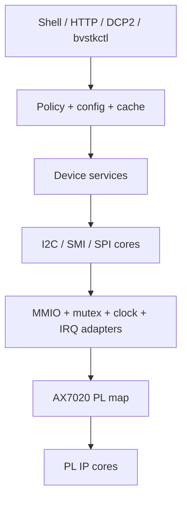
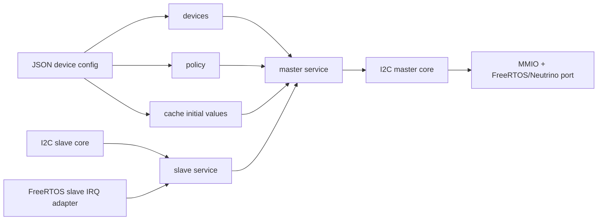
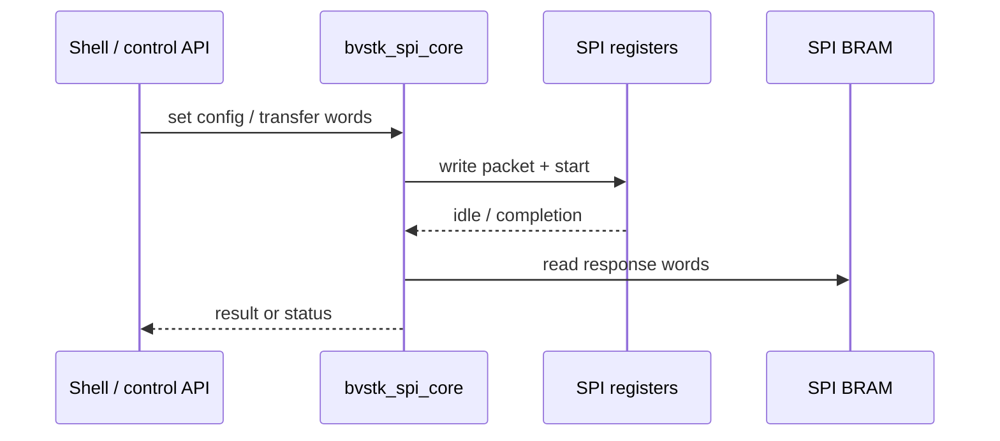

# PL cores и программные слои

## 1. Назначение раздела

PL-подсистема BVSTK состоит из аппаратного контракта, OS-independent cores, сервисов устройств и target-specific adapters. Каждый слой имеет отдельную ответственность и собственный набор тестов.

```mermaid
flowchart TB
    Surface[Shell / HTTP / DCP2 / bvstkctl]
    Policy[Policy + config + cache]
    Device[Device services]
    Core[I2C / SMI / SPI cores]
    Port[MMIO + mutex + clock + IRQ adapters]
    Map[AX7020 PL map]
    IP[PL IP cores]

    Surface --> Policy --> Device --> Core --> Port --> Map --> IP
```

## 2. Раскладка исходников

| Слой | Каталог | Примеры |
|---|---|---|
| Аппаратная карта | `src/hardware/boards/ax7020/` | адреса, размеры, IRQ |
| Регистровые контракты | `src/hardware/pl/` | offsets и frame layout |
| Общие cores | `src/drivers/pl/` | `bvstk_i2c_master`, `bvstk_i2c_slave`, `bvstk_smi_core`, `bvstk_spi_core` |
| Общие сервисы | `src/services/i2c/`, `src/services/smi/` | devices, cache, policy, master/slave service |
| Общий access | `src/shared/pl/access/` | чтение регионов и platform service |
| FreeRTOS port | `src/ports/freertos-xilinx/` | MMIO, sync, I2C slave IRQ adapter |
| Neutrino port | `src/ports/neutrino-zynq7000/` | MMIO, sync и platform init |
| FreeRTOS composition | `src/apps/freertos/runtime/` | запуск cores/services и runtime handles |
| Legacy FreeRTOS | `src/apps/freertos/drivers/pl/` | старые SMI/SPI shell/runtime модули |

Legacy-каталог сохраняется для совместимых поверхностей и постепенной миграции. Новые OS-independent операции размещаются в `src/drivers/pl/`, сервисная логика — в `src/services/`, OS glue — в `src/ports/`.

## 3. Общий core-контракт

| Core | Входная операция | Результат |
|---|---|---|
| I2C master | адрес, write buffer, read buffer, timeout | transaction result |
| I2C slave | mailbox frame и read-window | событие для service |
| SMI | `phy`, `reg`, `value`, timeout | MDIO read/write result |
| SPI | массив TX words, capacity RX | массив RX words |

Каждый core получает `bvstk_mmio_region_t`, `bvstk_clock_t` и `bvstk_mutex_t`. Эти зависимости передаются через интерфейсы из `src/shared/interfaces/`, поэтому алгоритм работы с PL отделён от конкретного RTOS.

## 4. I2C

I2C имеет наиболее полную общую модель:

```mermaid
flowchart LR
    Config[JSON device config] --> Devices[devices]
    Config --> Policy[policy]
    Config --> Cache[cache initial values]
    Devices --> Master[master service]
    Policy --> Master
    Cache --> Master
    Master --> Core[I2C master core]
    Core --> Port[MMIO + FreeRTOS/Neutrino port]
    SlaveCore[I2C slave core] --> SlaveService[slave service]
    SlaveService --> Master
    IRQ[FreeRTOS slave IRQ adapter] --> SlaveService
```

I2C policy проверяет пару `(register, value)`. `settings[]` хранит значения для persistence. Автополинг в I2C-модели отсутствует. Подробные регистры, mailbox и жизненный цикл описаны в [I2C](pl/i2c.md).

## 5. SMI

SMI работает с адресом PHY и 5-битным регистром. Общий service поддерживает cache, policy, settings и функцию `bvstk_smi_service_poll()`. Runtime FreeRTOS и Neutrino инициализируют core/service для on-demand операций; планирование периодического poll выполняется отдельным composition-кодом, если оно требуется конкретной платформе.

Конфигурация SMI содержит `autopoll_enabled`, список регистров и задержки цикла. Эти поля относятся к SMI и остаются частью JSON-модели. Полное описание приведено в [SMI](pl/smi.md).

## 6. SPI

SPI представлен общим transfer core и FreeRTOS shell/runtime integration. Core управляет packet mode, делителем, timeout и BRAM read window. Policy-aware device service для SPI в текущей реализации отсутствует.

```mermaid
sequenceDiagram
    participant Client as Shell / control API
    participant Core as bvstk_spi_core
    participant MMIO as SPI registers
    participant BRAM as SPI BRAM

    Client->>Core: set config / transfer words
    Core->>MMIO: write packet + start
    MMIO-->>Core: idle / completion
    Core->>BRAM: read response words
    Core-->>Client: result or status
```

Смещения и runtime-ограничения собраны в [SPI](pl/spi.md).

## 7. FreeRTOS и Neutrino

| Возможность | FreeRTOS | Neutrino |
|---|---|---|
| Общие I2C master services | runtime task после config store | `bvstkctl` и `bvstkd` composition |
| I2C slave IRQ | `bvstk_i2c_slave_freertos` | отдельный adapter пока не включён в build |
| SMI core/service | `bvstk_runtime` | `bvstkd` |
| SPI core | `bvstk_runtime` + shell | `bvstkd` |
| MMIO/sync | `src/ports/freertos-xilinx` | `src/ports/neutrino-zynq7000` |
| Внешние поверхности | TCP, SSH, HTTP, DCP2 | CLI и DCP2 daemon |

Приложение Neutrino компилирует общий код явным списком в `scripts/neutrino/build.sh`. FreeRTOS получает source roots из `scripts/vitis/build.tcl`.

## 8. События и диагностика

I2C и SMI публикуют события попытки, разрешения, отказа и аппаратной ошибки через `bvstk_event_sink_t`. FreeRTOS преобразует их в DCP2 notify. Это создаёт единый путь наблюдения:

```mermaid
flowchart LR
    Operation[Service operation] --> Event[bvstk_event_t]
    Event --> Sink[bvstk_event_sink_t]
    Sink --> Notify[DCP2 notify]
    Notify --> Host[monitor_notify.py / host client]
```

## 9. Правило размещения нового кода

| Вопрос | Размещение |
|---|---|
| Код знает только о MMIO и PL-регистрах? | `src/drivers/pl/` |
| Код описывает устройства, policy, cache или persistence? | `src/services/` |
| Код использует FreeRTOS API, очередь или ISR? | `src/ports/freertos-xilinx/` |
| Код использует Neutrino API? | `src/ports/neutrino-zynq7000/` |
| Код разбирает командную строку или HTTP? | соответствующий `src/apps/<os>/` adapter |
| Код задаёт адреса платы? | `src/hardware/boards/<board>/` |

Внешнее API вызывает сервисы через control layer. Shell, HTTP и DCP2 не должны обращаться к MMIO core напрямую.
