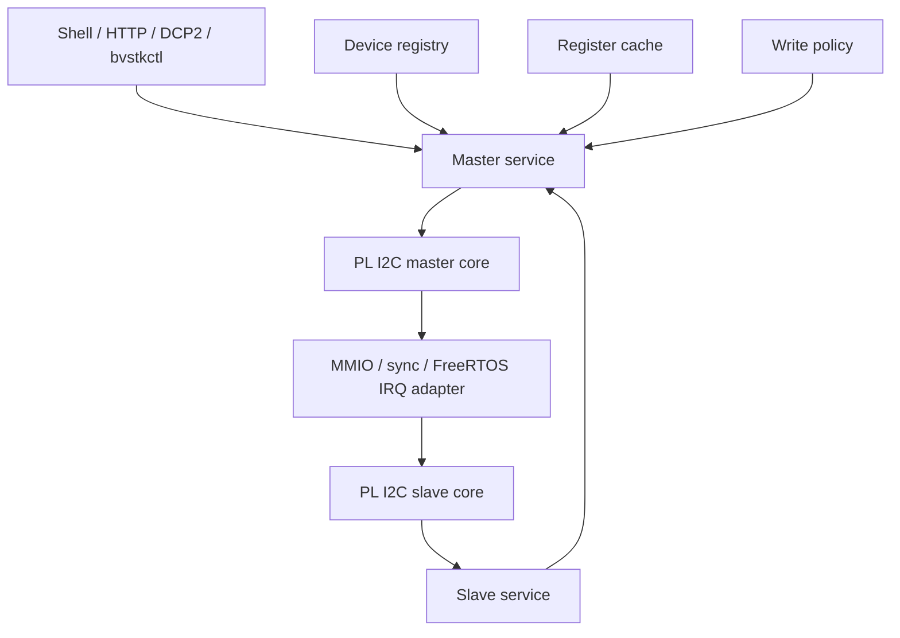
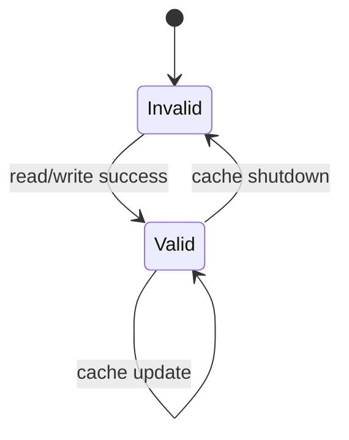
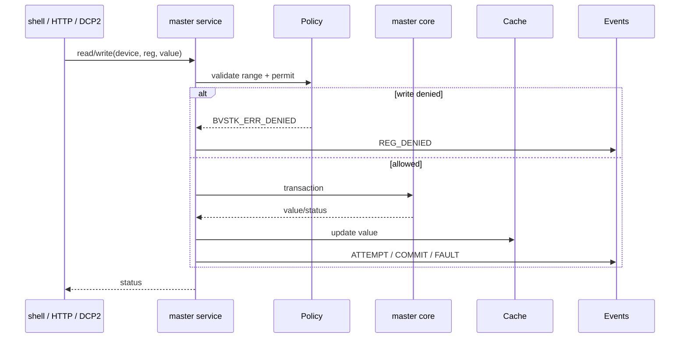
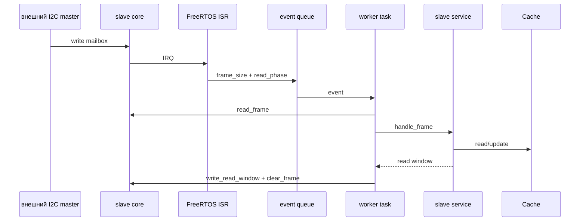

# I2C

## 1. Архитектурная модель

I2C разделён на пять функциональных частей: hardware core, устройства, cache, policy и master/slave services. Внешние интерфейсы вызывают services через runtime/control API.



| Компонента | Исходники | Ответственность |
|---|---|---|
| master core | `src/drivers/pl/i2c/bvstk_i2c_master.*` | transaction frame, MMIO, timeout |
| slave core | `src/drivers/pl/i2c/bvstk_i2c_slave.*` | mailbox, IRQ snapshot, read window |
| devices | `src/services/i2c/bvstk_i2c_devices.*` | имена, address и limits |
| cache | `src/services/i2c/bvstk_i2c_cache.*` | values и valid flags |
| policy | `src/services/i2c/bvstk_i2c_policy.*` | whitelist/blacklist пар `(reg,val)` |
| master service | `src/services/i2c/bvstk_i2c_master_service.*` | связывает core, device, cache и policy |
| slave service | `src/services/i2c/bvstk_i2c_slave_service.*` | mailbox protocol и ответы из cache |
| FreeRTOS adapter | `src/ports/freertos-xilinx/os/i2c/` | ISR, queue и worker task |

## 2. Hardware core

`bvstk_i2c_master_hw_t` открывает master MMIO и I2C BRAM. Основная операция:

```c
bvstk_i2c_master_hw_transfer(hardware,
                             addr_7b,
                             write_data, write_size,
                             read_data, read_size,
                             timeout_ms);
```

Удобные операции `read_reg` и `write_reg` формируют одно-регистровый transaction поверх transfer API.

I2C slave core предоставляет:

| Операция | Назначение |
|---|---|
| `hw_init` | открыть slave MMIO и BRAM |
| `set_address` | записать host-facing address bitmap |
| `clear_irq` / `capture_irq` | снять sticky IRQ flags и request header |
| `read_frame` | прочитать header и mailbox из `BRAM + 0x1000` |
| `write_read_window` | записать header и данные в `BRAM + 0x2000` |
| `accept_read` | выставить `CSR.rd_valid` после подготовки ответа |
| `clear_frame` | завершить обработку mailbox |

Операции core не знают о FreeRTOS queue, task или Neutrino thread.

Регистровый протокол slave из `fpga/develop`:

| Offset | Read | Write |
|---:|---|---|
| `0x00` | busy/core state | soft reset, start, `rd_valid` |
| `0x04` | sticky IRQ flags | clear IRQ, bit 0 |
| `0x08` | current request header | — |
| `0x10..0x1C` | address bitmap | address bitmap |

Header имеет формат `num_bytes << 7 | phy_addr`. Write mailbox начинается с
`0x1000`, response mailbox — с `0x2000`; response header находится первым
словом окна, данные — со второго слова.

## 3. Device registry

`bvstk_i2c_device_t` хранит только bus-facing identity:

| Поле | Значение |
|---|---|
| `name` | имя устройства |
| `addr_7b` | 7-битный адрес |
| `reg_count` | число регистров |
| `max_value_code` | максимум значения записи |

`bvstk_i2c_devices_init_from_config()` переносит validated `i2c_device_config_t` из config store в runtime registry. Поиск поддерживает имя и адрес.

## 4. Cache

Cache хранит таблицы `values[device][reg]` и `valid[device][reg]`. Значение становится valid после явной записи cache или успешного чтения через master service.



Cache используется slave service для ответа внешнему I2C master. Чтение из cache не выполняет новый transaction на физической шине.

## 5. Policy

I2C policy применяется к паре `(reg, value)`:

| Режим | Условие записи |
|---|---|
| `whitelist` | пара присутствует в `whitelist[]` |
| `blacklist` | пара отсутствует в `blacklist[]` |

До проверки policy service проверяет `reg < reg_count` и `value <= max_value_code`. Изменения mode и списков передаются из shell/HTTP/DCP2 в service, затем синхронизируются с config store.

## 6. Master service

`bvstk_i2c_master_service_t` объединяет:



Публичные операции:

| API | Назначение |
|---|---|
| `device_count`, `device_info` | перечисление устройств |
| `find_by_name`, `find_by_addr` | выбор устройства |
| `read`, `read_cached` | физическое или cached чтение |
| `write` | policy-aware запись |
| `get_policy`, `set_policy` | режим policy |
| `set_config`, `get_config` | обновление модели |
| `rule_allow`, `rule_deny`, `rule_clear` | редактирование правил |

## 7. Slave service

Slave service поддерживает состояние выбранного устройства, register pointer и read armed flags. Он принимает один mailbox frame и формирует read window длиной до `64` байт.

Типовая последовательность:



FreeRTOS adapter находится в `src/ports/freertos-xilinx/os/i2c/`. Neutrino build сейчас использует common master/service набор; отдельный Neutrino slave IRQ adapter в `scripts/neutrino/build.sh` не подключён.

## 8. FreeRTOS runtime

`bvstk_runtime_start()` создаёт runtime task. После `config_store_wait_ready()` выполняются:

1. перенос I2C devices из конфигурации;
2. инициализация cache и загрузка `settings[]` в cache;
3. создание FreeRTOS mutex и master core;
4. создание master service;
5. запуск slave core/service/adapter при успешной инициализации.

Read/write operations доступны через `bvstk_runtime_i2c_master_service()` после готовности service.

## 9. Конфигурация

Пример source JSON:

```json
{
  "name": "axp15060",
  "addr_7b": 54,
  "reg_count": 74,
  "max_value_code": 64,
  "policy": "whitelist",
  "whitelist": [{ "reg": 19, "val": 16 }],
  "blacklist": [],
  "settings": []
}
```

I2C settings — значения для persistence. Autopoll-поля в этой модели отсутствуют.

## 10. Диагностика

```text
i2c list
i2c axp15060 info
i2c axp15060 policy show rules
i2c axp15060 r 0x13
i2c axp15060 w 0x13 0x10
```

| Симптом | Проверка |
|---|---|
| `I2C not ready` | `config_store`, mount QSPI и время runtime task |
| `device not found` | имя, адрес и загруженный JSON |
| `DENIED` | активная policy и пара `(reg,val)` |
| `timeout` | XSA/bitstream, адрес core, PL clock и transaction state |
| slave event отсутствует | IRQ `64`, FreeRTOS adapter и BRAM mailbox |
| policy отображается пустой | использовать `policy show rules` или `policy whitelist/blacklist` для списка |
