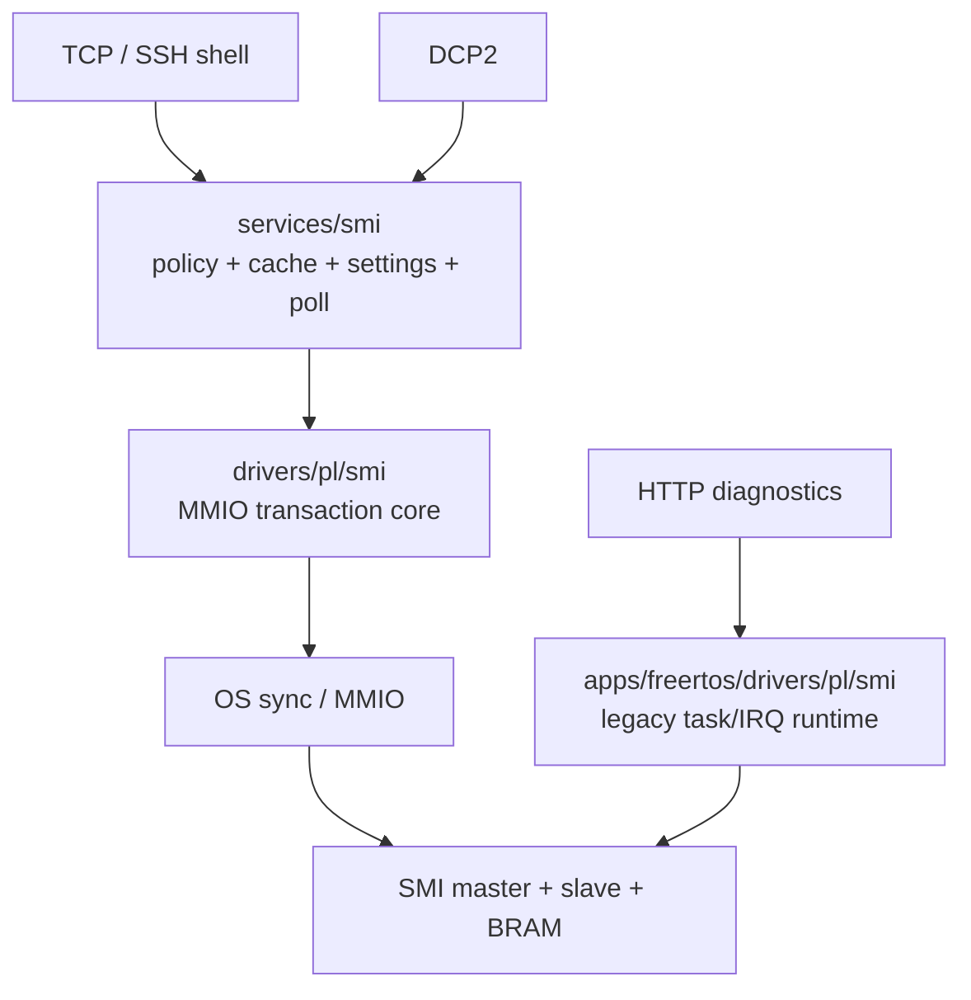

# SMI / MDIO

## 1. Архитектура

SMI обслуживает MDIO PHY-регистры с 5-битными адресами PHY и регистра. В проекте существуют общий core/service слой и legacy FreeRTOS task runtime.



| Слой | Файлы | Назначение |
|---|---|---|
| core | `src/drivers/pl/smi/bvstk_smi_core.*` | frame, MMIO, timeout и mutex |
| service | `src/services/smi/bvstk_smi_service.*` | PHY registry, policy, cache и settings |
| config | `shared/config/bvstk_config_model.h` | JSON-модель и autopoll fields |
| FreeRTOS legacy | `src/apps/freertos/drivers/pl/smi/` | старый task/IRQ flow и HTTP compatibility |

## 2. Адреса и frame

SMI использует базовые адреса `smi-master`, `smi-slave`, `smi-bram` и BRAM-окна:

| Окно | Offset |
|---|---:|
| master write | `0x0000` |
| slave write | `0x1000` |
| slave read | `0x2000` |

Команда master формируется в 32-битном слове:

| Биты | Поле |
|---:|---|
| `0..15` | data |
| `16..20` | register |
| `21..25` | PHY address |
| `26` | direction/write flag |

`bvstk_smi_core_read()` пишет read frame, ждёт `READ_READY`, читает ответ и выполняет acknowledge slave IRQ. `bvstk_smi_core_write()` записывает frame в TX FIFO.

## 3. SMI service

`bvstk_smi_service_t` хранит массив `smi_phy_config_t`, cache `[device][reg]` и backend operations.

| API | Назначение |
|---|---|
| `device_count`, `device_info` | перечисление PHY |
| `find_by_name`, `find_by_phy` | выбор устройства |
| `read`, `read_cached` | physical или cached чтение |
| `write` | policy-aware запись |
| `set_policy` | смена write mode |
| `get_config`, `set_config` | runtime-конфигурация |
| `poll` | прочитать configured autopoll registers |

## 4. Policy

SMI policy работает на уровне номера регистра:

| Режим | Условие записи |
|---|---|
| `whitelist` | `reg` находится в `write_allow_regs[]` |
| `blacklist` | `reg` отсутствует в `write_deny_regs[]` |

Диапазоны `phy_addr`, `reg` и `reg_count` проверяются до доступа к core. После успешной записи service обновляет cache и `settings[]`, затем публикует событие commit.

## 5. Autopoll

Конфигурация SMI содержит:

| Поле | Назначение |
|---|---|
| `autopoll_enabled` | включить режим |
| `autopoll_regs[]` | список регистров |
| `autopoll_reg_delay_ms` | задержка между чтениями |
| `autopoll_cycle_delay_ms` | рекомендуемая задержка цикла |

`bvstk_smi_service_poll()` выполняет один проход по всем активным PHY и выбранным регистрам. Планирование периодичности остаётся задачей composition root.

В стандартном FreeRTOS runtime общий SMI core/service инициализируются после готовности `config_store`; отдельный scheduler для `bvstk_smi_service_poll()` в `bvstk_runtime` отсутствует. Legacy `start_smi()` в `main.c` отключён. Поэтому поле autopoll описывает политику сбора, а фактический периодический запуск требует отдельного вызова polling runtime.

## 6. FreeRTOS и Neutrino

| Возможность | FreeRTOS | Neutrino |
|---|---|---|
| общий SMI core | `bvstk_runtime` | `bvstkd` |
| общий SMI service | `bvstk_runtime` | `bvstkd` |
| legacy task flow | исходники сохранены, `start_smi()` отключён | не входит в build |
| DCP2 read/write | общий runtime service | `bvstkd` service |
| HTTP diag | legacy compatibility path | отсутствует в `bvstkd` |

## 7. Shell и конфигурация

```text
smi list
smi lan8720 info
smi lan8720 r 0x01
smi lan8720 w 0x00 0x1200
smi lan8720 policy whitelist
smi lan8720 allow 0x00
smi lan8720 rules
smi lan8720 autopoll
smi lan8720 autopoll on
smi lan8720 autopoll regs 0 1 4 5 17 31
smi lan8720 settings
smi lan8720 save
```

Пример JSON находится в `configs/smi/lan8720.json`. SMI settings используют пары `{reg,val}`, а policy — массивы регистров.

## 8. События и диагностика

SMI service публикует `REG_ATTEMPT`, `REG_COMMIT`, `REG_DENIED` и `FAULT`. FreeRTOS runtime передаёт их в DCP2 notify.

| Симптом | Проверка |
|---|---|
| `SMI not ready` | `config_store`, SMI base addresses и runtime readiness |
| `DENIED` | active policy и `write_allow/write_deny` |
| timeout | PL master/slave, clock, BRAM response и IRQ acknowledge |
| autopoll не меняет cache | вызывается ли `bvstk_smi_service_poll()` планировщиком |
| HTTP и shell показывают разные результаты | используется ли common service или legacy HTTP path |
