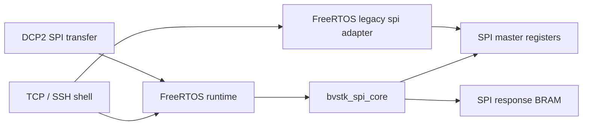
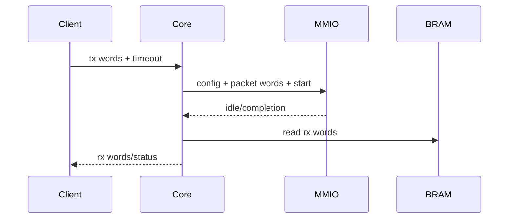

# SPI

## 1. Назначение

SPI в текущем BVSTK — transfer core и runtime configuration. Полноценная device/policy/config-store модель для SPI отсутствует; управление выполняется через shell, DCP2 и target composition.



| Компонента | Путь | Ответственность |
|---|---|---|
| common core | `src/drivers/pl/spi/bvstk_spi_core.*` | MMIO transfer, config, timeout |
| register map | `src/hardware/pl/spi/bvstk_spi_regs.h` | offsets и bit fields |
| FreeRTOS adapter | `src/apps/freertos/drivers/pl/spi/` | compatibility runtime и shell helpers |
| runtime handle | `src/apps/freertos/runtime/bvstk_runtime.c` | common core + mutex |

## 2. Конфигурация core

`bvstk_spi_core_config_t` содержит:

| Поле | Значение |
|---|---|
| `packets_mode` | single, multi или fallthrough |
| `timeout_ticks` | timeout аппаратного transfer |
| `p_clk_div` | делитель clock, допустимы чётные значения `2..65535` |
| `read_enable` | разрешить чтение response BRAM |

API:

```c
bvstk_spi_core_set_config(core, &config);
bvstk_spi_core_get_config(core, &config);
bvstk_spi_core_transfer(core, tx, tx_count, rx, rx_capacity, timeout_ms);
```

## 3. Transfer



Shell ограничивает одну передачу 64 словами:

```text
spi info
spi cfg mode multi
spi cfg timeout 1
spi cfg div 512
spi cfg read on
spi xfer 0x01020304 0xAABBCCDD
```

## 4. DCP2

DCP2 service `SPI` использует opcode `SPI_TRANSFER`. Body содержит число слов и массив 32-битных TX values; response возвращает массив RX values.

| Поле | Размер |
|---|---:|
| `count` | 2 байта, big-endian |
| `tx[count]` | `count * 4` байт |
| response `rx[count]` | `count * 4` байт |

Допустимый `count` — `1..256`. DCP2 использует отдельный control path и не предоставляет SPI policy.

## 5. FreeRTOS runtime

`bvstk_runtime` создаёт mutex и инициализирует common SPI core. Shell получает core через `bvstk_runtime_spi_core()`. Legacy adapter остаётся доступным для совместимых участков приложения.

Neutrino `bvstkd` создаёт common SPI core с default config и передаёт его в `bvstk_control_api_t`.

## 6. Диагностика

| Симптом | Проверка |
|---|---|
| `spi info` показывает defaults | готов ли common runtime core |
| transfer timeout | SPI base, BRAM, clock и bitstream |
| RX значения пустые | `read_enable`, response BRAM и packet mode |
| DCP2 возвращает range | count и размер body |
| shell и DCP2 дают разный результат | сравнить common и legacy paths |

Адреса `spi-master` и `spi-bram` приведены в [аппаратной карте](../../reference/hardware-map.md).
