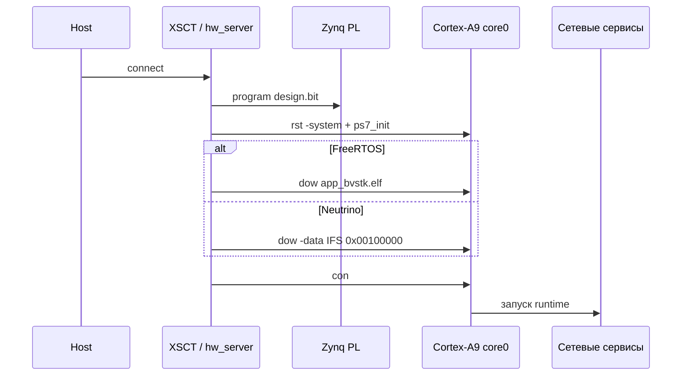

# Запуск и отладка

## 1. Общая схема

JTAG-flow подготавливает PL, инициализирует PS7, загружает программный образ и передаёт управление процессору. FreeRTOS получает ELF приложения. Neutrino получает IFS в DDR по адресу `0x00100000`.



## 2. FreeRTOS: обычный запуск

```sh
source <Vitis-install>/settings64.sh
./build.sh freertos
./run.sh freertos jtag
```

По умолчанию JTAG-скрипт использует:

| Артефакт | Путь |
|---|---|
| ELF | `vitis_ws/app_bvstk/Debug/app_bvstk.elf` |
| bitstream | `artifacts/fpga/design.bit` |
| PS7 init | `vitis_ws/plat_bvstk/export/plat_bvstk/hw/ps7_init.tcl` |

Замена входных файлов:

```sh
./scripts/vitis/run_jtag.sh /abs/path/to/design.bit
BITSTREAM_FILE=/abs/path/to/design.bit \
ELF_FILE=/abs/path/to/app_bvstk.elf \
PS7_INIT_TCL=/abs/path/to/ps7_init.tcl \
  ./scripts/vitis/run_jtag.sh
```

Приоритет bitstream: позиционный аргумент, `BITSTREAM_FILE`, `artifacts/fpga/design.bit`, legacy-путь `../bvstk_hw/tmp/design.bit`, bitstream из platform export. Для ELF и `ps7_init.tcl` используются override-переменные и пути из Vitis workspace.

## 3. Neutrino: запуск IFS

```sh
./build.sh neutrino-image
./run.sh neutrino jtag
```

Скрипт `scripts/neutrino/run_jtag.sh` проверяет файлы, настраивает UART, сохраняет лог и ждёт сигнатуру старта. Затем `run.sh` запускает `verify_ssh.sh`.

| Параметр | Значение по умолчанию |
|---|---|
| `IFS_FILE` | `build/neutrino/ifs-zynq7000-ax7020-bvstk.raw` |
| `BITSTREAM_FILE` | `artifacts/fpga/design.bit` |
| `PS7_INIT_TCL` | `vitis_ws/plat_bvstk/export/plat_bvstk/hw/ps7_init.tcl` |
| `UART_DEVICE` | `/dev/ttyUSB1` |
| `UART_BAUD` | `115200` |
| `LOG_FILE` | `build/neutrino/neutrino-uart.log` |
| `DEVICE_IP` | `192.168.0.10` |
| `SSH_IDENTITY` | `build/neutrino/ax7020_ssh_client` |

IFS передаётся в DDR командой `dow -data` и запускается через запись PC. JTAG-flow предназначен для разработки и проверки; автономная запись BOOT.BIN в SD/QSPI выполняется отдельным процессом.

## 4. Debug FreeRTOS

Команда подготовки debug-target:

```sh
./scripts/vitis/run_jtag.sh --debug
```

Скрипт запускает `hw_server` с TCF-портом `3121` и GDB-портом `3000`, программирует PL, выполняет `ps7_init` и оставляет core0 остановленным.

Ручное подключение GDB:

```sh
arm-none-eabi-gdb vitis_ws/app_bvstk/Debug/app_bvstk.elf \
  -ex "target remote :3000" \
  -ex "load" \
  -ex "tbreak main" \
  -ex "continue"
```

VSCode использует ту же последовательность через `.vscode/tasks.json`, `.vscode/launch.json` и `scripts/vscode/jtag_prepare_debug.tcl`. Перед attach должны быть доступны `arm-none-eabi-gdb`, `hw_server` и актуальный ELF.

## 5. Что запускается после загрузки FreeRTOS

`src/apps/freertos/main.c` выполняет следующий порядок:

1. QSPI self-test;
2. SD, QSPI и файловые устройства;
3. `config_store`;
4. LAN и TCP-консоль;
5. SSH при включённой опции сборки;
6. HTTP и DCP2;
7. `bvstk_runtime`, который после готовности конфигурации поднимает общие I2C, SMI и SPI cores/services.

Общий SMI service участвует в runtime и доступен shell/HTTP/DCP2 после успешной инициализации. Legacy-функция `start_smi()` в `main.c` остаётся отключённой. Периодический вызов `bvstk_smi_service_poll()` отдельной задачей `bvstk_runtime` сейчас не планирует; on-demand read/write и конфигурационные операции используют общий service напрямую.

| Сервис | Порт | Проверка |
|---|---:|---|
| TCP shell | `8888` | `nc <device-ip> 8888` |
| SSH shell | `22` | `ssh root@<device-ip>` |
| HTTP | `80` | `curl http://<device-ip>/api/rtos` |
| DCP2 | `8889` | `scripts/dcp2/monitor_notify.py` |

## 6. Первичная проверка

Подключение к TCP-консоли:

```sh
nc <device-ip> 8888
```

Минимальный набор команд:

```text
help
ip addr show
pwd
ls
i2c list
```

Файловые команды работают как команды shell верхнего уровня. Команда `fs` выводит справку по файловому слою.

Проверка HTTP:

```sh
curl -sS http://<device-ip>/api/net
curl -sS http://<device-ip>/api/rtos
curl -sS http://<device-ip>/api/i2c
```

Проверка DCP2 notify:

```sh
./scripts/dcp2/monitor_notify.py <device-ip> --port 8889
```

## 7. Диагностика запуска

| Симптом | Проверка |
|---|---|
| `xsct not found` | активировать Vitis environment или задать `XILINX_SETTINGS` |
| ELF отсутствует | выполнить `./build.sh freertos` и проверить путь в `vitis_ws/` |
| bitstream отсутствует | проверить `artifacts/fpga/design.bit` или `BITSTREAM_FILE` |
| PS7 init отсутствует | пересобрать Vitis platform и проверить `vitis_ws/plat_bvstk/export/plat_bvstk/hw/` |
| GDB-порт `3000` закрыт | перезапустить `hw_server` с `-p 3000` |
| UART-лог не содержит startup signature | проверить UART, baud rate, IFS и PS7 init |
| сеть не отвечает | проверить bitstream/XSA, PHY и конфигурацию `network.json` |
| I2C/SMI service не готов | дождаться `config_store`, проверить JSON и readiness через API |
| чтение политики возвращает ошибку | проверить имя устройства, формат команды и фактически загруженный конфиг |

## 8. Связанные документы

| Документ | Назначение |
|---|---|
| [Сборка](build.md) | build inputs, переменные и результаты |
| [Аппаратная платформа](hardware-platform.md) | XSA, bitstream, PL-регионы и IRQ |
| [Консольные команды](../reference/console-commands.md) | полный синтаксис shell |
| [HTTP API](../reference/http-api.md) | маршруты и форматы запросов |
| [Диагностика пользователя](../user/troubleshooting.md) | пошаговый разбор типовых отказов |
