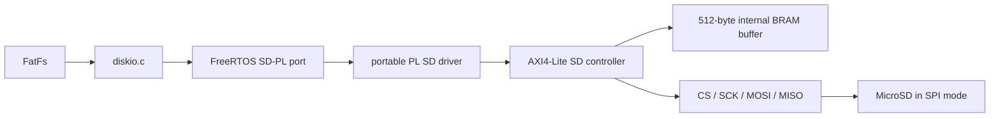

# SD-карта через PL

## 1. Граница подсистемы

Ветка `playground` использует внешний MicroSD SPI-адаптер. Встроенный SD-разъём
AX7020 остаётся отдельным PS MIO-интерфейсом и в этот путь не входит.

FatFs, `fs_shared`, shell, HTTP, SCP/SFTP и `config_store` работают поверх
обычного disk I/O. Путь `sd:/...` сохраняет старый PS SD backend, а внешний
контроллер доступен как `sd-pl:/...`.

## 2. Слои исходников

| Слой | Файл/каталог | Ответственность |
|---|---|---|
| Регистры | `src/hardware/pl/sd/bvstk_sd_regs.h` | offsets и bit masks |
| Common driver | `src/drivers/pl/sd/` | MMIO, timeout, mutex, блоковые операции |
| FreeRTOS port | `src/ports/freertos-xilinx/storage/sd-pl/` | Xilinx MMIO и FreeRTOS mutex |
| FatFs glue | `src/ports/freertos-xilinx/fs-fatfs/diskio.c` | drive `0:` PS SD, `1:` QSPI, `2:` PL SD |
| Application | `src/apps/freertos/storage/sd/`, `src/apps/freertos/storage/sd-pl/` | mount-task и общий FS context |

Драйвер работает секторами по 512 байт. Один вызов FatFs на несколько секторов
разбивается на последовательные операции `CMD17` или `CMD24`; блоковая передача
не требует от FatFs знания внутреннего SPI-протокола.

## 3. AXI-регистры

Регистровое окно контроллера должно быть размещено по адресу `0x43C30000` и
иметь размер `0x10000`. Буфер 512 байт находится внутри этого окна, отдельное
PS BRAM-окно не используется.

| Offset | Регистр | Назначение |
|---:|---|---|
| `0x00` | `CONTROL` | `INIT`, `READ`, `WRITE`, очистка `DONE/ERROR` |
| `0x04` | `STATUS` | `BUSY`, `DONE`, `ERROR`, initialized, SDHC/SDXC |
| `0x08` | `BLOCK` | LBA сектора |
| `0x0C` | `DATA` | 32-битное слово буфера, auto-increment |
| `0x10` | `BUFFER_INDEX` | индекс слова `0..127` |
| `0x14` | `CLOCK_DIV` | делитель полупериода SCK |
| `0x18` | `ERROR` | последний R1 и код ошибки |
| `0x1c` | `DEBUG_STATE` | состояние FSM, CS/SCK/MOSI/MISO, текущая команда |
| `0x20` | `DEBUG_COUNTERS` | число CMD55 и ACMD41 |
| `0x24..0x28` | `DEBUG_LAST_CMD_*` | последняя команда, R1 и номер команды |
| `0x2c` | `DEBUG_RESPONSE` | первые четыре байта ответа текущей команды |
| `0x30` | `DEBUG_ACMD41` | число попыток ACMD41 и номер последней попытки |
| `0x34` | `DEBUG_CMD55` | R1 CMD55, R1 ACMD41 и признаки последовательности |
| `0x38` | `DEBUG_PINS` | снимок линий и последние TX/RX/MISO |
| `0x3c..0x40` | `DEBUG_TRACE_*` | индекс и данные кольцевого трассировщика (32 байта SPI) |
| `0x44..0x50` | `DEBUG_CMD55/41_*` | точные 48-битные пакеты CMD55 и ACMD41 |
| `0x54` | `DEBUG_LAST_BYTE` | последний TX/RX/MISO и число poll-байтов |
| `0x58` | `DEBUG_DIAG` | указатель трассы, счётчик байтов и флаги ACMD41 |

Для чтения `DATA` AXI-wrapper обязан корректно завершать обычный AXI read после
синхронного ответа native-порта (`host_rvalid_o`). Это важно: PS-драйвер не
должен видеть старое слово буфера.

## 4. Жизненный цикл

`start_sd_card()` создаёт задачу для PS SD, а `start_sd_pl_card()` — отдельную
задачу для PL SD. После запуска планировщика они монтируют соответственно
`0:/` и `2:/`; FatFs вызывает `disk_initialize()` для нужного backend’а.
PS-контроллер использует штатный `XSdPs`, PL-контроллер запускает:

1. 80 тактов с `CS=1` на безопасной частоте;
2. `CMD0`, `CMD8`, `CMD55`/`ACMD41` (HCS + 3.3 V window), `CMD58`;
3. проверку ответа и флага high-capacity;
4. чтение/запись FAT-секторов через `CMD17`/`CMD24`.

Первая версия рассчитана на SDHC/SDXC в SPI mode, включая карту 32 GB. Legacy
SD v1/MMC и аппаратный card-detect не заявляются.

## 5. Диагностика и FPGA-контракт

AXI4-Lite wrapper для native-порта `sd_spi_controller` подключён к PL clock
50 MHz, а SPI-сигналы выведены на J10. Диагностические регистры доступны по
тому же адресу `0x43C30000`; они только для чтения, кроме `DEBUG_TRACE_INDEX`.
Для чтения кольцевой трассы записывается индекс `0..31` и затем читается
`DEBUG_TRACE_DATA`.

Команда `sd-pl debug` выводит эти регистры и трассу в порядке от старой записи
к новой. В каждой строке трассы четыре байта имеют формат `[state tx rx pins]`.
Таким образом, можно отдельно проверить фактические байты CMD55/ACMD41 и
ответ карты, не полагаясь только на код ошибки и последний R1.

Для текущей разводки внешнего адаптера используются чётные контакты J10:

| Сигнал SD | J10 | FPGA package pin |
|---|---:|---|
| `CS` | 10 | `V15` |
| `MISO` | 12 | `W14` |
| `SCK` | 14 | `N17` |
| `MOSI` | 32 | `T11` |
| `VCC` | 40 | `+3.3 V` |
| `GND` | 38 | `GND` |

J10 pin 2 — это `+5 V`, его нельзя подключать к адаптеру как питание SD.

Первая версия PL-контракта ещё не возвращает CSD/физическую ёмкость карты.
Чтение и запись уже существующей FAT-разметки поддерживаются; автоформатирование
пустого тома требует следующим шагом добавить `CMD9` и регистр capacity либо
явную геометрию носителя.
