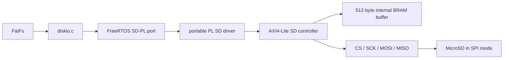

# SD-карта через PL

## 1. Граница подсистемы

Ветка `playground` использует внешний MicroSD SPI-адаптер. Встроенный SD-разъём
AX7020 остаётся отдельным PS MIO-интерфейсом и в этот путь не входит.



FatFs, `fs_shared`, shell, HTTP, SCP/SFTP и `config_store` работают поверх
обычного disk I/O. Путь `sd:/...` сохраняет старый PS SD backend, а внешний
контроллер доступен как `sd-pl:/...`.

## 2. Слои исходников

| Слой | Файл/каталог | Ответственность |
|---|---|---|
| Регистры | `src/hardware/pl/sd/bvstk_sd_regs.h` | offsets и bit masks |
| Common driver | `src/drivers/pl/sd/` | MMIO, timeout, mutex, блоковые операции |
| FreeRTOS port | `src/ports/freertos-xilinx/storage/sd-pl/` | Xilinx MMIO и FreeRTOS mutex |
| FatFs glue | `src/ports/freertos-xilinx/fs-fatfs/diskio.c` | drive `0:` PS SD, `1:` QSPI, `2:` PL SD |
| Application | `src/apps/freertos/storage/sd/`, `src/apps/freertos/storage/sd-pl/` | mount-task и общий FS context |

Драйвер работает секторами по 512 байт. Один вызов FatFs на несколько секторов
разбивается на последовательные операции `CMD17` или `CMD24`; блоковая передача
не требует от FatFs знания внутреннего SPI-протокола.

## 3. AXI-регистры

Регистровое окно контроллера должно быть размещено по адресу `0x43C30000` и
иметь размер `0x10000`. Буфер 512 байт находится внутри этого окна, отдельное
PS BRAM-окно не используется.

| Offset | Регистр | Назначение |
|---:|---|---|
| `0x00` | `CONTROL` | `INIT`, `READ`, `WRITE`, очистка `DONE/ERROR` |
| `0x04` | `STATUS` | `BUSY`, `DONE`, `ERROR`, initialized, SDHC/SDXC, initialization active |
| `0x08` | `BLOCK` | LBA сектора |
| `0x0C` | `DATA` | 32-битное слово буфера, auto-increment |
| `0x10` | `BUFFER_INDEX` | индекс слова `0..127` |
| `0x14` | `CLOCK_DIV` | делитель полупериода SCK |

Для чтения `DATA` AXI-wrapper обязан корректно завершать обычный AXI read после
синхронного ответа native-порта (`host_rvalid_o`). Это важно: PS-драйвер не
должен видеть старое слово буфера.

## 4. Жизненный цикл

`start_sd_card()` создаёт задачу для PS SD, а `start_sd_pl_card()` — отдельную
задачу для PL SD. После запуска планировщика они монтируют соответственно
`0:/` и `2:/`; FatFs вызывает `disk_initialize()` для нужного backend’а.
PS-контроллер использует штатный `XSdPs`, PL-контроллер запускает:

1. 80 тактов с `CS=1` на безопасной частоте;
2. `CMD0`, `CMD8`, `CMD55`/`ACMD41` (HCS + 3.3 V window), `CMD58`;
3. проверку ответа и флага high-capacity;
4. чтение/запись FAT-секторов через `CMD17`/`CMD24`.

Первая версия рассчитана на SDHC/SDXC в SPI mode, включая карту 32 GB. Legacy
SD v1/MMC и аппаратный card-detect не заявляются.

## 5. FPGA-контракт и рабочие параметры

AXI4-Lite wrapper для native-порта `sd_spi_controller` подключён к PL clock
50 MHz, а SPI-сигналы выведены на J10. Регистровое окно содержит только
рабочие регистры контроллера и буфер сектора.

На AX7020 для проверенной связки платы и MicroSD-адаптера драйвер по умолчанию
использует `CLOCK_DIV=50` (примерно 500 кГц). При прежнем `CLOCK_DIV=5` карта
возвращает корректный data-response, но текущий PL-сэмплер иногда пропускает
его; поэтому более высокая частота пока не является рабочим режимом.

Для принудительного форматирования карты в FAT32 через PL-контроллер используется
разрушающая команда shell:

```text
fs format sd-pl confirm
```

Без `confirm` команда не выполняется. После форматирования том доступен через
`sd-pl:/`.

Для внешнего адаптера используется та же распиновка J10, что и у SPI-мастера
из предыдущей ветки `develop`:

| Сигнал SD | J10 | FPGA package pin |
|---|---:|---|
| `MOSI` | 4 | `W18` |
| `MISO` | 6 | `P14` |
| `CS` | 8 | `Y16` |
| `SCK` | 10 | `V15` |
| `VCC` | 40 | `+5 V` на входе проверенного MicroSD-адаптера |
| `GND` | 38 | `GND` |

Адаптер должен сам преобразовывать входное питание в уровни SD 3.3 V; нельзя
подавать 5 V непосредственно на контакты MicroSD-карты. Для другого адаптера
необходимо свериться с его схемой питания.

PL-контракт ещё не возвращает CSD/физическую ёмкость карты. Сейчас размер тома
определяется из существующего FAT boot sector, поэтому форматирование карты,
на которой уже была FAT-разметка, поддерживается. Для полностью пустого носителя
нужно добавить `CMD9` и регистр capacity либо явную геометрию носителя.
