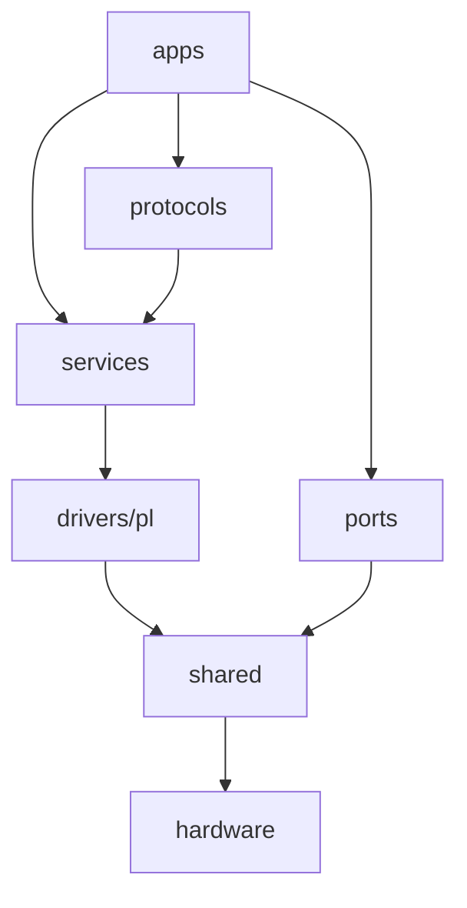
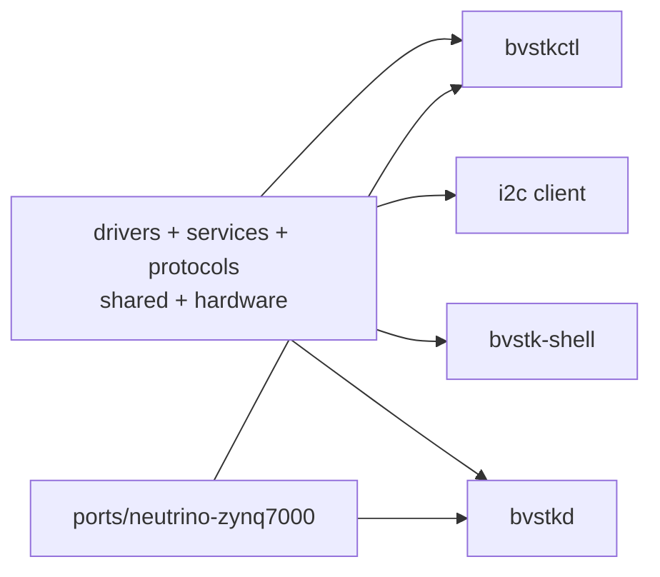

# Структура исходников

Путь к файлу определяет его архитектурную роль. Общие слои содержат алгоритмы
и контракты. Порты связывают эти контракты с ОС и BSP. `apps/` собирает конкретный
образ и владеет порядком запуска.

## 1. Дерево исходников

```text
src/
├── shared/                         common contracts and models
│   ├── base/                       status and parsing helpers
│   ├── config/                     configuration model
│   ├── events/                     event model and sinks
│   ├── interfaces/                 clock, MMIO, sync, IRQ, platform
│   ├── pl/access/                  checked PL region access
│   └── protocols/                  shared protocol models
├── hardware/                       board and PL hardware contract
│   ├── boards/ax7020/               MMIO, BRAM, IRQ and QSPI layout
│   └── pl/                          register maps
├── drivers/pl/                     OS-independent raw PL drivers
│   ├── i2c/                         master and slave transaction cores
│   ├── smi/                         MDIO transaction core
│   └── spi/                         packet/BRAM transfer core
├── services/                       reusable application services
│   ├── control/                     common control facade
│   ├── i2c/                         devices, cache, policy, master/slave
│   └── smi/                         PHY policy, cache and polling API
├── protocols/                      reusable protocol adapters
│   └── dcp2/                        codec and control handler
├── ports/                           OS and BSP integrations
│   ├── freertos-xilinx/             FreeRTOS/Xilinx/FatFs
│   └── neutrino-zynq7000/           Neutrino/POSIX/Zynq
├── apps/                            composition roots
│   ├── freertos/                    ELF, tasks, shell and network services
│   └── neutrino/                    i2c, bvstkctl, bvstkd and bvstk-shell
└── vendor/lwip/                     project-maintained lwIP extensions
```

## 2. Направление зависимостей



| Правило | Обоснование |
|---|---|
| `shared`, `drivers`, `services`, `protocols` не импортируют OS/BSP headers | код собирается обеими ОС |
| `hardware` не зависит от ОС | hardware contract един для FreeRTOS и Neutrino |
| `ports` реализует common interfaces | системные API изолированы в одном месте |
| `ports` не зависит от `apps` | adapter переиспользуется разными composition roots |
| `apps` выбирает реализацию порта и порядок запуска | composition root владеет runtime |
| include начинается от корня `src/` | сборка не зависит от положения исходного файла |
| `../` в include запрещён | архитектурные границы остаются явными |

Проверки выполняет `./build.sh check`, который запускает
`scripts/check_architecture.sh` и host-тесты.

## 3. FreeRTOS source view

`scripts/vitis/build.tcl` создаёт в `vitis_ws/app_bvstk/src` символические ссылки
на следующие корни:

| Корень | Назначение |
|---|---|
| `apps/freertos` | FreeRTOS application и runtime services |
| `drivers` | raw PL drivers |
| `hardware` | board/register contract |
| `ports/freertos-xilinx/board` | проверка hardware export |
| `ports/freertos-xilinx/fs-fatfs` | diskio и FatFs integration |
| `ports/freertos-xilinx/os` | FreeRTOS platform, sync и I²C adapter |
| `ports/freertos-xilinx/storage` | QSPI flash driver |
| `protocols` | DCP2 codec/control |
| `services` | common services |
| `shared` | common models, interfaces and CLI completion |
| `vendor/lwip` | local lwIP extensions |

Linker files `lscript.ld` и `Xilinx.spec` находятся в
`src/ports/freertos-xilinx/linker/` и добавляются в производный source view в
корне приложения.

## 4. Neutrino source list

Neutrino build использует явный массив `COMMON_SOURCES` в
`scripts/neutrino/build.sh`. В него входят common drivers, services, protocols,
hardware map и Neutrino ports. FreeRTOS application, lwIP, FatFs и Xilinx BSP в
этом target отсутствуют.



IRQ-driven фоновые сервисы Neutrino требуют отдельного владельца MMIO —
resource manager или daemon. В проекте `bvstkd` владеет I²C runtime, а `i2c`
и `bvstkctl` используют его через resource-manager node. Process model Neutrino задаёт собственную
оркестрацию; FreeRTOS task model переносится на уровень контрактов, а не на
уровень системных вызовов.

## 5. Карта изменений

| Изменение | Каталог |
|---|---|
| статус, parse, shared model | `src/shared/` |
| регистр PL или board address | `src/hardware/` |
| алгоритм raw transaction | `src/drivers/pl/` |
| устройства, cache или policy | `src/services/` |
| OS synchronization/MMIO/IRQ | `src/ports/<target>/` |
| startup и composition | `src/apps/<target>/` |
| пользовательский транспорт | `src/apps/freertos/services/` |
| shell command | `src/apps/freertos/console/` |
| shared completion | `src/shared/cli/` |
| Neutrino interactive shell | `src/apps/neutrino/shell/` |
| сборочный состав | `scripts/vitis/build.tcl` или `scripts/neutrino/build.sh` |

## 6. Ключевые файлы

| Файл или каталог | Роль |
|---|---|
| `src/apps/freertos/main.c` | FreeRTOS startup |
| `src/apps/freertos/runtime/bvstk_runtime.c` | composition common PL services |
| `src/apps/neutrino/config/` | Neutrino I²C config store and persistence |
| `src/apps/neutrino/runtime/` | process-lifetime Neutrino I²C runtime |
| `src/apps/neutrino/i2c/` | I²C IPC resource manager and clients |
| `src/drivers/pl/i2c/` | raw I²C master/slave |
| `src/services/i2c/` | I²C devices/cache/policy/services |
| `src/ports/freertos-xilinx/os/i2c/` | FreeRTOS I²C ISR/task adapter |
| `src/ports/neutrino-zynq7000/os/i2c/` | Neutrino I²C IRQ-thread adapter |
| `src/hardware/boards/ax7020/` | board map |
| `src/protocols/dcp2/` | portable DCP2 codec/control |
| `tests/host/` | host-level regression tests |
