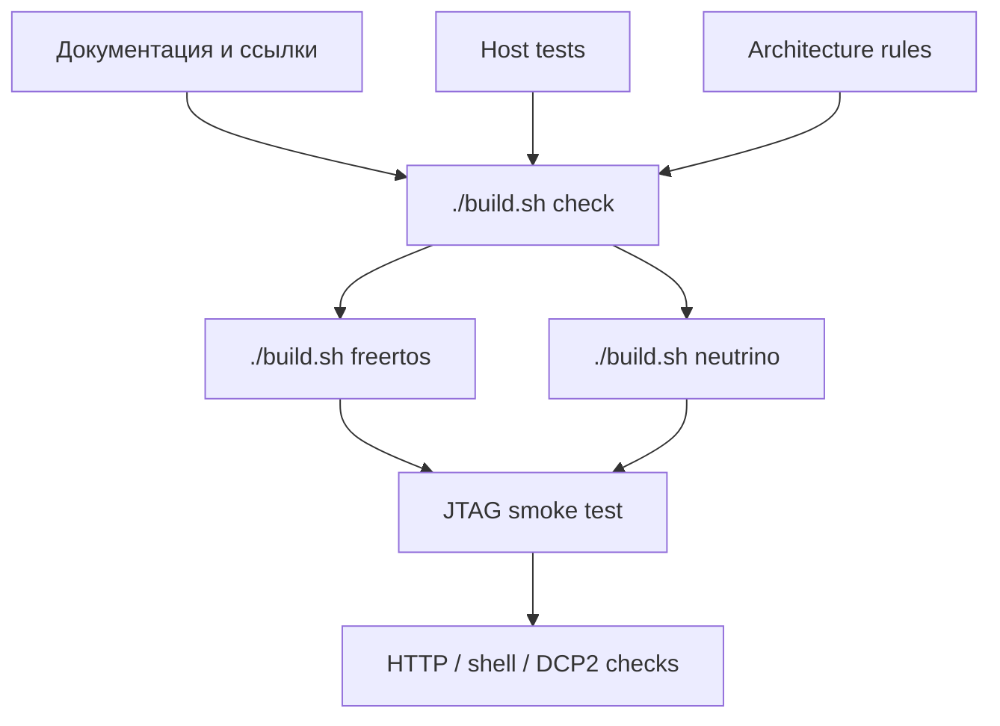

# Проверки и тестирование

## 1. Уровни проверки



| Уровень | Команда | Что проверяет |
|---|---|---|
| host | `./tests/host/run.sh` | общие cores, services, DCP2 codec/control |
| архитектура | `./scripts/check_architecture.sh` | зависимости и target boundaries |
| документы | `./scripts/check_docs.sh` | локальные Markdown-ссылки и stale patterns |
| общий check | `./build.sh check` | host + architecture + docs |
| FreeRTOS | `./build.sh freertos` | Vitis platform, BSP, source view, ELF |
| Neutrino | `./build.sh neutrino` | `bvstkctl` и `bvstkd` |
| IFS | `./build.sh neutrino-image` | mkifs composition |
| runtime | `./run.sh ... jtag` | PL, PS7, image и сетевые сервисы |

## 2. Host-тесты

`tests/host/run.sh` компилирует переносимые модули обычным host compiler. В набор входят:

| Компонента | Примеры проверок |
|---|---|
| PL region map | поиск регионов и границы |
| I2C | core, devices, cache, policy, master/slave services |
| SMI | core и service policy/read/write |
| SPI | core configuration и transfer |
| DCP2 | codec, status mapping, control API |
| shared | parse и status helpers |

Запуск:

```sh
./tests/host/run.sh
```

Скрипт создаёт временный host binary и удаляет его после завершения.

## 3. Архитектурные проверки

```sh
./scripts/check_architecture.sh
```

Проверяются запреты на:

| Проверка | Область |
|---|---|
| OS/BSP headers | `src/shared`, `src/hardware`, `src/drivers`, `src/services`, `src/protocols` |
| application includes в нижних слоях | общие layers и ports |
| cross-target includes | FreeRTOS ↔ Neutrino |
| relative parent includes | весь `src/` |
| `__QNXNTO__` guards | весь `src/` |

При добавлении нового target-specific файла обновляется source list соответствующего build script и проверяется направление зависимости.

## 4. Проверка документации

```sh
./scripts/check_docs.sh
```

Проверка проходит по `README.md`, `docs/**/*.md`, `scripts/**/*.md` и `third_party/**/*.md`, разрешает внешние URL, проверяет локальные файлы и сообщает устаревшие маршруты/API-формулировки.

## 5. FreeRTOS build smoke

```sh
source <Vitis-install>/settings64.sh
./build.sh check
./build.sh freertos
test -x vitis_ws/app_bvstk/Debug/app_bvstk.elf
```

Для SSH-варианта:

```sh
BVSTK_SSH_ENABLE=1 \
BVSTK_SSH_PASSWORD='test-password' \
  ./build.sh freertos
```

Пароль используется только в локальной проверке. В CI он передаётся через secret variable.

## 6. Neutrino build smoke

```sh
source /etc/profile.d/kpda_env_2024.sh
./build.sh neutrino
./build.sh neutrino-image
test -x build/neutrino/bvstkctl
test -x build/neutrino/bvstkd
test -f build/neutrino/ifs-zynq7000-ax7020-bvstk.raw
```

## 7. Runtime smoke по JTAG

FreeRTOS:

```sh
./run.sh freertos jtag
nc <device-ip> 8888
curl -f http://<device-ip>/api/rtos
./scripts/dcp2/monitor_notify.py <device-ip> --port 8889
```

Neutrino:

```sh
./run.sh neutrino jtag
```

Скрипт Neutrino проверяет UART startup signature и затем выполняет `bvstkctl version` и `bvstkctl pl list` по SSH.

## 8. Проверка PL-изменений

После изменения аппаратного контракта выполняется:

1. сборка Vivado и экспорт XSA/bitstream;
2. host-тесты общих cores/services;
3. `./build.sh check`;
4. сборка FreeRTOS и Neutrino;
5. JTAG smoke с `pl list`, `pl probe`, shell/API и DCP2;
6. проверка адресов и IRQ по [аппаратной карте](../reference/hardware-map.md).

## 9. Критерии готовности

Изменение считается проверенным, когда:

| Критерий | Результат |
|---|---|
| host tests | exit code `0` |
| architecture/docs checks | exit code `0` |
| FreeRTOS | ELF собран |
| Neutrino | оба приложения собраны |
| IFS | image собран |
| runtime | сервисы отвечают через предусмотренный интерфейс |
