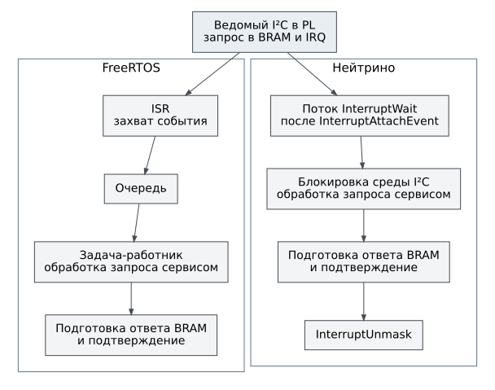

# Драйверы и сервисы I²C

Текущий профиль включает ведущий и ведомый путь PL I²C. Ведущий драйвер
выполняет транзакцию с внешним устройством. Ведомый принимает запросы
внешнего ведущего, передаёт их программному сервису и выдаёт ответ через
BRAM. Кэш и политика связывают эти пути, но чтение кэша само по себе не
создаёт новой транзакции на физической шине.

## Компоненты

| Каталог или тип | Ответственность |
|---|---|
| `drivers/pl/i2c/bvstk_i2c_master.*` | MMIO ведущего, упаковка данных, ожидание и восстановление |
| `drivers/pl/i2c/bvstk_i2c_slave.*` | Регистры ведомого, захват IRQ, входной буфер и окно ответа |
| `services/i2c/bvstk_i2c_devices.*` | Имена, адреса и пределы регистров |
| `services/i2c/bvstk_i2c_cache.*` | Значения и признаки действительности |
| `services/i2c/bvstk_i2c_policy.*` | Разрешение записи пары «регистр, значение» |
| `bvstk_i2c_master_service_t` | Физические операции, кэш, политика, события |
| `bvstk_i2c_slave_service_t` | Указатель регистра, обработка ведомого запроса и подготовка ответа |

Пути в таблице относительны `src/`. Адреса и GIC ID задаёт
[плата](../../reference/board.md), а не каждый сервис независимо.

## Ведущая транзакция

Публичный вызов из
[bvstk_i2c_master.h](../../../src/drivers/pl/i2c/bvstk_i2c_master.h):

```c
bvstk_status_t bvstk_i2c_master_hw_transfer(
    bvstk_i2c_master_hw_t *hardware,
    uint8_t addr_7b,
    const uint8_t *write_data, size_t write_size,
    uint8_t *read_data, size_t read_size,
    uint32_t timeout_ms);
```

Драйвер должен быть инициализирован; переданные буферы принадлежат
вызывающему и сохраняются до возврата. Ненулевая длина требует ненулевого
указателя. Обе длины не могут быть нулевыми. Поддерживаются запись,
чтение и запись с повторным стартом перед чтением.

Поле длины ведущего кадра имеет 21 бит. Чтение дополнительно ограничено
окном результата: `0x1000 - 4 = 4092` байта. Это предел общего драйвера,
не разрешение отправлять такой объём через любую команду или внешний
чип. Адрес вызывающий задаёт в `0..127`; нижний драйвер маскирует старший
бит и не должен использоваться вместо проверки адреса сервисом.

Заголовок ведущего кадра: длина в битах `31..11`, повторный старт в бите 8,
направление чтения в бите 7, адрес в `6..0`. Байты полезных данных
упаковываются в слова FIFO младшим байтом вперёд. Ответ читается из
ведущего окна BRAM со смещения 4 после его заголовка. Это внутренний
контракт PL, не порядок байтов DCP2.

Вызов синхронный и может ждать. Нулевой тайм-аут ожидания готовности
заменяется на 100 мс. Драйвер делает до трёх попыток с программным сбросом
и задержкой восстановления 10 мс. Поэтому `timeout_ms` не равен общему
пределу времени вызова. Повтор аппаратной записи после ошибки также
нельзя автоматически считать безопасным для любого регистра.

Типичные результаты: `NOT_READY` до инициализации, `MALFORMED` для пустой
операции, `RANGE` для буферов/длин, `IO` при отказе MMIO, `TIMEOUT` при
ожидании. Ошибка mutex передаётся вызывающему. После неуспеха содержимое
выходного буфера не следует считать завершённым результатом.

## Сервис, кэш и политика

Сервис хранит ссылки на драйвер, реестр устройств, кэш и политику.
Эти объекты должны жить дольше сервиса. Для тестов можно передать таблицу
`bvstk_i2c_master_io_t` вместо физического драйвера; она выполняет чтение
и запись одного регистра через пользовательский контекст.

`read` выполняет физическую операцию и обновляет кэш при успехе;
`read_cached` возвращает только известное кэшу значение. При запуске
`settings` загружаются в кэш. Признак действительности отличает известный
ноль от отсутствующего значения. Нельзя заполнять неизвестные регистры
нулём и выдавать это как результат чтения устройства.

`write` проверяет регистр и значение, затем правило пары. Белый список
разрешает перечисленные пары, чёрный запрещает их. После успешной записи
обновляются связанные данные и публикуется событие. Приёмник события
работает в контексте вызова: новый обработчик не должен блокироваться
или повторно входить в тот же сервис без анализа блокировок.

Операции перечисления и поиска, `get_config`/`set_config`,
`get_policy`/`set_policy`, `rule_allow`/`rule_deny`/`rule_clear` описаны
объявлениями в [заголовке сервиса](../../../src/services/i2c/bvstk_i2c_master_service.h).
Они не являются автоматическим сохранением файла: сохранение выполняет
целевое приложение. Правила JSON находятся в [справочнике](../../reference/configuration.md).

## Ведомый регистровый контракт

Смещения относительно базы ведомого IP:

| Смещение | Чтение | Запись |
|---:|---|---|
| `0x00` | Состояние ядра | Сброс (бит 0), старт (бит 1), готовность ответа `rd_valid` (бит 2) |
| `0x04` | Зафиксированные признаки IRQ | Сброс IRQ записью бита 0 |
| `0x08` | Заголовок текущего запроса | Не используется как вход данных |
| `0x10`, `0x14`, `0x18`, `0x1C` | Карта адресов | Настройка карты адресов |

IRQ содержит `DATA_VALID` (бит 1), `FINAL_PACKET` (2), `RD_REQUEST` (3),
`ERR_ACK` (4), `MEM_OVERFLOW` (5). Заголовок ведомого буфера —
`num_bytes << 7 | addr_7b`; это не формат ведущего заголовка.
Запрос размещается в BRAM с `0x1000`, ответ — с `0x2000`: первым словом
идёт заголовок, затем данные. Сервис готовит окно чтения до 64 байт.

## IRQ и контекст обработки



Рисунок 2. Аппаратное прерывание не переносит всю логику сервиса в ISR.
Последовательности двух ОС имеют разные механизмы ожидания и синхронизации.

Во FreeRTOS адаптер захватывает событие в ISR и передаёт обработку
работнику. В Нейтрино отдельный поток подключает IRQ через
`InterruptAttachEvent()`, ждёт `InterruptWait()`, обрабатывает запрос
под общей блокировкой среды I²C и затем вызывает `InterruptUnmask()`.
Именно этот портовый код определяет порядок подтверждения и повторного
разрешения; общий драйвер не знает очередей FreeRTOS или потоков ОС.

В `bvstkd` командный IPC, DCP2 и ведомый обработчик используют одну среду
I²C. В FreeRTOS свои экземпляры создаёт `bvstk_runtime`. Отключение
порта IRQ требует остановки обработчика до освобождения сервисов.

Для проверки нужны отдельно ведущая транзакция, ведомый запрос с
подготовкой ответа, отказ политики, выход за границу и восстановление
после тайм-аута. Успешное `i2c list` проверяет модель, но не эти пути.
