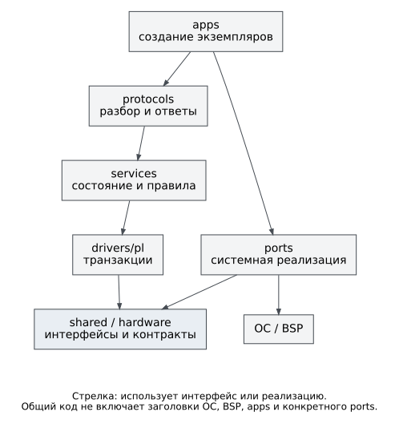

# Карта исходников

Каталог определяет ответственность кода, но не отдельный процесс или
задачу. Общие исходники выбираются при сборке приложения; конкретными
экземплярами и порядком запуска владеет целевая программа.

```text
src/
├── shared/                    модели и интерфейсы общего кода
│   ├── base/                  статусы и разбор значений
│   ├── cli/                   редактор строки и дополнение I²C
│   ├── config/                модель конфигурации и кодек I²C
│   ├── events/                события и приёмники событий
│   ├── interfaces/            MMIO, часы, блокировки, IRQ, вывод
│   ├── pl/access/             доступ по таблице регионов
│   └── protocols/             общие модели протоколов
├── hardware/                  контракт аппаратуры
│   ├── boards/ax7020/         адреса, IRQ, признаки узлов, QSPI
│   └── pl/                    регистровые карты IP
├── drivers/pl/                драйверы I²C, SMI, SPI, SD без ОС
├── services/                  устройства, кэш, политика, FS, управление
├── protocols/dcp2/            кодирование и обработка DCP2
├── ports/                     реализации системной границы
│   ├── freertos-xilinx/       FreeRTOS, BSP, FatFs, линковка
│   └── neutrino-zynq7000/     Нейтрино, MMIO, IPC-смежные адаптеры, носители
├── apps/                      создание и связывание экземпляров
│   ├── freertos/              одно приложение, консоль, сеть, хранение
│   └── neutrino/              программы и менеджер ресурсов I²C
└── vendor/lwip/               поддерживаемые проектом дополнения lwIP
```

## Зависимости

`shared`, `hardware`, `drivers`, `services` и `protocols` не включают
заголовки FreeRTOS, Нейтрино, Xilinx BSP, FatFs и lwIP. Порты реализуют
общие интерфейсы; нижние слои не включают `apps/`. Порт одной ОС не
включает приложение или порт другой. Подключения заголовков начинаются
от корня `src/`, без `../`.



Рисунок 1. Основные направления зависимости. Это схема архитектурных
границ, не полный граф всех `#include`.

Выбор целевого кода выполняется сборочным составом, не разрастанием
условий `__QNXNTO__` внутри общего алгоритма. Эти запреты проверяет
[check_architecture.sh](../../scripts/check_architecture.sh).

## Точки подключения к сборке

Vitis создаёт представление исходников в `vitis_ws/app_bvstk/src` с
выбранными корнями: `apps/freertos`, `drivers`, `hardware`, `protocols`,
`services`, `shared`, `vendor/lwip` и частями `ports/freertos-xilinx`
(`board`, `fs-fatfs`, `os`, `storage`). Файлы линковки из `linker/`
добавляются отдельно. Изменение производной символической ссылки не
заменяет изменения [build.tcl](../../scripts/vitis/build.tcl).

Нейтрино использует явные списки в
[build.sh](../../scripts/neutrino/build.sh). Разные программы получают
разные наборы: командный `i2c` — клиент IPC, `bvstkd` — общую логику и
среду исполнения, менеджеры носителей — свои реализации. Не все общие
модули линкуются в каждую программу.

## Задача и место изменения

| Задача | Основное место |
|---|---|
| Новый адрес, IRQ, признак IP | `src/hardware/boards/ax7020/`, проверки `ports/.../board/` |
| Формат регистра или транзакции | `src/hardware/pl/` и `src/drivers/pl/` |
| Правила записи, кэш, модель устройства | `src/services/i2c/`, `src/services/smi/` |
| Перенос файлового чтения DCP2 | `src/services/fs/`, адаптер файловой системы целевого приложения |
| Формат или обработка DCP2 | `src/protocols/dcp2/`, модель в `src/shared/protocols/dcp2/` |
| FreeRTOS HTTP/TCP/SSH | `src/apps/freertos/services/` |
| Команда FreeRTOS | `src/apps/freertos/console/` |
| Загрузка JSON FreeRTOS | `src/apps/freertos/config/` |
| Запуск общих сервисов FreeRTOS | `src/apps/freertos/runtime/` и `main.c` |
| I²C IPC Нейтрино | `src/apps/neutrino/i2c/` |
| Время жизни и конфигурация Нейтрино | `src/apps/neutrino/runtime/`, `config/`, `bvstkd/` |
| Редактор и дополнение команд | `src/shared/cli/`, `src/apps/neutrino/shell/` |
| Блокировка, часы, MMIO, IRQ | `src/ports/<цель>/os/` |
| Исходные настройки устройства | `configs/` и `tools/codegen/` |
| Состав IFS | `third_party/neutrino/bsp/ax7020/images/` и `scripts/neutrino/` |
| Проверки общего поведения | `tests/host/` |

Наличие старого драйвера в `apps/freertos/drivers/pl/` не делает его
основной переносимой реализацией. Перед изменением найдите фактического
вызывающего и признак включения в текущем профиле.
