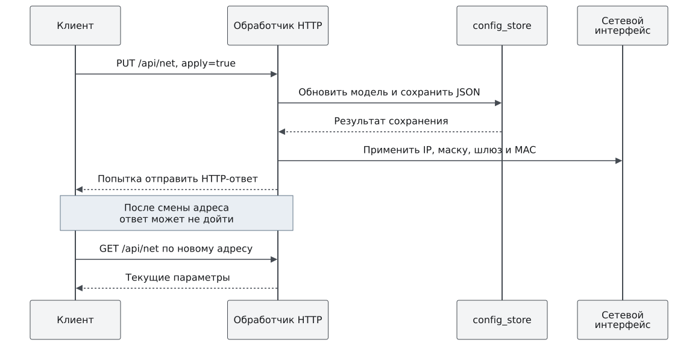

# Сеть

Во FreeRTOS один интерфейс lwIP получает статические параметры из
конфигурации. В штатном IFS Нейтрино адрес интерфейса `xzynq0` задаётся
сценарием загрузки. Это независимые механизмы: изменение FreeRTOS
`network.json` не является настройкой сети Нейтрино.

## Посмотреть действующие и сохранённые параметры

В консоли FreeRTOS:

```text
ip addr show
ip link show
ip route show
cat flash:/config/network.json
```

Первые три команды показывают работающий интерфейс, последняя — файл.
HTTP `GET /api/net` тоже показывает интерфейс, а не сохранённый JSON:

```sh
curl -fsS http://192.168.0.10/api/net
```

В Нейтрино используйте `ifconfig xzynq0` и системные средства просмотра
маршрутов. Постоянные параметры штатного образа меняют в исходном сценарии
IFS и пересобирают образ; временная команда ОС не изменяет IFS на компьютере.

## Изменить адрес FreeRTOS

До изменения подготовьте доступ по UART/JTAG и запишите старый и новый
адреса. Новый адрес должен быть свободен и доступен с компьютера. Команда
консоли изменяет IP и маску и пытается сохранить полный сетевой набор:

```text
ip addr set 192.168.0.20/24
```

Сеанс может оборваться. Следующее подключение выполняйте к новому адресу.
Шлюз и MAC меняются отдельными командами из
[справочника](../reference/console-commands.md#сеть).

Для HTTP передают полный набор полей. Пример сохраняет настройки для
следующего запуска без немедленной смены адреса:

```sh
curl -fsS -X PUT -H 'Content-Type: application/json' \
  --data '{"ip":"192.168.0.20/24","gateway":"192.168.0.1","mac":"00:0a:35:00:01:02","apply":false}' \
  http://192.168.0.10/api/net
```

Проверьте `saved:true`. С `apply:true` обработчик также изменяет работающий
интерфейс; успешное сохранение не является условием применения.



Рисунок 1. Адрес меняется до отправки ответа. Отсутствие ответа не означает
отказ изменения; запрос нельзя безусловно повторять на старый адрес.

После применения подключитесь к новому адресу, прочитайте `/api/net` и
сохранённый файл. `applied:true` описывает действия обработчика с `netif`,
а не подтверждение успешного приёма пакетов или сохранения параметров
аппаратным Ethernet-контроллером. Изменение MAC требует отдельной проверки
реальной связи.

## Если адрес неизвестен

Сначала проверьте журнал UART, кабель и принадлежность компьютера нужной
подсети. Таблица `ip neigh` на компьютере может помочь найти ранее
наблюдавшийся узел, но отсутствие записи не доказывает отсутствие платы.
Сканирование допустимо только в принадлежащей вам тестовой сети.

Не удаляйте конфигурацию и не меняйте случайным образом MAC. При наличии
локального доступа прочитайте действующие параметры и файл, затем внесите
одно проверяемое изменение. Исходные значения перечислены в
[справочнике конфигурации](../reference/configuration.md#сеть-freertos).
