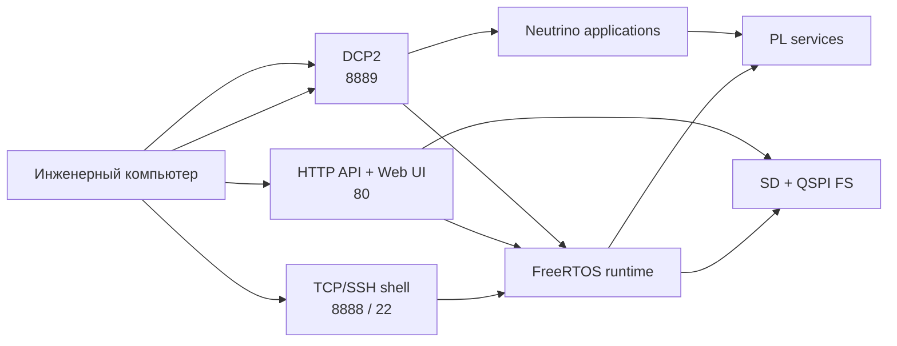

# Быстрые справочники

Документ собирает сведения, которые удобно держать под рукой во время сборки,
запуска и первичной диагностики `bvstk`. Полные контракты вынесены в профильные
справочники.

## 1. Карта внешних интерфейсов



## 2. Сетевые порты

| Назначение | Вариант | Протокол | Порт | Состояние |
|---|---|---|---:|---|
| TCP-консоль | FreeRTOS | TCP | `8888` | active |
| SSH-консоль | FreeRTOS | SSH/TCP | `22` | включается при `BVSTK_SSH_ENABLE=1` |
| DCP2 | FreeRTOS, Neutrino | TCP | `8889` | active |
| HTTP API и Web UI | FreeRTOS | HTTP/TCP | `80` | active |
| системный SSH | Neutrino IFS | SSH/TCP | `22` | active в Neutrino image |

FreeRTOS SSH предоставляет shell через wolfSSH. Neutrino SSH запускает
системный сервис IFS и используется, в частности, для вызова `bvstkctl`.

Подробные команды и поля интерфейсов:

| Интерфейс | Документ |
|---|---|
| TCP/SSH shell | [Команды консоли](console-commands.md) |
| HTTP | [HTTP API](http-api.md), [пользовательский обзор](../user/http.md) |
| DCP2 | [Спецификация](../dcp2.md), [сценарии](../user/dcp2-usage.md) |

## 3. Карта исходников

| Каталог | Ответственность |
|---|---|
| `src/shared/` | модели данных, статусы, события и общие контракты |
| `src/hardware/` | карта платы и регистровые контракты PL |
| `src/drivers/pl/` | переносимое взаимодействие с raw PL cores |
| `src/services/` | устройства, cache, policy и функциональные сервисы |
| `src/protocols/` | wire-format и протокольные адаптеры |
| `src/ports/` | OS/BSP adapters |
| `src/apps/freertos/` | FreeRTOS composition root, shell, HTTP, DCP2 и storage |
| `src/apps/neutrino/` | `i2c`, `bvstkctl`, `bvstkd`, `bvstk-shell` и Neutrino composition roots |
| `configs/` | исходные JSON-файлы конфигурации |
| `scripts/` | сборка, запуск, проверки и диагностические утилиты |
| `web/` | Web UI и средства загрузки статики |
| `tests/host/` | host-тесты переносимой части |

Зависимости между уровнями описаны в [архитектуре](../dev/architecture.md) и
[карте исходников](../dev/source-layout.md).

## 4. Артефакты сборки

| Артефакт | Путь | Назначение |
|---|---|---|
| Vivado export | `artifacts/fpga/design.xsa` | платформа для Vitis и target build |
| Bitstream | `artifacts/fpga/design.bit` | программирование PL |
| FreeRTOS ELF | `vitis_ws/app_bvstk/Debug/app_bvstk.elf` | приложение FreeRTOS |
| Neutrino control utility | `build/neutrino/bvstkctl` | локальное управление PL через SSH |
| Neutrino I²C client | `build/neutrino/i2c` | FreeRTOS-совместимые I²C-команды через `/dev/bvstk-i2c` |
| Neutrino daemon | `build/neutrino/bvstkd` | DCP2 daemon на порту `8889` |
| Neutrino shell | `build/neutrino/bvstk-shell` | интерактивный shell с I²C completion |
| Neutrino IFS | `build/neutrino/ifs-zynq7000-ax7020-bvstk.raw` | загрузочный образ Neutrino |

Команды диспетчера:

```sh
./build.sh check
./build.sh freertos
./build.sh neutrino
./build.sh neutrino-image
./build.sh all
```

JTAG-загрузка выполняется отдельным шагом:

```sh
./run.sh freertos jtag
./run.sh neutrino jtag
```

Полный порядок сборки приведён в [руководстве по сборке](../dev/build.md).

## 5. Минимальная проверка устройства

После запуска FreeRTOS удобно проверить доступность основных поверхностей в
следующем порядке:

```sh
curl -fsS http://<device-ip>/api/version
curl -fsS http://<device-ip>/api/net
curl -fsS http://<device-ip>/api/fs
telnet <device-ip> 8888
```

Для DCP2 доступен монитор событий:

```sh
./scripts/dcp2/monitor_notify.py <device-ip> --port 8889
```

Если требуется проверить файловое содержимое, используйте маршруты
`/flash/...`, `/sd/...` и `/tar/...`, описанные в [HTTP API](http-api.md).

## 6. Источники истины

| Что меняется | Основной источник | Документы, которые следует обновить |
|---|---|---|
| команда shell | `src/apps/*/console/` | [команды консоли](console-commands.md), user-сценарий |
| HTTP route или JSON field | `src/apps/freertos/services/http/` | [HTTP API](http-api.md), [HTTP overview](../user/http.md) |
| DCP2 opcode или payload | `src/protocols/dcp2/`, target server | [DCP2 spec](../dcp2.md), практический пример |
| MMIO, BRAM, IRQ | `src/hardware/`, hardware repository | [карта hardware](hardware-map.md) |
| JSON configuration | `configs/`, config model/store | [configuration reference](configuration.md) |

Проверка ссылок и устаревших форматов выполняется командой
`./scripts/check_docs.sh`, которую запускает `./build.sh check`.
