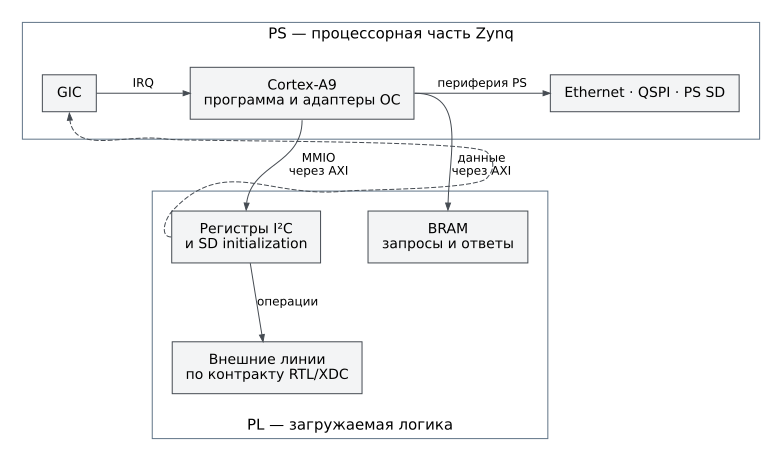

# Плата AX7020 и граница PS/PL

Целевая плата — AX7020 на Zynq-7000. PS включает процессорные ядра и
стандартную периферию; PL загружается проектным bitstream. BSP Нейтрино
содержит унаследованные имена `zedboard`, но они не меняют модель физической
платы и не разрешают использовать её распиновку от ZedBoard.

Рисунок 1. Основные пути управления; пунктир обозначает прерывание от PL
к GIC. Рисунок не является электрической схемой, картой выводов корпуса
или перечнем всех IP Vivado.

## Адресные окна

Адреса физические, размеры и смещения указаны в байтах. Окно имеет
полуоткрытый диапазон `[база, база + размер)`. Имена взяты из
[bvstk_pl_regions.c](../../src/hardware/boards/ax7020/bvstk_pl_regions.c);
значения — из [bvstk_hw_config.h](../../src/hardware/boards/ax7020/bvstk_hw_config.h).

| Имя региона | База | Размер | Состояние текущего профиля |
|---|---:|---:|---|
| `i2c-master` | `0x43C00000` | `0x10000` | Включён |
| `i2c-slave` | `0x43C10000` | `0x10000` | Включён |
| `i2c-bram` | `0x40000000` | `0x3000` | Используемая область I²C |
| `smi-master` | `0x43C20000` | `0x10000` | Константа сохранена, SMI выключен |
| `smi-slave` | `0x43C30000` | `0x10000` | Константа сохранена, SMI выключен |
| `smi-bram` | `0x42000000` | `0x2000` | Константа сохранена, SMI выключен |
| `spi-master` | `0x43C50000` | `0x10000` | Адрес текущего SD-узла; обычный SPI выключен |
| `spi-bram` | `0x44000000` | `0x2000` | Общая память ответов текущего SD-узла |

`BVSTK_SD_CONTROLLER_BASE` равен `BVSTK_SPI_MASTER_BASE`. Отдельного имени
`sd-controller` в таблице регионов нет. `spi-slave` по адресу `0x43C40000`
тоже не входит в текущую программную таблицу. Нельзя добавлять эти окна в
список безопасных диагностических целей по старой схеме.

В I²C BRAM ведущая область начинается с `0x0000`, входной буфер ведомой
стороны — с `0x1000`, область ответа — с `0x2000`. Программа использует
`0x3000` байт; физический AXI-сегмент XSA имеет размер `0x4000`, поскольку
его размер должен быть степенью двойки. Последние `0x1000` байт не относятся
к используемому программой окну.

Старые константы SMI содержат смещение ответа `0x2000`, совпадающее с концом
объявленного окна `0x2000` байт. Это не подтверждённая карта доступного
SMI-буфера. Перед включением SMI необходимо согласовать размер отображения
с RTL; просто изменить признак `HAS_SMI_CORE` недостаточно.

## Прерывания

Это номера прерываний GIC, а не номера выводов корпуса и не индексы битов
одного внешнего регистра.

| Источник | Макрос | GIC ID | Применимость |
|---|---|---:|---|
| I²C master | `BVSTK_IRQ_I2C_MASTER` | `63` | Контракт I²C |
| I²C slave | `BVSTK_IRQ_I2C_SLAVE` | `84` | Используется адаптерами ведомой стороны двух ОС |
| SMI master | `BVSTK_IRQ_SMI_MASTER` | `61` | Сохранённая константа выключенного узла |
| SMI slave | `BVSTK_IRQ_SMI_SLAVE` | `62` | Сохранённая константа выключенного узла |
| SPI master / SD | `BVSTK_IRQ_SPI_MASTER`, `BVSTK_IRQ_SD_CONTROLLER` | `64` | Общая константа; способ ожидания задаёт драйвер |

Наличие номера IRQ не означает, что текущий драйвер подключает обработчик:
драйвер инициализации SD опрашивает регистр состояния.

## Сигналы и ограничения распиновки

Внешний репозиторий аппаратуры содержит файл
`src_vivado/Burevestnik_pins.xdc`. Следующие соответствия прочитаны из него
при сверке документации 11 сентября 2026 года. Это выводы FPGA, **не номера
контактов разъёма**; XDC следует сверять с конкретной ревизией аппаратного
экспорта и схемой платы перед подключением.

| Имя в XDC | Вывод FPGA | Электрический стандарт | Назначение |
|---|---|---|---|
| `m_sda` | `P18` | `LVCMOS33` | SDA ведущего I²C |
| `m_scl` | `Y14` | `LVCMOS33` | SCL ведущего I²C |
| `s_sda` | `W15` | `LVCMOS33` | SDA ведомого I²C |
| `s_scl` | `Y17` | `LVCMOS33` | SCL ведомого I²C |
| `m_MOSI` | `W18` | `LVCMOS33` | Выход данных SPI-видимого узла |
| `m_MISO` | `P14` | `LVCMOS33` | Вход данных SPI-видимого узла |
| `m_CS` | `Y16` | `LVCMOS33` | Выбор устройства |
| `m_sck_o` | `V15` | `LVCMOS33` | Тактовый выход |

Таблица не задаёт разводку внешнего SD-переходника. Номера разъёмов и их
контактов нельзя достоверно восстановить из одного `PACKAGE_PIN`. В BVSTK
нет закреплённой вместе с программным контрактом электрической схемы такого
переходника; для монтажа требуется схема конкретного аппаратного комплекта.
Встроенная подтяжка из XDC не подтверждает пригодность внешней линии по
напряжению и нагрузке.

## Проверка совместимости

FreeRTOS компилирует
[bvstk_hw_validate.c](../../src/ports/freertos-xilinx/board/ax7020/bvstk_hw_validate.c),
который сопоставляет контракт с Vitis `xparameters.h`. Нейтрино компилирует
константы напрямую и не импортирует XSA в `build.sh`. Для обоих вариантов
нужен совместимый набор `design.bit`, `design.xsa`, `ps7_init.tcl` и программы.
Порядок получения и фиксации набора описан в [аппаратной сборке](../build/fpga.md).

Форматы регистров относятся к конкретным драйверам:
[I²C](../development/drivers/i2c.md), [SMI](../development/drivers/smi.md),
[SPI](../development/drivers/spi.md), [SD](../development/drivers/sd.md).
