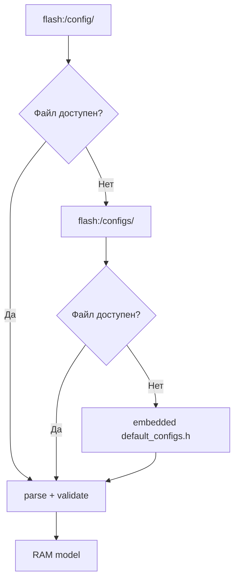
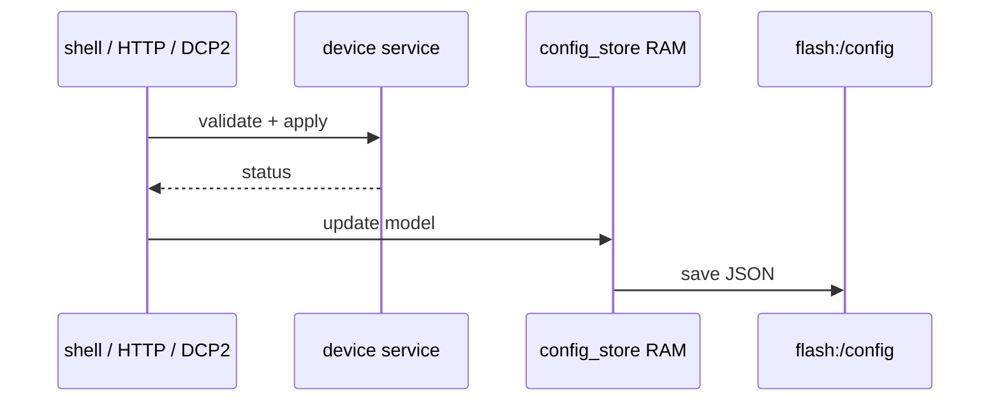

# Справочник конфигурации

## 1. Источники и приоритет

FreeRTOS `config_store` использует источники в следующем порядке:



| Источник | Каталог | Роль |
|---|---|---|
| primary | `flash:/config/` | актуальное persistent-хранилище |
| legacy | `flash:/configs/` | совместимость и миграция |
| defaults | `src/apps/freertos/config/default_configs.h` | fallback, сгенерированный из `configs/` |
| source | `configs/` | версия конфигурации в репозитории |

Изменения в `configs/` попадают в firmware после запуска `tools/codegen/gen_default_configs.py` в составе Vitis build.

## 2. Файлы

| Файл | Модель |
|---|---|
| `network.json` | `flash:/config/network.json` |
| `i2c/<device>.json` | `i2c_device_config_t` |
| `smi/<device>.json` | `smi_phy_config_t` |

## 3. Сеть

```json
{
  "ipv4": {
    "ip": "192.168.0.10",
    "netmask": "255.255.255.0",
    "gateway": "192.168.0.1"
  },
  "mac": "00:0a:35:00:01:02"
}
```

| Поле | Обязательность | Ограничение |
|---|---|---|
| `ipv4.ip` | требуется для полного конфига | IPv4 dotted decimal |
| `ipv4.netmask` | требуется | IPv4 dotted decimal |
| `ipv4.gateway` | требуется | IPv4 dotted decimal |
| `mac` | требуется | шесть hex-октетов |

## 4. I2C device

```json
{
  "name": "axp15060",
  "addr_7b": 54,
  "reg_count": 74,
  "max_value_code": 64,
  "policy": "whitelist",
  "whitelist": [
    { "reg": 19, "val": 16 },
    { "reg": 19, "val": 17 }
  ],
  "blacklist": [],
  "settings": []
}
```

| Поле | Тип | Назначение |
|---|---|---|
| `name` | string | идентификатор устройства |
| `file_name` | string | имя persistent-файла, для runtime-модели |
| `addr_7b` | integer | 7-битный I2C address `0..127` |
| `reg_count` | integer | число доступных регистров, максимум `256` |
| `max_value_code` | integer | верхняя граница значения записи |
| `policy` | `whitelist`/`blacklist` | активный режим записи |
| `whitelist` | `{reg,val}[]` | разрешённые пары |
| `blacklist` | `{reg,val}[]` | запрещённые пары |
| `settings` | `{reg,val}[]` | значения persistence |

I2C policy проверяет регистр и значение одновременно. Поля `autopoll_*` в I2C JSON отсутствуют.

## 5. SMI PHY

```json
{
  "name": "lan8720",
  "phy_addr": 1,
  "reg_count": 32,
  "policy": "whitelist",
  "autopoll_enabled": true,
  "autopoll_reg_delay_ms": 0,
  "autopoll_cycle_delay_ms": 1000,
  "autopoll_regs": [0, 1, 4, 5, 17, 31],
  "write_allow_regs": [0, 4, 18, 30, 31],
  "write_deny_regs": [],
  "settings": []
}
```

| Поле | Тип | Назначение |
|---|---|---|
| `phy_addr` | integer | PHY address `0..31` |
| `reg_count` | integer | число регистров `1..32` |
| `policy` | enum | режим write policy |
| `autopoll_enabled` | boolean | флаг periodic poll |
| `autopoll_regs` | integer[] | регистры для poll |
| `autopoll_reg_delay_ms` | integer | задержка между регистрами |
| `autopoll_cycle_delay_ms` | integer | задержка между циклами |
| `write_allow_regs` | integer[] | разрешённые регистры |
| `write_deny_regs` | integer[] | запрещённые регистры |
| `settings` | `{reg,val}[]` | значения persistence |

SMI policy проверяет номер регистра. Autopoll-конфигурация применяется вызывающим runtime-кодом, который планирует `bvstk_smi_service_poll()`.

## 6. Валидация

| Группа | Проверки |
|---|---|
| I2C address | `0..0x7F` |
| I2C register | меньше `reg_count` |
| I2C value | не больше `max_value_code` |
| SMI PHY/register | оба диапазона `0..31` |
| policy | известное значение enum |
| arrays | размер в пределах `*_MAX` |
| file name | допустимое имя конфигурационного файла |

Невалидный JSON исключается из активной модели; затем выбирается следующий источник согласно приоритету.

## 7. Применение и сохранение



Операцию следует считать сохранённой после проверки `saved` в HTTP-ответе или после чтения файла через shell. Для I2C запись регистра через DCP2 синхронизирует settings; HTTP diagnostic write обновляет runtime-модель без отдельного `save`.

## 8. Диагностика

```text
ls flash:/config
ls flash:/config/i2c
ls flash:/config/smi
cat flash:/config/i2c/axp15060.json
cat flash:/config/smi/lan8720.json
```

Если runtime использует defaults, сравните primary и legacy каталоги с source-файлами в `configs/`, затем пересоберите FreeRTOS для обновления embedded header.
