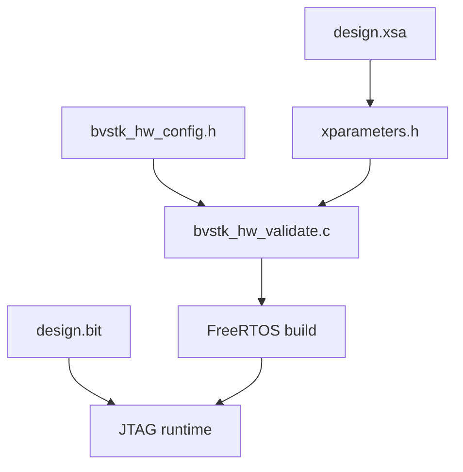

# Аппаратная карта AX7020

## 1. Источник контракта

Программная карта платы находится в:

```text
src/hardware/boards/ax7020/bvstk_hw_config.h
src/hardware/boards/ax7020/bvstk_pl_regions.h
src/hardware/boards/ax7020/bvstk_pl_regions.c
```

FreeRTOS сверяет значения с Vitis `xparameters.h` через `bvstk_hw_validate.c`. Neutrino компилирует общие константы напрямую.

## 2. MMIO-регионы

| Регион | Base address | Size | Тип |
|---|---:|---:|---|
| `i2c-master` | `0x43C00000` | `0x10000` | control |
| `i2c-slave` | `0x43C10000` | `0x10000` | control |
| `smi-master` | `0x43C20000` | `0x10000` | control |
| `smi-slave` | `0x43C30000` | `0x10000` | control |
| `spi-slave` | `0x43C40000` | `0x10000` | control |
| `spi-master` / `sd-controller` | `0x43C50000` | `0x10000` | control + data window |
| `i2c-bram` | `0x40000000` | `0x3000`* | BRAM |
| `smi-bram` | `0x42000000` | `0x2000` | BRAM |
| `spi-bram` | `0x44000000` | `0x2000` | BRAM |

Регионы доступны по именам в `bvstkctl pl list`, PL service и DCP2 MEM policy.

## 3. IRQ

| Источник | Macro | GIC ID |
|---|---|---:|
| SMI master | `BVSTK_IRQ_SMI_MASTER` | `61` |
| SMI slave | `BVSTK_IRQ_SMI_SLAVE` | `62` |
| I2C master | `BVSTK_IRQ_I2C_MASTER` | `63` |
| I2C slave | `BVSTK_IRQ_I2C_SLAVE` | `84` |
| SPI master / SD controller | `BVSTK_IRQ_SPI_MASTER`, `BVSTK_IRQ_SD_CONTROLLER` | `64` |

I2C slave IRQ получают FreeRTOS adapter `src/ports/freertos-xilinx/os/i2c/` и
Neutrino adapter `src/ports/neutrino-zynq7000/os/i2c/`. Остальные cores
выполняют операции через общий MMIO/sync слой; конкретный IRQ flow определяется
целевой интеграцией.

## 4. BRAM layout

### I2C

| Макрос | Offset | Назначение |
|---|---:|---|
| `BVSTK_I2C_BRAM_MASTER_OFFSET` | `0x0000` | master transaction buffer |
| `BVSTK_I2C_BRAM_SLAVE_WR_OFFSET` | `0x1000` | slave write mailbox |
| `BVSTK_I2C_BRAM_SLAVE_RD_OFFSET` | `0x2000` | slave read mailbox |

`*` The slave read window starts at `0x2000`, so the PS uses the first `0x3000`
bytes of the I2C BRAM. Vivado requires AXI memory segments to have a
power-of-two size; therefore the generated XSA maps this BRAM as `0x4000`
bytes, with the final `0x1000` bytes reserved.

### SMI

| Макрос | Offset | Назначение |
|---|---:|---|
| `BVSTK_SMI_MASTER_WR_OFFSET` | `0x0000` | master command |
| `BVSTK_SMI_SLAVE_WR_OFFSET` | `0x1000` | slave write mailbox |
| `BVSTK_SMI_SLAVE_RD_OFFSET` | `0x2000` | slave read mailbox |

### SPI

SPI BRAM имеет размер `0x2000`; offsets control-регистров и packet fields находятся в `src/hardware/pl/spi/bvstk_spi_regs.h`.

## 5. Проверка платформы



```sh
./build.sh check
./build.sh freertos
./build.sh neutrino
```

При изменении адресов, размеров, IRQ или BRAM offsets требуется обновление XSA, bitstream, board contract, OS adapters и соответствующих тестов.
