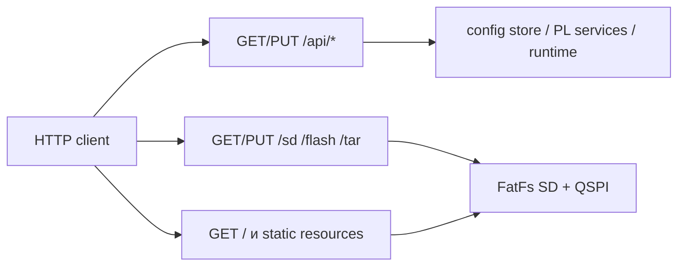

# HTTP API

## 1. Общие правила

HTTP-сервер FreeRTOS слушает порт `80` и поддерживает методы GET и PUT. JSON-ответы используют `Content-Type: application/json; charset=utf-8`; файловые операции передают бинарное содержимое.



Для PUT требуется `Content-Length` или chunked transfer. Маршруты используют `PUT`; формы `POST` относятся к старым описаниям и текущему серверу не соответствуют.

## 2. Справочная таблица маршрутов

| Метод | Маршрут | Назначение |
|---|---|---|
| GET | `/api/version` | build date/time и HTTP port |
| GET | `/api/rtos` | uptime, tick rate и heap |
| GET | `/api/net` | текущее состояние eth0 |
| PUT | `/api/net` | сохранить и применить network config |
| GET | `/api/fs` | готовность и размеры томов |
| GET | `/api/qspi` | готовность и QSPI FS window |
| GET | `/api/i2c` | список I2C устройств |
| GET | `/api/i2c?name=<device>` | конфигурация выбранного I2C устройства |
| PUT | `/api/i2c` | policy и rules выбранного устройства |
| PUT | `/api/diag/i2c/read` | чтение I2C-регистра |
| PUT | `/api/diag/i2c/write` | запись I2C-регистра |
| PUT | `/api/diag/smi/read` | чтение SMI-регистра |
| PUT | `/api/diag/smi/write` | запись SMI-регистра |
| PUT | `/api/diag/mem/read` | диагностическое MMIO-чтение |
| PUT | `/api/diag/mem/write` | диагностическое MMIO-письмо с confirm |
| PUT | `/api/reboot` | reboot с confirm |
| GET/PUT | `/sd/<path>` | файл SD |
| GET/PUT | `/flash/<path>` | файл QSPI |
| GET/PUT | `/tar/sd/<dir>` | tar stream SD |
| GET/PUT | `/tar/flash/<dir>` | tar stream QSPI |
| GET | `/<path>` | static file из `flash:/www/` |

## 3. GET API

### 3.1. Состояние системы

```sh
curl -sS http://<device-ip>/api/version
curl -sS http://<device-ip>/api/rtos
curl -sS http://<device-ip>/api/net
curl -sS http://<device-ip>/api/fs
curl -sS http://<device-ip>/api/qspi
```

Поля:

| Маршрут | Основные поля |
|---|---|
| `/api/version` | `build_date`, `build_time`, `http_port` |
| `/api/rtos` | `uptime_ms`, `tick_rate_hz`, `heap_free`, `heap_min_ever` |
| `/api/net` | `ip`, `netmask`, `gateway`, `mac`, `mode`, `dhcp`, `up`, `link_up` |
| `/api/fs` | `volumes[]` с `name`, `ready`, `total_bytes`, `free_bytes` |
| `/api/qspi` | `ready`, `fs_base_bytes`, `fs_size_bytes` |

### 3.2. I2C

```sh
curl -sS http://<device-ip>/api/i2c
curl -sS 'http://<device-ip>/api/i2c?name=axp15060'
```

Список возвращает `ready`, `count`, `devices[]`. Элемент устройства содержит `name`, `addr_7b`, `file_name`, `policy`, длины `settings`, `whitelist` и `blacklist`. Запрос с `name` дополнительно возвращает пары правил.

## 4. Сетевой PUT

`PUT /api/net` принимает полный набор сетевых полей:

```sh
curl -X PUT \
  -H 'Content-Type: application/json' \
  --data '{"ip":"192.168.0.20/24","gateway":"192.168.0.1","mac":"00:0a:35:00:01:02","apply":true}' \
  http://<device-ip>/api/net
```

| Поле | Формат |
|---|---|
| `ip` | `a.b.c.d/prefix` или `a.b.c.d` |
| `netmask` | требуется при IP без prefix |
| `prefix` | числовая альтернатива `netmask` |
| `gateway` | IPv4 |
| `mac` | шесть hex-октетов |
| `apply` | boolean, по умолчанию `true` |

Успешный ответ содержит `ok`, `saved`, `applied`. Смена IP может завершить TCP-соединение сразу после ответа.

## 5. I2C PUT

### 5.1. Изменение policy

```sh
curl -X PUT \
  -H 'Content-Type: application/json' \
  --data '{"name":"axp15060","policy":"whitelist","whitelist":[{"reg":16,"val":1}],"blacklist":[]}' \
  http://<device-ip>/api/i2c
```

`name` обязателен. Поля `policy`, `whitelist` и `blacklist` применяются, если присутствуют. Успешный ответ содержит `ok` и `saved`.

### 5.2. Диагностическое чтение и запись

```sh
curl -X PUT -H 'Content-Type: application/json' \
  --data '{"name":"axp15060","reg":16}' \
  http://<device-ip>/api/diag/i2c/read

curl -X PUT -H 'Content-Type: application/json' \
  --data '{"name":"axp15060","reg":16,"val":1}' \
  http://<device-ip>/api/diag/i2c/write
```

Вместо `name` можно передать `addr_7b`. Ответ чтения содержит `ok`, `name`, `reg`, `val`; запись возвращает `{"ok":true}`. Запись проходит через I2C policy.

## 6. SMI PUT

```sh
curl -X PUT -H 'Content-Type: application/json' \
  --data '{"phy":1,"reg":1}' \
  http://<device-ip>/api/diag/smi/read

curl -X PUT -H 'Content-Type: application/json' \
  --data '{"phy":1,"reg":0,"val":4608}' \
  http://<device-ip>/api/diag/smi/write
```

`phy` и `reg` находятся в диапазоне `0..31`, `val` — `0..65535`. Запись проверяется SMI policy. Результат чтения содержит `ok` и `val`.

## 7. MMIO и reboot

Чтение:

```sh
curl -X PUT -H 'Content-Type: application/json' \
  --data '{"addr":1136656384}' \
  http://<device-ip>/api/diag/mem/read
```

Выровненный адрес читается как 32-битный, невыровненный — как 8-битный. Запись требует явного подтверждения:

```sh
curl -X PUT -H 'Content-Type: application/json' \
  --data '{"addr":1136656384,"val":1,"confirm":true}' \
  http://<device-ip>/api/diag/mem/write
```

```sh
curl -X PUT -H 'Content-Type: application/json' \
  --data '{"confirm":true,"delay_ms":1000}' \
  http://<device-ip>/api/reboot
```

MMIO write относится к опасным инженерным операциям. Адрес проверяется по аппаратной документации перед запросом.

## 8. Файловые маршруты

```sh
curl -f http://<device-ip>/flash/config/network.json
curl --upload-file ./network.json \
  http://<device-ip>/flash/config/network.json
curl -f http://<device-ip>/tar/flash/config
curl -T config.tar http://<device-ip>/tar/flash/config
```

| URL | FatFs путь |
|---|---|
| `/sd/x` | `0:/x` |
| `/flash/x` | `1:/x` |
| `/tar/sd/x` | tar каталога `0:/x` |
| `/tar/flash/x` | tar каталога `1:/x` |
| `/css/app.css` | `flash:/www/css/app.css` |

URL-декодирование поддерживается. Сегменты `..` и двоеточия в пользовательском пути отклоняются.

## 9. HTTP status codes

| HTTP | Типичная причина |
|---:|---|
| `200` | операция выполнена |
| `400` | пустой или malformed JSON, confirm отсутствует |
| `403` | запись отклонена policy |
| `404` | неизвестный API, устройство или файл |
| `405` | метод отсутствует в маршруте |
| `411` | отсутствует Content-Length/chunked |
| `503` | config store или сервис ещё не готов |

Протокол HTTP использует текстовое тело для ошибок и JSON для успешных API-ответов. Для полного набора status-кодов см. [справочник status](status-codes.md).
