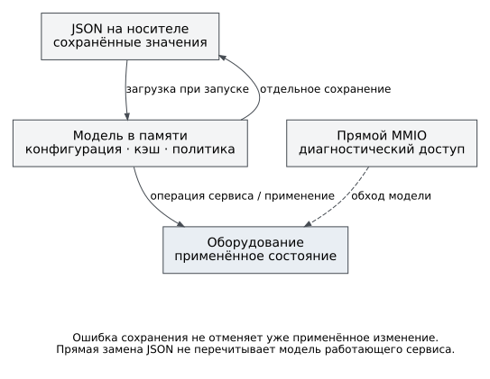

# Жизненный цикл конфигурации

У конфигурации есть три состояния: файл на носителе, модель в памяти и
состояние оборудования. Они связаны, но не совпадают автоматически.
Загрузка нового JSON не означает его немедленного применения, а выполненная
запись регистра не гарантирует успешное сохранение файла.

Рисунок 4. Применение и сохранение могут завершиться независимо. Ответ
конкретного интерфейса определяет, какие этапы он подтверждает.

## Загрузка

Во FreeRTOS задача `config_store` ожидает QSPI, подготавливает каталог
`flash:/config/`, переносит доступные старые конфигурации из
`flash:/configs/` и использует встроенные JSON при отсутствии пригодных
данных. Исходные JSON для встроенного набора находятся в `configs/`
репозитория; генератор включается в сборку программы.

Выбор набора устройств выполняется на уровне загрузчика каталога. Не следует
представлять его как универсальное правило «для каждого ошибочного файла
найти одноимённый файл во всех источниках»: загрузчик пропускает непригодные
файлы, а переход к встроенному набору зависит от числа загруженных устройств.
Часть ранее сохранённых файлов может сосуществовать с файлами, созданными
из встроенного набора. Проверять нужно фактический список устройств.

В Нейтрино хранилищем I²C владеет `bvstkd`. Основной каталог —
`/flash/config/i2c`, старый — `/flash/configs/i2c`; при отсутствии пригодного
набора используются встроенные I²C-конфигурации. Конфигурация сети этого
образа задаётся сценарием IFS, а не FreeRTOS-файлом `network.json`.

После публикации готовности службы работают со структурами в памяти.
Файл не перечитывается перед каждой транзакцией. Прямая замена JSON через
файловый интерфейс не является командой перезагрузки модели; для проверки
нового начального состояния нужен контролируемый перезапуск.

## Изменение через сервис

Команды I²C передают изменение сервису, который проверяет диапазон и
политику записи. Успешная операция может обновить кэш и `settings`, после
чего целевой обработчик синхронизирует модель и сохраняет её. Нельзя
считать все интерфейсы одной транзакцией: обработчики различаются.

| Операция | Что проверить после ответа |
|---|---|
| Консольная запись I²C или изменение правил | Результат команды, предупреждение сохранения, затем конфигурационный файл |
| HTTP `PUT /api/i2c` | `ok` и отдельно `saved`; при ошибке сохранения изменение уже может быть применено |
| HTTP диагностическая запись I²C | Успех записи; этот ответ не подтверждает отдельное сохранение JSON |
| DCP2-запись I²C в Нейтрино | Статус операции и файл: ошибка последующего сохранения выводится в журнал `bvstkd`, но не меняет уже сформированный статус |
| Прямая файловая загрузка JSON | Полноту файла; работающие сервисы не обязаны увидеть замену без перезапуска |

HTTP-изменение сети сначала обновляет модель и пытается сохранить файл,
затем, если запрошено применение, меняет сетевой интерфейс. Ответ отправляется
после этого. При смене адреса он может не дойти до клиента; отсутствие ответа
не доказывает, что настройка осталась прежней. Процедура проверки приведена
в [главе о сети](../operations/network.md).

## Сохранение и восстановление

Сохранение означает запись в основной каталог. Встроенные данные в ELF
от этого не меняются. Обновление `configs/` в репозитории тоже не заменяет
автоматически уже сохранённую конфигурацию устройства.

Перед заменой набора сделайте резервную копию и проверьте её содержимое.
После изменения сравните модель (`i2c list`, `i2c <имя> info`, правила) с
файлом, а затем повторите проверку после перезапуска. Если значения
разошлись, выясните, какой этап не завершился: загрузка, применение или
сохранение. Не удаляйте оба каталога как первый способ диагностики.

Поля, пределы массивов и особенности парсера собраны в
[справочнике конфигурации](../reference/configuration.md).
