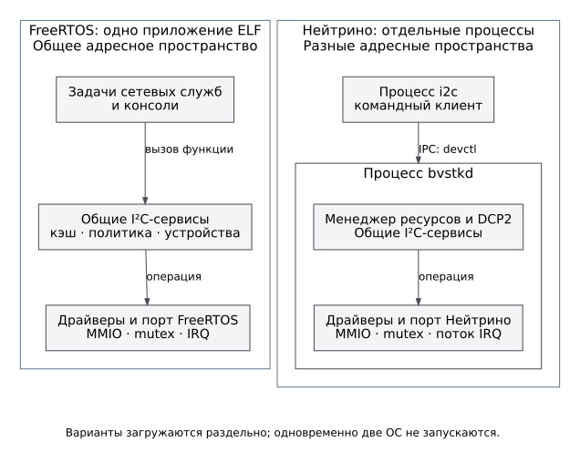

# Исполнение и запуск

FreeRTOS и Нейтрино используют общую логику I²C, но по-разному создают её
экземпляры и организуют доступ к ним. На рисунке показаны границы исполнения,
а не зависимости каталогов исходников.

Рисунок 1. Альтернативные модели исполнения BVSTK. Стрелка IPC пересекает
границу процессов; вызовы внутри приложения FreeRTOS такой границы не имеют.

## FreeRTOS

Точка входа [main.c](../../src/apps/freertos/main.c) создаёт задачи хранения,
загрузки конфигурации, сети и внешних служб, затем запускает планировщик.
Драйверы, сервисы и обработчики протоколов находятся в одном ELF и общем
адресном пространстве. Задача не является изолированным процессом: ошибка
указателя или прямой доступ к неподходящему MMIO может остановить всё устройство.

Последовательность вызовов `start_*()` — порядок создания задач, а не
подтверждение готовности служб. После старта планировщика они работают
конкурентно. Файловый слой публикует готовность томов, хранилище конфигурации
загружает модель, а зависимые службы ожидают собственные условия запуска.

Однократная задача в
[bvstk_runtime.c](../../src/apps/freertos/runtime/bvstk_runtime.c) ожидает
`config_store` до 10 секунд. После готовности она создаёт I²C-сервисы и,
если включён соответствующий признак платы, SMI-сервисы. Затем задача
удаляется. Экземпляры сервисов имеют статическое время жизни и продолжают
работать без неё. Истечение ожидания не запускает бесконечную повторную
инициализацию: при отказе проверяют журнал и готовность зависимостей.

Для I²C готовность ведущего сервиса и ведомой стороны различается. Ведомая
сторона создаётся при наличии устройства в конфигурации; её адрес берётся
из первого устройства. Обработчик IRQ и задача обслуживания ведомого
запроса подключаются отдельно. Доступность TCP-порта не подтверждает
готовность этого пути.

## Нейтрино

Нейтрино предоставляет процессы с отдельными адресными пространствами,
потоки и обмен сообщениями. Микроядро и менеджер процессов входят в модуль
`procnto`; BVSTK работает поверх ОС, а не заменяет его. Это описание
соответствует руководству «ЗОСРВ „Нейтрино“ 2024», разделу «Микроядро:
менеджер процессов» (физическая страница 697 локального комплекта).

В образ включаются шесть программ BVSTK:

| Программа | Ответственность |
|---|---|
| `bvstkd` | Модель I²C, сервисы, обработка ведомых IRQ, `/dev/bvstk-i2c` и DCP2 |
| `i2c` | Командный клиент менеджера I²C |
| `bvstkctl` | Клиент I²C и отдельные диагностические операции PL |
| `bvstk-shell` | Интерактивная оболочка с редактором строки и дополнением I²C-команд |
| `bvstk-qspi-fat` | Доступ к выделенному окну QSPI для файлового стека ОС |
| `bvstk-sd-raw` | Доступ к PS SD и представление FAT-раздела файловому стеку ОС |

`bvstkd` сначала инициализирует платформу и I²C, затем присоединяет менеджер
ресурсов по пути `/dev/bvstk-i2c`, после чего создаёт слушающий сокет DCP2.
Команда `i2c` открывает этот путь и передаёт запрос через `devctl()`.
Независимо от числа командных клиентов состоянием I²C владеет один процесс.

Текущий цикл DCP2 в `bvstkd` обслуживает одно принятое соединение до его
закрытия, затем принимает следующее. Значение очереди `listen()` не означает
параллельное обслуживание нескольких DCP2-клиентов. Менеджер ресурсов при
этом является другим входом в тот же процесс; доступ к состоянию
сериализуется блокировкой среды I²C.

## Как проверять готовность

Проверка должна соответствовать нужной функции. Ответ `PING` подтверждает
обмен DCP2, но не наличие тома. Появление `/dev/bvstk-i2c` подтверждает
регистрацию менеджера, но не успешность транзакции с внешним устройством.
Для файлов проверяют том и конкретный путь, для I²C — список устройств и
безопасное чтение известного регистра.

JTAG-сценарий Нейтрино ищет в UART признаки начала загрузки. Такой тест не
проверяет все процессы и носители. Последующие проверки приведены в
[первом подключении](../operations/README.md) и [диагностике](../operations/diagnostics.md).
