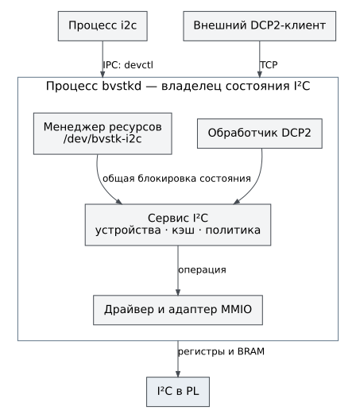

# Интерфейсы и владение состоянием

Внешний интерфейс разбирает запрос и формирует ответ. Сервис устройства
проверяет допустимость операции и обращается к драйверу. Драйвер знает
регистровый контракт PL; адаптер платформы выполняет доступ к памяти,
синхронизацию и ожидание. Эти роли не следует объединять: проверка
синтаксиса протокола не заменяет политику записи устройства.

## Путь запроса I²C

В FreeRTOS консоль, HTTP и DCP2 вызывают общие сервисы внутри одного
приложения. В Нейтрино командный клиент передаёт запрос менеджеру ресурсов.
DCP2-обработчик находится в самом `bvstkd` и не делает дополнительный
сетевой запрос к командному клиенту.

Рисунок 2. Один владелец состояния I²C обслуживает командные и сетевые запросы.
Файловый путь устройства является точкой IPC, а не файлом с содержимым регистров.

Сервис объединяет описание устройства, кэш регистров, правила записи и
ведущий драйвер. Для I²C правило относится к паре «регистр, значение».
Ведомая сторона PL получает запрос внешнего ведущего через BRAM и IRQ,
а затем использует связанные с устройством кэш и политику. Подробности
двух направлений обмена находятся в [главе I²C](../development/drivers/i2c.md).

## Владение и конкурентный доступ

| Состояние | Владелец | Условие доступа |
|---|---|---|
| Описание устройств и сохранённые настройки | Хранилище конфигурации выбранной ОС | После завершения загрузки модели |
| Кэш, политика и незавершённая I²C-операция | Экземпляр I²C-сервисов | Через сервис и его синхронизацию |
| Дескриптор чтения DCP2 FS | Сеанс DCP2 в FreeRTOS | Только в создавшем его соединении |
| Файловый том FreeRTOS | Контекст тома и файловый слой | После монтирования, под блокировкой тома |
| Отображение физического MMIO в Нейтрино | Процесс, создавший отображение | В пределах его отображения и времени жизни |

Возвращённый указатель на общую модель не превращает её в копию. Новому
обработчику нельзя сохранять его для произвольного изменения в обход
сервиса. Требования к времени жизни и блокировкам описаны в
[контрактах переноса](../development/ports.md).

## Диагностический обход сервисов

Команды доступа к памяти и `bvstkctl pl` работают ниже политики устройства.
Они могут изменить регистры без согласованного обновления кэша и файла
конфигурации. Поэтому успешная запись MMIO не равнозначна успешной
операции I²C-сервиса. Особенно опасен одновременный доступ к одному IP
из диагностической команды и работающей службы.

Разрешённые адреса зависят от интерфейса: HTTP использует список включённых
окон платы, DCP2 в текущем FreeRTOS допускает сырой доступ к 32-битному
адресному пространству, Нейтрино ограничивает PL-доступ своими регионами.
Наличие имени в таблице регионов не подтверждает наличие IP в bitstream.

## Уведомления

В FreeRTOS события управления передаются подписчикам DCP2 через `NOTIFY`.
Попытка, отказ и выполненная запись — разные события; клиент не должен
считать сам факт попытки подтверждением изменения. Потоковые тестовые
источники I²C/SMI/SPI/UART служат проверке передачи данных и не подтверждают
работу физических шин. Порядок запуска клиента приведён в
[практике DCP2](../operations/dcp2.md), формат — только в
[спецификации](../dcp2/dcp2.md).
