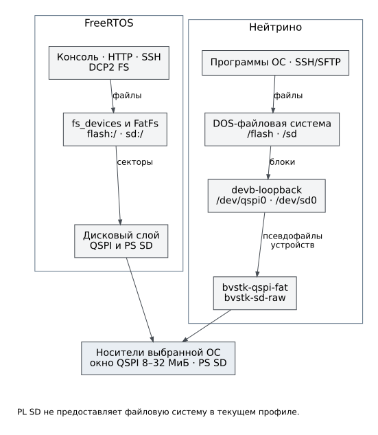

# Хранение данных

BVSTK использует QSPI для постоянной конфигурации и статических файлов
интерфейса, PS SD — для файлов на съёмном носителе. PL SD в текущем профиле
умеет выполнять инициализацию карты, но не предоставляет файловую систему.
Ни имя драйвера в исходниках, ни успешная инициализация карты не означают
готовность тома `sd-pl:/`.

Рисунок 3. Один носитель обслуживается файловым стеком выбранной ОС.
FreeRTOS и Нейтрино не монтируют его одновременно.

## FreeRTOS

`fs_devices` сопоставляет имена томов контекстам FatFs. `flash:/` обозначает
QSPI-том `1:/`, `sd:/` — PS SD `0:/`. Контекст содержит корень, состояние
готовности и блокировку. Консоль, HTTP, SSH/SCP и DCP2 FS пользуются этим
файловым слоем; это разные способы доступа к тем же данным.

QSPI не целиком является файловым томом. В программном контракте под FAT
выделено окно от 8 МиБ до 32 МиБ, то есть 24 МиБ. Нижняя область не входит
в `flash:/`. Самотестирование QSPI и монтирование файловой системы — разные
операции. Перед действиями с сырыми адресами обязательно сверяют границы.

Отказ монтирования одного носителя не следует считать отказом всех сетевых
служб. Проверяют готовность нужного тома, например через DCP2 `--fs-info`
или HTTP `/api/fs`. Нулевой размер при ошибке получения статистики не
доказывает, что носитель физически пуст.

## Нейтрино

В штатном IFS используется следующий путь доступа:

- QSPI: `bvstk-qspi-fat` → `/dev/bvstk-qspi-fat` → `devb-loopback` → `/dev/qspi0` → DOS-файловая система → `/flash`.
- PS SD: `bvstk-sd-raw` → `/dev/bvstk-sd-fat` → `devb-loopback` → `/dev/sd0` → DOS-файловая система → `/sd`.

Это описание относится к проектному
[файлу состава IFS](../../third_party/neutrino/bsp/ax7020/images/zynq7000-ax7020-ssh.build).
Схема с `devb-sdmmc` из других BSP не описывает текущую сборку BVSTK.
Псевдофайл `bvstk-sd-fat` представляет выбранную FAT-область карты; он не
означает второй физический носитель.

Основные пути ОС — `/flash` и `/sd`. Образ также создаёт совместимые имена
с двоеточием. В новых командах Нейтрино используйте POSIX-пути, чтобы не
переносить особенности консоли FreeRTOS в системные утилиты ОС.

## Целостность и копирование

Дерево файлов не снимается атомарно. Перечисление имён, TAR и последующее
чтение файла могут наблюдать разные состояния, если параллельно выполняется
запись. Блокировка отдельной файловой операции не является блокировкой
всего резервного копирования. На время копирования конфигурации нужно
остановить её изменение через другие интерфейсы.

HTTP-загрузка файла пишет непосредственно в целевой файл с усечением;
сбой передачи может оставить неполные данные. DCP2 FS в текущем варианте
предоставляет только чтение. Его готовый клиент умеет заменить локальный
результат после успешного завершения чтения, но это не делает исходное
дерево снимком и не меняет поведение HTTP-записи.

Команды копирования и проверки результата находятся в
[работе с файлами](../operations/files.md). Формат конфигурации описан
отдельно от устройства файлового слоя — в [справочнике JSON](../reference/configuration.md).
