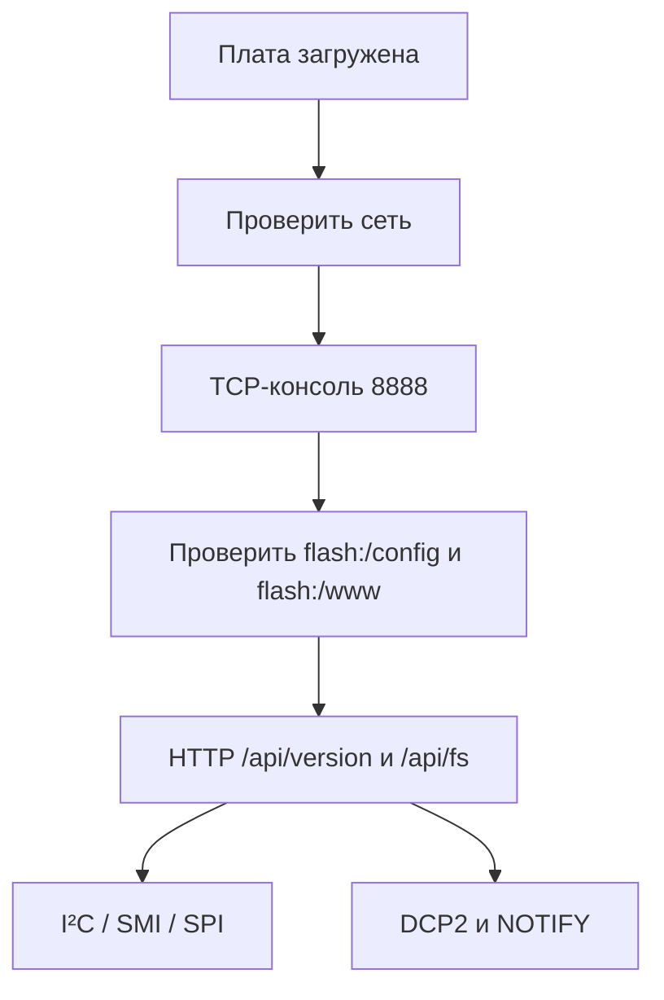

# Пользовательская документация

Начните с [Руководства пользователя](guide.md). Оно ведёт от загрузки платы к
первой проверке сети, файловых систем и интерфейсов управления.

| Задача | Документ |
|---|---|
| изменить сетевые параметры | [network.md](network.md) |
| работать с файлами | [filesystems.md](filesystems.md) |
| выполнить команду | [tcp-console.md](tcp-console.md) |
| отправить HTTP-запрос | [http.md](http.md) |
| подключить DCP2-клиент | [dcp2-usage.md](dcp2-usage.md) |
| обновить Web UI | [web-ui.md](web-ui.md) |
| диагностировать отказ | [troubleshooting.md](troubleshooting.md) |
