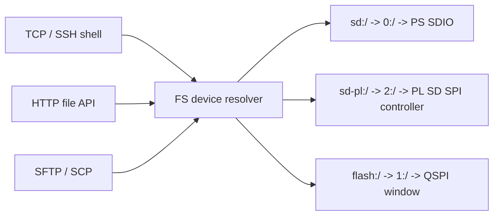

# Файловые системы

## 1. Три тома

FreeRTOS-маршрутизатор файлов поддерживает PS SD, PL SD и QSPI FatFs.

| Псевдоним | FatFs root | Роль |
|---|---|---|
| `sd:/` | `0:/` | встроенный PS SD-разъём |
| `flash:/` | `1:/` | конфигурация и web-ресурсы |
| `sd-pl:/` | `2:/` | внешний MicroSD SPI-адаптер через PL |



## 2. Каталоги проекта на устройстве

| Путь | Содержимое |
|---|---|
| `flash:/config/network.json` | сетевые параметры |
| `flash:/config/i2c/` | конфигурации I2C-устройств |
| `flash:/config/smi/` | конфигурации SMI PHY |
| `flash:/www/` | web UI и статические файлы |
| `sd:/` | пользовательские и обменные файлы на PS SD |
| `sd-pl:/` | пользовательские и обменные файлы на внешней PL SD |

Основной каталог конфигурации — `flash:/config/`. Legacy-каталог `flash:/configs/` поддерживается миграцией при старте `config_store`.

## 3. QSPI-разметка

QSPI NOR имеет размер `32 MiB`. FatFs получает окно:

| Параметр | Значение |
|---|---:|
| начало flash filesystem | `8 MiB` |
| размер окна | `24 MiB` |
| сектор стирания | `0x1000` |

Первые 8 MiB резервируются под boot-область. Параметры определены в `src/hardware/boards/ax7020/bvstk_qspi_layout.h` и могут быть изменены только вместе с boot layout.

## 4. Готовность и форматирование

После старта PS SD, PL SD и QSPI монтируются отдельными задачами. Сеть может отвечать раньше, чем тома станут готовы; перед файловой операцией проверяйте результат `ls` или API `/api/fs`.

Для текущего PL SD backend нужна уже существующая FAT-разметка: физическая
геометрия носителя ещё не читается из CSD, поэтому автоматическое `f_mkfs` для
пустой карты пока не включено. Перед подключением носителя с данными всё равно
подготовьте резервную копию; поддержку форматирования добавим вместе с
`CMD9`/capacity-регистром в PL.

## 5. Shell-команды

Команда `fs` выводит справку. Файловые операции доступны на верхнем уровне command dispatcher:

| Команда | Назначение |
|---|---|
| `pwd` | текущий каталог |
| `ls [path]` | содержимое каталога |
| `cd <path>` | перейти в каталог |
| `mkdir <path>` | создать каталог |
| `touch <path>` | создать пустой файл |
| `cat <path>` | вывести файл |
| `rm <path>` | удалить файл или пустой каталог |
| `rm -r <path>` | удалить каталог рекурсивно |
| `cp <src> <dst>` | копировать файл |
| `cp -r <src> <dst>` | копировать каталог |
| `mv <src> <dst>` | переместить или переименовать |

Примеры:

```text
cd flash
ls /config
cat /config/network.json
cp flash:/config/network.json sd:/backup/network.json
cp -r sd:/prepared-config flash:/config
cd sd-pl
ls 2:/
cp sd:/backup/network.json sd-pl:/backup/network.json
```

Путь с `sd:/`, `sd-pl:/` или `flash:/` выбирает том явно. Относительные пути разрешаются относительно текущего каталога сессии.

## 6. HTTP file API

HTTP использует префиксы `/sd`, `/flash` и `/tar`. Подробные методы и коды приведены в [справочнике HTTP API](../reference/http-api.md).

Примеры:

```sh
curl -O http://<device-ip>/flash/config/network.json
curl --upload-file ./network.json http://<device-ip>/flash/config/network.json
curl -O http://<device-ip>/sd/backup.bin
```

Web UI раздаётся из `flash:/www/`; каталог `/` HTTP-сервера обычно обслуживает этот набор статических ресурсов.

## 7. SCP и SFTP

При включённом FreeRTOS SSH доступны виртуальные пути:

```sh
scp ./network.json root@<device-ip>:/flash:/config/network.json
scp -r ./www root@<device-ip>:/flash:/
sftp root@<device-ip>
```

Для классического SCP используется `-O`. `/sd` и `/sd:/` выбирают PS SD, `/sd-pl` и `/sd-pl:/` — PL SD, `/flash` и `/flash:/` — QSPI.

## 8. Диагностика файлового слоя

| Симптом | Проверка |
|---|---|
| `FS not ready` | дождаться mount-задач и повторить операцию |
| пустой каталог | проверить правильный том и наличие FAT-разметки |
| конфиг отсутствует | проверить `flash:/config/` и legacy `flash:/configs/` |
| web UI не обновился | проверить `flash:/www/` и cache браузера |
| копирование завершилось ошибкой | проверить путь, существование каталога и свободное место |
| запись QSPI не сохраняется | проверить mount, разметку и журналы QSPI |

При подозрении на повреждение данных сначала снимите копию доступных файлов на SD, затем выполняйте операции восстановления.
