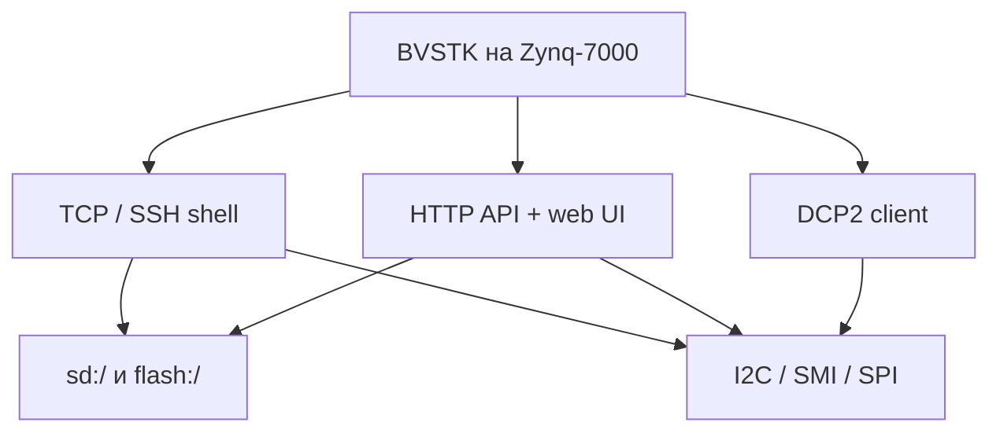
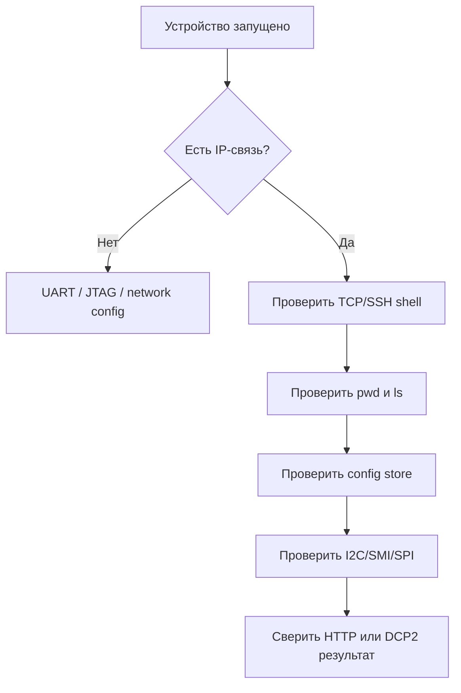

# Руководство пользователя

## 1. Что доступно после запуска

FreeRTOS-вариант BVSTK представляет собой сетевое устройство управления Zynq/PL.

| Интерфейс | Порт | Основное назначение |
|---|---:|---|
| TCP-консоль | `8888` | ручные команды и диагностика |
| SSH | `22` | аутентифицированная инженерная консоль при включённой опции сборки |
| HTTP | `80` | JSON API, файловые маршруты и web UI |
| DCP2 | `8889` | бинарный протокол для host-клиентов |

Файловые тома доступны как `sd:/` и `flash:/`. Конфигурация и web-ресурсы обычно находятся на `flash:/`.



## 2. Первый запуск

После загрузки образа проверьте доступность устройства по сети. По умолчанию используется адрес `192.168.0.10`; сохранённый сетевой JSON-конфиг может задать другой адрес.

```sh
nc 192.168.0.10 8888
```

В консоли выполните:

```text
help
ip addr show
pwd
ls
i2c list
```

Сборка с SSH:

```sh
ssh root@192.168.0.10
```

Первичная HTTP-проверка:

```sh
curl -sS http://192.168.0.10/api/net
curl -sS http://192.168.0.10/api/rtos
curl -sS http://192.168.0.10/api/i2c
```

## 3. Выбор интерфейса

| Задача | Предпочтительный интерфейс |
|---|---|
| быстро проверить состояние платы | TCP или SSH shell |
| выполнить серию повторяемых JSON-запросов | HTTP API |
| передать файл или каталог | shell `cp`, HTTP file API, SCP/SFTP |
| интегрировать host-приложение | DCP2 |
| прочитать PL-регион на Neutrino | `bvstkctl` |

TCP и SSH используют общий command dispatcher. HTTP и DCP2 обращаются к тем же сервисам через свои adapters.

## 4. Файлы и конфигурация

Основные каталоги:

| Путь | Содержимое |
|---|---|
| `flash:/config/network.json` | сетевые параметры |
| `flash:/config/i2c/*.json` | устройства I2C, policy и settings |
| `flash:/config/smi/*.json` | PHY SMI, policy, settings и autopoll |
| `flash:/www/` | статические web-ресурсы |
| `sd:/` | обменные и пользовательские файлы |

Пример проверки:

```text
cd flash
ls /config
cat /config/network.json
ls /www
```

Автоформатирование при `FR_NO_FILESYSTEM` может создать новую FAT-разметку и удалить прежнее содержимое тома. Перед первым запуском на носителе с данными подготовьте резервную копию.

## 5. Работа с PL

I2C предоставляет операции устройств, cache и policy. SMI работает с PHY-регистрами и поддерживает отдельную модель autopoll. SPI предоставляет transfer/runtime configuration. Полные команды приведены в [справочнике консоли](../reference/console-commands.md), HTTP-маршруты — в [HTTP API](../reference/http-api.md).

Примеры I2C:

```text
i2c list
i2c axp15060 info
i2c axp15060 r 0x10
i2c axp15060 w 0x10 0x01
i2c axp15060 policy show
```

При записи I2C применяется policy для пары `(register, value)`. SMI policy проверяет номер регистра; ограничения и форматы конфигурации приведены в [конфигурации](../reference/configuration.md).

## 6. Изменение сети

```text
ip addr show
ip addr set 192.168.0.20/24
ip route set default via 192.168.0.1
```

После смены адреса текущая сессия может завершиться. Переподключение выполняется по новому IP. Persistent-результат проверяется в `flash:/config/network.json` или через `GET /api/net`.

## 7. DCP2

DCP2 предназначен для программных клиентов, которым нужны фиксированный бинарный формат, status-коды, read/write-операции и notify-события. Формат кадра и service IDs описаны в [спецификации DCP2](../dcp2.md).

Мониторинг notify:

```sh
./scripts/dcp2/monitor_notify.py 192.168.0.10 --port 8889
```

## 8. Порядок диагностики



Подробный маршрут отказов собран в [диагностике](troubleshooting.md).

## 9. Ограничения интерфейса

TCP-консоль и HTTP API предназначены для доверенной сети. Диагностические записи MMIO, PL-регистров и policy могут изменить состояние оборудования. Перед записью сверяйте адрес, значение, device/PHY и действующую конфигурацию.
