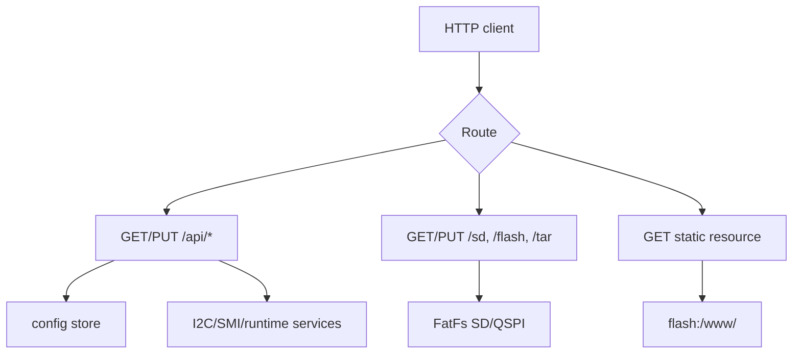

# HTTP-сервер

HTTP-сервер FreeRTOS предоставляет четыре практических поверхности: состояние
системы, изменение конфигурации, инженерную диагностику и передачу файлов.
Web UI загружается из `flash:/www/` через тот же сервер.

## 1. Модель запросов



Сервер слушает порт `80`, обслуживает один запрос на TCP-соединение и закрывает
соединение после ответа. Для `PUT` клиент передаёт `Content-Length` либо
использует chunked transfer. Полный список маршрутов и полей находится в
[HTTP API reference](../reference/http-api.md).

## 2. Быстрая проверка

```sh
curl -fsS http://<device-ip>/api/version
curl -fsS http://<device-ip>/api/net
curl -fsS http://<device-ip>/api/fs
curl -fsS http://<device-ip>/api/i2c
```

Эти запросы показывают версию сборки, состояние сети, готовность файловых
томов и загруженную конфигурацию I2C.

## 3. Рабочие сценарии

| Задача | Запрос |
|---|---|
| состояние runtime | `GET /api/rtos` |
| сетевые параметры | `GET /api/net` |
| список I2C-устройств | `GET /api/i2c` |
| конфигурация устройства | `GET /api/i2c?name=axp15060` |
| изменение I2C policy | `PUT /api/i2c` |
| чтение I2C-регистра | `PUT /api/diag/i2c/read` |
| диагностика SMI | `PUT /api/diag/smi/read` или `/write` |
| передача одного файла | `GET/PUT /flash/<path>` или `/sd/<path>` |
| передача дерева файлов | `GET/PUT /tar/flash/<dir>` или `/tar/sd/<dir>` |
| открытие Web UI | `GET /` |

### 3.1. Чтение и изменение I2C

```sh
curl -X PUT -H 'Content-Type: application/json' \
  --data '{"name":"axp15060","reg":16}' \
  http://<device-ip>/api/diag/i2c/read

curl -X PUT -H 'Content-Type: application/json' \
  --data '{"name":"axp15060","policy":"whitelist","whitelist":[{"reg":16,"val":1}]}' \
  http://<device-ip>/api/i2c
```

I2C policy хранит пары `(reg, value)`. При записи сервис проверяет пару по
активному режиму устройства. Формат JSON-конфигурации и правила применения
описаны в [configuration reference](../reference/configuration.md).

### 3.2. Передача файлов

```sh
curl -f http://<device-ip>/flash/config/network.json
curl --upload-file ./network.json \
  http://<device-ip>/flash/config/network.json

curl -T web.tar http://<device-ip>/tar/flash/www
```

Обычный `PUT` записывает файл в существующий каталог. Tar-маршрут подходит для
загрузки Web UI и комплектов конфигурации.

## 4. Диагностические операции

Маршруты `/api/diag/*` обращаются к живым шинам или MMIO и требуют проверки
адресов и регистров по аппаратному контракту. Запись в MMIO и перезагрузка
требуют поля `confirm:true`.

В стандартном FreeRTOS runtime common SMI core и service инициализируются после
загрузки конфигурации. HTTP-обработчики SMI используют совместимый FreeRTOS
diagnostic path; shell и DCP2 обращаются к common SMI service напрямую.

Пример чтения SMI-регистра:

```sh
curl -X PUT -H 'Content-Type: application/json' \
  --data '{"phy":1,"reg":1}' \
  http://<device-ip>/api/diag/smi/read
```

## 5. Ответы и диагностика ошибок

Успешные API-операции возвращают JSON. Ошибки маршрутизации, разбора тела и
доступа к устройству возвращаются текстом с HTTP status code. Наиболее частые
коды:

| Код | Причина |
|---:|---|
| `400` | некорректный JSON или отсутствует обязательное подтверждение |
| `403` | запись отклонена policy |
| `404` | неизвестный маршрут, файл или устройство |
| `405` | метод не поддерживается маршрутом |
| `411` | отсутствует длина тела или chunked framing |
| `503` | runtime или config store ещё не готовы |

При проблемах сначала проверьте `/api/version`, `/api/net` и `/api/fs`, затем
переходите к узкому маршруту. Полные поля, примеры и ограничения приведены в
[справочнике HTTP API](../reference/http-api.md).
