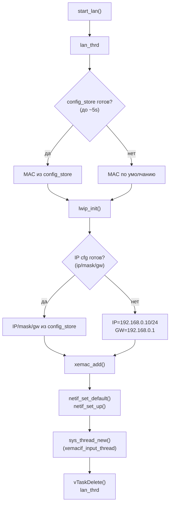

# Сеть (lwIP)

Подробное описание сетевой подсистемы, настройки IP/MAC и восстановления доступа после сетевых изменений.


### Инициализация интерфейса

Инициализация сетевого интерфейса выполняется в `src/bvstk_lan/bvstk_lan.c` и запускается из `main()` через `start_lan()`.

Поток `lan_thrd` делает следующее:



1) **Подхватывает MAC из конфигурации (если успела загрузиться)**  
`lan_thread()` ждёт готовность `config_store` до ~5 секунд и, если в конфиге задан MAC, копирует его в глобальный `mac_ethernet_address[]`.

2) **Поднимает lwIP**  
Вызывается `lwip_init()`.

3) **Настраивает IPv4 адресацию**  
Если `config_store` готов и есть `ip/netmask/gateway`, они применяются. Иначе используются дефолты:
- IP: `192.168.0.10`
- mask: `255.255.255.0`
- gw: `192.168.0.1`

4) **Создаёт netif на PS Ethernet (GEM)**  
Вызов `xemac_add(..., XPAR_XEMACPS_0_BASEADDR)` добавляет интерфейс, после чего делается:
- `netif_set_default(netif)`
- `netif_set_up(netif)`

5) **Запускает input‑поток драйвера**  
Создаётся `xemacif_input_thread` (через `sys_thread_new("xemacif_input_thread", ...)`) для приёма/обработки входящих пакетов.

После успешной инициализации `lan_thrd` завершает работу (`vTaskDelete(NULL)`).

### Настройка IP/MAC и сохранение

Параметры сети хранятся в `config_store` (и сохраняются в `flash:/config/network.json`) и могут применяться:
- **в рантайме** (на текущий `netif`) — чтобы изменения вступили сразу;
- **персистентно** — чтобы применялись после перезагрузки.

Доступные способы изменения:

**1) TCP‑консоль: команда `ip`**

Показать текущие значения:
```
ip addr show
ip link show
ip route show
```

Задать IP/маску (CIDR) и применить сразу:
```
ip addr set 192.168.0.10/24
```

Задать default gateway и применить сразу:
```
ip route set default via 192.168.0.1
```

Задать MAC и применить сразу:
```
ip link set address 00:0a:35:00:01:02
```

Сохранить *текущие* runtime‑параметры `netif` в `flash:/config/network.json` (без изменения адресов):
```
ip save
```

Как это реализовано:
- Парсинг и команды — `src/bvstk_tcp_server/utils/ip_shell.c`
- Сохранение — `config_store_save_network()` (`src/config/config_store.c`)
- Runtime‑применение — `netif_set_ipaddr/netif_set_netmask/netif_set_gw` + обновление `mac_ethernet_address` и `netif->hwaddr` (если доступно)

**2) HTTP API: `PUT /api/net`**

Эндпоинт принимает JSON и может (опционально) применить конфиг сразу.

Пример (применить сразу):
```sh
curl -X PUT http://<device-ip>/api/net \
  -H 'Content-Type: application/json' \
  --data '{"ip":"192.168.0.10/24","gateway":"192.168.0.1","mac":"00:0a:35:00:01:02","apply":true}'
```

Пример (только сохранить, не применять):
```sh
curl -X PUT http://<device-ip>/api/net \
  -H 'Content-Type: application/json' \
  --data '{"ip":"192.168.0.10/24","gateway":"192.168.0.1","mac":"00:0a:35:00:01:02","apply":false}'
```

Замечания по формату:
- `ip` можно задавать как `"a.b.c.d/prefix"`, либо `"ip"+"netmask"` (или `"prefix"` числом).
- `gateway` и `mac` обязательны для `PUT /api/net`.
- Реализация: `api_handle_net_put()` в `src/http_fs/http_fs_routes.c`.

**3) Файловый способ (через `flash:/config/network.json`)**

Если удобнее управлять конфигом как файлом, можно заменить `flash:/config/network.json` через файловый API:
- `PUT /flash/config/network.json` (запись файла на QSPI)

Важно: замена файла сама по себе не гарантирует немедленное применение в рантайме — для “живого” применения используйте `ip ... set` или `PUT /api/net` с `"apply":true`.

**Поведение при смене IP**
- Любое runtime‑применение IP может разорвать текущие TCP/HTTP соединения — это нормально; переподключайтесь к новому адресу.

### Смена IP и восстановление доступа

Смена IP выполняется “на лету” (в рантайме) и почти всегда приводит к потере текущих соединений (TCP‑консоль и/или HTTP), потому что удалённая сторона продолжает слать пакеты на старый адрес.

**Как сменить IP**

Через TCP‑консоль:
```
ip addr set 192.168.0.20/24
ip route set default via 192.168.0.1
ip link set address 00:0a:35:00:01:02
ip save
```

Через HTTP (с немедленным применением):
```sh
curl -X PUT http://<old-ip>/api/net \
  -H 'Content-Type: application/json' \
  --data '{"ip":"192.168.0.20/24","gateway":"192.168.0.1","mac":"00:0a:35:00:01:02","apply":true}'
```

**Как восстановить доступ**
1. Подключитесь к **новому адресу**:
   - `telnet 192.168.0.20 8888`
   - `curl http://192.168.0.20/api/net`
2. Если вы потеряли адрес устройства:
   - проверьте таблицу ARP на ПК (по MAC): `ip neigh` / `arp -a`
   - используйте сканирование подсети (например, `nmap -sn 192.168.0.0/24`) и затем проверьте порт `8888` или `80`.
3. Если устройство перестало отвечать после смены параметров:
   - верните конфиг через JTAG‑старт и TCP‑консоль,
   - либо замените `flash:/config/network.json` на корректный файл (через SD или HTTP‑файловый API, если доступен).

**Примечания**
- Изменения, записанные через `ip save` или `PUT /api/net` (saved), применятся и после перезагрузки.
- Если `config_store`/QSPI недоступны, устройство может стартовать с дефолтным IP (см. раздел про инициализацию интерфейса).
