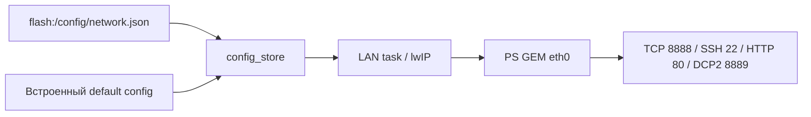
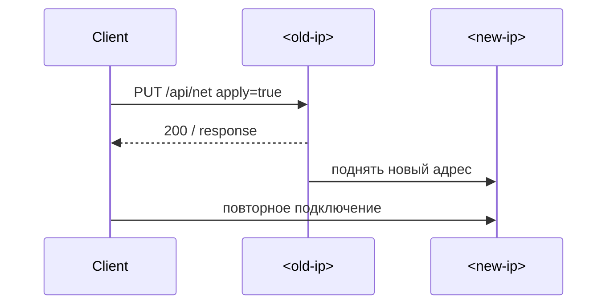

# Сеть

## 1. Модель сети

FreeRTOS использует Ethernet MAC PS GEM и один интерфейс `eth0`. Адресация статическая: конфигурация загружается из `flash:/config/network.json`, а при отсутствии пригодного файла используются встроенные значения.


```mermaid
flowchart LR
    Config[flash:/config/network.json] --> Store[config_store]
    Defaults[Встроенный default config] --> Store
    Store --> LAN[LAN task / lwIP]
    LAN --> ETH[PS GEM eth0]
    ETH --> Services[TCP 8888 / SSH 22 / HTTP 80 / DCP2 8889]
```

Текущие значения по умолчанию:

| Параметр | Значение |
|---|---|
| IP | `192.168.0.10` |
| netmask | `255.255.255.0` |
| gateway | `192.168.0.1` |
| MAC | `00:0a:35:00:01:02` |

## 2. Формат конфигурации

Файл `flash:/config/network.json` имеет следующий формат:

```json
{
  "ipv4": {
    "ip": "192.168.0.10",
    "netmask": "255.255.255.0",
    "gateway": "192.168.0.1"
  },
  "mac": "00:0a:35:00:01:02"
}
```

| Поле | Формат | Назначение |
|---|---|---|
| `ipv4.ip` | dotted decimal | адрес интерфейса |
| `ipv4.netmask` | dotted decimal | маска подсети |
| `ipv4.gateway` | dotted decimal | default gateway |
| `mac` | `xx:xx:xx:xx:xx:xx` | MAC-адрес |

DHCP-клиент в текущем startup path отсутствует. Адрес получается из config store или defaults.

## 3. Проверка текущего состояния

Shell-команды показывают параметры живого `netif`:

```text
ip addr show
ip link show
ip route show
```

HTTP предоставляет текущее состояние интерфейса:

```sh
curl -sS http://<device-ip>/api/net
```

Сохранённый JSON можно посмотреть через shell:

```text
cd flash
cat /config/network.json
```

## 4. Изменение через shell

| Команда | Действие |
|---|---|
| `ip addr set <IPv4>/<prefix>` | меняет IP и маску, применяет и сохраняет |
| `ip route set default via <IPv4>` | меняет gateway, применяет и сохраняет |
| `ip link set address <MAC>` | меняет MAC, применяет и сохраняет |
| `ip save` | сохраняет текущее runtime-состояние |

Пример:

```text
ip addr set 192.168.0.20/24
ip route set default via 192.168.0.1
ip link set address 00:0a:35:00:01:02
```

Команды `set` записывают полный сетевой набор в `flash:/config/network.json`, сохраняя отсутствующие поля из текущего config store или `netif`.

## 5. Изменение через HTTP

Маршрут `PUT /api/net` принимает JSON с сетевыми полями и флагом `apply`.

```sh
curl -X PUT \
  -H 'Content-Type: application/json' \
  --data '{"ip":"192.168.0.20/24","gateway":"192.168.0.1","mac":"00:0a:35:00:01:02","apply":true}' \
  http://<old-ip>/api/net
```

| Поле запроса | Назначение |
|---|---|
| `ip` | адрес, допускается форма `a.b.c.d/prefix` |
| `netmask` | маска при отдельном задании IP |
| `prefix` | префикс вместо `netmask` |
| `gateway` | default gateway |
| `mac` | MAC-адрес |
| `apply` | применить ли конфиг к живому `netif` |

`apply=true` записывает конфиг и обновляет текущий интерфейс. `apply=false` сохраняет значения для следующего старта.

## 6. Смена IP и восстановление доступа

Применение нового адреса меняет endpoint текущего TCP-соединения. После ответа HTTP или shell-сессии следует использовать новый IP.


```mermaid
sequenceDiagram
    participant Client
    participant Device as <old-ip>
    participant New as <new-ip>

    Client->>Device: PUT /api/net apply=true
    Device-->>Client: 200 / response
    Device->>New: поднять новый адрес
    Client->>New: повторное подключение
```

Если адрес неизвестен, проверяются ARP/neighbor tables и диапазон локальной сети:

```sh
ip neigh
arp -a
nmap -sn 192.168.0.0/24
```

При отсутствии сетевой связи используются UART/JTAG, затем проверяется `flash:/config/network.json` и восстанавливается корректная конфигурация.

## 7. Сервисные порты

| Сервис | Порт |
|---|---:|
| TCP shell | `8888` |
| SSH | `22`, при `BVSTK_SSH_ENABLE=1` |
| HTTP | `80` |
| DCP2 | `8889` |

Проверка доступности:

```sh
nc -vz <device-ip> 8888
curl -f http://<device-ip>/api/rtos
```

## 8. Диагностическая последовательность

| Шаг | Проверка |
|---:|---|
| 1 | доступен ли `192.168.0.10` или ожидаемый новый адрес |
| 2 | отвечает ли `ip addr show` через shell |
| 3 | совпадает ли runtime с `network.json` |
| 4 | открыт ли HTTP `/api/net` |
| 5 | доступен ли путь `flash:/config/` |
| 6 | соответствует ли `design.xsa` текущему Ethernet hardware |

Подробный общий маршрут приведён в [диагностике](troubleshooting.md).
