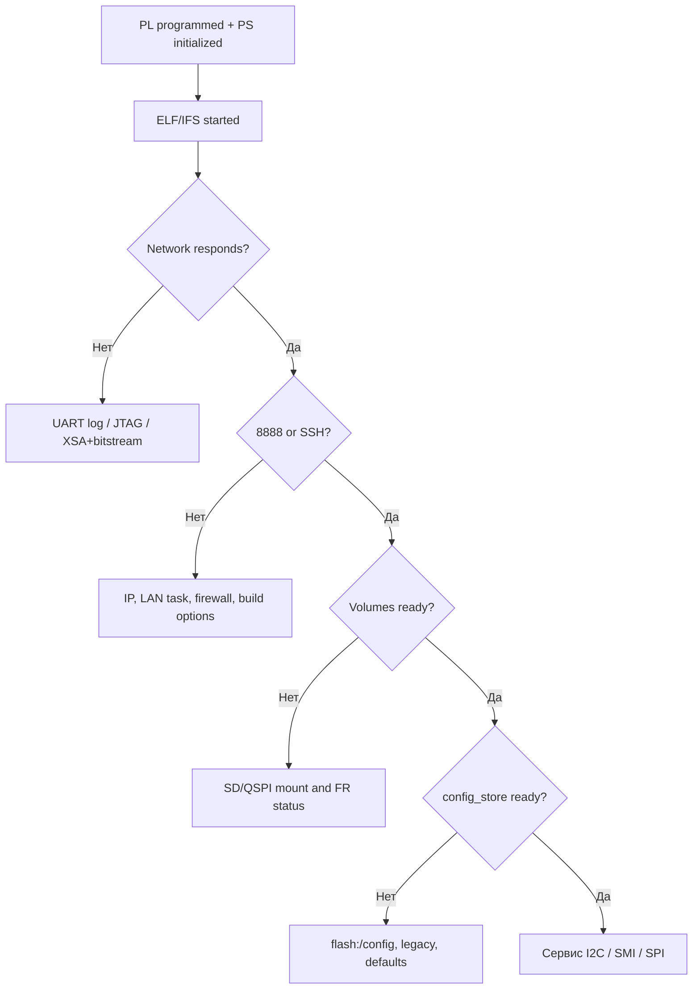

# Диагностика

## 1. Общая последовательность

Диагностика проходит от аппаратной загрузки к runtime и затем к конкретному сервису.



## 2. JTAG и startup

| Симптом | Проверки |
|---|---|
| `xsct not found` | активировать Vitis settings |
| bitstream not found | проверить `artifacts/fpga/design.bit` и `BITSTREAM_FILE` |
| PS7 init отсутствует | собрать Vitis platform и проверить `vitis_ws/plat_bvstk/hw/` |
| ELF не найден | выполнить `./build.sh freertos` |
| Neutrino IFS не найден | выполнить `./build.sh neutrino-image` |
| UART startup signature отсутствует | `UART_DEVICE`, `UART_BAUD`, IFS, PS7 init и кабель |
| приложение запускается с неправильными адресами | сверить XSA, bitstream и [hardware map](../reference/hardware-map.md) |

## 3. Сеть

```sh
ip neigh
arp -a
nc -vz 192.168.0.10 8888
curl -v http://192.168.0.10/api/net
```

| Симптом | Действие |
|---|---|
| устройство не отвечает на default IP | попробовать сохранённый IP и проверить `network.json` через JTAG/shell |
| соединение пропало после смены IP | подключиться к новому адресу |
| TCP открыт, HTTP закрыт | проверить HTTP task и порт `80` |
| SSH закрыт | проверить `BVSTK_SSH_ENABLE`, пароль и порт `22` |
| MAC/IP отличаются от JSON | сравнить runtime `GET /api/net` и `flash:/config/network.json` |

## 4. Файловые тома

```text
pwd
ls
cd flash
ls /config
ls /www
```

| Симптом | Действие |
|---|---|
| `FS not ready` | дождаться mount-задач и повторить |
| volume пуст | проверить том и автоформатирование |
| конфиг не сохраняется | проверить `flash:/config`, QSPI readiness и свободное место |
| web UI отдаёт `404` | проверить `flash:/www/index.html` |
| данные исчезли после запуска | проверить `FR_NO_FILESYSTEM`, резервную копию и QSPI layout |

## 5. Config store

```sh
curl -sS http://<device-ip>/api/i2c
curl -sS http://<device-ip>/api/fs
```

```text
cat flash:/config/network.json
ls flash:/config/i2c
ls flash:/config/smi
```

Приоритет: `flash:/config/`, затем legacy `flash:/configs/`, затем встроенные defaults. После изменения source JSON требуется новая FreeRTOS-сборка для обновления `default_configs.h`.

## 6. I2C policy

```text
i2c list
i2c axp15060 info
i2c axp15060 policy show rules
i2c axp15060 policy show whitelist
i2c axp15060 r 0x13
i2c axp15060 w 0x13 0x10
```

| Ошибка | Причина для проверки |
|---|---|
| `I2C not ready` | runtime task ещё ждёт config store или core init |
| `device not found` | имя/address отсутствует в активной модели |
| `DENIED by policy` | пара `(reg,val)` отсутствует в whitelist или входит в blacklist |
| `WRITE_FAILED` | hardware timeout, XSA/bitstream или QSPI save |
| policy list не отображается | использовать `policy show rules` или `policy whitelist/blacklist` |

## 7. SMI

```text
smi list
smi lan8720 info
smi lan8720 rules
smi lan8720 r 0x01
```

Общий SMI service требует готовности `config_store`. Autopoll начинает работу только при наличии вызывающего polling scheduler. При расхождении HTTP и shell результатов проверьте common и legacy runtime paths.

## 8. DCP2

```sh
nc -vz <device-ip> 8889
./scripts/dcp2/monitor_notify.py <device-ip> --port 8889 --buses i2c
```

| Status | Проверка |
|---|---|
| `ERR_MALFORMED` | длина body, endian и обязательные поля |
| `ERR_BUSY` | готовность runtime |
| `ERR_RANGE` | device/reg/count/MMIO range |
| `ERR_DENIED` | policy |
| `ERR_UNSUPPORTED` | profile ОС и opcode |
| event отсутствует | notify mask, source/bus filter и операция, создающая event |

## 9. Сборка и документация

```sh
./build.sh check
git diff --check
```

`build.sh check` объединяет host-тесты, архитектурные ограничения и проверку локальных Markdown-ссылок. При ошибке документа сначала исправляется первая строка с отсутствующей ссылкой или устаревшим правилом, затем проверка запускается повторно.
