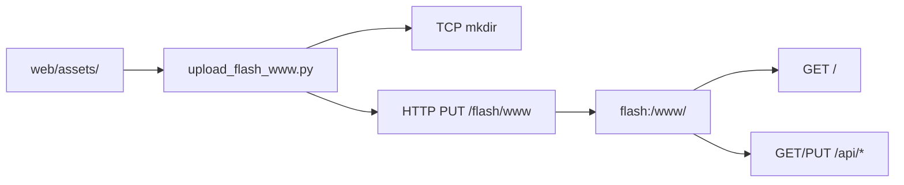

# Web UI

## 1. Модель web-ресурсов

BVSTK раздаёт статические файлы из `flash:/www/`. Исходный набор находится в `web/assets/`; отдельный frontend build в текущем workflow отсутствует.



| Уровень | Путь или URL |
|---|---|
| локальная статика | `web/assets/` |
| web-root устройства | `flash:/www/` |
| корневая страница | `/` → `flash:/www/index.html` |
| JSON API | `/api/*` |

Запросы к web-root используют GET. API и файловые маршруты имеют отдельные правила методов.

## 2. Штатная загрузка

```sh
./web/upload_flash_www.sh <device-ip>
```

Прямой вызов:

```sh
python3 ./web/upload_flash_www.py <device-ip> --src ./web/assets
```

Загрузчик выполняет следующие операции:

1. получает текущий `manifest.json`, если он доступен;
2. сравнивает локальные файлы по размеру и SHA-256;
3. создаёт каталоги через TCP-команду `mkdir`;
4. отправляет изменившиеся файлы через HTTP `PUT`;
5. обновляет `flash:/www/manifest.json`.

## 3. Параметры загрузчика

| Опция | Значение по умолчанию | Назначение |
|---|---|---|
| `--src` | `web/assets/` | локальный источник |
| `--dst` | `flash:/www` | путь для `mkdir` через shell |
| `--http-prefix` | `/flash/www` | HTTP-префикс PUT |
| `--manifest` | `manifest.json` | имя manifest в web-root |
| `--http-port` | `80` | HTTP-порт |
| `--console-port` | `8888` | порт TCP-консоли |
| `--force` | выключен | отправить все файлы |
| `--no-mkdir` | выключен | пропустить создание каталогов |
| `--dry-run` | выключен | показать план без записи |

Перед первой загрузкой полезно выполнить dry run:

```sh
python3 ./web/upload_flash_www.py 192.168.0.10 --dry-run
```

## 4. Полная загрузка через tar

Для переноса всего дерева одной операцией:

```sh
tar -C web/assets -cf www.tar .
curl -T www.tar http://<device-ip>/tar/flash/www
```

Tar-маршрут извлекает архив в каталог назначения. Hash-based incremental режим доступен только у Python-загрузчика.

## 5. Ручная загрузка

Отдельный файл можно передать напрямую:

```sh
curl --upload-file ./web/assets/index.html \
  http://<device-ip>/flash/www/index.html
```

Промежуточные каталоги для HTTP PUT создаются заранее:

```text
mkdir flash:/www
mkdir flash:/www/css
mkdir flash:/www/js
```

## 6. Проверка результата

```sh
curl -f http://<device-ip>/
curl -f http://<device-ip>/api/version
curl -f http://<device-ip>/api/fs
```

В TCP-консоли:

```text
ls flash:/www
cat flash:/www/manifest.json
```

| Симптом | Проверка |
|---|---|
| `404` на `/` | существует ли `flash:/www/index.html` |
| отсутствуют CSS/JS | совпадают ли URL ресурса и путь в `flash:/www/` |
| страница открылась, данные отсутствуют | отвечают ли `/api/version`, `/api/net`, `/api/fs` |
| загрузчик завершился ошибкой | доступны ли TCP `8888`, HTTP `80` и QSPI mount |
| браузер показывает старую версию | проверить manifest, force upload и cache браузера |

## 7. Рекомендации для обновления

| Сценарий | Команда |
|---|---|
| посмотреть изменения | `--dry-run` |
| обычное инкрементальное обновление | `upload_flash_www.sh <ip>` |
| полная повторная отправка | `--force` |
| перенос большого дерева | tar-over-HTTP |
| ручная проверка одного файла | `curl --upload-file` |

После обновления проверяйте одновременно файловый слой и HTTP-ответ. Это позволяет разделить ошибку доставки файла и ошибку web/API runtime.
