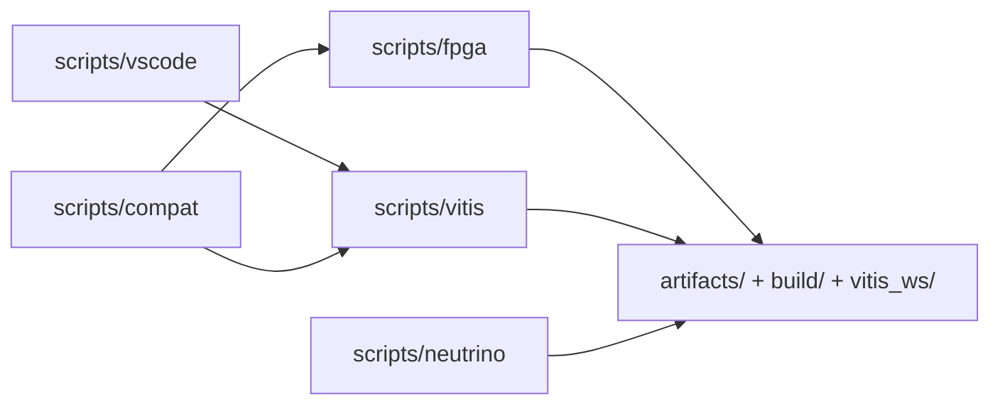

# Инструменты проекта

Каталог `scripts/` содержит команды сборки, запуска, проверки и подготовки
локальной среды. Скрипты вызываются из корня репозитория; machine-specific
параметры хранятся в локальных `.conf`-файлах.

## 1. Карта инструментов

| Каталог | Назначение | Основной документ |
|---|---|---|
| `scripts/fpga/` | Vivado project, implementation и XSA/bitstream export | [FPGA build](fpga/README.md) |
| `scripts/vitis/` | Vitis platform, FreeRTOS ELF и JTAG | [Vitis/JTAG](vitis/README.md) |
| `scripts/neutrino/` | `i2c`, `bvstkctl`, `bvstkd`, `bvstk-shell`, IFS и Neutrino JTAG | [Neutrino](neutrino/README.md) |
| `scripts/vscode/` | compile commands и GDB preparation | [VSCode](vscode/README.md) |
| `scripts/compat/` | совместимость со старыми путями | исходники wrappers |
| `scripts/dcp2/` | host-инструменты DCP2/NOTIFY | [DCP2 usage](../docs/user/dcp2-usage.md) |

## 2. Общий рабочий поток

| Этап | Команда | Результат |
|---:|---|---|
| 1 | `./scripts/fpga/build_fpga.sh` | `artifacts/fpga/design.xsa`, `design.bit` |
| 2 | `./build.sh check` | архитектурные, host- и doc-проверки |
| 3 | `./build.sh freertos` | `vitis_ws/.../app_bvstk.elf` |
| 4 | `./build.sh neutrino` | `build/neutrino/i2c`, `bvstkctl`, `bvstkd`, `bvstk-shell` |
| 5 | `./build.sh neutrino-image` | Neutrino IFS |
| 6 | `./run.sh <target> jtag` | загрузка на AX7020 и runtime smoke |

Полные требования к окружению и варианты сборки описаны в
[руководстве разработчика](../docs/dev/build.md).

## 3. Настройка новой рабочей станции

| Инструмент | Что проверить |
|---|---|
| Vivado/Vitis | `vivado -version`, `xsct -version`, `hw_server -h` |
| ARM toolchain | `arm-none-eabi-gcc --version`, `arm-none-eabi-gdb --version` |
| Neutrino SDK | `qcc -V`, `mkifs -V` |
| hardware repository | доступен каталог `hw_platform/fpga` |
| BSP snapshot | доступен `third_party/neutrino/bsp/ax7020` |

Конфигурации скриптов копируются из `*.conf.example` только для локальной
машины. Секреты, host keys и сгенерированные build artifacts хранятся в
производных каталогах и не добавляются в Git.

## 4. Совместимость

Старые точки входа поддерживаются wrappers в `scripts/compat/`. Для новых
сценариев используются пути внутри текущего репозитория и команды корневого
`build.sh`/`run.sh`.
